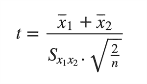
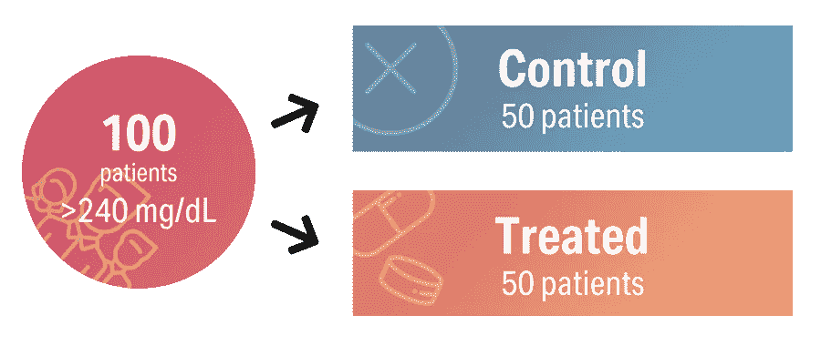
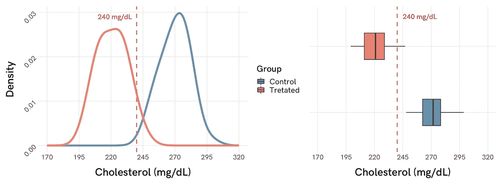
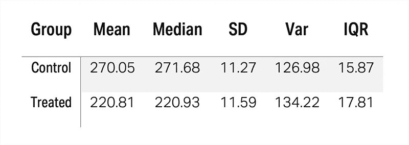
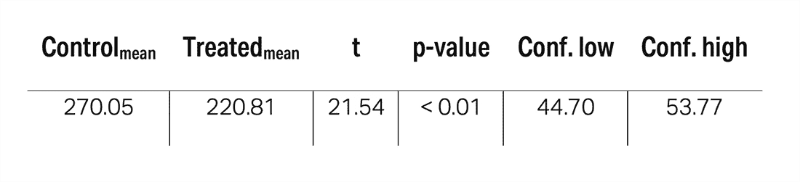

# 医学中的学生 t 检验:阐明其直观概念

> 原文：<https://towardsdatascience.com/students-t-test-in-medicine-shedding-light-on-its-intuitive-concepts-fa5d7734aae?source=collection_archive---------8----------------------->

统计学术语被技术术语和复杂的数学符号所困扰。纵观我在生物医学领域的经历，我遇到过两种类型的人:一种是对这种抽象语言感到绝对着迷的人，另一种是每次看到有几个希腊字母的公式就惊恐地逃离的人(尽管他们的研究是基于这些公式的结果)。

我主要为医生和生物医学研究人员工作，他们对应用统计学有着早已被遗忘的知识，所以我最终花更多的时间回答解释性的问题，而不是做分析。这是神秘的统计数据变得如此简单的直接结果。

最常见的问题之一也来自医学中最流行和最常用的统计测试之一:学生的 t 检验和 *p 值。*

但是*学生的 t-test 是什么？*

# 为什么使用学生的 t 检验

给定一个连续变量，Student 的 t 检验允许**比较两个样本的平均值。**简单明了，不涉及重大复杂问题。

对于喜欢数学记数法的人来说，Student 的 t 等于均值之和，除以组合标准差，再乘以 2 的平方根除以观察次数。这比听起来简单:

为了说明学生的 t 检验，我们将设计一个小实验。假设我们想进行一项适度的临床试验，在试验中，我们打算评估一种新药在使用一个月后是否能降低患者的血液胆固醇水平。为此，我们选择了 100 名高胆固醇血症(> 240 mg/dL)患者，并将他们随机分配到**两个治疗组**(对照组或治疗组)**中的一个，比例相同。这样，我们将拥有:**

****

****Figure 1\.** Simple study design where 100 patients, whose cholesterol blood concentration is above 240 mg/dL, are randomly assigned to one of the two treatment groups: control or treated.**

**一旦研究完成，我们如何知道我们测试的药物是否足够有效？这就是学生 t 检验变得有用的地方。但是首先，我们必须定义我们相信会发生什么。**

# **告诉我可能的假设**

**这是我经常说的一句话:要在医学中正确使用统计学，**良好的前期实验设计是最重要的。**必须在开始任何实验之前**确定假设。为什么会这样？每个统计测试对不同事物的评价是不同的。最合适的测试将在很大程度上取决于我们如何制定我们最初的假设。这是一个常见的错误来源，可能导致不确定的结果，甚至更糟，错误的结论！****

**在开始一个像我们上面设计的简单实验之前，我们必须定义两个假设:零假设(T0)和替代假设(T4)，零假设(T1)和替代假设分别是 h₀(T2)和 h₁(T7)。**

**本实验的适当的**零假设**可以定义为 *H₀: (x̅₁ - x̅₂) = 0* ，在我们的例子中，这意味着当比较对照组( *x̅₁* 和治疗组( *x̅₂* )的平均值时，胆固醇血症**没有差异。这很直观:如果血液胆固醇浓度没有变化，对照组和治疗组的手段是一样的，对吗？****

**相反，替代假设可以由 *H₁: (x̅₁ - x̅₂) ≠ 0* 来定义，它设置了与前一种情况相反的情况。如果我们测试的药物引起胆固醇水平的变化，两组平均值的差异必须是非零的。**

> ****无效假设(H₀ *)* :** 治疗对胆固醇水平没有影响。**
> 
> ****替代假说(H₁ *)* :** 治疗改变胆固醇水平。**

**这些假设设置了理想的场景，使用学生的 t 检验来评估它们，t 检验专门评估均值之间的差异。一旦假设成立，这些方法应该有多大的不同，这样我们才能确定新的治疗方法是有效的？在统计学中，这就是 *p 值*的用武之地，但首先，我们将从视觉和数字上探索我们的数据。**

# **看看你的数据！**

**将我们的测量结果存储在电子表格、笔记本或数据库中是非常常见的。这是数据存在的地方，但我们人类一旦达到了容量和密度的临界点，就很容易失去洞察力。尽管在本例中完全可以用肉眼得出结论，**强烈建议通过视觉探索数据**来了解每个治疗组的表现。**

****

****Figure 2\.** Density graph and boxplot representing the distribution of populations for the control group (in blue) and the treated group (in orange). The vertical dashed line (in red) shows the initial cholesterol and inclusion criteria for the study.**

**乍一看，我们看到两组分布的中心沿着横坐标轴彼此分离，这意味着，*先验地，*它们的均值不同(稍后我们将看到是否充分)。此外，我们可以看到治疗组中的大多数个体低于 240 mg/dL 的阈值，考虑到在开始临床试验之前患者的胆固醇浓度高于该值，这是明显改善的指标。**

**如果我们用数字的形式来研究集中趋势和分散程度，我们会得出同样的结论。显然，这种新药有效！**

****

****Table 1.** Measures of central tendency and dispersion of each treatment group.**

**但是在科学上，特别是在研究人们的健康时，我们不能简单地根据两条曲线被一条垂直线移动和分开的事实来说一种治疗是有效的。我们不得不求助于数字的客观性。**

# **什么是 p 值**

**当医生理解 p 值的真正含义时，他们解释研究结果的方式通常会发生范式转变。需要澄清的是，Student 的 t 检验(以及更多的统计检验)**假设零假设为真**，这意味着他们从药物没有效果的基础出发。**

**用技术术语来说， *p 值*是假设零假设为真，获得与我们的数据中观察到的结果一样极端的结果的概率(从 0 到 1)。例如，如果我们获得的 *p 值*为 0.6，就有可能发现均值之间的差异，就像我们在 60%的情况下观察到的那样。科学界一致认为，当测试的 p 值低于 0.05 时，该测试被认为具有统计学意义。**

**这是**这里的关键概念**:p 值*并没有提供任何关于替代假设的确定性的证据(这正是我们感兴趣的)，它只是说机会无法解释我们在数据中观察到的可变性。这是统计学结束和解释开始的地方:你如何解释为什么另一个假设可能是真的？***

# **解释结果**

**在进行学生 t 检验之前，根据所使用的统计软件，会产生几个疑问。我的样本有关系吗？我应该假设方差相等吗？单尾还是双尾？**

**对于第一个问题，在我们的特殊情况下，我们定义的两个治疗**组**是**独立的**，因为每个组由不同的人组成。如果我们在临床试验的第一天，即给药前测量胆固醇浓度，并在治疗一个月后再次测量胆固醇，以随后分析同一患者随时间推移发生的差异，情况就会相反。在这种情况下，我们应该认为我们的措施是相关的。这就是实验的设计阶段如此重要的原因！**

**为了检查两组之间的方差是否相等，有必要执行一个 *F 检验*，我们不会在本文中讨论。一般来说，我们可以假设当方差之间的比值接近 1 (127/134 = 0.94)时，方差实际上是相等的。这影响了学生的 t 检验，因为如果方差足够不同，我们必须使用韦尔奇校正(这也是另一篇文章)。**

**当 Student t-test 问我们是想进行单尾还是双尾检验时，基本上是问我们是否知道我们期望的结果会改变我们的均值。在医学上，这转化为我们是否期望药物增加**或**降低胆固醇浓度，或者是否**两者**可能同时发生。在生命科学中，在对人体进行试验之前，通常会有一些关于药物预期效果的先验证据:*体外*，动物实验等。为此，执行**单尾**测试是相当常见的。但是，如果我们想对学生的 t 检验进行更严格的限制，并且假设在我们最初的替代假设中我们确定存在差异(但不是在哪个方向)，我们将使用**双尾**检验。**

****

****Table 2.** Output of a Student two-tailed t-test for 2 independent samples, assuming equal variances.**

**我们首先再次发现的是每个治疗组的手段。乍一看，有 50 毫克/分升的绝对差异。但这有关系吗？获得的下一个参数是 *t 值*，它表明观察到的均值差异几乎是我们数据中可变性大小的 22 倍。太多了！这转化为低于 0.01 的 *p 值*，如果我们回忆之前的解释，这表明我们在患者中发现像我们观察到的那样极端的变异性的概率不到 1%，这种变异性可以用纯粹的概率来解释。综上所述，**我们拒绝零假设**，接受另一个假设。**

**最后两个参数是 **95%** **置信区间:**其下限和上限。这告诉我们，在大多数情况下，两个值之间的真正差异。对于这种特殊情况，我们发现与对照组相比，胆固醇的差异在 44.70 和 53.88 mg/dL 之间。物理学家应该从这里开始进行临床解释！**

# **那么，新药有效吗？**

**好吧，统计学永远无法回答这个问题，它只是给我们一些线索，告诉我们某些事情正在发生，而这不是偶然的。这里开始解释部分。在医学上，找到有统计学意义但与临床无关的证据并不罕见。对于这种特殊情况，我们治疗的患者的平均浓度为 220 毫克/分升，仍然高于临床推荐的限值(~200 毫克/分升)。是的，他们有所改善，但也许其他药物的效果更好，副作用更少，等等。甚至可能发生的是，尽管已经发现了显著的差异，但我们所看到的是由于其他因素，如临床试验期间饮食的变化，身体活动的增加，甚至是基因变异。作为研究人员，我们必须考虑所有可能的选择，并在得出结论之前进行测试。**

> **从这个样本实验中得到的信息应该是:对于初始浓度超过 240 mg/dL 的患者，这种**治疗可以将胆固醇**降低到 45 到 54 mg/dL 之间。**

**这足以证明它的用途吗？看你问谁了！同样，这是统计学不能(也不应该)回答的解释性部分。**

# **最后**

**这个例子非常简单(它来自于 R 中的模拟分布)，但是我认为它确实说明了学生的 t 检验是有用的。在实际的临床实践中，要考虑更多的变量，甚至是它们的部分贡献，对此学生的 t 检验是不够的。这就是回归和混合模型发挥作用的地方。**

**记住:要报告一个学生的 t 检验，你必须包括所有的参数: *p 值*是不够的！有无数的论文只提供了最后一个参数，正如我们已经解释过的，这个参数很少甚至没有提到*实际的*差异，也不能让我们了解我们观察到的效应的大小。请给出置信区间！**