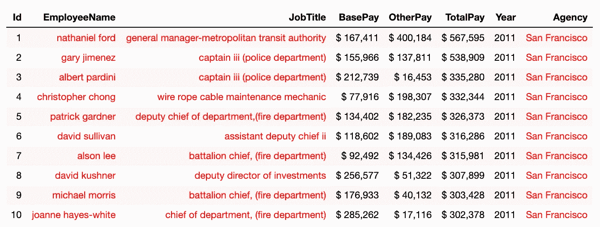

# 像大师一样设计熊猫数据框

> 原文：<https://towardsdatascience.com/style-pandas-dataframe-like-a-master-6b02bf6468b0?source=collection_archive---------0----------------------->


Photo by [billow926](https://unsplash.com/@billow926?utm_source=unsplash&utm_medium=referral&utm_content=creditCopyText) on [Unsplash](https://unsplash.com/s/photos/giant-panda?utm_source=unsplash&utm_medium=referral&utm_content=creditCopyText)

# 什么是造型，为什么要在意？

造型背后的基本思想是利用视觉辅助手段，如颜色和格式，以便更有效地传达洞察力。

可视化数据集的最常见方式之一是使用表。表格允许你的数据消费者通过*读取*底层数据来收集洞察力。例如，您可能会发现自己处于这样的场景中，您希望使用表为您的消费者提供对底层数据的访问。

在本文中，您将学习如何通过使用 pandas [样式](https://pandas.pydata.org/pandas-docs/stable/style.html)和[选项/设置](https://pandas.pydata.org/pandas-docs/stable/user_guide/options.html)为 pandas 数据框架添加可视化。熊猫文档本身是相当全面的，但是如果你正在寻找稍微友好的介绍，我想你来对地方了。我将使用 kaggle' " [旧金山工资数据集](https://www.kaggle.com/datasets/kaggle/sf-salaries)"作为一个例子，像往常一样，我们首先使用 pandas 加载数据集。

熊猫代码加载数据集和一些基本的数据管理:

```
df = pd.read_csv('Salaries.csv')\
       .replace('Not Provided', np.nan)\
       .astype({"BasePay":float, "OtherPay":float})
```


This is the rendered dataframe of “[San Fransisco Salaries](https://www.kaggle.com/datasets/kaggle/sf-salaries)”

# 熊猫选项/设置 API

熊猫有一个选项系统，可以让你定制它行为的某些方面，这里我们将着重于显示相关的选项。在使用渲染数据框时，您可能会遇到以下问题:

*   数据框中的列/行太多，中间的一些列/行在显示时被忽略。
    例如，如果想要显示最多 7 行和最多 7 列，可以:


*   包含长文本的列被截断，包含浮点的列仅在显示器上显示过多/过少的数字。


*   以及更多的[用例](https://pandas.pydata.org/pandas-docs/stable/user_guide/options.html#available-options)。

# 熊猫造型 API

正如我们提到的，pandas 也有一个样式系统，可以让你使用 CSS 定制渲染数据帧的某些方面。您编写一个“样式函数”，它采用标量、`DataFrame`或`Series`，并返回 *like-indexed* 数据帧或带有 CSS `"attribute: value"`对的序列作为值。

最简单的样式示例是在处理货币值时使用货币符号。例如，在我们的数据中，一些列(BasePay、OtherPay、TotalPay 和 TotalPayBenefit)是货币值，所以我们希望添加美元符号和逗号。这可以使用`style.format`功能来完成:

Pandas 代码通过格式化货币列来呈现数据帧

```
df.head(10).style.format({"BasePay": "$**{:20,.0f}**", 
                          "OtherPay": "$**{:20,.0f}**", 
                          "TotalPay": "$**{:20,.0f}**",
                          "TotalPayBenefits":"$**{:20,.0f}**"})
```


这些样式函数可以递增地传递给在呈现前收集样式的`Styler`，因此，如果我们想添加一个函数来格式化 EmployeeName 和 companyTitle，可以使用另一个`style.format`函数来完成:

Pandas 代码呈现数据帧，也将一些列格式化为小写

```
df.head(10).style.format({"BasePay": "$**{:20,.0f}**", 
                          "OtherPay": "$**{:20,.0f}**", 
                          "TotalPay": "$**{:20,.0f}**",
                          "TotalPayBenefits":"$**{:20,.0f}**"})\
                 .format({"JobTitle": **lambda** x:x.lower(),
                          "EmployeeName": **lambda** x:x.lower()})
```


现在看起来好多了，但是让我们再往前走一步这里的索引没有添加任何真实的信息，我们可以使用下面的代码片段使用`hide_index`函数来取消索引的显示:

Pandas 编写代码来呈现不带索引的格式化数据帧

```
df.head(10).style.format({"BasePay": "$**{:20,.0f}**", 
                          "OtherPay": "$**{:20,.0f}**", 
                          "TotalPay": "$**{:20,.0f}**",
                          "TotalPayBenefits":"$**{:20,.0f}**"})\
                 .format({"JobTitle": **lambda** x:x.lower(),
                          "EmployeeName": **lambda** x:x.lower()})\
                 .hide_index()
```


在呈现我们的数据集时，拥有这种类型的灵活性是非常强大和有用的，但这还不够。您可以应用**条件格式**，这是一个数据帧的可视样式，取决于其中的实际数据。最简单的例子是样式 API 中的内置函数，例如，可以用绿色突出显示最高的数字，用彩色突出显示最低的数字:

熊猫代码也强调最小/最大值

```
df.head(10).style.format({"BasePay": "$**{:20,.0f}**", 
                          "OtherPay": "$**{:20,.0f}**", 
                          "TotalPay": "$**{:20,.0f}**",
                          "TotalPayBenefits":"$**{:20,.0f}**"})\
                 .format({"JobTitle": **lambda** x:x.lower(),
                          "EmployeeName": **lambda** x:x.lower()})\
                 .hide_index()\
                .highlight_max(color='lightgreen')\                            
                .highlight_min(color='#cd4f39')
```


另一个有用的函数是`background_gradient`，它可以突出显示一列中的值的范围。此外，`cmap`参数允许我们为渐变选择调色板。matplotlib [文档](https://matplotlib.org/examples/color/colormaps_reference.html)列出了所有可用的选项(seaborn 也有一些选项)。

熊猫代码，也增加了背景渐变

```
df.head(10).style.format({"BasePay": "$**{:20,.0f}**", 
                          "OtherPay": "$**{:20,.0f}**", 
                          "TotalPay": "$**{:20,.0f}**",
                          "TotalPayBenefits":"$**{:20,.0f}**"})\
                 .format({"JobTitle": **lambda** x:x.lower(),
                          "EmployeeName": **lambda** x:x.lower()})\
                 .hide_index()\
                 .background_gradient(cmap='Blues')
```


当风格实际上不依赖于值时，甚至可以使用`styler.set_properties` 。在这个例子中，我们将使用黑色背景和绿色文本来呈现数据集。

Pandas 编码为每个单元格以相同的方式呈现格式化的数据帧。

```
df.head(10).style.set_properties(**{'background-color': 'black',                                                   
                                    'color': 'lawngreen',                       
                                    'border-color': 'white'})
```


但是，如果我们诚实的话，大多数时候我们希望根据值和我们想要强调的内容来更改可视化属性，我们可以使用以下方法之一来帮助实现我们的目标:

*   `Styler.applymap(func)`针对元素风格。
*   `Styler.apply(func, axis=0)`用于列样式。
*   `Styler.apply(func, axis=1)`针对行式风格。
*   `Styler.apply(func, axis=None)`用于表格风格。

第一个例子是**突出显示数据帧中的所有负值。**

如果值是一个字符串，则用改变的字体颜色呈现格式化的数据帧

```
df.head(10).style.format({"BasePay": "$**{:20,.0f}**", 
                          "OtherPay": "$**{:20,.0f}**", 
                          "TotalPay": "$**{:20,.0f}**",
                          "TotalPayBenefits":"$**{:20,.0f}**"})\
                 .format({"JobTitle": **lambda** x:x.lower(),
                          "EmployeeName": **lambda** x:x.lower()})\
                 .hide_index()\
                 .applymap(lambda x: f”color: {‘red’ if isinstance(x,str) else ‘black’}”)
```



最后，pandas 样式 API 还支持更高级的样式，如在列中绘制条形图，我们将在这里介绍`bar`函数和一些参数来配置它在表中的显示方式:

```
df.head(10).style.format({"BasePay": "$**{:20,.0f}**", 
                          "OtherPay": "$**{:20,.0f}**", 
                          "TotalPay": "$**{:20,.0f}**",
                          "TotalPayBenefits":"$**{:20,.0f}**"})\
                 .format({"JobTitle": **lambda** x:x.lower(),
                          "EmployeeName": **lambda** x:x.lower()})\
                 .hide_index()\
                 .bar(subset=["OtherPay",], color='lightgreen')\
                 .bar(subset=["BasePay"], color='#ee1f5f')\
                 .bar(subset=["TotalPay"], color='#FFA07A')
```


# 结论

pandas 风格的 API 和 options API 在您的数据分析接近尾声并需要向他人展示结果时非常有用。字符串格式化有几个棘手的部分，所以希望这里突出显示的内容对您有用。