# 高清图像上的 GANs 风格转换

> 原文：<https://towardsdatascience.com/style-transfer-with-gans-on-hd-images-88e8efcf3716?source=collection_archive---------0----------------------->

## 如何使用 GANs 生成高清图像，而无需昂贵的硬件

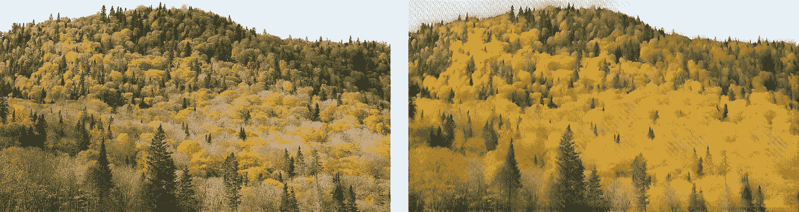

# **简介**

最近的一些研究探索了使用 GANs(生成对抗网络)生成高清晰度图像(1024×1024 像素)的一些方法和技术。看到**超逼真的**，由算法生成的人脸、动物和其他事物的高清图像，尤其是记得几年前的第一张 GAN 图像，令人难以置信地惊讶。我们很快就从低质量的像素化图像发展到了接近现实的**图像**:这是该领域研究进展有多快的一个非常清晰的证明。

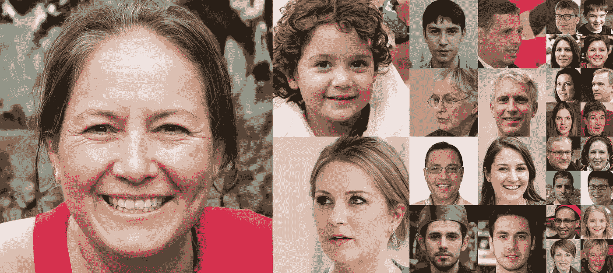

StyleGAN HD face samples

但是阅读这些最近的研究(最相关的是 Nvidia 的 StyleGAN 和 Google 的 BigGAN 论文),我总是发现一个方面能够降低我的惊讶和兴奋感:计算能力。发现**巨大的计算能力**被用来完成那些图像让我意识到在我和那些结果之间有一个不可逾越的障碍。光是这个想法就让我觉得研究中探索的整个新技术对我来说都很遥远，因此不那么令人惊讶。

这就是为什么在这篇文章中，我想探讨如何使 GANs 和 HD 图像一起工作**而不需要昂贵的硬件**，为不一定有机会使用高级 GPU 的人打开新的机会。这里解释的一切都可以使用免费的[谷歌合作实验室](https://colab.research.google.com)平台来实现，该平台为你所有的机器/深度学习项目提供免费的 GPU。

# **我们的目标**

我们将尝试在高清图像的两个域之间执行**风格的传输**，使用特殊但简单的 GAN 架构来执行我们的任务。更具体地说，我们将把梵高的绘画风格应用到风景的高分辨率图像上。公平地说，在过去的几年里，风格转换一直是计算机视觉中的一个热门话题；开创潮流的原始论文是**《一种艺术风格的神经算法》** (Gatys 等人)，在一个预训练的卷积网络上使用了一个内容和风格损失来执行任务。虽然这种方法可以在高清图像上工作，但它只能使用一个**单幅图像**(假设是“星夜”)作为画家风格的表示，这不是我们想要的。

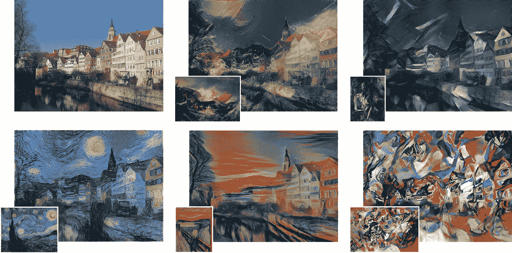

Style Transfer examples from the original paper

另一方面，GAN 通常需要一个图像域来进行训练，因此在我们的情况下能够完全捕捉画家的风格(CycleGAN 的论文显示了风格转移的有趣结果)。

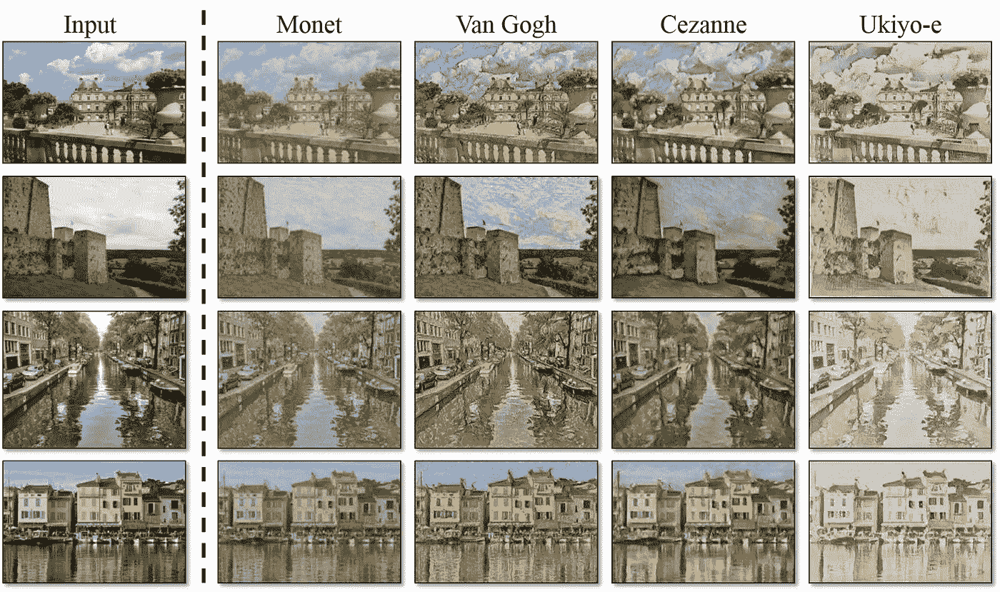

CycleGAN Style Transfer examples

然而，训练 GANs 在计算上极其昂贵**:高分辨率图像的生成只有在非常高端的硬件和长训练时间的情况下才有可能。我希望本文中解释的**技巧和技术**能够帮助你进行高清图像生成的冒险。**

**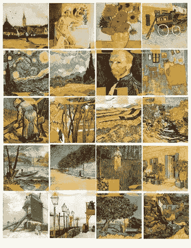**

**Van Gogh paintings**

**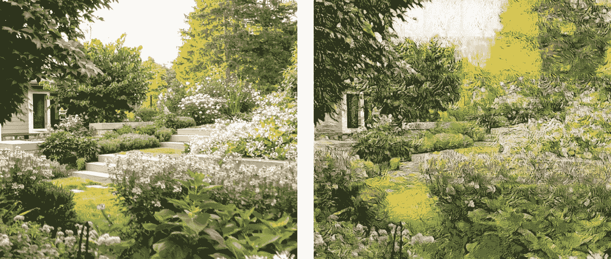****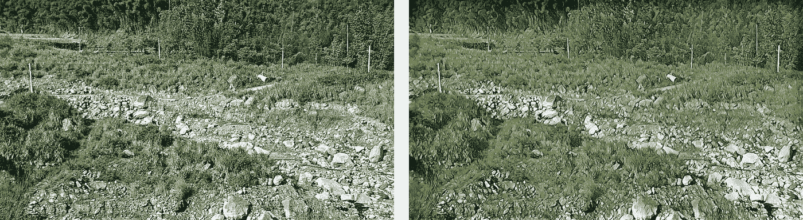**

**HD images translated to Van Gogh Style**

**我们开始吧！**

# ****架构****

**我们要努力实现的叫做图像到图像的翻译(从域 A 到域 B)。有不同的方法和网络架构来实现它:最著名的可能是 CycleGAN，但也存在许多关于同一主题的其他论文。**

**在我的实验中，我使用了一个定制的架构，该架构包含一个作为鉴别器的暹罗网络和一个特殊的(但超级简单的)损失函数。我选择这种方法是因为它不依赖于任何损失中的每像素差异:这仅仅意味着网络不遵循生成图像的任何几何约束，因此能够创建更令人信服的图像转换(这在我们的情况下是有效的)。**

**在我写的另一篇文章 [**这里**](/a-new-way-to-look-at-gans-7c6b6e6e9737) 中可以找到对这种架构及其工作原理的深入透彻的解释。**

**下面简单介绍一下暹罗甘建筑。**

**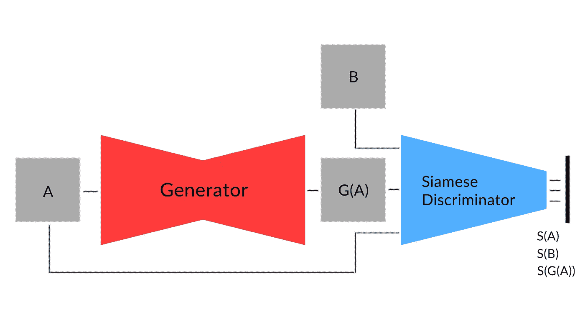**

**Siamese GAN Architecture**

**它由单个生成器(G)和鉴别器(D)组成:G 以一幅图像为输入，输出翻译后的图像；d 以一幅图像作为输入，输出一个潜在向量。**

**暹罗鉴别器有两个目标:告诉 G 如何生成更真实的图像，并在这些假图像中保持与原始图像的相关性(相同的“内容”)。**

**调用 *A1、*A2、 *B1、B2* 分别来自 A 域和 B 域的随机图像、X 域的随机图像、 *G(X)* 生成器生成的图像，鉴别器必须将图像编码成**矢量***【D(X)*如:**

**1. *D(B1)* 一定离一个固定点(例如原点)很近(欧几里德距离)，而 *D(G(A1))* 一定离同一点很远。因此，更接近固定点的向量代表更真实的图像。另一方面，生成器试图以经典的对抗方式最小化从 *D(G(A1))* 到固定点的距离。**

**2. *(D(A1)-D(A2))* 必须与 *(D(G(A1))-D(G(A2)))* 相似(余弦相似)，才能保留 *A* 与 *G(A)* 之间的‘内容’。发生器和鉴别器都参与这个目标。**

**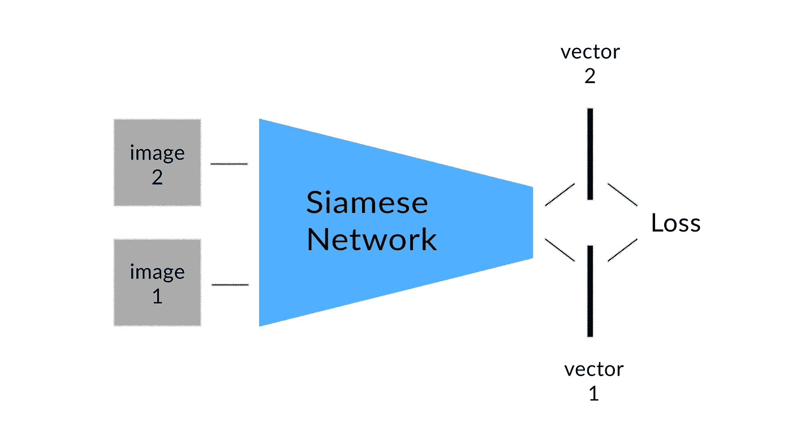**

**Siamese Discriminator**

**有了这两个约束(损失)，第一个依赖于向量的大小，而第二个依赖于向量之间的角度，我们的全部目标得到满足，我们可以实现从域 A 到域 b 的图像到图像转换的最终目标。我真的建议您阅读 [**这篇文章**](/a-new-way-to-look-at-gans-7c6b6e6e9737) ，其中我给出了该架构的更全面和深入的解释，同时展示了插图和示例。**

**现在我们已经锁定了架构，让我们来探索如何以及向网络提供什么，以实现高清图像生成。**

# ****图像提取****

**我们需要 2 个高清图像数据集:在我们的例子中，我们将使用一个风景数据集(域 A)和一个梵高画作数据集(域 B)。请记住，您选择处理的图像越大，对这些图像进行预处理(切割、调整大小)所需的时间就越长(尽管它**不会**增加专门用于训练网络的时间！).**

**现在，我们需要选择将被馈送到生成器的图像的大小:显然，我们不能使用来自数据集的整个 HD 图像的大小，否则训练时间和网络大小将是巨大的，并且不会解决任何问题。因此，我们选择了一个足够小的 SxS(例如 64x64 像素),这样训练时间可以得到控制，一切都保持计算上可行，即使对于中端 GPU 也是如此(就像在[谷歌合作实验室](https://colab.research.google.com)上免费提供的那些)。**

**因此，正如您可能已经想到的，图像在被馈送到发生器之前，必须被剪切(或裁剪)成更小的 SxS 图像。因此，在读取图像并将其转换为张量后，我们对图像执行**随机 SxS 裁剪**，将其添加到一个批处理中，并将该批处理馈送到网络。这听起来非常简单，事实也确实如此！**

**现在，假设我们使用这种方法训练一个 GAN，直到每一个小的 SxS 裁剪都被生成器以一种令我们满意的方式转换为梵高风格:我们现在如何将整个高清图像从域 A 转换到域 B？**

**同样，非常简单:**图像被分成**小的 SxS 块(如果 HD 图像的大小是 BxB，那么我们将有(B//S)x(B//S)个小的 SxS 图像)，每个 SxS 图像被生成器翻译，最后**所有的东西被重新组合在一起**。**

**然而，如果我们尝试使用这种从较大图像中提取较小图像的简单思想来训练 GAN，在测试期间，我们很快就会注意到一个相当恼人的问题:由我们想要翻译的大图像提取的小图像，当由生成器转换到域 B 时，**不会** **有机地融合在一起**。每个 SxS 图像的边缘在最终构图中清晰可见，破坏了原本成功的风格转移的“魔力”。这是一个相对较小的问题，但可能相当令人讨厌:即使使用基于像素的方法，如 cycle gan**相同的障碍仍然出现**。**

**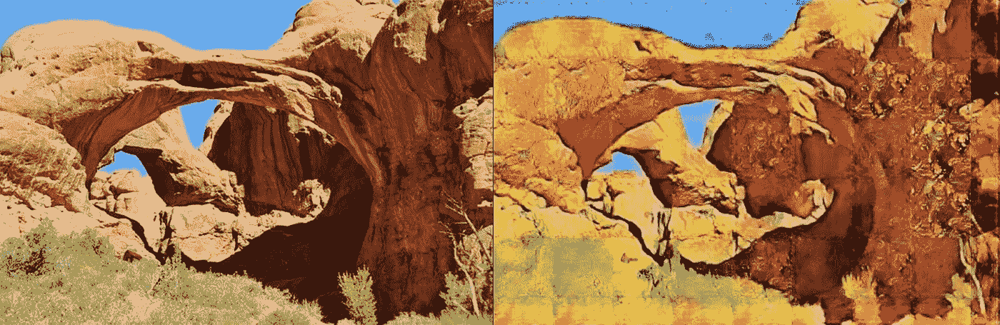**

**The edges are visible**

**怎么才能解决呢？**

**我使用的解决方案很容易理解，在我看来也很优雅，它代表了我希望你能从这篇文章中记住(也许会用到)的**核心思想**。**

**首先，我们需要重新审视我们的数据管道:在我们直接从 BxB HD 图像中剪切 SxS 裁剪之前，我们现在必须得到 **2Sx2S 裁剪**(如果 S=64，那么我们需要 128x128 裁剪)。然后，在定义了我们的生成器之后，我们创建了一个名为 Combo 的**新模型**，它执行以下操作:**

**1.取一批 2Sx2S 图像(来自 A 域)作为输入(*INP*)；**

**2.将 *INP* 中的每幅图像切割成 4 幅 SxS 图像(*INP cut*)；**

**3.将*input*的 4 幅 SxS 图像中的每一幅输入到发生器，并获得 *OUTCUT* (与*input*的形状完全相同，但每幅 SxS 图像都有翻译版本)；**

**4.将每组 4 张 SxS 图像加入 *OUTCUT* 中，取出 *OUT* (与 *INP* 形状完全相同，但每张 2Sx2S 图像有翻译版本)；**

**5.输出输出。**

**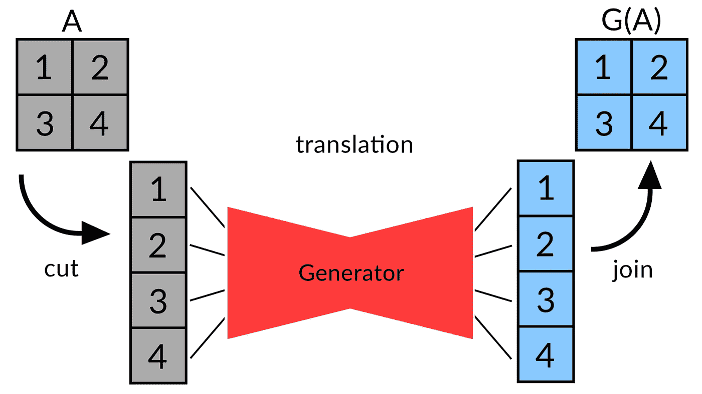**

**Combo model: cutting, translating, joining**

**Combo 的输出然后作为输入传递给鉴别器，鉴别器现在接受比以前大一倍的输入(2Sx2S)。这个小小的调整不需要太多的计算时间，并且可以有效地**解决我们之前的问题**。怎么会？**

**现在，生成器被迫生成关于**边缘和颜色**一致的图像，因为鉴别器不会将不一致的合并图像归类为真实图像，因此会通知生成器可以改进的地方。深入一点，生成器被迫学习如何在 SxS 图像的 4 个边缘中的每一个上生成逼真的边缘:在最终的 2x2 合并图像中，4 个边缘中的每一个都与另一个接触，甚至一个生成不好的边缘都会破坏 2x2 图像的真实感。**

**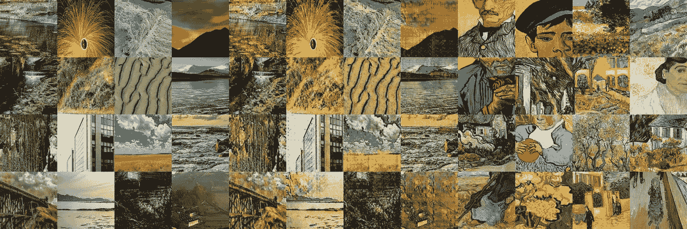**

**Samples during training: (from left to right) images from domain A, translated images (AB), images from domain B**

# ****所有的事情加在一起****

**为了确保到此为止的一切都清楚明白，让我们总结一下整个网络是如何工作的。**

**目标是将 B 的样式应用于 A 中的图像。大小为 2Sx2S 的图像是从域 A 和 B 中的高分辨率图像中剪切的。来自 A 的图像是 Combo 的输入；该模型将图像切割成 4 个较小的图像(SxS)，然后使用生成器 G 转换它们，最后将它们连接在一起。我们称这些假图像为 AB。**

**现在让我们来关注一下**连体鉴别器 D** :其输入的大小是生成器输入(2Sx2S)大小的两倍，而输出是大小为 *LENVEC* 的向量。**

**D 将图像编码成向量 D(X ),例如:**

**1.D(B)必须靠近原点(大小为 *VECLEN* 的零点向量):**

**LossD1 是 D(B)到原点的欧氏距离的平方，所以**Eucl(D(A))**；**

**2.D(AB)必须远离原点:**

**LossD2 是( **max(0，cost — Eucl(D(AB))))****

**3.变换向量(D(A1)-D(A2))和(D(AB1)-D(AB2))必须是相似的向量，以保留图像的“内容”:**

**LossD3 是**余弦 _ 相似度(D(A1)-D(A2)，D(AB1)-D(AB2))****

**另一方面，**生成器**必须生成(结合的)图像 AB，例如:**

**1.D(AB)必须靠近原点:**

**LossG1 是 **Eucl(D(AB))****

**2.变换向量(D(A1)-D(A2))和(D(AB1)-D(AB2))必须是相似的向量(与鉴别器的目的相同):**

**LossG2 是**余弦 _ 相似度(D(A1)-D(A2)，D(AB1)-D(AB2))****

**在我的文章 [**here**](/a-new-way-to-look-at-gans-7c6b6e6e9737) 中可以找到关于这些损失如何工作的更深入的解释，在那里我详细解释了暹罗鉴别器是如何工作的(我认为这值得一读！).**

**就是这样！**

**按照这种方法，生成器能够学习如何生成小的风格化图像，这些图像可以被连接在一起**而没有任何边缘差异**。因此，当翻译整个高清图像时，在将它切割成单独的较小 SxS 图像并将它们馈送到生成器之后，我们能够将它们连接在一起成为最终的、视觉上令人愉快的和连贯的高清图像。**

************

**Translation examples on HD images: although not perfect, realistic brush strokes are generated and the images look quite coherent. Solutions might be networks fine tuning and bigger capacity**

# ****结论****

**本文中解释的技术仍然存在一些我们需要解决的问题。**

**如果选择极高清晰度的图像，用于训练网络**的较小作物可能不包含任何相关信息**(它们可能只是纯色，类似于单个像素)，因此训练可能不会成功:生成器和鉴别器都需要某种信息来处理(鉴别器必须根据图像的“内容”对图像进行编码)，如果该信息不可用，可能会面临一些问题。**

**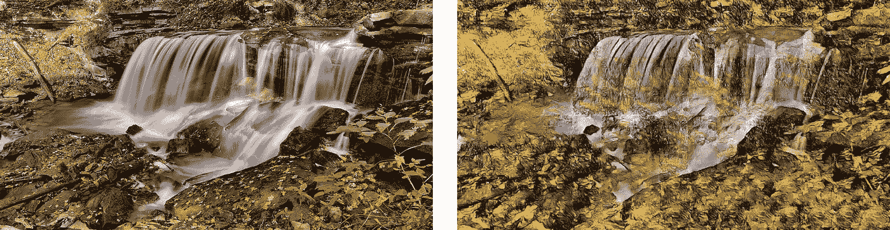**

**Failure case: the generator “hallucinates” incoherent colors and shapes in some areas**

**即使训练成功结束，当连接具有非常高分辨率的图像的所有不同裁剪时，每个小的翻译图像的**风格贡献**对于整个高清图像来说是不够的，整个高清图像通常看起来与原始图像相似，只是颜色发生了变化。**

**在我的实验中，我发现，对于训练阶段，使用调整大小(较低分辨率)的 HD 数据集版本，同时在转换时切换到整个 HD 图像，对于第一个问题肯定有帮助。**

**这项技术给**留下了很多有待探索的空间**:不同于传统风格转换的其他类型的图像翻译也是可能的。重要的是要记住，本例中的生成器不知道整个高清图像的上下文，只“看到”较低分辨率的裁剪。因此，给生成器一些**上下文**(可能以编码的‘上下文向量’的形式)？)可以扩展该技术的应用范围，**为更复杂的“上下文感知”类型的高清图像翻译(对象到其他对象、人脸、动物)提供了可能性**。**

**因此，正如你可能已经理解的，可能性是无穷无尽的，尚未被发现！**

**我很乐意真诚地**感谢**您对本文的关注，非常感谢，我希望您带着新的东西离开。**

**玩得开心！**