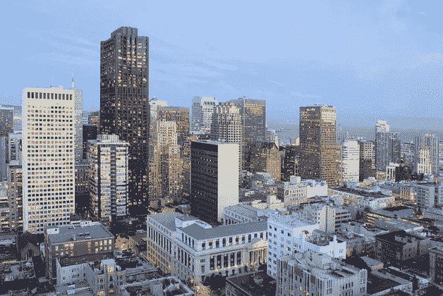
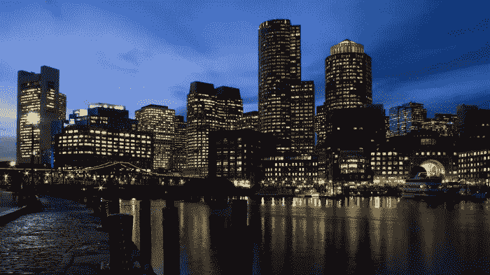
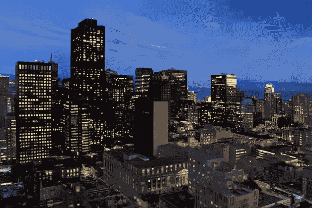
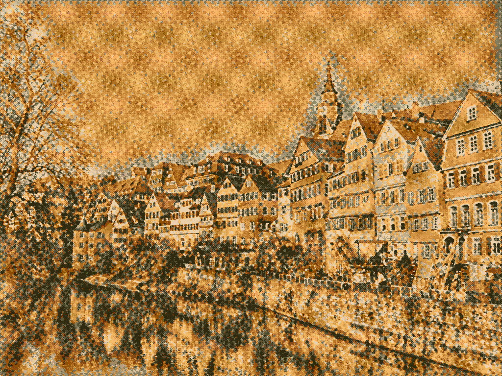
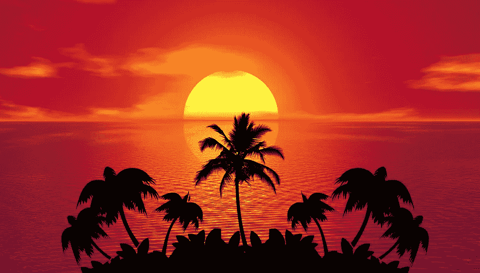

# 用一点深度学习的魔力来装饰你的照片

> 原文：<https://towardsdatascience.com/style-up-your-photos-with-a-touch-of-deep-learning-magic-60a003c676f9?source=collection_archive---------22----------------------->

## 看到深度学习的艺术一面

*风格转移*在成像的语境中，指的是将一幅图像的“风格”转移到另一幅图像，同时保持第二幅图像的“内容”的过程。

例如，最左边的图像是“内容”图像。我们将中间图像的“样式”(“样式”图像)应用于我们的内容图像。我们预计，由于中间的图像有一种大城市夜晚的氛围，这将反映在最终的图像中——这正是最右边的结果中发生的事情！



Source from the original [research paper](https://arxiv.org/pdf/1703.07511.pdf).

这一领域最具突破性的研究之一来自 Adobe Research。他们称之为 [*深照风格转移*](https://arxiv.org/pdf/1703.07511.pdf)*【DPST】*。

# 如何转移照片风格

为了正确地执行从一张照片到另一张照片的样式转换，Adobe 团队设计了他们的 DPST 的目标:“*将引用的样式转换到输入，同时保持结果的照片真实感*

这里的关键部分是保持输出的“照片真实感”属性。如果我们有一个像上面这样的内容照片，我们不希望任何建筑改变。我们只是想让它看起来像是同一张照片是在晚上拍的。

在这项研究发表之前出现的许多风格转换算法扭曲了原始图像的许多内容。在当时神经风格转移技术的结果中，像使直线呈波浪状和改变物体形状这样的事情很常见。

这完全可以接受。许多算法是为艺术风格的转换而设计的，所以一点点的变形也是受欢迎的！



Example of a distorted style-transferred image. [Source](https://github.com/yusuketomoto/chainer-fast-neuralstyle)

但在这种情况下，目的是创造仍然逼真的图像——就像是由真实世界的相机拍摄的一样。

作者做了 2 件主要的事情来实现这一点:(1)损失函数中的*照片真实感正则化项*(2)用作*指导*的内容图像的语义分割。

## 摄影现实规则化

想想我们如何直观地保持图像的真实感。我们希望原始图像的线条和形状保持不变。颜色和灯光可能会改变，但一个人看起来仍然像一个人，一棵树像一棵树，一只狗像一只狗，等等。

基于这种直观的想法，作者实现的正则化项迫使像素从输入到输出的变换在色彩空间中为*局部仿射。根据定义，[仿射变换](https://en.wikipedia.org/wiki/Affine_transformation)在将输入映射到输出时必须保持点、直线和平面。*

有了这个约束，直线永远不会变成波浪，在我们的输出中也不会有任何奇怪的形状变化！

## 分段指导

除了保持点、直线和平面之外，我们还希望确保样式图像中各种“事物”的样式被真实地转换。

想象一下，如果你有一个风格图像，显示一个美丽的橙色日落，如下图所示。



[Source](https://pixabay.com/illustrations/tropical-summer-sunset-beach-1651426/)

图像的大部分是略带红色的橙色。如果我们把它转换成一个城市形象，所有的建筑都会变成红色！然而这并不是我们真正想要的——一个更真实的转换会使大部分建筑非常暗(接近黑色),只有天空会有日落和水的颜色。

深度照片风格转移算法使用应用于内容图像的语义分割的结果，以便 T2 引导风格转移。当算法确切地知道哪些像素属于前景和背景时，它可以更真实地传递风格。天空像素将始终被转换为天空像素，背景像素被转换为背景像素，依此类推。

# 转移样式的代码

您可以从 GitHub 下载照片真实感风格传输库:

```
git clone [https://github.com/GeorgeSeif/DeepPhotoStyle_pytorch.git](https://github.com/GeorgeSeif/DeepPhotoStyle_pytorch.git)
```

运行它所需要的只是一个最新版本的 [Pytorch](https://pytorch.org/) 。完成后，进入文件夹，使用下载脚本下载语义分段的模型:

```
cd DeepPhotoStyle_pytorch
sh download_seg_model.sh
```

现在我们准备好运行我们的代码了！

下载一个风格图片和一个内容图片——任何你选择的图片！以我的经验来看，城市和风景图片效果最好。最后，像这样运行代码:

```
python main.py --style_image path_style_image --content_image path_content_image
```

该算法将迭代地改进样式传递结果，因此您等待的时间越长，效果就越好！默认情况下，它设置为运行 3000 步，但如果您觉得更多的步骤可以改善结果，您可以增加。

自己试试代码吧，很好玩的！查看风格转换后照片的外观。欢迎在下面发布链接，与社区分享您的照片。

# 喜欢学习？

在推特[上关注我，我会在这里发布所有最新最棒的人工智能、技术和科学！也请在 LinkedIn](https://twitter.com/GeorgeSeif94)[上与我联系！](https://www.linkedin.com/in/georgeseif/)

# 推荐阅读

想了解更多关于深度学习的知识？用 Python 进行 [***深度学习***](https://amzn.to/2Lj0vWJ) 本书将教你如何用有史以来最简单的 Python 库:Keras 进行*真正的*深度学习！

提醒一句，我支持这个博客，因为分享好书对每个人都有帮助。作为一名亚马逊员工，我从合格购买中获得收入。