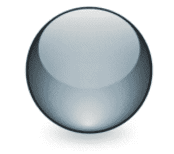

# StyleGAN2

> 原文：<https://towardsdatascience.com/stylegan2-ace6d3da405d?source=collection_archive---------2----------------------->

## 本文探讨了 StyleGAN2 中的变化，如权重解调、路径长度正则化和移除渐进增长！

StyleGAN 架构的第一个版本在被称为 [Flicker-Faces-HQ (FFHQ)](https://github.com/NVlabs/ffhq-dataset) 的面部图像数据集上产生了令人难以置信的结果。与早期迭代的 [GANs](http://papers.nips.cc/paper/5423-generative-adversarial-nets.pdf) 如[条件 GANs](https://arxiv.org/abs/1411.1784) 或 [DCGANs](https://arxiv.org/abs/1511.06434) 相比，这些结果最令人印象深刻的特征是生成图像的高分辨率(1024)。除了分辨率之外，还从生成图像的多样性(避免模式崩溃)和一套比较真实图像和生成图像的定量指标(如 FID、初始分数、精确度和召回率)等方面对 gan 进行了比较。

Facial images generated from StyleGAN2

Frechet 初始距离(FID)是最常用的自动度量之一，用于评估从生成模型中采样的图像。该度量基于对真实图像和生成图像上的预训练分类网络的激活进行比较。下表显示了过去 2 年中在该数据集和指标上从 StyleGAN 到 StyleGAN2 的 GAN 进度。

FID results reported in the first edition of StyleGAN, “A Style-Based Generator Architecture for Generative Adversarial Networks” authored by Tero Karras, Samuli Laine, and Timo Aila. Note the FID scores on the right on the FFHQ dataset to compare with the StyleGAN2 resutls below.

FID results reported in the second edition of StyleGAN, “Analyzing and Improving the Image Quality of StyleGAN” authored by Tero Karras, Samuli Laine, Miika Aittala, Janne Hellsten, Jaakko Lehtinen, and Timo Aila. Note the FID scores on the far left for the sake of comparison with StyleGAN1.

本文将讨论将 FID 指标提高了约 3 倍的架构变化，以及像消除生成图像中的伪像和平滑潜在空间插值这样的定性改进。潜在空间的平滑导致生成图像的源的微小变化，从而导致结果图像的微小感知变化，[实现这样的惊人动画。如果你感兴趣，我还制作了一个视频来解释 StyleGAN2 的变化:](https://www.youtube.com/watch?v=6E1_dgYlifc)

# 如何辨别图像是否是 StyleGAN 创作的

StyleGAN 的第一版产生了令人惊讶的逼真的面孔，从下面 whichfaceisreal.com 提供的测试中，你能看出哪个面孔是真实的吗？

你认为你能训练自己在这个游戏中获得满分吗？你认为你能训练一个神经网络来做这件事吗？这是 Kaggle 上价值 100 万美元的 Deepfake 检测挑战背后的想法。whichfaceisreal.com 的作者详细列出了一系列泄露秘密的“人工制品”,可用于区分 StyleGAN 生成的图像。一个这样的伪像是图像中出现的“水滴”效果。意识到这一点会让这个游戏变得更容易(如下所示)。

StyleGAN2 的作者试图从生成的图像中消除这些伪像。他们将水滴的来源归因于[自适应实例规范化](https://arxiv.org/pdf/1703.06868.pdf)层对生成器施加的限制。

# 权重解调

NVIDIA 的研究人员是将标准化层用于图像合成应用的大师，如 StyleGAN 和 [GauGAN](https://arxiv.org/pdf/1903.07291.pdf) 。StyleGAN 使用自适应实例规范化来控制源向量 w 对最终生成的图像的影响。 [GauGAN 使用一个空间自适应反规格化层从涂鸦草图合成真实感图像。](https://arxiv.org/pdf/1903.07291.pdf)(如下图)

Image taken from “Semantic Image Synthesis with Spatially-Adaptive Normalization” by Taesung Park, Ming-Yu Liu, Ting-Chun Wang, and Jun-Yan Zhu. An example showing the power of normalization layers for image synthesis applications.

在 StyleGAN 的第二个版本中，作者重新调整了自适应实例规范化的使用，以避免这些水滴伪像。[自适应实例规范化](https://arxiv.org/pdf/1703.06868.pdf)是一个规范化层，源于对实现更快的神经风格转移的研究。神经风格转移展示了卷积神经网络中明显的低级“风格”特征和高级“内容”特征之间的显著分离(如下所示):

Image above taken from “Arbitrary Style Transfer in real-time with Adaptive Instance Normalization” authored by Xun Huang and Serge Belongie

但是，样式转换(在自适应实例规范化之前)需要一个漫长的优化过程或仅限于单一样式的预训练网络。阿丹表明，风格和内容可以结合起来，通过标准化统计的唯一使用。(这方面的概述如下所示):

Image above taken from “Arbitrary Style Transfer in real-time with Adaptive Instance Normalization” authored by Xun Huang and Serge Belongie

StyleGAN2 的作者解释说，这种标准化丢弃了以相对激活幅度编码的特征图中的信息。发生器克服了这种限制，通过这些层偷偷传递信息，导致这些水滴假象。作者和读者一样困惑，为什么鉴别器不能从这种液滴效应中区分图像。

在 StyleGAN2 中，自适应实例归一化被重构为权重解调。(这一进展如下所示)

自适应实例规范化(类似于其他规范化层，如 Batch Norm)缩放和移动中间激活的激活。Batch Norm 使用从批次统计数据中计算出的学习均值和方差参数来实现这一点，而 Instance Norm 使用单个图像与批次进行比较。自适应实例范数使用不同的比例和偏移参数来将源 w 的不同区域与特征图的不同区域对准(在每个特征图内或者通过按空间位置按通道分组特征)。

权重解调将缩放和移位参数从顺序计算路径中取出，而不是将缩放烘焙到卷积层的参数中。在我看来，值的移动(在 AdaIN 中用(y)完成)是噪声图 b 的任务。

将缩放参数移动到卷积核权重中使得该计算路径更容易并行化。这导致 40%的训练速度从每秒 37 幅图像提高到每秒 61 幅图像。

# 移除渐进增长

第二版中 StyleGAN 介绍的下一个工件也可能帮助你在 whichfaceisreal.com 图灵测试中获得好的结果。[在他们的配套视频](https://www.youtube.com/watch?v=c-NJtV9Jvp0&feature=youtu.be)的 1:40 中描述，StyleGAN 图像对鼻子和眼睛等面部图像特征有强烈的位置偏好。作者将此归因于渐进增长。渐进生长描述了首先用低分辨率图像(例如 4)分配 GAN 框架的任务，并且当在较低比例下达到期望的收敛属性时将其放大的过程。

虽然渐进增长可能难以实现，在较高分辨率层中引入关于衰落的超参数，并且需要更复杂的训练循环，但是它是高分辨率图像合成问题的非常直观的分解。众所周知，GANs 的训练具有挑战性，尤其是在生成像 1024 图像这样的图像之后，传统观点认为鉴别器很容易区分真实和虚假的图像，导致生成器在训练期间无法学到任何东西。

Animesh Karnewar 和 Oliver Wang 最近发表的另一篇关于 GANs 的论文“生成对抗网络的多尺度梯度”展示了一种有趣的方式，即利用单个端到端架构来利用多尺度生成。(如下所示):

Technique to avoid progressive growing from “Multi-Scale Gradients for Generative Adversarial Networks” by Animesh Karnewar and Oliver Wang

受 MSG-GAN 的启发，StyleGAN2 的作者设计了一种新的架构，以利用多尺度的图像生成，而无需明确要求模型这样做。他们通过低分辨率特征映射到最终生成的图像之间的 resnet 风格的跳过连接来实现这一点。

StyleGAN2 architecture without progressive growing

作者表明，与渐进式增长类似，早期的训练迭代更依赖于低频率/分辨率尺度来产生最终输出。下图显示了每个要素地图在最终输出中所占的比重，通过检查跳过的连接添加来计算。对这一点的考察启发作者按比例增加网络容量，以便 1024×1024 的比例对最终输出有更大的贡献。

# 路径长度正则化

StyleGAN2 为损失引入了一个新的归一化项，以加强更平滑的潜在空间插值。潜在空间插值描述了源向量 z 的变化如何导致所生成图像的变化。这是通过在发电机上增加以下损耗项来实现的:

这是如何实现的具体细节超出了我的理解范围，但是高层次的想法似乎是雅可比矩阵将 w 中的小变化映射到结果图像中的变化([从 w 空间中的点到 1024 个图像](https://www.youtube.com/watch?v=bohL918kXQk))。该矩阵乘以随机图像以避免陷入局部最优，并且该矩阵的 l2 范数乘以其指数移动平均值。因此，l2 范数越大，损耗增加得越多，导致发电机打球并保持潜在空间平滑。

这种实现的另一个有趣的特征被称为惰性正则化。由于计算该雅可比矩阵的计算量很大，因此与每一步相比，该归一化仅每 16 步添加到损失中。

这种平滑的潜在空间极大地方便了将图像投射回潜在空间。这是通过获取一个给定的图像并针对能够产生该图像的源向量 w 进行优化来实现的。这已经在许多有趣的 twitter 帖子中得到证实，研究人员将自己的图像投射到 FFHQ 上训练的 StyleGAN2 的潜在空间中:

来自[吉恩·科岗](https://twitter.com/genekogan)的投影的一些推特演示:( [1](https://twitter.com/genekogan/status/1205929208750510080) ， [2](https://twitter.com/genekogan/status/1205901296622067712) )

投射到一个完全平滑的潜在空间有很多有趣的应用。例如，动画工作流通常包括勾画出高级关键帧，然后手动填充更细粒度的中间帧。像 StyleGAN2 这样的模型将允许您将高级关键帧投影到潜在空间，然后在由先前 w~ p(w)的结构定义的两个 w 向量之间的路径中搜索，直到您找到满意的过渡。

比方说生成图像的源，w 是从这个球形分布(表示 3D 均匀分布)采样的。然后，将两个关键帧投影到这个球体中，以找到分别生成每个图像的向量。那么在源代码分布中的这些点之间将会有许多路径可供您选择。一个平滑的潜在空间将确保这些过渡是平滑的，就像由人类插图画家和动画师提炼的细粒度中间点一样。

# 通过投影进行深度伪造检测

投影的一个应用是用它来找到给定生成图像的来源，以判断它是真是假。这个想法是，如果它是假的，你可以找到产生它的潜在载体，如果它是真的，你不能。我认为这种将图像投射回潜在空间的想法非常有趣，但我并不认为这是一种深度伪造检测技术。似乎不可能记录下所有可能的数据集，人们可能不得不训练这些模型，这些模型将是图像投射回潜在空间的真正贡献者。此外，我不明白为什么 StyleGAN 不能完美地重建原始训练图像，因为这确实是训练目标的核心。

我认为投影可以以一种有趣的方式用于异常检测和终身学习。当一个新的例子被错误分类时，它可以被重新投射回用于训练分类器的相同数据集，并且可以像 l2 距离或预先训练的分类器特征那样计算某种图像相似性距离。

感谢您阅读 StyleGAN2 的概述！