# Matplotlib 中的支线剧情:规划剧情的指南和工具

> 原文：<https://towardsdatascience.com/subplots-in-matplotlib-a-guide-and-tool-for-planning-your-plots-7d63fa632857?source=collection_archive---------5----------------------->

我最近做了一个项目，需要在 matplotlib 中进行一些微调的子绘图和叠加。虽然我对制作基本的可视化感到很舒服，但我很快发现我对支线剧情系统的理解没有达到标准。我不得不回到基础，花了一些时间通读文档，在 Stack Overflow 中寻找例子和清晰的解释。

当我开始理解 mateplotlib 的 subplot 系统是如何错综复杂地工作时，我意识到如果有一个简单的 UI 工具可以测试你的代码并确切地看到你的图形中发生了什么，那么学习起来会容易得多。我找不到我要找的东西，所以我继续做了我自己的[小网络应用](https://qed0711.github.io/plot-planner/)，我称之为情节策划者！这是一个非常简单的工具。只要调整几个参数，看看它们如何改变你正在处理的支线剧情。

在本文中，我将使用我的 plot planner 工具来解释 matplotlib 的 subplot 系统的一些特性是如何工作的。具体来说，我将讨论两种方法。add_subplot()和. subplot2grid()。

但是说够了。我们开始吧！


subplot emojis!

## 。add_subplot()

figure.add_subplot()方法是将现有图形对象划分为不同大小的不同区域的最简单方法之一。它返回一个轴对象，并接受三个整数。如果这些整数中的每一个都是一位数，那么它们可以简化为一个三位数的整数。例如，。add_subplot(1，2，3)可以简化为。add_subplot(123)。但是这些数字实际上意味着什么呢？如果这几个栈溢出帖子上的话题，这里似乎有一些混乱。

关键是要理解，前两个整数定义了图形的划分，最后一个数字实际上表示了子情节应该在该划分中的位置。因此，如果您将子情节定义为(2，3，1)，这意味着将子情节分成一个 2 x 3 的网格，并将新的子情节放在该网格的第一个单元格中。

你可以阅读更多关于。 [matplotlib 文档](https://matplotlib.org/3.1.0/api/_as_gen/matplotlib.figure.Figure.html#matplotlib.figure.Figure.add_subplot)中的 add_subplot()。

记住所有这些，让我们试着去做吧。我们将制作下面的例子，有 5 个不同大小的支线剧情。

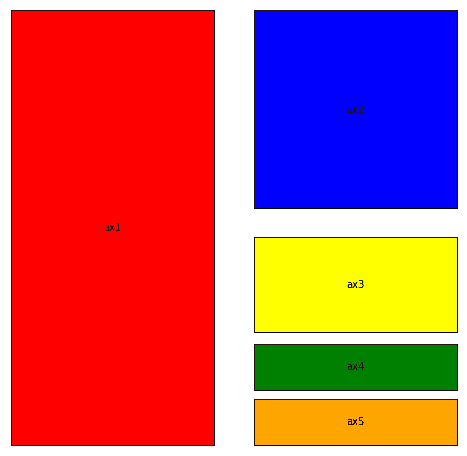

我们将从标有 *ax1* (红色)的那个开始。只需查看图像，ax1 似乎占据了图形区域的左半部分。首先，我们将定义我们的图形，并使它成为一个 8x8 的正方形(图形大小是任意的，但在这个例子中很好)。然后，忽略所有其他的次要情节，让我们把我们的图形分成两部分，左边和右边。

```
fig = plt.figure(figsize=(8,8))fig.add_subplot(1, 2, 1)
```

在这种情况下，这些数字的意思是— *取我的数字，以这样一种方式划分，即有 1 行和 2 列*。最后一个数字表示要使用的单元格。奇怪的是支线剧情的索引是从 1 开始的，而不是你所期望的 0。所以当我们说使用第一个支线剧情时，我们是在告诉我们的图形进入第一个支线剧情的空间。

这是一个非常简单的次要情节，但是更复杂的会变得难以理解。这是因为每个支线剧情都是独立的，我们永远不会看到没有被选中的支线剧情。但这里有一个来自 plot planner 应用程序的图像，它可能会使整个事情变得更加清晰。

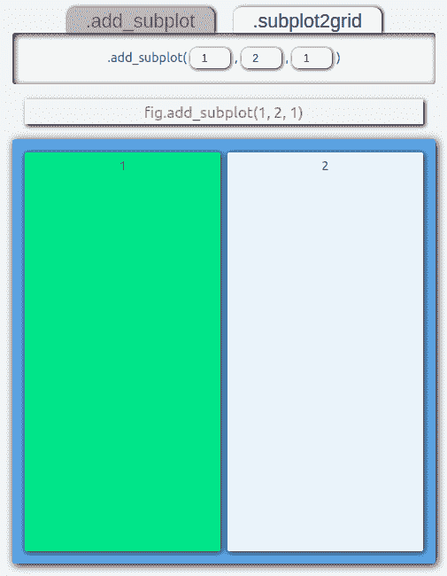

1 row by two columns. Select 1st subplot

我发现这种形象化比我看到的任何解释都要清晰得多。我们可以看到 1 行 2 列。然后，用绿色突出显示，我们可以看到编号为 1 的单元格是我们选择的子情节。太好了！我们的第一个次要情节完成了。

现在事情变得更有趣了。你可能会想，既然你已经把你的形象分成了左右两部分，那么你现在唯一的选择就是把右半部分留白，或者在那个支线剧情中设计一些东西。事实并非如此。

你定义的每个新支线剧情都不关心你已经制作的任何其他支线剧情。本质上，每一个新支线剧情都会愉快地按照你告诉它的方向发展，而不管其他支线剧情已经存在。

考虑到这一点，让我们创建 *ax2* 支线剧情(蓝色)。再来看这张图片，ax2 占据了图的右上象限。所以再一次，我们会忘记所有其他的支线剧情(甚至是我们已经做好的那个)，我们只专注于在右上角做一个新的支线剧情。

为了做到这一点，我们希望将图形空间分成 4 个象限，并选择右上象限。让我们再看一下情节设计器，看看这是如何工作的。

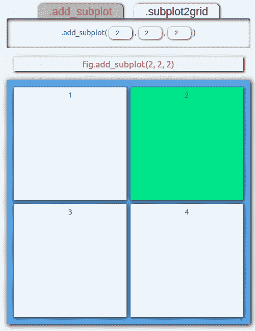

由此看来，我们想要一个 2x2 的网格，我们想要第二个支线剧情。地块索引首先按行编号，然后按列编号。所以我们的代码应该是:

```
fig.add_subplot(2,2,2)
```

太好了！让我们来看看我们迄今为止的工作:

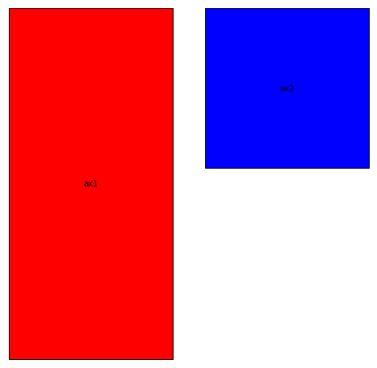

看来一切都上轨道了！现在我已经解释了一些基本原则，我将快速浏览剩下的次要情节。

对于 *ax3* (黄色)，它看起来大约是我们 ax2 插槽垂直尺寸的一半，出现在它的正下方。基本上，我们在寻找这个:

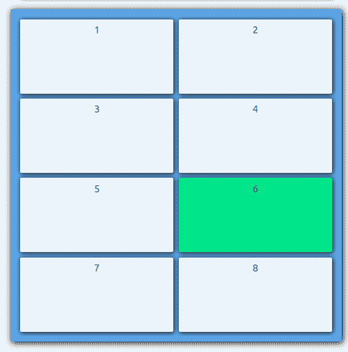

那将是 4 行 2 列，第 6 个支线剧情。或者:

```
fig.add_subplot(4,2,6)
```

最后两个支线剧情看起来一样大。在这里很难看到确切的比例，所以我会告诉你，我们正在寻找一个 8 行 2 列的图形分割。它看起来应该是这样的，我们想要为我们的两个新轴抓取第 14 和第 16 个支线剧情。

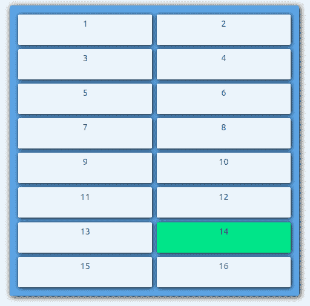

```
fig.add_subplot(8,2,14)fig.add_subplot(8,2,16)
```

我们现在应该有我们的数字完全充满了支线剧情。下面是完整的代码，添加了一些其他视觉元素(颜色、标签等)。).

```
import matplotlib.pyplot as pltfig = plt.figure(figsize=(8,8))ax1 = fig.add_subplot(1, 2, 1, xticklabels=[], yticklabels=[], xticks=[], yticks=[], fc="red",)ax2 = fig.add_subplot(2, 2, 2, xticklabels=[], yticklabels=[], xticks=[], yticks=[], fc="blue")ax3 = fig.add_subplot(4, 2, 6, xticklabels=[], yticklabels=[], xticks=[], yticks=[], fc="yellow")ax4 = fig.add_subplot(8, 2, 14, xticklabels=[], yticklabels=[], xticks=[], yticks=[], fc="green")ax5 = fig.add_subplot(8, 2, 16, xticklabels=[], yticklabels=[], xticks=[], yticks=[], fc="orange")ax1.text(0.5, 0.5, "ax1", horizontalalignment='center', verticalalignment='center')ax2.text(0.5, 0.5, "ax2", horizontalalignment='center', verticalalignment='center')ax3.text(0.5, 0.5, "ax3", horizontalalignment='center', verticalalignment='center')ax4.text(0.5, 0.5, "ax4", horizontalalignment='center', verticalalignment='center')ax5.text(0.5, 0.5, "ax5", horizontalalignment='center', verticalalignment='center')plt.show()
```

就是这样！现在你知道了支线剧情系统是如何与？add_subplot()方法。

的。add_subplot()方法当然可以是一个强大的工具，但它有其局限性。例如，你创建的每个支线剧情只能占用一个单元格。这意味着下面的事情是不可能的。add_subplot()(即使看起来更简单)。

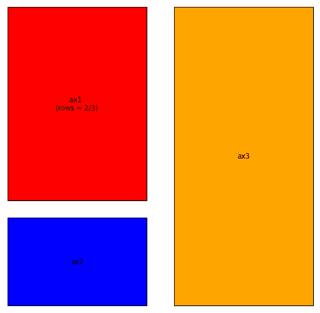

这里的问题是红色支线图占据了图表左侧的 2/3。不幸的是。add_subplot()不能处理选择图形区域的 2/3。

为此，我们可以使用. subplot2grid()。

## **.subplot2grid()**

比如。add_subplot()，. subplot2grid()返回一个 axis 对象，其中包含有关新的子情节应放置在何处的信息。它接受两个必需的位置参数，shape 和 loc。

shape 参数作为两个数的列表或元组传入，其功能类似于。add_subplot()方法。它们指定网格布局，第一个数字是行数，第二个数字是列数。

第二个参数 loc 代表 location，也是一个由两个数字组成的列表或元组。不像。add_subplot()，你不需要通过在你的网格上指定一个索引来指定把你的 subplot 放在哪里。相反，您可以通过指定想要放置子情节的行号和列号来选择网格索引。同样不同的是，. subplot2grid()从 0 开始索引。因此(0，0)将是网格中第一行第一列的单元格。

除了这两个参数，还有两个可选的关键字参数， *rowspan* 和 *colspan* 。这就是我们真正体会到. subplot2grid()威力的地方。有了网格布局(shape)和起始索引(loc)之后，就可以用这两个参数来扩展选择，以占据更多的行或列。默认情况下，rowspan 和 colspan 都设置为 1，这意味着占用相当于 1 行 1 列的单元格。当您增加这些数字时，您可以告诉您的轴对象在当前的网格布局中占据尽可能多的相邻行和列。

让我们仔细看看上面那个只有 3 个支线剧情的例子。虽然这些支线剧情中有一些可以(或许应该)用。add_subplot()，我们将在这里对它们都使用. subplot2grid()进行练习。

正如我已经说过的红色支线剧情，我们需要它占据总高度的 2/3。那么我们如何用. subplot2grid()做到这一点呢？除了占了我们三分之二的行之外，它还被绘制在两列的左列。有了这些信息，让我们将网格分成 3 行 2 列，并将起始索引设置为左上角的单元格。最后，我们需要告诉我们的支线剧情占用我们的三行中的两行。为此，我们将 rowspan 参数设置为 2。因此，我们的网格和支线剧情应该是这样的。

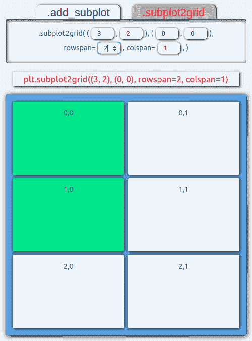

a 3x2 grid, start at index (0,0), use 2 rows and 1 column

```
plt.subplot2grid((3, 2), (0, 0), rowspan=2, colspan=1)
```

正如您所看到的，对. subplot2grid()还有一点要求。但是它允许你非常精确地安排你的可视化空间！

让我们快速完成这个例子。我们接下来将处理蓝色网格框。就像我说的，你可以用。add_subplot()(图 add_subplot(325))。但是我们也可以用. subplot2grid()来完成这个任务。在我们的 3x2 网格中，我们希望这个子情节占据左下角的单元格。这在下面的绘图设计器的图像中进行了描述。


我们的网格形状是相同的(3，2)。因为我们只选择了一个单元格，所以我们将 rowspan 和 colspan 都设置为 1。我们只需要将 loc 参数指向正确的单元格。方便的是，plot planner 应用程序中的单元格标有该单元格在网格中的位置(尽管它们并不难理解)。从上面的图像中，我们想要 cell (2，0)，所以我们将它插入到我们的 loc 参数中。代码将会是:

```
plt.subplot2grid((3, 2), (2, 0), rowspan=1, colspan=1)
```

对于最后一个支线剧情，我们只需要整个右栏。同样，这很容易通过。add_subplot(122)。我们也可以用 plt.subplot2grid((3，2)，(0，1)，rowspan=3，colspan=1)来实现。

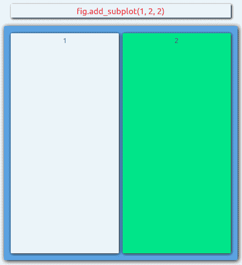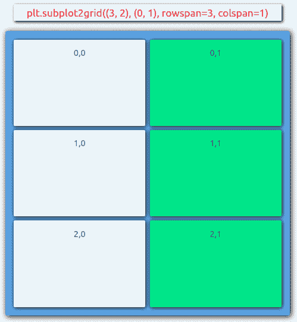

变得更加冒险(接近荒谬)，我们也可以用下面的代码完成右边的专栏。这只是为了说明可以做些什么，而不是如何解决这个问题的实际建议。

```
plt.subplot2grid((6, 6), (0, 3), rowspan=6, colspan=3)
```

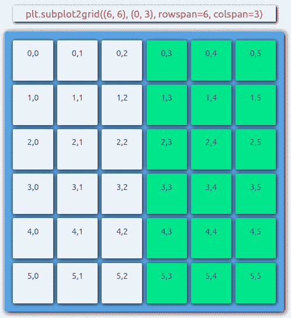

将所有这些放在一起，我们得到了以下内容(同样，我添加了一些额外的代码来处理颜色和文本):

```
fig = plt.figure(figsize=(8,8))ax1 = plt.subplot2grid((3, 2), (0, 0), rowspan=2, colspan=1, xticklabels=[], yticklabels=[], xticks=[], yticks=[], fc="red",)ax2 = plt.subplot2grid((3, 2), (2, 0), rowspan=1, colspan=1, xticklabels=[], yticklabels=[], xticks=[], yticks=[], fc="blue",)ax3 = plt.subplot2grid((3, 2), (0, 1), rowspan=3, colspan=1, xticklabels=[], yticklabels=[], xticks=[], yticks=[], fc="orange",)ax1.text(0.5, 0.5, "ax1 \n(rows = 2/3)", horizontalalignment='center', verticalalignment='center')ax2.text(0.5, 0.5, "ax2", horizontalalignment='center', verticalalignment='center')ax3.text(0.5, 0.5, "ax3", horizontalalignment='center', verticalalignment='center')plt.show()
```

以及由此产生的视觉效果:


现在你知道了！的基础演练。add_subplot()和. subplot2grid()。如果你想自己尝试一下，或者只是想得到一点帮助来为一个复杂的布局建立索引，可以看看我的 [plot planner 工具](https://qed0711.github.io/plot-planner/)。

感谢你的阅读！