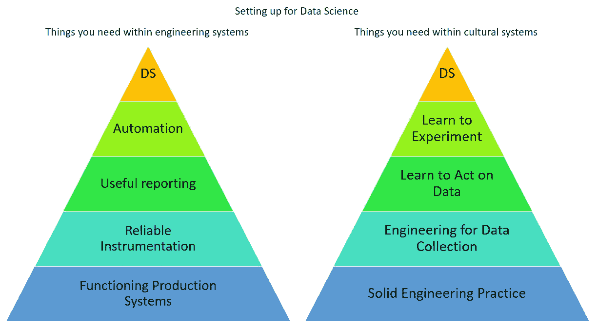

# 在小公司/初创公司中成为成功的数据科学家

> 原文：<https://towardsdatascience.com/succeeding-as-a-data-scientist-in-small-companies-startups-92f59e22bd8c?source=collection_archive---------4----------------------->

这与成熟的大公司完全不同。

这可能会是一个无限的帖子系列，从这个问题衍生而来，这个问题来自一个令人敬畏的社区，即数据呆子 twitter 集群:

# 一些背景

我已经在规模在 15-150 之间的公司工作了将近 12 年，身兼数据分析师、工程师以及偶尔的科学家等各种职务。作为一名 UX 的研究人员，走进大型企业谷歌云有点不符合他的性格，但随着新产品不断涌现，就问题和混乱而言，这感觉就像一家初创公司，尽管涉及数十亿美元的总收入。

我曾在室内设计(办公室设计)、广告技术、社交网络、链接缩短、电子商务以及现在的企业云等多个领域工作过。我有社会科学背景，有一点 NLP，应用数学和工商管理。我主要生活在后端系统、日志和 SQL 中。

一句话，我是一个多面手，就是人们似乎会推荐给初创公司的那种，而这正是我整个职业生涯蓬勃发展的地方。

这些是我的偏见，也是我从中汲取的经验。如果你在一家初创公司，人工智能/人工智能实际上是业务的核心基础，我可能与你的需求无关。YMMV。

# 成为第一个“数据人”

我就直说了， ***小公司不需要一个数据科学家，但是需要一个“数据人”。*** 他们可能会称这份工作为“数据科学家/工程师/分析师/忍者”，随便什么。

我的经验是，在 20 至 60 名员工之间，有足够的客户、积累的数据和角色专业化，需要引入能够利用数据提供有用商业见解的人，这开始证明雇佣某人的成本是合理的。在那之前，他们用现有的技能凑合着过日子。

职位几乎可以是任何东西，但是职位描述往往是以下各项的混合:

1.  理解我们拥有的数据
2.  帮助建立我们的数据系统
3.  帮助我们实现数据驱动/运行实验
4.  发展业务
5.  教育/认证可能与任何事情相关，也可能不相关

通常很有可能他们并不真正完全了解他们需要什么。这只是一种广义的感觉，“我们有数据，它似乎很有用，但我们没有任何人有技能让它变得有用。”

实际上，担任这个职位的人需要同时做两件大事:

*   帮助公司今天取得成功
*   让公司明天成为数据驱动型企业

# 帮助公司取得今天的成功

创业公司被不确定性所包围。他们不确定谁是他们的客户，生产系统可能不可靠，他们不知道他们的客户在用产品做什么，他们不知道如何利用他们拥有的数据做出决策，他们不知道他们拥有的数据是否有用。

对这些问题的聪明回答会导致更聪明的决定，并有希望实现每个人梦寐以求的神话般的曲棍球棒增长。问题是，这些问题中的大部分并不适合花哨的方法。有用的方法通常是一个世纪前的和/或基于定性方法而不是定量方法。

大多数 DS 方法在优化现有流程时是最有效的，它们会在客户获取、转换、保留和支出等方面为您带来 5%、10%甚至 25%的增长。A/B 测试，推荐系统，ML 分类器，这些都有助于优化。收益是真实的，可量化的，并且可能是显著的，但是早期可能有更大的鱼要煎。

早期最大的影响通常涉及*洞察力*。洞察力从根本上改变了公司的行为。它们来自非常平凡的事情，比如对用户偏好/行为的研究，为销售人员揭示了一个新的营销概念，或者帮助产品团队认识到 Twitter 上最令人讨厌的功能实际上被 90%的付费客户使用，他们不应该无缘无故地放弃它。

我对这个“现在就帮助公司”角色的看法是，数据人是一个**力量倍增器**。企业内部的人有问题，工作就是帮助他们解决问题。

## 成为第一个“数据人”=成为“拥有数据的科学家”

对我来说，成为一名科学家意味着你有一个问题，一个研究问题，并且你使用任何你能使用的方法来得到这个问题的可靠答案。

作为数据科学家，我们倾向于使用定量方法和从系统中收集的数据来回答问题，但这不是获得洞察力的唯一途径。有时你会全力观察或询问用户(定性方法)，或者你出去收集数据(实验和调查)，或者你观察其他人(竞争分析)。一个好的科学家不会用他们的方法来定义自己，第一个数据人(或任何后来的数据人)也不应该。

目标是回答紧迫的业务需求:“为什么没有人使用我们的产品？”“我们的回报怎么会这么高？”我们该不该进行这次昂贵的拍卖？”“是什么推动了客户流失？”“客户的终身价值是什么，是什么推动了这种价值？"

# 成为数据驱动的未来

我看到的一个常见陷阱是，数据科学专业毕业的人加入这些职位时，期望使用 Spark 等性感的东西，并将 RNNs 应用到他们的工作中。但可悲的是，他们想住在需要首先完成的基础工作的山顶上，**从工程角度来看是**，从文化角度来看是*。这种不匹配是残酷的。*

Fancy “Data Science” methods rely on a ton of things, DO NOT expect each layer to be “done” before moving to the next. Think of the colors as “time spent”.

作为第一个被专门雇佣来处理数据的人，金字塔的任何部分都不太可能是坚固的。这是一项历时多年、跨职能、全公司共同努力的工作，旨在将所有部分都落实到位。并行培养所有这些部分是这项工作的一大部分。

请注意，在一个典型的业务中，您将试图同时在金字塔的上下游做事情，而不管底层的稳定性如何。我已经针对脆弱的新系统构建了大量的仪表板和分类器，您也一样。

关于所有这些东西的各个方面，有足够的空间来发表大量的帖子，但这里是我的想法的粗略概述。

## **固体生产系统和工程实践**

这是一件在工程领域非常常见的事情，但是如果一个系统有问题并且损坏了，你就不能真正地测量这个系统的行为，所以期望在需要的时候能帮上忙。

你最终戴的“数据工程师”的帽子越多，你在帮助构建可靠的系统中扮演的角色就越大。人们自然会问你一些问题，比如 PostgresSQL 对 MySQL，AWS 对 GCP，Spark 对 Redshift 等等。帮助这些决定增加了持久的价值。如果没有足够的工程资源，你必须自己建立系统并运行它们。

我还发现，出于商业目的将工程推向仪器系统有一个很好的副作用，那就是发现有趣的 bug。有一次，我在一个不应该有 dupes 的关键表中发现了重复的 id，那是一组 bug hunt，它修复了一个创收系统中的一些东西。经常查看生产表可以发现非常奇怪的错误。

## 可靠的仪器

垃圾进，垃圾出。

获得可靠的仪器是第一数据人员做的最重要的事情**。这是一个无止境的旅程，从挑选框架(多个)到收集系统和用户数据，确保工程师学会如何在不计算错误(这很容易发生)的情况下实现事情，确保数据库和日志做正确的事情(tm)，并确保你正在计算你认为你正在计算的东西。**

**同时，将增加专门收集和报告数据的系统。这些需要由某个人，也许是你来整理和管理。**

**在文化方面，从新人到首席执行官，每个人都会不断询问数据的可靠性以及如何处理这些信息。他们会要求澄清，解释，深入了解他们自己建立的系统。**

**这种文化培训本身就是一个漫长的旅程，因为你要制作报告和仪表板，人们会发现与其他系统不一致的地方，并得到与他们对现实的看法不一致的结果。有时他们的现实是错误的，但通常他们是正确的。仅仅是这些对话就能让所有参与其中的人变得更聪明。**

**老实说，我不认为这个阶段是“完全”的，它只是达到了一个点，当一个新的特性或大的变化出现时，你只需要担心它。**

## **报告和处理数据**

**仪表板和报告并不是一个性感的工作，但不幸的是，这通常是整个公司的人每天观察公司健康状况的第一/唯一方式，因此投资是必要的。目标是将(潜在的)可操作信息放在能够主动采取行动的人手中。**

**开始时，大多数仪表板和报告将是手动的。这需要大量的迭代来发现人们足够关心多次看到的指标。自动化是一个不错的选择，但是获得洞察力更重要。**

**技术方面并不超级复杂。有许多服务和平台可以生成报告和仪表板，您甚至可以使用自定义代码来完成。诀窍是让所有的数据系统一起发挥作用(Ha)，有良好的性能，并尽量减少(重大！)随着业务增长维护仪表板和报告的开销。**

**文化方面是有趣的地方。你在训练人们变得更加数据驱动。这也需要多年的工作和练习。**

**这里涉及到大量的教育。你将教人们如何阅读 A/B 测试的结果，显著差异意味着什么，解释什么是置信区间/预测区间，解释为什么该图表“只是一个估计，因为我们依赖于第三方报告，它们是不可靠的”。你将回答关于样本大小的问题(永远不够)，并不断需要教人们好的方法。**

**如果人们担心仪表板上的数字，他们应该怎么做？就我个人而言，我告诉他们来和我谈谈。他们关心的是潜在的研究问题(或缺陷)，这是字面上的研究黄金。这些人是这部分业务的领域专家，而我只是一个使用 SQL 的书呆子。**

## **自动化和实验**

**随着时间的推移，您将为新功能的推出建立指标和仪表板。不可避免地，人们会对某个功能的表现感到失望，并想知道为什么。如果你还没有学会前/后分析方法，还没有记住你的主要市场的所有节假日，现在是时候这样做了。**

**一旦人们习惯了拥有信息，并可能运行一些 A/B 测试得到令人失望的结果，当测试数据与人们的假设相反时，预计将花费大量时间来验证数字是否正确。**

**尽管有那些痛苦的时刻，我们现在终于在做真正的科学了。提出假设并收集数据进行测试。**

**到目前为止，有用的仪表板应该是相当自动化的，人们习惯于使用数据来做出决策。当一个新功能被提出时，你知道你已经到了，“我们将如何判断它的成功？”不用你去争取就会出现。**

**我注意到的另一件有趣的事情是，在这个阶段，一家公司可能会过于舒适地进行实验。他们学习设计他们知道会成功的测试(低风险)，或者他们会“测试”一个他们 100%知道不管结果如何都会启动的东西(“我们稍后会优化它”)。**

**作为科学家，现在你的工作是呼吁人们关注这种行为。他们可以完全不顾测试结果而推出，激进的改变往往测试效果不佳，但应该明确说明意图。**

## **最后，数据科学**

**在经历了漫长、漫长、漫长的旅程和许多弯路之后，公司本身已经过渡到数据驱动。他们有假设，能够可靠地收集数据，并根据结果做出深思熟虑的决定。他们也更加自给自足，能够阅读(也许创建)带有一些指导的仪表板，并且已经学会何时担心以及如何提出问题。**

**在金字塔的底部总会有事情要做，但至少现在事情不会一直着火。企业有望更好地了解其在市场和世界中的位置，并且兴趣转移到优化现有流程以获得增量(但显著)收益。**

**现在，你可以考虑打破花哨的算法…**

**或者，可能有一个数据仓库需要构建，因为您现在有太多的系统，分析查询无法进一步加速，哎呀。**

# **欢迎评论/反馈**

**我一口气写完了整篇文章，因为内容需要一个出口。由于篇幅原因，我已经掩盖了一大堆东西。因此，我们非常欢迎对未来帖子的任何反馈和主题请求。在推特上给我打电话。**