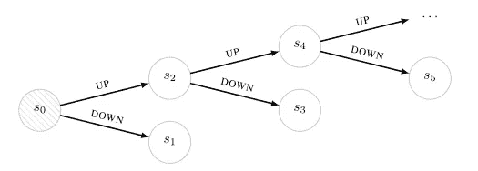

# 后续不确定性

> 原文：<https://towardsdatascience.com/successor-uncertainties-b498097827fb?source=collection_archive---------19----------------------->

## 无模型强化学习的高效探索

我在这里描述一下我们最近的 NeurIPS 论文[【1】](https://arxiv.org/abs/1810.06530)[【code】](https://github.com/DavidJanz/successor_uncertainties_tabular)，介绍了**无模型强化学习中**高效探索**的最新方法**后继不确定性** (SU)。**

主要作者是来自剑桥 [**机器学习小组**](http://mlg.eng.cam.ac.uk) 的两名博士生 **David Janz** 和 **Jiri Hron** ，这项工作源于 David Janz 在 [**微软剑桥**](https://www.microsoft.com/en-us/research/lab/microsoft-research-cambridge/) 研究院实习期间。

SU 背后的主要见解是使用概率模型描述 Q 函数，该模型直接考虑 Q 函数值之间的**相关性，如**贝尔曼方程**所示。这些相关性在以前的工作中被忽略了。**

结果是一种方法，即**在表格基准和 Atari 游戏上胜过竞争对手**，同时仍然是**快速**和**高度可扩展**。

# 问题描述

我们考虑一般的**强化学习** (RL)设置，其中**代理**通过采取**动作** a_t，与具有**状态** s_t 的**环境**进行交互，然后环境通过转换到状态 s_t+1 并给出奖励值 r_t+1 进行响应，如下图所示。

环境通常是由未知的**跃迁分布** P(s_t+1，r_t+1|s_t，a_t)完全确定的**随机**和**马尔可夫**，。

代理使用**策略函数** π(a|s)选择其下一个动作作为当前状态的函数，π(a|s)是给定当前状态下动作的概率分布，即π(a|s)=P(a_t=a|s_t=s)。

RL 的目标是从与环境的相互作用中找到一个政策函数，该函数使**贴现回报的期望总和**最大化

其中 0≤γ<1 保证和是有限的。

RL 中的**主要挑战**之一是，行为对奖励的影响通常会**延迟**，直到很久以后才会被察觉。这使得很难确定在任何给定状态下采取的最佳行动。

# q-函数和广义策略迭代

当根据政策π行动时，一种立即说明行动对未来回报的影响的方法是使用**状态-行动值函数**或 **Q 函数。**

Q 函数返回当在状态“s”采取行动“a”然后根据π行动时将获得的折扣奖励的预期总和。特别是，

其中期望是π选择的未来行动和环境的转移概率。

Q 函数可以被示为满足**贝尔曼方程**，因为在特定状态的动作的值取决于在**后续状态**的其他动作的值。特别是，

该等式清楚地表明 Q 函数不是任意函数，并且**必须满足** **特定约束**。这将是 SU 设计中的**关键**，这是在构建 Q 函数的概率模型时考虑这些约束的第一种方法。

## 政策改进

Q-函数非常有用，因为我们可以通过**贪婪地**对π的 Q-函数采取行动来获得比π更好或等于π的新策略π_new。这个过程叫做**政策完善**。当行动空间离散时，我们得到以下贪婪策略

## 政策评价

为了实现策略改进，我们需要对当前策略的 Q 函数进行估计。这一估计最初可能不可用。获得这种估计的一种方法是对 Q 函数的初始随机猜测重复应用**贝尔曼算子**:

它根据其他状态-动作对的 Q 值来更新一个状态-动作对的 Q 值。这个过程叫做**政策评估**。

## 广义策略迭代和有效探索

大多数无模型 RL 方法通过从初始随机策略开始，然后以不同程度的粒度交替策略评估和策略改进步骤来找到最优策略。这被称为**广义策略迭代** (GPI)。

在许多 GPI 方法中，贝尔曼算子在政策评估步骤中所要求的期望值通常通过蒙特卡罗近似，通过对从与环境的交互中收集的数据求平均**。**

好的实证结果的一个关键因素是如何收集数据以便快速收敛到最优政策。**高效探索**指的是与环境的智能互动，旨在使这种快速融合在实践中发生。

然而，大多数情况下，无模型 RL 方法不执行有效的探索，并且只是通过遵循具有概率 1-ɛ的贪婪策略，然后选择具有概率ɛ.的随机动作来收集数据

# 汤普森采样和概率 Q 函数

Thompson sampling (TS)是一种有效收集数据的**策略**，该策略在许多不同领域**都非常成功**。特别地，我们的方法 SU 使用 TS 的近似版本来进行有效的探索。

在一般设置中，TS 通过迭代执行以下两个步骤来工作:

1.  在给定可用数据的情况下,**后验分布**中关于数据生成机制的样本假设“H”。
2.  根据采样的“H ”,通过**最佳动作**收集新数据。

下图显示了当我们想要最大化一个未知的目标函数时，TS 迭代的一个例子。

图 1 显示了通过在三种不同输入下评估目标获得的数据。图 2 显示了给定目前收集的数据的目标后验分布的样本。曲线 3 显示选定的样本，曲线 4 显示使采样函数最大化的输入。这个输入是我们下一步根据 TS 收集数据的最佳动作。

在 RL 设置中，TS 通常被称为**强化学习的后验采样**(PSRL)【5，6】。当 TS 应用于 RL 问题时，“H”是一个特定的转移分布，并且“H”上的后验概率是在给定观察元组(r_t+1，s_t+1，s_t，a_t)形式的数据的情况下计算的。相对于特定“H”的最佳动作包括**为采样的 P(s_t+1，r_t+1|s_t，a_t)找到最佳策略**。

这意味着上面的步骤 2 在实践中是**高成本的**,因为一旦我们采样了特定的跃迁分布，最优行动需要解决由采样的 P(s_t+1，r_t+1|s_t，a_t)指定的新 RL 问题。

结果是**汤普森采样在大多数 RL 问题中是不可行的**。

## 概率 Q 函数

RL 中 TS 的巨大计算成本促使研究人员提出近似方法。

一种常见的方法是在 Q 函数上使用**后验分布，而不是在转移分布上使用后验分布。这种方法通常被称为**随机化价值函数**(RVF)【7】。在这种情况下，对从后验分布采样的假设采取最优行动**与为采样的 Q 函数计算贪婪策略**一样简单。**

RVF 在实践中被证明是成功的，导致 RL 方法执行更有效的探索。然而，当 Q 函数由神经网络近似时，这种方法**仍然具有局限性**。

首先，获得 Q 函数的后验分布并不简单，因为当我们执行非策略 RL 时，我们无法直接访问 Q 函数的输入和相应输出值形式的**数据。许多使用神经网络近似的 RVF 方法**错误地假设情况就是这样**。此外，这些方法还存在以下**两个问题**之一:**

1.  Q 函数上的分布**忽略了函数值**之间的相关性，例如由**贝尔曼方程**给出的相关性。
2.  Q 函数上的分布捕捉到了这些依赖性，但是计算成本**很大**。

SU 没有这些问题，因为它捕获了由贝尔曼方程给出的依赖性，并且具有低计算成本。

# 后续不确定性

给定策略π的 Q 函数上的后验分布可以通过以下方式获得:首先，从观察到的元组(r_t+1，s_t+1，s_t，a_t)计算转移分布上的后验分布，然后将该后验分布映射到 Q 函数上的对应分布。

令人惊讶的是，当转移分布满足以下假设时，前面的操作可以直接完成:

1.  P(r_t+1|s_t，a_t)由**线性高斯模型**r _ t+1 =**wϕ**(s_t,a_t)+ϵ_t，其中 **ϕ** (s_t，a_t)是状态和动作的特征表示，ϵ_t 是高斯噪声。
2.  忽略关于 P(s_t+1|s_t，a_t)的不确定性。

奖励的先前线性模型导致 Q 函数的对应**线性模型。特别是，**

其中 **ψ** (s_t，a_t)为**后继特征**【10】，即π下每个 **ϕ** (s_t，a_t)的折现期望未来发生。

在对于 **w** 的高斯先验下，我们获得对于 **w** 的高斯后验 N( **w|m，S** ),在前面的等式下，导致对于 Q 函数的**完全相关的**高斯后验，均值和协方差函数由下式给出

由于 Q 函数仅针对给定策略π定义，我们假设该策略是通过从后验分布中采样 Q 函数而获得的**平均贪婪策略**。

这个协方差函数保证采样的 Q 函数将满足**贝尔曼方程**。

## 实际实施

初始特征 **ϕ** (s_t，a_t)和后续特征 **ψ** (s_t，a_t)使用**多头神经网络**计算，每个可能的动作值和特征类型( **ϕ** 或 **ψ)** 一个头。每个头的输出乘以 **m** 以获得对下一个奖励和 Q 函数值的预测。

下图显示了 Atari 游戏设置的整个过程，头部的输入由一个卷积神经网络给出，后面是一个完全连接的层。在表格环境中，网络的这一部分可以由状态的一次热编码来代替。

苏通过优化学习神经网络的参数和 m

期望超过通过与环境交互收集的元组(r_t+1，s_t+1，s_t，a_t)。

上述目标包括三种不同的损失条款。第一个是**后续特征**的**时间差误差**。此项强制 **ψ** 收敛于 **ϕ** 的贴现预期未来发生。第二个损失项调整 **m** 和 **ϕ** ，使得回报预测中的**误差较低**。最后，第三项是 **Q 函数**和的估计中的**时间差异误差**，它强制 **ψ** 也适用于预测 Q 函数值。

最后，根据高斯线性模型中的贝叶斯规则在线更新**协方差矩阵 **S** :**

其中β是奖励的线性模型中的噪声方差，0≤ζ≤1 是允许模型遗忘的衰减因子，这有助于在学习过程中对抗 **ϕ** 的非平稳性。在下面的实验中我们用了β = 0.001(二叉树)和β = 0.01(雅达利)和ζ = 1(二叉树)和ζ = 0.99999(雅达利)。

# 二叉树基准的实验

我们评估了 SU 在一个需要**高效探索**的挑战性问题上的表现。在这个问题中，见下图，有 **2L+1** 状态和两个可能的动作，这两个动作在环境生成时被随机映射到每个状态中的**向上**和**向下**的运动。奖励总是 0，除非在到达产生奖励 1 的 s_2L 州之后。奇数指数和 s_2L 的状态是终端。

这个问题**对**具有挑战性，因为代理将总是获得奖励 0，除非问题被解决，如果没有智能探索，这将以指数小概率发生，作为 **L** 的函数。

下图显示了学习最佳策略所需的发作次数的中位数。将 SU 与其他 RVF 方法进行比较，如贝叶斯 DQN ( **BDQN** ) [3]、不确定性贝尔曼方程( **UBE** ) [2]和**自举 DQN** [4]。后一种方法用一组 Q 函数估计量来逼近 Q 函数后验。

BDQN 和 UBE 执行与**相同的策略，随机地对行为进行统一采样****，并且当 **L** 很大时，他们都努力寻找最优策略。自举的也比苏差，当自举的使用比苏多 25 倍的计算时，差距变得更小。原因是我们的贝叶斯线性模型使用的分析更新允许不确定性得到真正快速的解释，而 bootstrap DQN 更依赖于基于梯度的更新。**

# **雅达利游戏的实验**

**为了表明它可以扩展到复杂的领域，我们在 49 个 Atari 游戏的标准集上评估了 SU[8]。实施、网络架构和培训程序的具体细节可以在[1]中找到。在[9]中描述的“无操作启动 30 分钟模拟器时间”测试协议下，在 200 米训练帧后，SU 获得了 2.09 的中值人类标准化得分(3 粒种子的平均值)。下表显示 SU 明显优于竞争方法。**

****

**关于更多细节，SU 和各个游戏的竞争算法之间的人类标准化分数的差异绘制在下图中。**

****

**Bars show the difference in human normalized score between SU and Bootstrap DQN (top),
UBE (middle) and DQN (bottom) for each of the 49 Atari 2600 games. Blue indicates SU performed
better, red worse. SU outperforms the baselines on 36/49, 43/49 and 42/49 games respectively.
Y-axis values have been clipped to [−2.5, 2.5].**

# **摘要**

**后继不确定性是**无模型强化学习中**高效探索**的最新方法。**尤其是苏**

1.  **是 Q 函数的第一个概率方法，它结合了贝尔曼方程给出的**依赖性。****
2.  **是高度可扩展的，和以前的方法一样快或者更快。**
3.  ****在表格基准测试和雅达利游戏上胜过竞争对手**。**

# **参考**

**[1] Janz* D .，Hron* J .，马祖尔 p .，霍夫曼 k .，埃尔南德斯-洛巴托 J. M .和 Tschiatschek S. **后继者的不确定性:时间差异学习中的探索和不确定性**，载于 NeurIPS，2019 年。*同等贡献者。**

**[2]b .奥多诺格、I .奥斯本、r .穆诺斯和 v .姆尼赫**《不确定性贝尔曼方程与探索**。在 2018 年的 ICML。**

**[3] Azizzadenesheli，k .、Brunskill，e .和 Anandkumar，A. **通过贝叶斯深度 Q 网络进行有效探索**。在 2018 年的 ICLR。[https://openreview.net/forum?id=Bk6qQGWRb](https://openreview.net/forum?id=Bk6qQGWRb)**

**[4] Osband，I .、Blundell，c .、Pritzel，a .、Van Roy，B. **通过自举 DQN 进行深度探索**。在 NeurIPS，2016。**

**[5] Strens，M. **强化学习的贝叶斯框架**。2000 年在 ICML。**

**[6] Osband，I .、Russo，d .和 Van Roy，B. **(更)有效的通过后验抽样的强化学习**。在 NeurIPS，2013 年。**

**[7] Osband，I .、Van Roy，b .、Wen，Z. **通过随机值函数进行概括和探索**。2016 年在 ICML。**

**[8] Mnih，v .，Kavukcuoglu，k .，Silver，d .，鲁苏，A. A .，Veness，j .，Bellemare，M. G .，Graves，a .，Riedmiller，m .，Fidjeland，A. K .，Ostrovski，g .，等人**通过深度强化学习实现人的水平控制**。自然，518(7540):529，2015。**

**[9] Hessel，m .，Modayil，j .，van Hasselt，h .，Schaul，t .，Ostrovski，g .，Dabney，w .，Horgan，d .，Piot，b .，Azar，M. G .，和 Silver，D. **彩虹:结合深度强化学习的改进**。2018 年 AAAI 人工智能大会。**

**[10] Dayan，P. **改进时间差异学习的概括:后继表征**。神经计算，5(4):613–624，1993。**