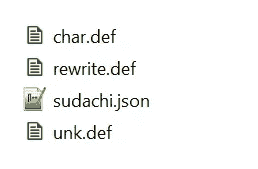
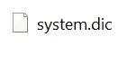
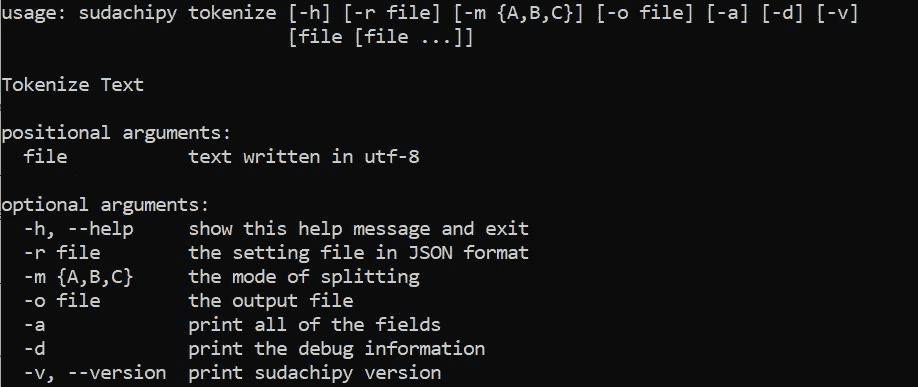

# SudachiPy:一个用 Python 编写的日语词法分析器

> 原文：<https://towardsdatascience.com/sudachipy-a-japanese-morphological-analyzer-in-python-5f1f8fc0c807?source=collection_archive---------20----------------------->

Sudachi 的 Python 版本，专注于日语文本的自然语言处理(NLP)


Photo by [Damon Lam](https://unsplash.com/@dayday95?utm_source=unsplash&utm_medium=referral&utm_content=creditCopyText) on [Unsplash](https://unsplash.com/s/photos/japanese-writing?utm_source=unsplash&utm_medium=referral&utm_content=creditCopyText)

本文介绍了 SudachiPy 的基本功能，它可以用来执行简单的自然语言处理任务，比如日语的标记化。基于官方 [Github](https://github.com/WorksApplications/SudachiPy) 页面:

> Sudachi 和 SudachiPy 是由人工智能的 [WAP 德岛实验室和 NLP](http://nlp.worksap.co.jp/) 开发的，NLP 是 [Works Applications](http://www.worksap.com/) 下的一个研究所，专注于自然语言处理(NLP)。

最初的版本是 Java，而 SudachiPy 是它的 python 实现。说了这么多，有些功能还是和 Java Sudachi 不兼容。本文由 4 个主要部分组成:

1.  设置
2.  命令行
3.  基本用法
4.  结论

# 1.设置

## SudachiPy

让我们从创建一个虚拟环境并激活它开始。完成后，在终端中运行以下命令:

```
pip install SudachiPy
```

这将安装 SudachiPy 的最新版本，在本文撰写时是 0.3.11。SudachiPy 高于 0.3.0 的版本默认引用 SudachiDict_core 包的 system.dic。这个软件包不包含在 SudachiPy 中，必须手动安装。

## SudachiDict_core

您可以通过运行以下命令来安装该软件包:

```
pip install https://object-storage.tyo2.conoha.io/v1/nc_2520839e1f9641b08211a5c85243124a/sudachi/SudachiDict_core-20190718.tar.gz
```

它会自动安装默认词典。一旦你准备好了，让我们跳到下一部分。以下段落旨在设置您自己的自定义词典。

## 自定义词典(可选)

Sudachi 为我们提供了 3 种不同的字典

*   [**小号**:仅包含 UniDic](https://object-storage.tyo2.conoha.io/v1/nc_2520839e1f9641b08211a5c85243124a/sudachi/sudachi-dictionary-20190718-small.zip) 的词汇
*   [**核心**:包含基本词汇(默认)](https://object-storage.tyo2.conoha.io/v1/nc_2520839e1f9641b08211a5c85243124a/sudachi/sudachi-dictionary-20190718-core.zip)
*   [**全**:包含杂项专有名词](https://object-storage.tyo2.conoha.io/v1/nc_2520839e1f9641b08211a5c85243124a/sudachi/sudachi-dictionary-20190718-full.zip)

您应该能够下载 system.dic 文件。您可以将字典修改为任何内置或自定义的字典。

*   **路径修改**:创建一个 sudachi.json，放在你喜欢的任何地方。默认情况下，包在以下目录中包含此文件。

```
<virtual_env>/Lib/site-packages/sudachipy/resources/
```



Image by Author

你可以选择编辑这个文件或者创建一个[新的](https://gist.github.com/wfng92/237a4ed7e11079f5cd0736285e02c577)并粘贴下面的代码:

将 systemDict 修改为 systemDict 的相对路径，以指向 system.dic 文件。

*   **直接替换**:转到以下目录:

```
<virtual_env>/Lib/site-packages/sudachidict_core/resources
```

您应该只能看到一个名为 system.dic 的文件



Image by Author

用您的自定义词典或从官方网站下载的词典替换该文件。

如果您使用的是 Windows 操作系统，并且遇到了`OSError: symbolic link privilege not held`问题。请以管理员身份运行您的终端。然后，键入并运行以下命令:

```
sudachipy link -t core
```

# 2.命令行

SudachiPy 还为我们提供了一些命令行。一旦安装了 **SudachiPy** 和 **SudachiDict_core** 模块，您就可以直接使用它了。我将用它来测试我们是否正确安装了模块。有 4 个主要的可用命令:

*   标记化
*   环
*   建设
*   ubuild(包含使用 0.3 版本时的 bug。*)

打开终端并运行以下命令:

```
sudachipy tokenize -h
```

您应该能够看到以下结果。



Image by Author

如果您遇到任何问题，请确保您已经正确安装了 **SudachiPy** 和 **SudachiDict_core** 模块。

# 3.基本用法

## 导入

首先，让我们导入**分词器**和**字典**模块。

```
from sudachipy import tokenizer
from sudachipy import dictionary
```

## 记号赋予器对象

创建一个**标记器**对象需要这两个模块。继续添加以下代码:

```
tokenizer_obj = dictionary.Dictionary().create()
```

## 方式

接下来，我们需要为记号赋予器定义模式。模式用于确定标记器应该如何拆分文本。

*   **A** :文本被分割成与 UniDic 短单元相当的最短单元
*   **B** :将文本分割成 A 和 C 之间的中间单元
*   **C** :提取命名实体

让我们通过将其设置为模式 A 来测试一下:

```
mode = tokenizer.Tokenizer.SplitMode.A
```

创建一个新变量，并指定任何日语文本。然后，调用列表理解中的 tokenize 函数，如下所示:

```
txt = "医薬品安全管理責任者"
print([m.surface() for m in tokenizer_obj.tokenize(txt, mode)])
```

您应该能够获得以下结果:

```
['医薬', '品', '安全', '管理', '責任', '者']
```

您可以对其进行测试，以查看所有三个输出的结果，如下所示:

```
from sudachipy import tokenizer
from sudachipy import dictionarytokenizer_obj = dictionary.Dictionary().create()
txt = "医薬品安全管理責任者"
mode = tokenizer.Tokenizer.SplitMode.A
print([m.surface() for m in tokenizer_obj.tokenize(txt, mode)])
mode = tokenizer.Tokenizer.SplitMode.B
print([m.surface() for m in tokenizer_obj.tokenize(txt, mode)])
mode = tokenizer.Tokenizer.SplitMode.C
print([m.surface() for m in tokenizer_obj.tokenize(txt, mode)])
```

## 字典和规范化形式

日语以复杂的动词变化著称。SudachiPy 还为我们提供了一种通过内置函数自由转换它们的方法。我们将只探索三个主要的函数，我们可以在通过 tokenizer obj 分割文本后访问它们。

第一个是原始文本，可以使用**表面**()函数调用

```
print([m.surface() for m in tokenizer_obj.tokenize(txt, mode)])
```

此外，我们还有 **dictionary_form** ()函数

```
print([m.dictionary_form() for m in tokenizer_obj.tokenize(txt, mode)])
```

最后一个是 **normalized_form** ()函数

```
print([m.normalized_form() for m in tokenizer_obj.tokenize(txt, mode)])
```

让我们将它们结合在一起，看看有什么不同:

```
from sudachipy import tokenizer
from sudachipy import dictionarytokenizer_obj = dictionary.Dictionary().create()
txt = "ゲームデータを消失してしまいました。"
mode = tokenizer.Tokenizer.SplitMode.A
print([m.surface() for m in tokenizer_obj.tokenize(txt, mode)])

print([m.normalized_form() for m in tokenizer_obj.tokenize(txt, mode)])

print([m.dictionary_form() for m in tokenizer_obj.tokenize(txt, mode)])
```

您应该能够获得以下结果:

```
['ゲーム', 'データ', 'を', '消失', 'し', 'て', 'しまい', 'まし', 'た', '。']
['ゲーム', 'データ', 'を', '消失', '為る', 'て', '仕舞う', 'ます', 'た', '。']
['ゲーム', 'データ', 'を', '消失', 'する', 'て', 'しまう', 'ます', 'た', '。']
```

## 词性

任何自然语言处理中最重要的特征之一是词性标记。我们可以通过**词性**()函数轻松获得:

```
print([m.part_of_speech() for m in tokenizer_obj.tokenize(txt, mode)])
```

输出结果如下所示:

```
[['名詞', '普通名詞', '一般', '*', '*', '*'], ['名詞', '普通名詞', '一般', '*', '*', '*'], ['助詞', '格助詞', '*', '*', '*', '*'], ['名詞', '普通名詞', 'サ変可能', '*', '*', '*'], ['動詞', '非自立可能', '*', '*', 'サ行変格', '連用形-一般'], ['助詞', '接続助詞', '*', '*', '*', '*'], ['動詞', '非自立可能', '*', '*', '五段-ワア行', '連用形-一般'], ['助動詞', '*', '*', '*', '助動詞-マス', '連用形-一般'], ['助動詞', '*', '*', '*', '助動詞-タ', '終止形-一般'], ['補助記号', '句点', '*', '*', '*', '*']]
```

# 4.结论

让我们回顾一下今天所学的内容。我们从安装必要的 python 模块开始， **SudachiPy** 和 **SudachiDict_core** 。还有一个选项可以配置它来加载您自己的自定义词典。

然后，我们研究了一些可以在终端中调用来测试安装的基本命令。

接下来，我们深入研究基本的 python 代码，学习如何标记日语文本。此外，我们可以得到字典或规范化形式的输出标记。更不用说**词性**()函数，它可以帮助识别每个令牌的 POS 标签。

感谢您的阅读，祝您愉快。下一篇文章再见。

# 参考

1.  [https://github.com/WorksApplications/SudachiPy](https://github.com/WorksApplications/SudachiPy)
2.  [https://github.com/WorksApplications/Sudachi](https://github.com/WorksApplications/Sudachi)