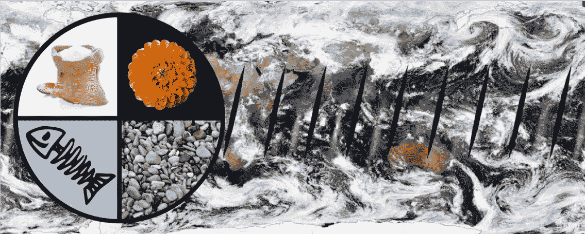
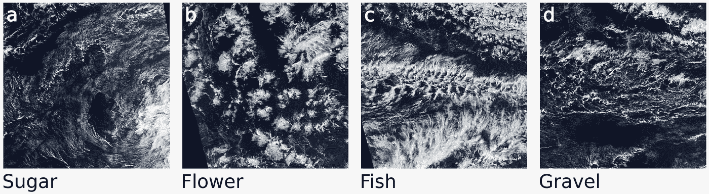
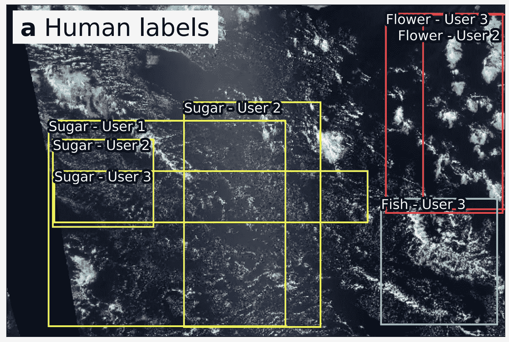

# 糖、花、鱼还是沙砾——现在是一场混战

> 原文：<https://towardsdatascience.com/sugar-flower-fish-or-gravel-now-a-kaggle-competition-8d2b6b3b118?source=collection_archive---------19----------------------->

我非常高兴地宣布我们的 Kaggle 竞赛“[从卫星图像中了解云](https://www.kaggle.com/c/understanding_cloud_organization)”开始了。这场比赛是几十名科学家数百个小时的辛勤劳动的结晶。挑战在于将卫星图像分成四类。通常，当我们想到不同类型的云时，我们会想到积云、层云和卷云。然而，这个挑战中的四个类别被称为糖、花、鱼和砾石。那么，这些到底是什么？

这一切都始于大约两年前的一个研讨会，12 名云专家聚在一起讨论海洋上空的浅云。与大雷暴相比，这些云看起来是良性的，但事实上，它们对地球的气候起着巨大的作用。原因是它们将大量的阳光反射回太空，从而使我们的星球变冷，同时对温室效应的影响很小。这意味着弄清楚这些云将如何随着我们的星球变暖而变化非常重要。然而，目前的气候模型却难以应对。他们甚至不同意这些浅云是多还是少。

部分原因是浅云不仅仅是全球大气环流的结果。相反，他们有自己的生活，并以各种方式安排自己。对于其中的许多模式，其背后的基本机制知之甚少。这让我们回到我们的科学家小组。当他们浏览数百张类似本页所示的卫星图像时，他们注意到一些结构比其他结构出现得更频繁。经过一番讨论，他们商定了四种常见的图案，并分别命名为糖、花、鱼和砾石。

为了找到更多关于这四种模式的信息，我们需要更多的数据。为了获得这些数据，我们在 Zooniverse 上建立了一个[众包项目](https://www.zooniverse.org/projects/raspstephan/sugar-flower-fish-or-gravel)，科学家可以在这个平台上创建自己的标签界面。为了我们的项目，我们去了 [NASA Worldview](https://worldview.earthdata.nasa.gov/) ，下载了来自大西洋和太平洋三个地区的 10，000 幅卫星图像，这些地区的云型经常出现。在 Zooniverse 界面上，用户会看到一幅随机图像，并被要求在云结构周围画出方框。

2018 年 11 月，我们在汉堡的马克斯·普朗克气象学研究所和巴黎的气象动态实验室组织了云标签日。在那里，整个部门，总共大约 70 名科学家，花了一整天的时间标记总共超过 30，000 张图片。这意味着，对于每张图片，我们都有来自三个人的标签。

这个项目有趣的部分原因是标签是主观的。一个人的糖可能是另一个人的沙砾。换句话说，不存在客观真实。我们可以问的第一个问题是，人们在多大程度上同意这些课程。事实证明，人们对大约 40%的标签表示赞同。乍一看，这似乎并不多，但是请记住，这是一个非常主观的任务。从另一个角度来看，有 80%的可能性，至少有三分之一的人同意你的判断。

现在我们有了这个大的手绘数据集，我们可以用它做什么呢？首先，我们可以通过检查它们的出现如何与大规模流动相关联来分析云模式背后的物理机制。但是，尽管累计花费了 250 个小时进行标记，这些数据只覆盖了全球一小部分时间的一小部分。我们希望扩大我们的分析规模，深度学习是实现这一目标的完美工具。

出于这个原因，我们现在向 Kaggle 社区提出挑战，要求建立一个基于人类标签的机器学习模型。有了这样的算法，我们就能够将我们的分析扩展到世界的不同地方。我们真的很期待看到 Kagglers 会选择什么样的预处理和模型构建方法。

除了获得一个好的预测模型，我们还希望提高对气候科学家日常处理的问题类型的认识。最后，我们希望做出更好的预测，但首先需要更好地理解地球系统的物理过程。理解云是如何组织的就是这样一个例子。我们希望现代机器学习技术能够以前所未有的方式加速我们的研究。

最后，我要感谢让这一切成为可能的每一个人:Hauke Schulz，Sandrine Bony，Bjorn Stevens，当然还有所有的云贴标机！

*要获得描述众包活动的论文预印本和更多关于科学背景的信息，请点击* [*此处*](https://arxiv.org/abs/1906.01906) *。*

*众包平台仍在运行。所以如果你想自己尝试给一些云贴标签，点击* [*这里*](https://www.zooniverse.org/projects/raspstephan/sugar-flower-fish-or-gravel) *。*

*最后，* [*这个*](https://www.kaggle.com/c/understanding_cloud_organization) *就是 Kaggle 比赛了。*