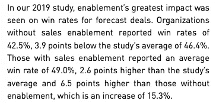
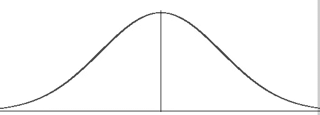
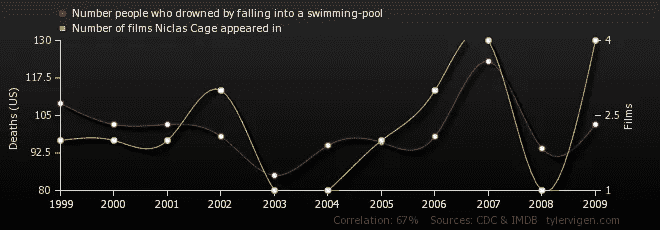

# 糖滑翔机，自闭症，枪支暴力和牙膏

> 原文：<https://towardsdatascience.com/sugar-gliders-autism-gun-violence-and-toothpaste-why-every-writer-needs-a-basic-understanding-a43b8514bf0a?source=collection_archive---------26----------------------->

## 为什么每个作家都需要对统计学有一个基本的了解

统计数据讲故事。人们喜欢故事。

这就是为什么作家喜欢在他们的作品中加入统计数据——统计数据可以用一种可量化的、可捕捉的、有感染力的方式捕捉有趣的事实。就像我告诉你的，在 2014 年的一项研究中，11%的人认为网络语言 HTML 是一种性病。

添加到你工作中的天赋和可信度的因素可能是好的也可能是坏的。这完全取决于你的统计数据有多准确。

如果您不正确地使用统计数据，或者如果统计数据一开始就是错误的，您可能会误导读者。当涉及到引用统计数据时，我也有过自己的混乱——对此我已经得到了纠正。我希望保持这种状态。

但对于作家来说，驾驭统计语言并非易事。我在大学里上过统计学课，真是太幸运了:)。这里有一些在引用统计数据时需要注意的事情，这样你就不会把键盘放在嘴里。

# 1.知道你的百分比

我已经纠正了百分比变化和百分点变化之间令人困惑的区别。你可能犯了同样的错误。让我们考虑一个假设的研究来梳理我们的错误。

假设科学家们正试图确定在项链袋中携带一架糖滑翔机是否有益于心理健康。我们想象中的科学家发现，82%的玩了一天糖滑翔机的人认为自己是快乐的，相比之下，50%的人没有在脖子上挂着可爱的哺乳动物闲逛。(让我们假设研究人员完成了所有关于统计意义的花哨计算，一切都一清二楚)。

在这种情况下，说有人拥有一架糖滑翔机会快乐 32%准确吗？

不。这些百分比是概率的指示。本质上，科学家们说，基于这个实验，携带糖滑翔机的人有更高的概率认为自己快乐(82%的概率对 50%)。

所以因为我们在谈论概率，我们可以说如果一个人随身携带一架糖滑翔机，他快乐的可能性会增加 32%？

也没有。

“什么？!"让我解释一下。

百分比增长和百分比*点的增长是有区别的。*百分点的增加更直观，在这种情况下，我们看到了 32 个百分点的增加。

另一方面，百分比增长指的是从原始状态的度量(在本例中是一个比例，50%)到一个新值(82%)的变化。假设我们说快乐的原始可能性是 50%(对于那些没有糖滑翔机的悲伤的人来说)，32 个百分点*点*的增加实际上是 64%的增加，因为 32%是 50%的 64%。

很多官样文章，我知道。有一种更好的方式来思考这个问题——不是从比例的变化来看(例如，50%的人说他们很快乐)，而是从数量变量的变化来看(例如，每个人在 1-10 的范围内给自己的快乐评分)。

如果在携带糖滑翔机时，平均幸福指数(从 1 到 10)从 6 到 9，3 的变化将增加 3 个评价点，代表幸福指数增加 50%(变化/原始测量值 3/6 = 0.5 或 50%)。

在这种情况下，*可以准确地说，平均而言，带着糖滑翔机的人要快乐 50%,因为测量结果量化了快乐。在这种情况下，50%的增长更直观。*

这是我最近在[的一份销售支持报告](https://www.csoinsights.com/5th-annual-sales-enablement-study/)中遇到的一个极好的例子:

# 2.不要引用引用者

统计数据很有趣，所以我们喜欢在写作中加入它们。所以我们跳到谷歌上，搜索“ *x* 统计”，试图找到关于 *x* 话题的有趣信息。这是一个完全合法的做法，但有一些事情你需要注意。

我称之为:引用引语。

其他像你一样的作家在他们的作品中引用统计数据。当你在谷歌上搜索的时候，你可能会找到他们的一些作品，并在这里或那里微妙地加入一些统计数据。虽然作者的统计数据可能是准确的，但你应该避免直接引用它们。这里有几个原因。

## 1.电话效应

统计数据在上下文中是强大的，但是当你把它们从上下文中移走时，它们就会失去一些意义。想想我们在小学玩的电话游戏:当一个基本短语被传来传去时，它会被无意地(或者有时是*有意地*)改变，最终产生一个有趣的新短语。

有了统计数据，这种变化就没那么有趣了。

就像电话游戏一样，你离原始来源越远，就越有可能得到原始统计数据的错误版本。

## 2.统计数据可能已经过时了

很少看到日期贴在统计数据旁边。因此，如果你引用报价者，你就冒着处于报价者引用报价者的菊花链末端的风险。因此，您可能会引用已经过时并且已经被揭穿的统计数据。2018 年发表的文章不代表其统计数据来自同一年。

这里有一个[例子](https://www.forbes.com/sites/forbestechcouncil/2018/04/26/why-ctos-and-cios-should-care-more-about-the-cost-of-downtime/#1dfc7599131c)《福布斯》2018 年的一篇文章引用了他们说是 2017 年的一项统计数据，但他们链接的文章是 2015 年的。

如果一定要引用报价者，尽量离数据源只有一步之遥。这可能是你的最佳选择，因为实际的研究可能只是原始数据，然后其他人会获取数据并使用它。因为你是作家，不是统计学家，这可能是你最好的事实来源。

## 3.正偏压

疫苗会导致自闭症吗？有人说是，有人说不是，科学家怎么说？没有。

但是，尽管自 2010 年[撤回](https://www.bmj.com/content/342/bmj.c5347.full.print)[伪造的 1998 年研究](http://v/)表明 MMR 疫苗和自闭症之间的联系已经过去了几年，但并不是每个父母都相信。

为什么？因为正偏。

[积极偏见](https://www.alleydog.com/glossary/definition.php?term=Positive+Bias)指的是“对发表有积极(重大)结果的研究的偏好，而不是平淡或消极的结果。”出版商和读者希望分享看似多事之秋的事情。由于这种偏好，积极的偏见可以创造一个分享循环，在这个循环中，重要的信息——尽管可能不是真的——可以迅速获得大量的宣传。

所以作家需要小心。特别是在为有议程的客户写作时，很容易只找到与我们的信息相匹配的统计数据(这正是前任——强调“前任”——研究员安德鲁·韦克菲尔德在他的自闭症研究中所做的)。

这是一个危险的游戏。每个人都有权利提出论点，但是一个有道德的作者会考虑各种各样的研究，或者至少在做出一个有潜在严重后果的大胆断言之前限定他们的陈述。

# 4.统计数据可能会误导人

拷问数据，它会告诉你任何你想要的东西。作者需要警惕潜在的数据滥用，统计数据可能是真实的，但结果可能完全是误导。这里有一些例子。

## 抽样误差

统计学的美妙之处在于，你不需要从一个群体中的每个个体那里获得信息，就能知道一个群体的特征。相反，您可以提取一个样本，并基于该样本对总体进行推断。

这里的技巧是，为了具有代表性，样本应该相对较大并且是随机选择的。下面是一些你应该注意的错误的采样方法。

## 错误的采样方式

**方便取样。**使用公司的电子邮件列表进行调查是一个便利示例。这并不意味着你不能使用电子邮件列表来了解消费者的偏好。但是如果你打算公布这些信息，你需要明确研究的范围。

例如，如果你的公司调查中有 51%的受访者说他们更喜欢巧克力冰淇淋，你不能说所有人中有 51%喜欢巧克力。只有你的观众。

**配额抽样。**像便利抽样一样，配额抽样发生在研究者不随机选择受试者的时候。相反，研究人员选择第一个进门的，并(错误地)假设这将产生一个有代表性的样本。

**志愿者取样。当人们自愿参加一项研究时，你需要对结果保持警惕。自愿提供信息的人可能与不提供信息的人有很大不同，所以你的样本可能不具有代表性。**

如果你曾经遇到过任何关于抽样的问题，请忽略这些信息。

# 平均值与中间值

均值和中位数是小学的话题。然而，这些简单的概念是误导读者的最佳方式，并且经常被故意用来误导读者。

简单回顾一下，均值和中位数表示数据集的中心。A **平均值**是平均值:将一组中每个个体的某个特定特性的所有值相加，然后除以个体数量。**中值**是中间值:根据一个定量变量将每个人排序，然后找到正好在中间的人。

数据的分布方式将决定是平均值还是中间值更适合测量中心。

## 分布:正态、右偏、左偏

一个**正态分布**是你的标准钟形曲线，其中大多数数据点聚集在平均值周围，然后它们随着远离平均值而减弱。

Courtesy of [Data Science Central](https://www.statisticshowto.datasciencecentral.com/probability-and-statistics/skewed-distribution/)

当数据呈正态分布时，平均值或中值将是中心的良好度量(因为它们应该大致相同)。但是当数据*不是*正态分布时(意味着它是右偏或左偏的)，你就需要小心了。

Courtesy of [Data Science Central](https://www.statisticshowto.datasciencecentral.com/probability-and-statistics/skewed-distribution/)

**右偏数据集**是指其大部分数据聚集在*左侧*的数据集，其中一些数据偏右，使平均值向更高的值倾斜。

右偏数据的一个好例子是美国的收入。大多数人挣不到 10 万美元，但有些人挣得更多，少数人挣得更多。由于存在异常值，使用平均值无法精确测量中心值，因此中值更可取。在收入报告中，[美国人口普查局](https://www.census.gov/newsroom/press-releases/2017/income-povery.html)甚至没有提供平均值，只有中位数(2016 年为 59039 美元)。在这种情况下，平均收入会产生误导。

一个**左偏数据集**是一个其大部分数据聚集在*右侧*的数据集，其中一些数据远离左侧，使平均值向较低值倾斜。

左偏数据的一个例子是退休年龄。随着年龄的增长，人们越来越倾向于退休，但也有少数幸运者早早地发了财，早早地退休到他们在加勒比海的私人岛屿上。在美国，[平均退休年龄和中位退休年龄](https://dqydj.com/average-retirement-age-in-the-united-states/)之间的差别并不大:平均退休年龄是 59.88 岁，中位退休年龄是 62 岁。很接近，但仍然是不同的故事。

(注意:以上是引用者的一级引用示例，其中我依赖其他人查看[原始数据](https://www.federalreserve.gov/consumerscommunities/files/SHED_2017codebook.pdf)并进行他们自己的评估；)).

# 5.研究与实验

你可能听说过“相关性并不意味着因果关系”的说法(也许是在政治舞台上)这到底是什么意思？

当研究人员得出结论，两个定量变量往往一起波动，这种关系被认为是一种相关性。例如，冰淇淋销售往往与温度成正相关——温度越高，冰淇淋销售越多。

这个简单的例子可能意味着更高的温度*会导致*更高的冰淇淋销量(事实很可能如此)。但是一个统计学家不能仅凭数据研究就这么说。仅仅因为两个变量相关，并不意味着一个导致另一个。

例如，掉进游泳池淹死的人数与尼古拉斯·凯奇每年出演的电影数量相关:

Courtesy of [Spurious Correlations](https://tylervigen.com/view_correlation?id=359)

你认为你能证明是一个导致了另一个吗？大概不会。

但是还有不太明显的例子。[一篇文章(错误地)引用了一项研究](http://neatoday.org/2012/01/04/international-study-links-higher-teacher-pay-and-teacher-quality/)，该研究发现教师工资和学生表现之间存在关联，认为提高工资会导致教师表现的提高。

虽然这可能是真的，但也可能不是——因为相关性并不意味着因果关系。有没有可能存在一些未知的变量——也许收入更高的教师生活在更先进的国家，因此更有可能教出更好的学生？一些值得思考的事情。(更不用说这篇文章是引用引用者的教科书式的例子了。随便说说。)

# 6.错误的调查结构

糟糕的调查结构也会产生误导性的统计数据。一个众所周知的罪魁祸首是高露洁。

一则[高露洁广告](https://www.telegraph.co.uk/news/uknews/1539715/Colgate-gets-the-brush-off-for-misleading-ads.html)称 80%的牙医推荐高露洁。这是一个相当可观的数字——所以只有 20%的牙医推荐高露洁以外的牙膏？

没有。调查的方式是，牙医被允许选择他们推荐的*多种*牙膏。因此，推荐高露洁的牙医也可以推荐佳洁士、Aquafresh、Pepsodent、Aim 和其他产品。

80%的牙医可能会推荐任何对你有益的产品，所以这不是一个很有帮助的数字。完全准确，只是没什么帮助。如果可能的话，对调查是如何进行的保持警惕。

# 7.误导性措辞

一项统计数据的措辞方式可能会使其误导，但不会是虚假的。

一个例子是联邦调查局的尼克·施罗尔在[引用的话，他说 2016 年联邦调查局制服犯罪报告显示，“被刺死的人数是被任何类型的步枪杀死的人数的四倍多。”我不确定这里的数字(因为我引用了引用者的话)，但不管怎样，措辞值得一看。](https://www.politifact.com/missouri/statements/2017/nov/18/nick-schroer/out-context-comments-inflate-stabbing-statistics/)

第一印象？除非你意识到“任何种类的步枪”和“枪支”之间的微妙区别，否则你可能会将这些说法解读为人们死于枪支暴力的可能性低于死于刺伤的可能性。推而广之，你可能会得出这样的结论:我们应该把精力重新放在遏制持刀暴力上，而不是枪支暴力上，如果你只看数字，这不是一个合理的决定。

# 把你的数据弄清楚

这可能比你作为一个作家所希望看到的更多的统计信息。但是我希望这个信息能被理解:数据是强大的，不管是好的还是不好的。

好好使用它们，不仅仅是因为你想让你的内容看起来更好或者表达一个观点。

用错了，可能会适得其反。

如果你看过任何糟糕的统计数据，请在下面评论。我很想看看他们！