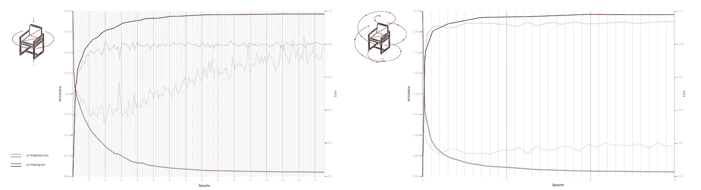

# 暗示性计算机辅助设计

> 原文：<https://towardsdatascience.com/suggestive-computer-aided-design-a9c7698c1cc9?source=collection_archive---------16----------------------->

## 通过机器学习辅助设计

[*斯塔尼斯拉斯 Chaillou*](https://www.linkedin.com/in/stanislas-chaillou-b1931090/)T4*T8 |哈佛设计研究院| 2018 年春季*

**协同* [*托马斯·特雷诺*](https://www.linkedin.com/in/thomastrinelle/)*

**

*T **基于机器的推荐已经在无数行业得到了应用，从网络上的暗示性搜索到图片股票图像推荐。**作为推荐引擎的核心，它可以在海量数据库中查询相关信息*文本、图像等*，并在用户与给定界面交互时呈现给用户。随着当今大型 3D 数据仓库的聚合，架构&设计可以从类似实践中受益。*

*实际上，我们专业的设计过程大多是通过 3D 软件*rhino 3D、Maya、3DSmax、AutoCAD* 等进行的。**建筑师无论是通过 [CAD](https://en.wikipedia.org/wiki/Computer-aided_design) 软件*计算机辅助设计*还是如今的 [BIM](https://en.wikipedia.org/wiki/Building_information_modeling) 引擎*建筑信息建模*不断地将自己的意图转化为三维空间中的线和面**。建议相关的 3D 对象，取自外部数据源，可能是一种方式，以加强他们的设计过程。*

*这就是本文的目的:**研究并提出一种辅助设计师的方法，通过*暗示造型*。**随着建筑师在 3D 空间中作画，一系列基于机器学习的分类器将能够搜索相关建议并提出替代、相似或互补的设计选项。*

*为此，我们从 3D 形状识别与分类领域的先例中汲取灵感，建立了一套能够在设计者绘图时向他们推荐模型的方法和工具集。实际上，我们的目标有两个: **(1)利用预先建模的建议加快 3D 建模过程**，而**则通过替代或互补的设计选项激励设计师**。*

## *卷积神经网络*

**

*Figure 1: **Convolutional Neural Network Architecture |** Source: [3b1b](https://www.youtube.com/channel/UCYO_jab_esuFRV4b17AJtAw)*

*能够查询与用户绘制的设计特征相匹配的 3D 对象依赖于特征比较。远离标准的几何描述性度量，卷积神经网络(CNN)提供了一种简化且更全面的比较形状的选项。*

*CNN 不是匹配简单的指标——也称为*特征提取*——而是将图像作为输入，将像素表示传递给一连串的“*神经元*”(*图 1* )。CNN 模型调整每个神经元的权重，同时在其最后一层输出预测。通过训练和验证的连续阶段，我们能够估计模型的准确性，并进一步调整权重以最大化准确性。一旦充分训练，CNN 模型将预测给定对象图像表示的“*类*”或类别。*

*这种类型的网络是机器学习的标准实践，本身并不代表突破或复杂的架构。然而，**它仅基于空间特征建立一定数量的直觉的能力比我们的应用更相关**:公开可用的 3D 对象的格式异构性使得特征提取和元数据比较成为一个具有挑战性的过程。能够使用图像简单地从它们的拓扑特征来考虑对象，为我们提供了一个用于 3D 形状比较和检索的健壮的统一框架。*

# *一.先例*

***我们的工作建立在 3 个主要研究项目之上，这些项目最近构建了 3D 对象识别和分类领域。**这些论文揭示了[卷积](https://en.wikipedia.org/wiki/Convolution)作为理解&描述 3D 形状的理想工具的相关性。*

***【1】用于 3D 形状识别的多视角卷积神经网络***

*[这第一篇论文](https://www.cv-foundation.org/openaccess/content_iccv_2015/papers/Su_Multi-View_Convolutional_Neural_ICCV_2015_paper.pdf)**【1】**提出了一个标准的 CNN 架构，该架构被训练来识别彼此独立的形状的渲染视图，并表明甚至可以以远高于使用最先进的 3D 形状描述符的准确度从单个视图识别 3D 形状。当提供形状的多个视图时，识别率进一步增加。*

**

*Figure 2: **Multi-view CNN for 3D shape recognition** | Source: [link](https://www.cv-foundation.org/openaccess/content_iccv_2015/papers/Su_Multi-View_Convolutional_Neural_ICCV_2015_paper.pdf)*

*此外，还引入了一种新颖的 CNN 架构，它将来自 3D 形状的多个视图的信息组合到一个紧凑的形状描述符中，提供了更好的识别性能。*

***【2】vox net:用于实时物体识别的 3D 卷积神经网络***

**

*Figure 3: **The VoxNet Architecture** | Source: [link](https://www.ri.cmu.edu/pub_files/2015/9/voxnet_maturana_scherer_iros15.pdf)*

*为了利用因激光雷达和 RGBD 扫描仪的可用性增加而导致的点云数据库数量的增长，[本文](https://www.ri.cmu.edu/pub_files/2015/9/voxnet_maturana_scherer_iros15.pdf)**【2】**提出了一个“VoxNet”。该模型的架构旨在通过将体积占用网格表示与受监督的 3D 卷积神经网络(3D CNN)集成来解决海量点云处理和标记的问题。*

*使用 LiDAR、RGBD 和 CAD 数据在公开可用的基准上评估结果。VoxNet 最终实现了超越现有技术水平的准确性，同时每秒标记数百个实例。*

***【3】设计中的体积表示和机器学习***

*[这最后一篇论文](http://njstudio.co.kr/main/project/2017_thesisVoxelHarvardGSD/public/)**【3】**探讨了体素建模与机器学习的机会。*

**

*Figure 4: **Summary of Work Flow |** Source: [link](http://njstudio.co.kr/main/project/2017_thesisVoxelHarvardGSD/public/)*

*首先介绍了体素建模的概念，并与传统建模技术进行了比较。解释了像像素图和图形表示这样的概念，以最终检查基于从空间和几何光栅化到机器学习的过程的拟议设计系统或工作流的原型实现。*

# *二。模型定义*

*在这个项目中，我们的方法是识别用户正在绘制的对象，并通过简单地使用对象的形状作为代理来提供相似的对象。*

*简而言之，我们在这里设计的模型处理两个主要任务:*

*   ***(1)分类:**识别用户正在绘制的对象的类型，即找到合适的标签(*“椅子”、“长凳”、“床”*等)。)对于任何给定的图像输入，结合预测置信度得分。*
*   ***(2)匹配:**在 3D 对象的数据库中查询与用户的模型化输入的方面最匹配的一些形状，即返回在我们的数据库中找到的对象列表，从最相似到最不相似排序。*

**

*Figure 5: **Typical Pipeline |** Source: Author*

*如图*图 5* 所示，通过嵌套两个不同层次的模型(一个**分类器**和一个**匹配器**),我们也许能够执行这个两步过程。每个模型将在 3D 对象的图像上被训练，然后将在由用户建模的对象的图像上被测试。*

## *A.数据来源和生成*

*第一步是生成一个数据库来训练我们的模型。由于我们的方法是为了共享，我们想在此详述这一关键步骤，并分享我们为实现这一目标而使用和构建的资源。*

*我们首先从现有的公共 3D 对象仓库中提取信息，例如:*

*   ***ShapeNet |** [链接](https://www.shapenet.org/)*
*   ***谷歌 3D 仓库|** [链接](https://3dwarehouse.sketchup.com/?hl=en)*
*   ***ModelNet |** [链接](http://modelnet.cs.princeton.edu/)*

*从 **ShapeNet** 数据库中，我们可以下载多达 2.330 个带标签的 3D 模型，分为 14 个特定类别(*图 6* )。*

**

*Figure 6: **Training Set Classes** | Source: Author*

***使用**[***犀牛***](https://www.rhino3d.com/) **和** [***蚱蜢***](https://www.grasshopper3d.com/) **，我们然后编写一个工具来创建我们的训练集和验证集。**在这个脚本中，围绕每个连续对象旋转的照相机以特定的角度拍摄对象，并将 JPG 图像保存在给定的目录中。*

**图 7 显示了典型的摄像机路径(左图)和拍摄的最终图像(右图)。**

**

*Figure 7: **Image Capture Path, and Resulting Images** | Source: Author*

*对于每个对象，我们拍摄 30 幅图像用于训练，10 幅用于验证，同时保持白色背景/中性背景。*

*[*用于捕捉图像的数据生成器可从以下地址下载。*](http://stanislaschaillou.com/suggestive-cad/download/Data_Generator.zip)*

***我们最终获得一个标记图像库，每类 10 个对象，总共有 14 个不同的类。**图 8 中显示了一个子集。*

**

*Figure 8: **Subset of Training Set** | Source: Author*

## *B.分类*

***一旦我们的数据集准备就绪，我们的目标是在大量的 3D 对象图像上训练我们的第一个模型，即分类器**，同时在属于类似类别的其他对象图像集上验证其性能。*

## *迭代次数*

*几个参数严重影响训练好的分类器的准确性:*

*   ***训练和验证集的大小***
*   ***班级人数***
*   ***每类对象的数量***
*   ***每个对象的图像数量***
*   ***两组中图像的尺寸** s*
*   ***物体周围摄像机的拍摄路径***

*在这一点上，我们在不同的选项之间迭代，目的是增加模型在验证集上的整体准确性。由于资源有限，我们负担不起从头开始培训的费用。**使用一些迁移学习很方便，因为它提供了提高我们模型准确性的可能性，同时绕过了数天的培训**。我们添加了一个 [VGG16 预训练模型](http://www.robots.ox.ac.uk/~vgg/research/very_deep/)作为模型的第一层，这反过来提高了我们 32%的准确度。*

***这个训练过程的一个重要收获是，摄像机路径实际上会显著影响最终的精度。**在我们尝试过的许多版本中，我们在下面的*图 9* 中展示了两种不同摄像机路径的性能对比:**圆形**和**球形**。*

**

*Figure 9: **Training Performance Under Different Image Capture Technics** | Source: Author*

## *结果*

*最终，我们满足于使用 *200*200* px 图像的分类器，具有球形相机路径，每个对象 30 个图像用于训练，10 个用于验证。在 30 个时期之后，**我们最终在验证集上获得了 93%的准确度。**现在似乎很清楚，以下参数对整个模型的性能有很大影响:*

*   ***增加图像尺寸可以提高精确度。**在我们的机器上，速度和精度之间的平衡在 *200x200* px 左右找到了平衡点。*
*   ***摄像机捕捉路径也直接影响精度。**通过使用球形捕获路径，而不是圆形路径(*见图 9* )，我们显著提高了模型性能:在更少的历元之后，精确度更高。使用球形路径似乎是一种更全面的捕捉给定形状的方式。*

**图 10 显示了分类器对四种不同用户输入的典型结果。**

**

*Figure 10: **Results of Classifier Model, User Input (left) to Predicted Class (right) |** Source: Author*

*   *更有趣的是在给定用户的 3D 建模过程中运行的相同模型的性能。当一个对象被建模时，少到几个表面就足以将分类器推向正确的方向。因此，在建模过程的早期，我们能够识别建模对象的类。作为回报，我们可以从我们的数据库向用户建议模型，如果用户在建议中找到匹配，可能会减少 3D 建模时间。*图 11* 显示了在建模过程的五个不同步骤中分类器的结果。*

**

*Figure 11: **Classification During Modeling Process** | Source: Author*

*[***更多关于 GitHub。***](https://github.com/StanislasChaillou/Independent_Study/blob/master/Week%204/Classification_Model_testing.ipynb)*

## *C.相称的*

**

*Figure 12: **Matching: Finding Best Matches Among Database Through a Convolutional Model** | Source: Author*

*第二步，**我们的模型试图在庞大的 3D 模型数据库中寻找理想的匹配**。如果分类模型有助于缩小搜索范围，则匹配模型将给定类别的所有 3D 模型从“最相似”到“最不相似”进行排序。*

*[***更上 GitHub***](https://github.com/StanislasChaillou/Independent_Study/blob/master/Week%204/Matching_Model.ipynb) ***。****

***我们的匹配模型是另一个卷积神经网络，根据给定类别**的对象的图像进行训练，并根据从不同角度拍摄的视图对相同的对象进行验证。对于测试，我们的输入将是一个用户建模的 3D 对象的图像，输出将是我们的数据库中所有对象的列表，按照相似性的顺序排列。*

## *结果*

*当我们为每个单独的类训练匹配模型时，我们现在能够将分类模型和匹配模型嵌套为一个单独的管道。**我们现在可以处理输入图像，首先对其进行分类，最后与数据库中的相似对象进行匹配。**同时，我们的模型输出一些预测置信度，帮助我们衡量原始模型和实际匹配之间的相似程度。*

**已经对不同类别的 7 个对象进行了测试，如图 13 所示。**

*[***更多关于 GitHub。***](https://github.com/StanislasChaillou/Independent_Study/blob/master/Week%204/Testing_Matching_Model.ipynb)*

**

*Figure 13: **Full Pipeline With Functional Classifying & Matching Model** | Source: Author*

# *三。结论*

*首先，我们鼓励在我们的行业内进一步发展和改进上述理念。在这方面已经做了很多工作，并为邻近领域带来了解决方案。让这些技术渗透到我们的学科中，将会真正有益于我们日常的建筑实践。此外，像我们这样嵌套 CNN 模型只是一个更大概念的一个可能版本: **3D 形状识别和建议**。可以部署其他方法和模型，将公开可用数据的广度&丰富性带到架构师&设计者的能力范围内。*

***事实上，除了本文开发的简单管道，还有一个更基本的想法** : **架构形式的资格**。正如在[之前的一篇文章](/ai-architecture-f9d78c6958e0)中所描述的，能够构建框架，包括现有形状的异质性和复杂性，将很快对我们的学科至关重要。随着数字数据量的增加，并汇集在大型公共存储库中，我们对这些共享知识的访问将与我们的查询智能一样好。正如我们在这里展示的，我们可以依靠*在某种程度上*依靠机器学习来找到一种共同语言，从而能够比较不同的&复杂形状。*

## *在一个更基本的层面上，这项工作只是显示了暗示性设计的潜力。通过在创意过程中为设计师带来相关的选择，我们有机会拓宽他们的工作范围。随着这种方法扩展到比简单的离散对象更大的分类法，它最终会将被动的集体知识转化为主动的灵感来源。*

*[***更多文章，点击这里。***](https://towardsdatascience.com/@sfjchaillou)*

# *文献学*

***【1】****用于 3D 形状识别的多视角卷积神经网络**，苏航、苏卜兰苏·马吉、伊万杰洛斯·卡罗格拉基斯、埃里克·博学-米勒、马萨诸塞大学阿姆赫斯特分校| [链接](https://www.cv-foundation.org/openaccess/content_iccv_2015/papers/Su_Multi-View_Convolutional_Neural_ICCV_2015_paper.pdf)*

***【2】****vox net:用于实时物体识别的 3D 卷积神经网络**，丹尼尔·马图拉纳和塞巴斯蒂安·舍雷尔| [链接](https://www.ri.cmu.edu/pub_files/2015/9/voxnet_maturana_scherer_iros15.pdf)*

***【3】****三维对象的再混合和重采样在设计中使用体积表示和机器学习**，NJ Namju Lee，哈佛 GSD，2017 | [链接](http://njstudio.co.kr/main/project/2017_thesisVoxelHarvardGSD/public/)*