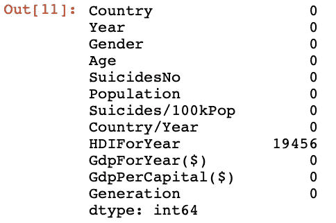
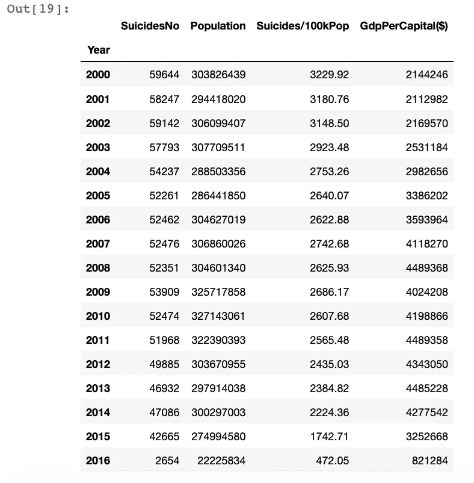
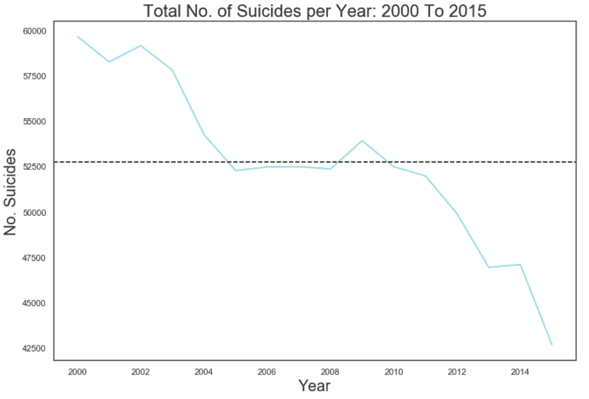
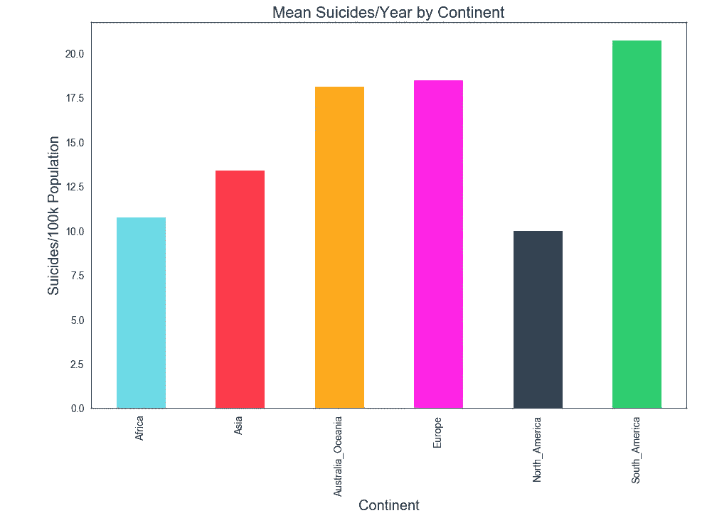
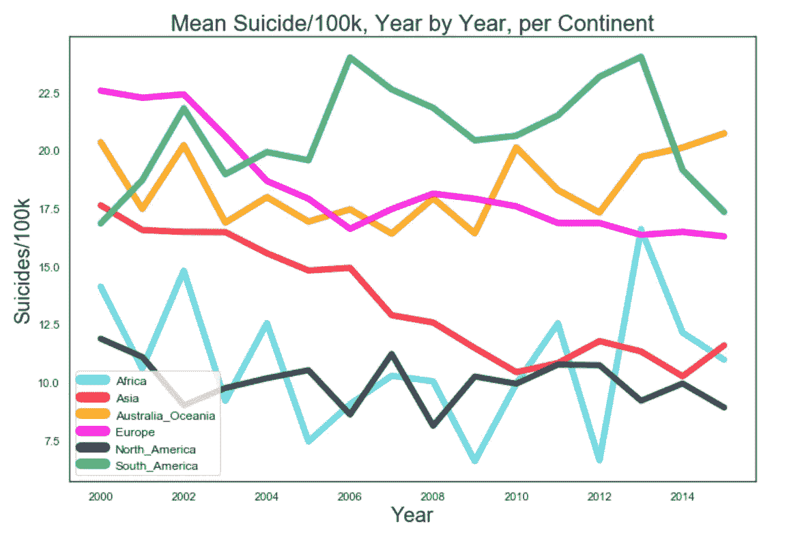
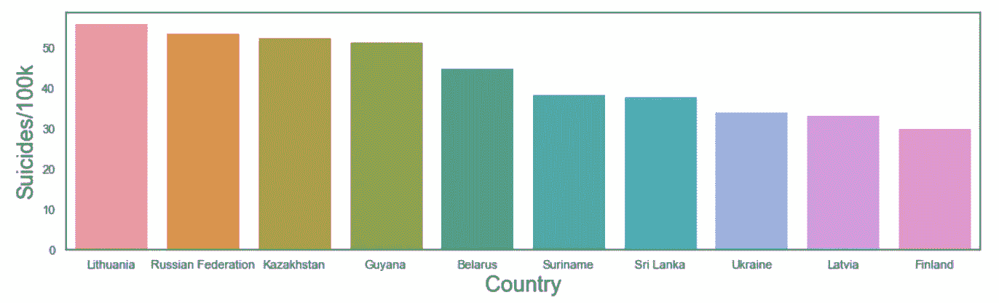
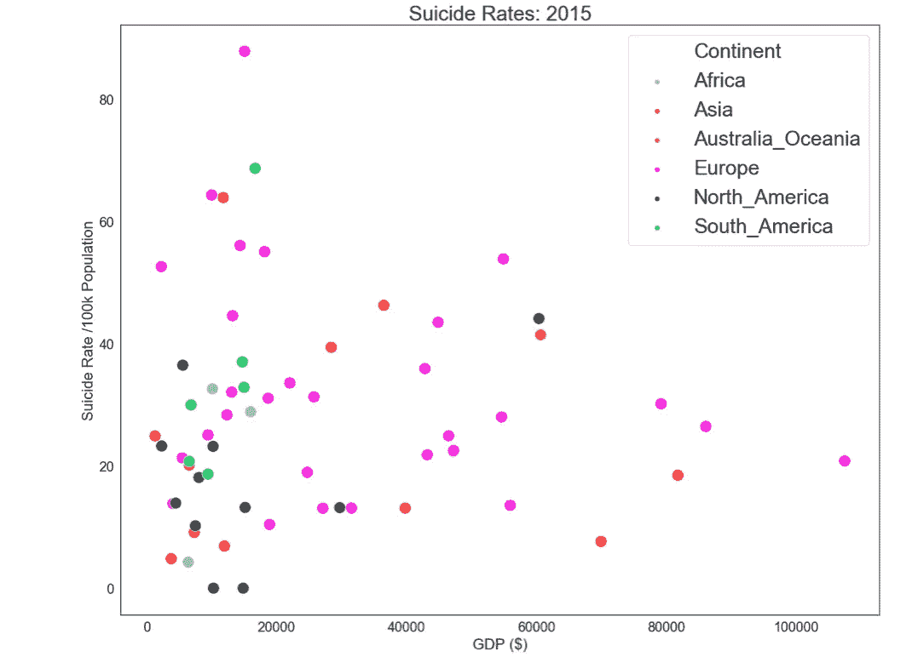
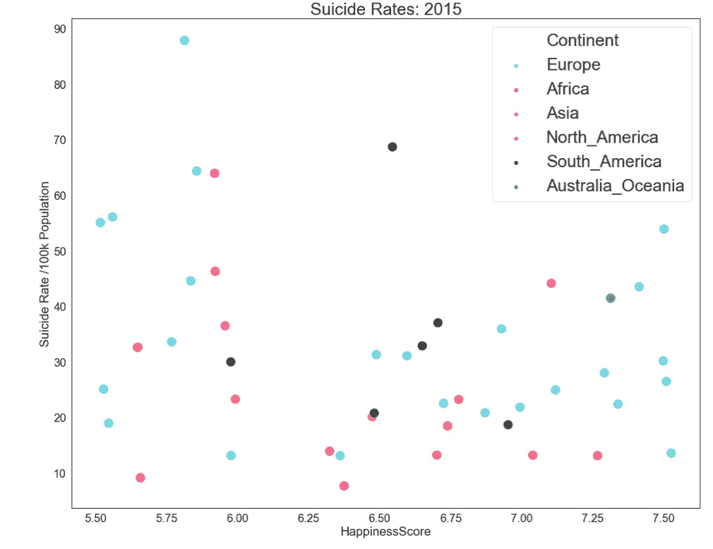
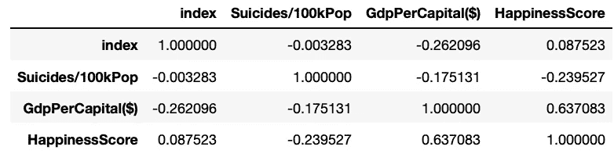
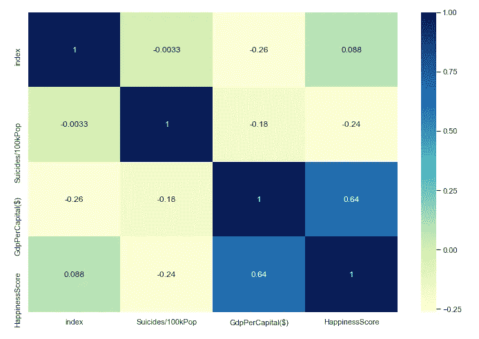

# 21 世纪的自杀(上)

> 原文：<https://towardsdatascience.com/suicide-in-the-21st-century-part-1-904abe8e1f5c?source=collection_archive---------12----------------------->


Photo by [Gabriel](https://unsplash.com/@natural?utm_source=medium&utm_medium=referral) on [Unsplash](https://unsplash.com?utm_source=medium&utm_medium=referral)

自杀是英国 20-34 岁年轻人的主要死因，自杀的男性是女性的三倍。令人担忧的是，在这成千上万的男性和女性中，最近的统计数据显示，在 2005 年至 2015 年期间，只有 27%的自杀受害者被归类为患者自杀，即个人在去世前一年曾接触过心理健康服务。

在这篇文章的第一部分，我们将对世界各地的自杀率进行一些基本分析，在第二部分，我们将更深入地研究一些机器学习，特别是 K-means。

我们开始吧！

本项目使用的数据集取自 [***Kaggle***](http://Kaggle.com) ，以大型表格的形式发布为“1985 年至 2016 年自杀率概览”。csv 文件。该数据集包含 27820 行，分为 12 列:“国家”、“年份”、“性别”、“年龄”、“自杀人数”、“人口”、“自杀人数/10 万人口”、“国家-年份”、“人类发展指数代表年份”、“gdp 代表年份($)”、“人均 GDP($)”、“世代”。

## 数据预处理

数据预处理是数据挖掘过程中最关键的步骤之一，处理初始数据集的准备和转换。尽管数据集本身相对干净，但仍有必要删除此分析不需要的任何冗余数据。

在我的项目的 [Github 资源库中可以获得数据预处理的所有步骤，但是，我们将讨论几个最重要的步骤。](https://github.com/HarryBitten/Suicide-Rates-Analysis)

首先，检查是否有丢失的数据是有用的，因为对丢失数据的帧进行分析很可能会导致错误。正如我们在下面看到的，HDIForYear 列有许多空条目。填充缺失数据的方法有很多，但是，大多数方法都假设该列的大多数行都被填充。但是，在这种情况下，总共 27820 行中有 19456 行缺少该属性的数据，因此最好将该列完全删除。

```
df.isnull().sum()
```



Missing values in HDIForYear

```
df.drop('HDIForYear', axis=1, inplace = True)
```

开始分析之前，务必确保数据框仅包含与其相关的数据。由于该分析将关注 21 世纪年轻男性自杀，我们希望删除性别= '女性'的任何行、年份不> = 2000 的任何行以及不在我们希望分析的年龄范围内的任何行。这些过滤器可以很简单地在熊猫身上实现，概述如下。

```
df = df[df.Year >= 2000]
df = df[df.Gender =='male']criteria_1 = df['Age'] == '15-24 years'
criteria_2 = df['Age'] == '25-34 years'
criteria_all = criteria_1 | criteria_2
df= df[criteria_all]
```

既然数据集更像我们分析所需要的，数据框可以按年份和总和分组，以显示每年的自杀人数。运行该图可以看出，2016 年的数据非常少，因为数据比往年低 10 倍以上，这是不正确的。所以，为了准确起见，有必要去掉 2016 年的数据。

```
#create new data frame grouped by year to check
yearlyStats = df.groupby('Year').sum()
yearlyStats
```



Suicide statistics by year

```
df = df[df.Year != 2016]
```

删除这个数据只删除了 32 行，可见 2016 年的数据是多么的不完整。使用相同的 groupby 方法，很容易按年份显示数据，因此我们可以了解哪些国家报告的数据很少。以下国家被删除，因为对它们的任何分析都是不准确的:安提瓜、巴巴多斯、格林纳达、马尔代夫、黑山和圣文森特。

## 数据聚合

我们知道数据集有一个 Country 列，但是如果我们希望对更大的组(如大洲)进行分析，该怎么办呢？在 Python/Pandas 中，这同样可以通过三个相当简单的步骤来完成。

1.  根据联合国统计司的数据，创建大陆阵列并给它们分配国家
2.  把这些移到字典里
3.  使用 Pandas 中的 Map 函数将各大洲映射到各个国家。请注意，可以跳过步骤 1，直接将国家放入字典中，但是首先将它们移动到一个数组中，这样在将来会更容易，例如，如果要将一个国家添加到数据集中。

```
#create lists of countries per continenteurope = ['Albania', 'Austria', 'Azerbaijan', 'Belarus', 'Belgium', 'Bosnia and Herzegovina', 'Bulgaria', 'Croatia', 'Cyprus', 'Czech Republic', 'Denmark', 'Estonia', 'Finland', 'France', 'Georgia', 'Germany', 'Greece', 'Hungary', 'Iceland', 'Ireland', 'Italy', 'Latvia', 'Lithuania', 'Luxembourg', 'Malta', 'Montenegro', 'Netherlands', 'Norway', 'Poland', 'Portugal', 'Romania', 'Russian Federation', 'San Marino', 'Serbia', 'Slovakia', 'Slovenia', 'Spain', 'Sweden', 'Switzerland', 'Ukraine', 'United Kingdom']asia = ['Armenia', 'Bahrain', 'Israel', 'Japan', 'Kazakhstan', 'Kuwait', 'Kyrgyzstan', 'Macau', 'Maldives', 'Mongolia', 'Oman', 'Philippines', 'Qatar', 'Republic of Korea', 'Singapore', 'Sri Lanka', 'Thailand', 'Turkey', 'Turkmenistan', 'United Arab Emirates', 'Uzbekistan']northamerica = ['Antigua and Barbuda', 'Bahamas', 'Barbados', 'Belize', 'Canada', 'Costa Rica', 'Cuba', 'Dominica', 'El Salvador', 'Grenada', 'Guatemala', 'Jamaica', 'Mexico', 'Nicaragua', 'Panama', 'Puerto Rico', 'Saint Kitts and Nevis', 'Saint Lucia', 'Saint Vincent and Grenadines', 'United States']southamerica =  ['Argentina', 'Aruba', 'Brazil', 'Chile', 'Colombia', 'Ecuador', 'Guyana', 'Paraguay', 'Suriname', 'Trinidad and Tobago', 'Uruguay']africa = ['Cabo Verde', 'Mauritius', 'Seychelles', 'South Africa'] australiaoceania = ['Australia', 'Fiji', 'Kiribati', 'New Zealand']#move these to a dictionary of continentscontinents = {country: 'Asia' for country in asia}
continents.update({country: 'Europe' for country in europe})
continents.update({country: 'Africa' for country in africa})
continents.update({country: 'North_America' for country in northamerica})
continents.update({country: 'South_America' for country in southamerica})
continents.update({country: 'Australia_Oceania' for country in australiaoceania})
```

然后，我们可以简单地将各大洲映射到我们的国家

```
df['Continent'] = df['Country'].map(continents)
```

既然数据已经过预处理，数据框已经从 27820 行 12 列变成了 2668 行 10 列，现在可以进行分析了。

## 探索性数据分析

首先，让我们为我们的绘图定义一个好的调色板。

```
flatui = ["#6cdae7", "#fd3a4a", "#ffaa1d", "#ff23e5", "#34495e", "#2ecc71"]
sns.set_palette(flatui)
sns.palplot(sns.color_palette())
```


Seaborn Colour Palette

首先，我们将展示一些以图形形式显示有趣数据的基本图表。通过按年份对数据进行分组并执行. sum()，我们能够创建一个包含全球每年自杀总人数的临时数据框架。采用这个框架，应用 Matplotlib 代码和 Seaborn 美学，我们可以显示全球自杀率，同时还可以绘制一条平均线。

```
data_per_year['SuicidesNo'].plot()
plt.title('Total No. of Suicides per Year: 2000 To 2015', fontsize = 22)
plt.axhline(y=52720, color='black', linestyle='--')
plt.ylabel('No. Suicides', fontsize = 20)
plt.xlabel('Year', fontsize = 20)
```



Global suicides (2000–2015)

这里我们可以看到有下降的趋势，全球自杀率在逐年下降。可以推测，这是因为意识的提高或资金等原因。，但这是以后可以深入探讨的事情。

接下来，我们可以使用 Matplotlib 中的条形图来显示各大洲每年每 10 万人口的平均自杀人数。使用按洲分组创建新的数据框。意思是()这次。该数据框表示如下:

```
data_per_continent = df.groupby('Continent').mean()
data_per_continentax = data_per_continent['Suicides/100kPop'].plot(kind='bar', figsize=(15, 10), fontsize=14)
plt.title('Mean Suicides/Year by Continent', fontsize = 22)
ax.set_xlabel("Continent", fontsize=20)
ax.set_ylabel("Suicides/100k Population", fontsize=20)
plt.show()
```



Suicides by Continent

有趣的是，我们可以看到南美洲是年轻男性自杀率最高的大陆，其次是欧洲。虽然有用，但它并没有显示这些大陆的自杀率随时间的变化。使用“洲”和“年”对数据进行分组，并执行以下代码后，我们能够绘制出各洲每 10 万人口的自杀率变化率:

```
dfAgg = dftesting.groupby(['Continent','Year'],sort=True,as_index=False)['Suicides/100kPop'].mean()by_cont = dfAgg.groupby('Continent')for name, group in by_cont:
    plt.plot(group['Year'], group['Suicides/100kPop'], label=name, linewidth=6.0)plt.title('Mean Suicide/100k, Year by Year, per Continent', fontsize = 22)
plt.ylabel('Suicides/100k', fontsize = 20)
plt.xlabel('Year', fontsize = 20)
leg = plt.legend(fontsize = 12)
for line in leg.get_lines():
    line.set_linewidth(10)
plt.show
```



Suicide rate by Continent over the years

可以看出，该图显示了总体下降趋势，但也显示了南美和非洲等大陆的恶性飙升(后者可能是由于报告数据的不一致)。接下来，我们希望找出哪些国家的自杀率最高。我们也可以找出最低的。然而，由于报告发生率低的国家等原因，这可能会有所偏差。(主要是非洲国家)。在 Python 中，我们能够通过创建数据框来创建可视化绘图，该数据框根据每个国家的平均自杀人数对数据进行分组，通过降序对值进行排序并绘制。数据帧的 head()作为条形图。

```
data_suicide_mean = df['Suicides/100kPop'].groupby(df.Country).mean().sort_values(ascending=False)
f,ax = plt.subplots(1,1,figsize=(15,4))
ax = sns.barplot(data_suicide_mean.head(10).index,data_suicide_mean.head(10))
plt.ylabel('Suicides/100k', fontsize = 20)
plt.xlabel('Country', fontsize = 20)
```



Countries with the highest suicide rates

多年来，立陶宛的自杀率最高，紧随其后的是俄罗斯和哈萨克斯坦，这三个国家的平均自杀率都超过了每 10 万人中 50 人。有趣的是，立陶宛和哈萨克斯坦都与俄罗斯接壤。

由于 2016 年的数据因不完整而被删除，我们可以运行分析的最近年份是 2015 年。Matplotlib 允许使用散点图，能够绘制自杀率与 GDP 的关系，以国家为单位。同样，准备数据框架很重要，例如排除任何非 2015 年的数据和不相关的列。按洲和国家分组，同时包括自杀率和 GDP.sum()给出了所需数据框架的正确形状。为该数据框绘制自杀率与 GDP 的关系图会将数据分散到各个国家，显示该数据框中每个国家的 GDP 与自杀率的关系。此外，将 hue =“Continent”添加到散点图参数中会显示根据国家所在的洲进行着色的数据。

```
#plot suicide rate vs gdp
plt.figure(figsize=(20,16))
sns.scatterplot(x='GdpPerCapital($)',s=300, y='Suicides/100kPop',data=dfcont, hue='Continent') 
plt.title('Suicide Rates: 2015', fontsize= 30)
plt.ylabel('Suicide Rate /100k Population', fontsize = 22)
plt.xlabel('GDP ($)', fontsize = 22)
plt.xticks(fontsize=20)
plt.yticks(fontsize=20)
plt.legend(loc=1, prop={'size': 30})plt.show()
```



Suicide rates vs GDP, coloured by Continent

有趣的是，似乎有很多国家的 GDP 很低，自杀率也很低，这有点出乎意料。然而，这可能是因为较贫穷国家报告的自杀率较低，而实际上自杀率可能要高得多。尽管如此，GDP 似乎对自杀率有着有趣的影响。

观察一个国家的总体幸福感是否会影响其年轻男性的自杀率也是一件有趣的事情。以 2015 年世界幸福报告 10]为例，可以为数据框中的国家创建一个所有幸福得分的列表；这可以简单地读入一个新列“HappinessScore ”,并将值转换为 Float。在这张图中，幸福指数低于或等于 5.5 的国家被移除了——这是因为许多得分低的国家自杀率低，这可能是由于数据不完整、没有报告自杀或自杀分类不同。然后可以使用 Matplotlib/Seaborn 中的散点图绘制该数据，以给出以下可视化效果，同样使用 hue =“continental”:

```
#plot suicide rates vs happiness score
plt.figure(figsize=(20,16))
sns.scatterplot(x='HappinessScore',s=300, y='Suicides/100kPop',data=dfcont, hue='Continent') 
plt.title('Suicide Rates: 2015', fontsize= 30)
plt.ylabel('Suicide Rate /100k Population', fontsize = 22)
plt.xlabel('HappinessScore', fontsize = 22)
plt.xticks(fontsize=20)
plt.yticks(fontsize=20)
plt.legend(loc=1, prop={'size': 30})plt.show()
```



Suicide rates vs HappinessScore, coloured by Continent

同样，很难判断一个国家的自杀率和它的幸福指数之间是否有真正的关系；因此，将进一步探讨这种关系。我们可以通过应用双变量分析来做到这一点，在 Pandas 中绘制一个相关矩阵，它计算列的成对相关。

```
dfcont.corr(method = 'pearson')
```



Pearson correlation matrix

可以观察到，在该数据帧中，使用皮尔逊方法，GdpPerCapita($)和硅化物/100kPop 之间存在-0.175131 的相关性，这意味着两者之间存在关系，但不是很强的关系，负值表示相关关系成反比，即一个增加，另一个减少。这也可以用 Seaborn 可视化为热图，给出一个更令人愉快的相关矩阵视图。

```
sns.heatmap(dfcont.corr(method = 'pearson'),cmap='YlGnBu',annot=True)
```



Seaborn heatmap matrix

感谢阅读！

请继续关注将于下周发布的第二部分。我们将坚持使用这个数据集，并进入一些机器学习。