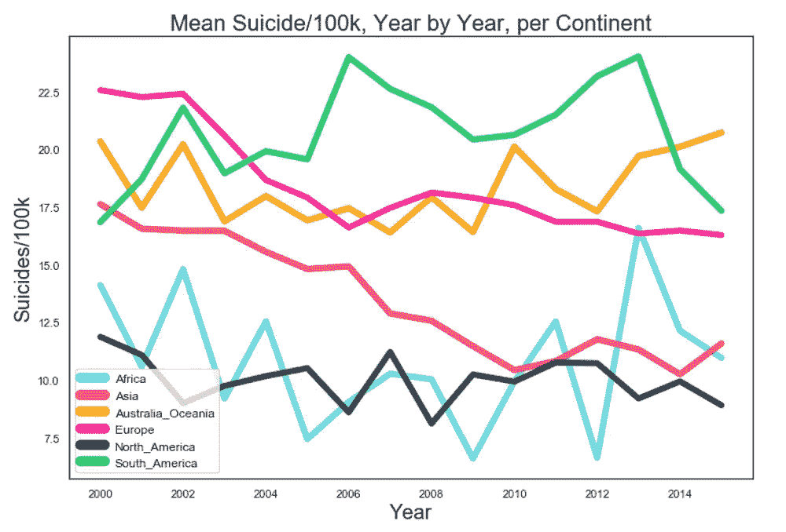
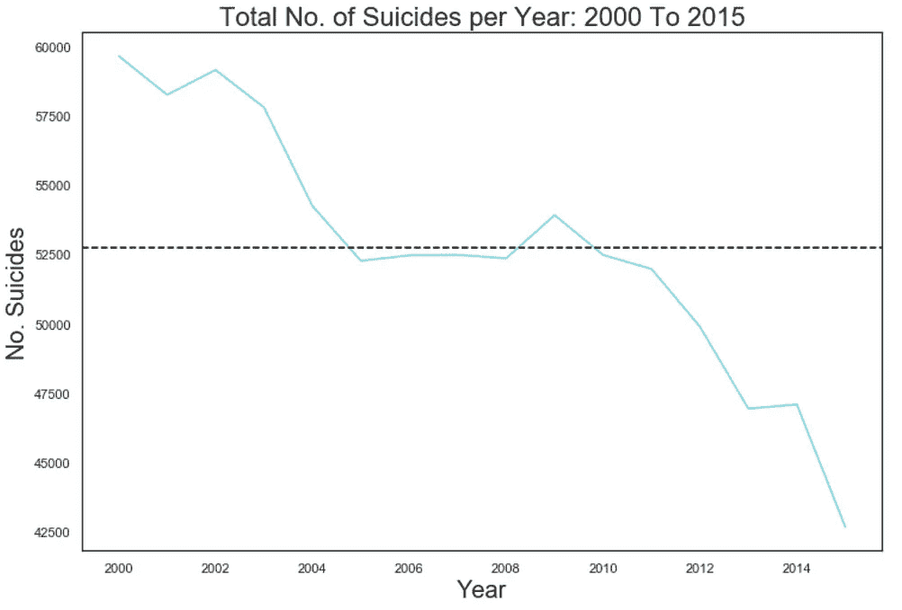
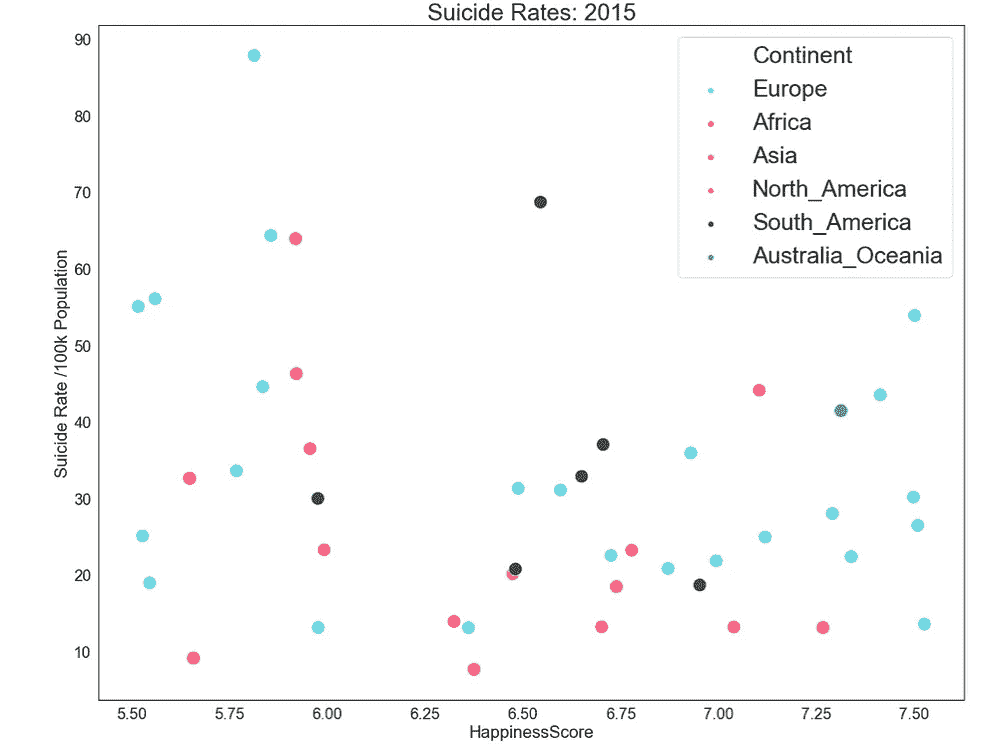
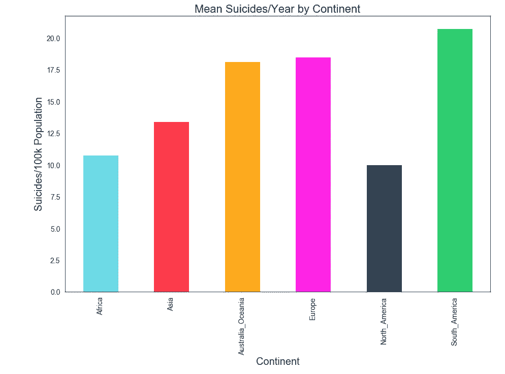
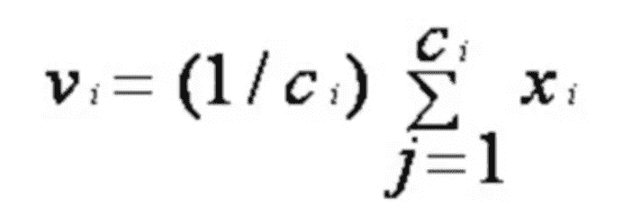
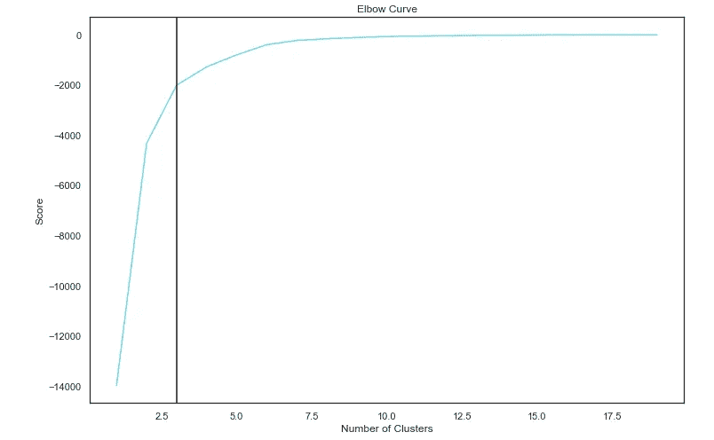
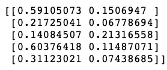
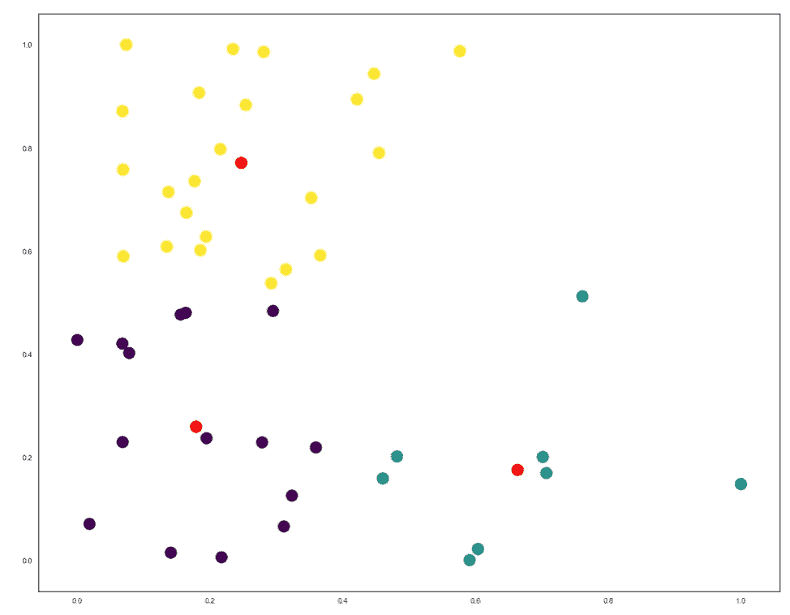
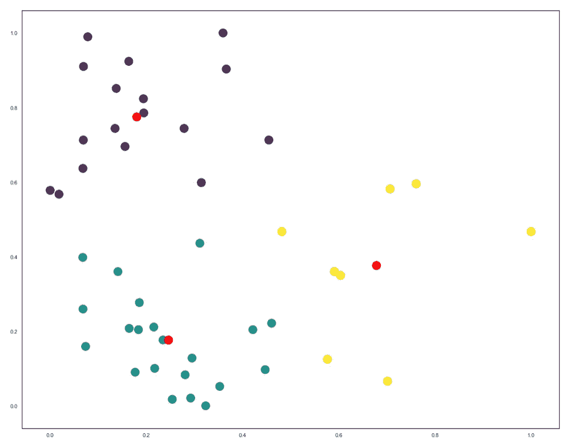
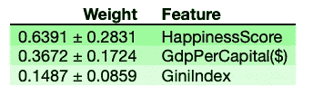

# 21 世纪的自杀(下)

> 原文：<https://towardsdatascience.com/suicide-in-the-21st-century-part-2-d8f9c4b9e588?source=collection_archive---------17----------------------->


Photo by [Paola Chaaya](https://unsplash.com/@paolitta?utm_source=medium&utm_medium=referral) on [Unsplash](https://unsplash.com?utm_source=medium&utm_medium=referral)

欢迎回来！如果您没有了解第 1 部分，可以在下面找到:

[](/suicide-in-the-21st-century-part-1-904abe8e1f5c) [## 21 世纪的自杀(上)

### 自杀不会传染，我们需要谈论它。

towardsdatascience.com](/suicide-in-the-21st-century-part-1-904abe8e1f5c) 

如前所述，第 2 部分将包含机器学习，或者更具体地说，使用 python 中的 K-Means 进行机器学习。

在我们开始之前，如果您错过了第 1 部分，这里有一个快速回顾。

# 概述

在第一部分中，我们主要做了数据预处理和一些 EDA(探索性数据分析)。使用的数据是来自 [Kaggle](https://www.kaggle.com/russellyates88/suicide-rates-overview-1985-to-2016) 的全球自杀率数据集。我们清理了数据，然后增加了一个额外的栏目，快乐得分，摘自联合国每年发布的《世界快乐报告》。然后，我们以图表的形式进行了一些基本的视觉数据分析，其中一些可以在下面看到:



Plots taken from Part 1

现在我们已经概括了，我们可以继续进行一些机器学习！

## k 均值

K-Means 是一种广泛使用且相对简单的无监督聚类机器学习技术。该算法迭代地工作，并试图将数据集划分为 *K* 个预定义的子组(或聚类),由此每个数据点属于一个组。它旨在使聚类间的数据点尽可能相似，同时也试图使聚类尽可能远离。该算法的工作原理如下:

1.  初始化——首先，K-Means 从数据集中随机选择 *K* 个数据点作为初始质心(质心是一个聚类的中心)。注意，该算法还不知道聚类的正确位置。
2.  聚类分配-计算每个数据点和聚类中心之间的欧几里德距离，然后将数据点分配给与聚类中心的距离最小的聚类。
3.  移动质心——使用以下公式重新计算新的聚类中心，其中 Ci 代表第*和第*个聚类中的数据点数量。



Recalculating Cluster Centres

## 准备

在实现任何类型的机器学习之前，确保数据准备正确是至关重要的。否则，算法极有可能会出错。

作为准备工作的第一步，在先前使用的数据框架中增加了一个额外的列:基尼系数。基尼指数是由科拉多·基尼在 1912 年发展起来的一种衡量收入分配的方法；该指数(或系数)被用作衡量经济不平等的标准。系数用 0 到 1 之间的值来度量，其中 0 表示完全相等，1 表示完全不相等。基尼指数的数据是从中央情报局公共图书馆中提取的，并以与之前用于幸福指数相同的方式添加；创建一个所有基尼指数值的列表，然后读入新列，再次转换为浮点值。

如前所述，K-Means 使用欧几里德距离，当面对比例/单位非常不同的要素时，这可能会成为问题。例如，GDP 通常是几万，而幸福指数通常是一个小于 10 的浮动值，这意味着 K 均值将是非常次优的。为了避免这一障碍，将最小-最大缩放器应用于数据帧。在此缩放中，从所有值中减去最小值。然后，将这些值除以最小值和最大值之间的差值，得到值在 0 和 1 之间的完整数据集。两个字符串列(国家和大陆)被删除，因为 MinMaxScaling 不能应用于字符串。然后应用定标器，产生一个新的数据帧— dfscaled —包含 sizes/100k pop、GdpPerCapita($)、HappinessScore 和 GiniIndex。

```
from sklearn import preprocessing
dfcontpre =  dfcont.drop('Country', axis=1)
dfcontpre = dfcontpre.drop('Continent', axis=1)
minmax_processed = preprocessing.MinMaxScaler().fit_transform(dfcontpre)
dfscaled = pd.DataFrame(minmax_processed, index=dfcontpre.index, columns=dfcontpre.columns)
```

在实现该算法之前，选择最佳数量的 *K* 个簇是很重要的。这在理论上可以通过反复试验来实现；然而，绘制肘形曲线更有效。这种方法的思想是对一系列值 *k* (在这种情况下，1–20)的数据集运行 K 均值，并对每 K 次迭代计算和绘制误差平方和(SSE)。理想情况下，这个线图看起来像一只手臂，肘部显示了数据集中聚类的最佳数量 *k* 。

首先，让我们定义一个好的调色板

```
flatui = ["#6cdae7", "#fd3a4a", "#ffaa1d", "#ff23e5", "#34495e", "#2ecc71"]
sns.set_palette(flatui)
sns.palplot(sns.color_palette()
```


Our Palette for future plots

现在我们可以绘制肘部曲线:

```
from sklearn.cluster import KMeans
from sklearn.decomposition import PCA#plotting elbow curve for ideal number of clusters
Nc = range(1, 20)
kmeans = [KMeans(n_clusters=i) for i in Nc]
score = [kmeans[i].fit(Y).score(Y) for i in range(len(kmeans))]
pl.plot(Nc,score)
plt.xlabel('Number of Clusters')
plt.ylabel('Score')
plt.title('Elbow Curve')
plt.show()
```



Plotted elbow curve

从肘图中可以看出，3 将是最优的聚类数，虽然肘图并没有过分的与众不同，但足以决定最优的 *k* 个聚类。

现在我们已经决定了要使用的最佳聚类数，我们可以开始实现 K-Means 了。

## 履行

***自杀率/100k pop vs GdpPerCapita($)***

首先，将两列的数据放入 1D NumPy 数组中。然后将这些数组压缩在一起，形成一个 2D NumPy 数组，其示例如下所示:

```
print X[0:5]
```



A sample of the scaled 2D NumPy array (Note that all values are between 0 and 1)

然后，使用前面提到的三个集群，在 2D 阵列 X 上运行 K-Means。然后创建一个散点图，X 轴和 Y 轴分别为硅化物/100kPop 和 GdpPerCapita($)。然后使用 kmeans.labels_，通过颜色将这些分散的数据分开，这意味着它们是根据 kmeans 分配的聚类进行分离的。然后使用 cmap 选择“viridus”配色方案绘制颜色(颜色对比比我们自定义的调色板更好)。最后，使用 kmeans.cluster_centres_ 绘制聚类中心，生成以下图:

```
#k-means plot suicide rate vs gdp, 3 clusters
kmeans = KMeans(n_clusters = 3, random_state = 0)                   
kmeans.fit(X) 
plt.figure(figsize=(20,16))
plt.scatter(X[:, 0], X[:, 1],c = kmeans.labels_,cmap='viridis', s = 300)
plt.scatter(kmeans.cluster_centers_[:, 0], kmeans.cluster_centers_[:, 1], s = 300, c = 'red')
```


GDP vs Suicide Rates using K-Means

这个图显示了一个有趣的结果。可以看出，不存在 x 和 y 都为高的数据，当回头参考图 14 时，这是有意义的。因此，我们可以将这些集群分类如下:

*   深紫色:高 GDP 低自杀风险国家
*   黄色:低 GDP 低自杀风险国家
*   提尔:低 GDP 高自杀风险国家
*   相当令人惊讶的是，K-Means 成功地将这些群体有效地聚类，主要是因为当看起来人均 GDP 和每 10 万人口自杀率之间的相关性相当低。

如果我们希望看到哪个国家被分配到哪个集群，我们也可以运行下面的代码:

```
cluster_map = pd.DataFrame()
cluster_map['data_index'] = dfscaled.index.values
cluster_map['cluster'] = kmeans.labels_
cluster_map.head(50)
```

***自杀/100kPop vs .快乐得分***

将 K-Means 应用于自杀/100kPop 和快乐核心的管理方式大致相同；两个一维 NumPy 数组被压缩成一个二维数组，然后 K-Means 对其进行处理以创建必要的聚类。然后绘制颜色并添加聚类质心。

```
#1d numpy arrays zipped to 2d
f1 = dfscaled['Suicides/100kPop'].values
f2 = dfscaled['HappinessScore'].values
X = np.array(list(zip(f1, f2)))
#k-means suicide rate vs happiness score
kmeans = KMeans(n_clusters = 3, random_state = 0)                   
kmeans.fit(X) 
plt.figure(figsize=(20,16))
plt.scatter(X[:, 0], X[:, 1],c = kmeans.labels_,cmap='viridis', s = 300)
plt.scatter(kmeans.cluster_centers_[:, 0], kmeans.cluster_centers_[:, 1], s = 300, c = 'red')
```



HappinessScore vs Suicide Rates using K-Means

同样，从算法中可以看到三个相当不同的集群，它们可以分类如下:

*   黄色:低风险的“快乐”国家
*   深紫色:低风险的“幸福”国家
*   缇尔:高风险“不快乐”国家

同样，当看到低相关性(-0.24)(来自第 1 部分)时，数据被有效地聚类是令人惊讶的

***自杀率/100kPop vs .基尼指数***

将 K-Means 应用于自杀率/100kPop 和基尼系数的方法与之前相同。

```
#1d numpy arrays zipped to 2d
f1 = dfscaled['Suicides/100kPop'].values
f2 = dfscaled['GiniIndex'].values
X = np.array(list(zip(f1, f2)))
#plot k-means  suicide rate vs gini index
kmeans = KMeans(n_clusters = 3, random_state = 0)                   
kmeans.fit(X) 
plt.figure(figsize=(20,16))
plt.scatter(X[:, 0], X[:, 1],c = kmeans.labels_,cmap='viridis', s = 300)
plt.scatter(kmeans.cluster_centers_[:, 0], kmeans.cluster_centers_[:, 1], s = 300, c = 'red')
```



GiniIndex vs Suicide Rates using K-Means

此外，该算法显示了三个不同的聚类，与之前的结果非常相似，右上角没有数据点(高 X 值和高 Y 值)。这些数据可以分类如下:

*   深紫色:低风险的“不平等”国家
*   缇尔:低风险的“平等”国家
*   黄色:高风险“平等”国家

这是一个非常令人惊讶的结果，因为高基尼指数意味着更高的财富不平等，而且没有一个国家既有非常高的基尼指数，又有非常高的自杀率。这可以用多种因素来解释，例如财富不平等的国家的自杀率可能比报道的数字高得多。虽然这个数据的含义的表述本身就令人惊讶，但可以通过数据相关性来解释。

在纳入新栏的同时再次关联数据显示，自杀率/100 千人口与基尼系数之间的相关性为-0.17，这意味着存在轻微的反比关系，即随着基尼系数的增加，自杀率/100 千人口下降。为了显示这些特征对自杀/100kPop 结果的重要性，可以应用通过随机森林的排列重要性。

## 排列重要性

要素重要性是一种计算哪些要素对预测影响最大的方法。有许多方法可以实现这一点；然而，排列的重要性是最快的和广泛使用的。
排列重要性的工作原理是，当一个特性变得不可用时，可以通过观察分数或准确度降低多少来测量特性的重要性。理论上，这可以通过删除一个特性，重新训练估计器，然后检查结果得分，并对每个特性重复进行测试。这将花费大量时间，并且计算量相当大。相反，从数据集的测试部分“移除”了一个特征。估计者会期望该特征存在，因此完全移除该特征会导致误差；因此，特征值被混洗所有特征值产生的噪声所取代。

还应该注意的是，排列重要性与大量的列进行斗争，因为它会变得非常耗费资源。然而，对于本文中使用的数据集来说，这不是问题，因为列很少。

因此，项目中引入了必要的模块——排列重要性和随机森林回归量。移除索引列时，从 dfscaled 创建了一个新的数据框 dfrfr。目标变量(自杀/100kPop)存储在 y 中，而其余的列存储在 x 中。然后实施使用随机森林的排列重要性，并显示结果权重和特征。

```
#import modules for permutation importance, and show output
import eli5
from eli5.sklearn import PermutationImportance
from sklearn.ensemble import RandomForestRegressordfrfr = dfscaled.drop("index", axis = 1)
rfr = RandomForestRegressor(random_state=42)y = dfrfr[['Suicides/100kPop']].values
X = dfrfr.drop('Suicides/100kPop',axis=1).valuesperm = PermutationImportance(rfr.fit(X,y), random_state=42).fit(X, y)
eli5.show_weights(perm, feature_names = dfrfr.drop('Suicides/100kPop',axis=1).columns.tolist())
```



Permutation Importance using Random Forest

当回头参考特征相关性并看到 HappinessScore 与自杀/100kPop 的相关性最高时，这个结果是有意义的，其次是 GdpPerCapita($)，最后是 GiniIndex。

## 结论

总体而言，尽管数据没有显示预期的某些特征的影响，但它仍然显示了这些影响的一个非常有趣的结论，例如收入不平等对各国自杀率的影响似乎无关紧要——这是以前被认为有显著影响的。

由于缺乏预期紧密相关的特征之间的相关性，该数据受到限制，例如，幸福感得分和自杀率/100k，因为普遍不幸福被认为会增加自杀率。它还受到缺乏某些国家和某些年份的数据的限制，这意味着必须对 2015 年而不是 2018/19 年的数据进行主要分析。

在未来的分析中，最好有一个特征被证实对各国的自杀率有很大影响。这将允许更精确的图，也允许更有意义的 K-均值聚类。

这篇文章的完整代码可以在下面的我的 github 上找到:

[](https://github.com/HarryBitten/Suicide-Rates-Analysis) [## 哈里比特/自杀率分析

### 通过在 GitHub 上创建一个帐户，为 Harry bitten/自杀率分析开发做出贡献。

github.com](https://github.com/HarryBitten/Suicide-Rates-Analysis) 

感谢阅读！我对这一切都很陌生，但我打算继续发布许多有趣的项目，主要是在数据科学/机器学习方面