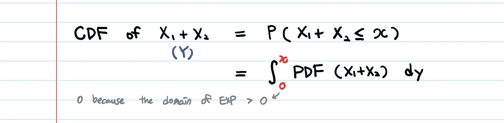
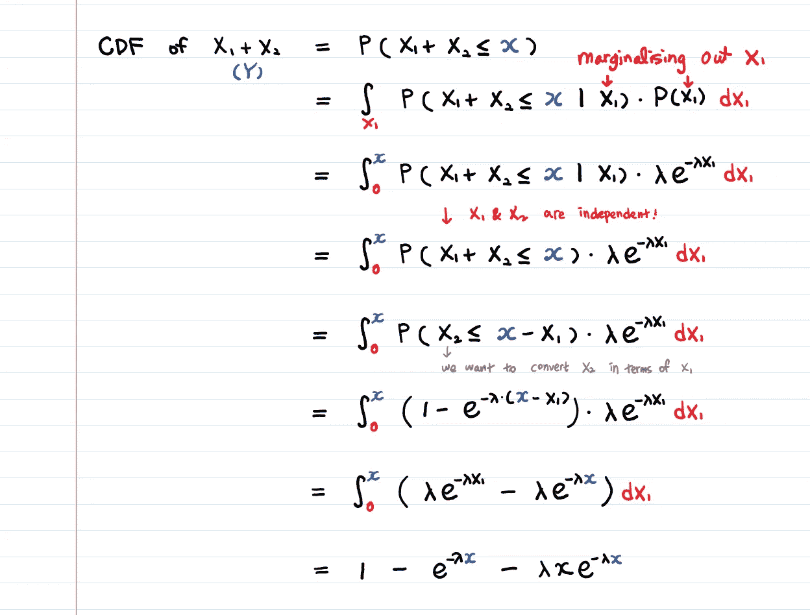
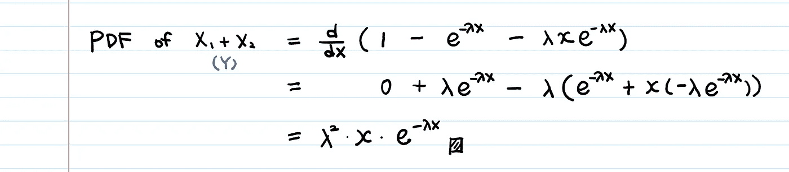
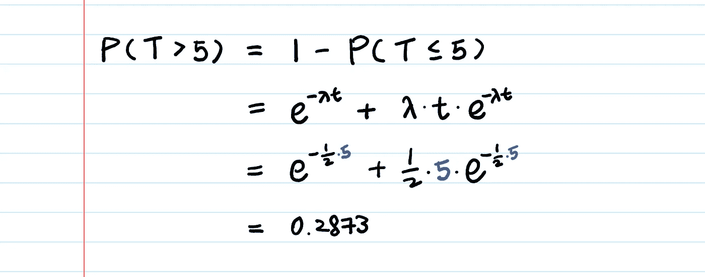
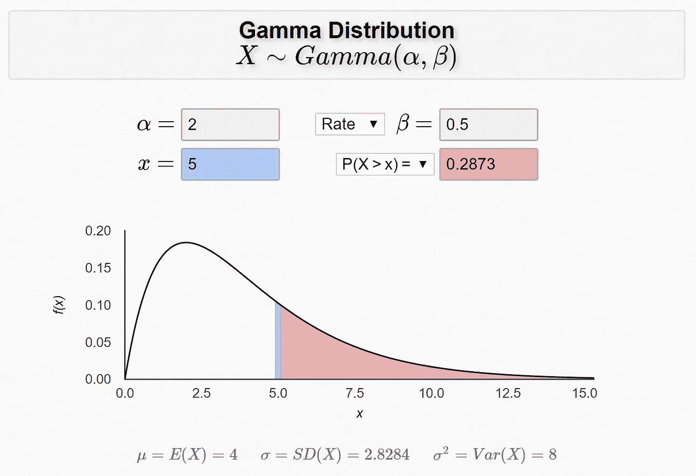

# 指数随机变量的和

> 原文：<https://towardsdatascience.com/sum-of-exponential-random-variables-b023b61f0c0f?source=collection_archive---------2----------------------->

## 推导埃尔兰分布的概率密度函数

> **X1** 和 **X2** 是**独立**的指数随机变量，速率为 **λ** 。
> 
> **X1~EXP(λ)
> X2~EXP(λ)**
> 
> 让 **Y=X1+X2**
> 
> 问题: **Y** 的 PDF 是什么？
> 我们在哪里使用**Y 的分布**？

# **要找到任何发行版的 PDF，我们使用什么技术？**

👉我们找到 CDF 并对其进行微分。
(我们在之前的帖子中已经多次使用过这种技巧。)

好，那我们来找 **(X1 + X2)** 的 CDF。



但是我们不知道 **(X1+X2)** 的 PDF。事实上，这正是我们想要计算的东西。

嗯…我们可以说…

```
**∫ PDF(X1+ X2) = ∫ PDF(X1) + ∫ PDF(X2) ???!?!?**
```

不，当然不是。

如果这样做的话， **(X1+X2)** 的 PDF 总和将为 2。(任何 PDF 的积分总和应始终为 1。)

> 我如何在不知道 PDF 的情况下找到任何发行版的 CDF？

# 我们可以用于概率计算的技术:边缘化和独立性。



在上面的 CDF 推导中使用了两个主要技巧。
一种是**将 X1 边缘化**(这样我们就可以将其整合到 **𝒙1** )另一种是利用独立的定义，即**p(𝐗1+𝐗2≤𝒙|𝐗1)= p(𝐗1+𝐗2≤𝒙)**。这些技巧简化了推导过程，并根据 **𝒙** 得出结果。

# 𝐗和𝒙有什么不同？

这些是数学惯例。 **𝐗** 是随机的，𝒙是确定性的。例如，让我们说 **𝐗** 是我们从掷骰子中得到的数字。所以 **𝐗** 可以取{1，2，3，4，5，6}中的任意一个数。但是**一旦我们滚动骰子**，𝐗**的值**就确定了。符号 **𝐗** = **𝒙** 表示随机变量 **𝐗** 取特定值 **𝒙** 。

*   𝐗是一个**随机**变量**和大写字母**被使用。
*   𝒙是随机变量可以取的某个**固定值**。例如， **𝒙1，𝒙2，…，𝒙n** 可能是**随机变量 x 对应的一个样本。**
*   因此，一个累积概率 **P(𝐗 ≤ 𝒙)** 是指函数 **𝐗** 的值域**t5】小于某个值 **𝒙** 的概率。 **𝒙** 可以是任意标量，如 **𝐗 ≤ 1** 、 **𝐗 ≤ 2.5** 、 **𝐗 ≤ 888** 、**、**等。**
*   波浪号(~)表示“具有的概率分布”，例如 **X1~EXP(λ)** 。

# 现在，让我们区分 CDF 得到 PDF。



> 这是一个 Erlang (2，λ)分布。

# Erlang 分布用在哪里？

在速率为 **λ** 的[泊松过程](/poisson-distribution-intuition-and-derivation-1059aeab90d)中， **X1+X2** 将代表第二个事件发生的时间。

在[我们的博客鼓掌👏例](/poisson-distribution-intuition-and-derivation-1059aeab90d)，如果你在单位时间内以 **λ** 的速率获得鼓掌，那么你等到看到第一个鼓掌粉丝的时间就以 **λ** 的速率呈指数分布。

如果你等待其他粉丝鼓掌更多的时间单位，那么你可以看到 0，1，2，…个粉丝。

然后使用 Erlang 分布来回答这个问题:

> “我还要等多久才能看到 **n** 粉丝为我鼓掌？”

答案是**独立指数分布随机变量的和**，是一个 **Erlang(n，λ)** 分布。Erlang 分布是 Gamma 分布的一个特例。Erlang 和 Gamma 的区别在于，在 Gamma 分布中， **n** 可以是非整数。

# 锻炼🔥

> a)什么分布等价于 **Erlang(1，λ)？**

简单。指数增长。

> b)【排队论】你去了 Chipotle，和排在你前面的两个人一起排队。一个在被服务，另一个在等待。他们的服务时间 **S1** 和 **S2** 是独立的指数随机变量，平均值为 2 分钟。(因此，平均服务速率为**. 5/分钟**。如果这个“速率对时间”的概念让你感到困惑，[阅读这个来澄清](https://medium.com/@aerinykim/what-is-exponential-distribution-7bdd08590e2a)。)
> 
> 你在队列中的条件时间是 **T = S1 + S2，**给定系统状态 **N = 2** 。**T**是二郎配。
> 
> **你排队等 5 分钟以上的概率有多大？**

让我们把 **λ = 0.5** 代入我们已经导出的 CDF。



我在 Chipotle 等待超过 5 分钟的几率不到 30%，听起来不错！

爱荷华大学的博格纳博士[建造了这个尔朗(伽马)分布计算器](https://homepage.divms.uiowa.edu/~mbognar/applets/gamma.html)，我觉得它很有用，也很漂亮:



See the numbers are matching with our derivation!