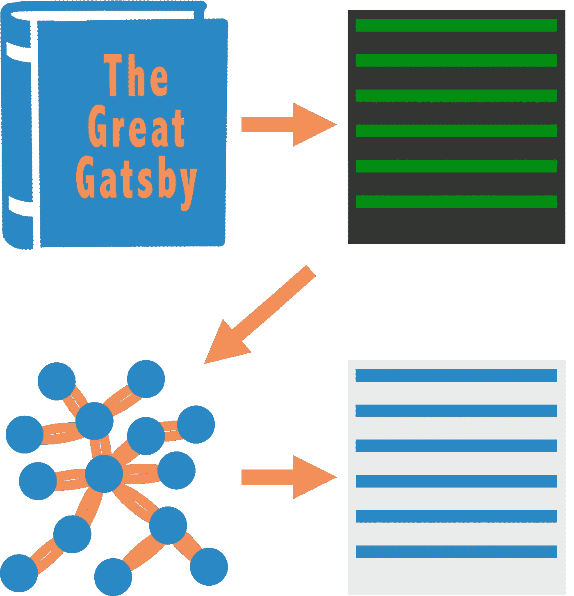
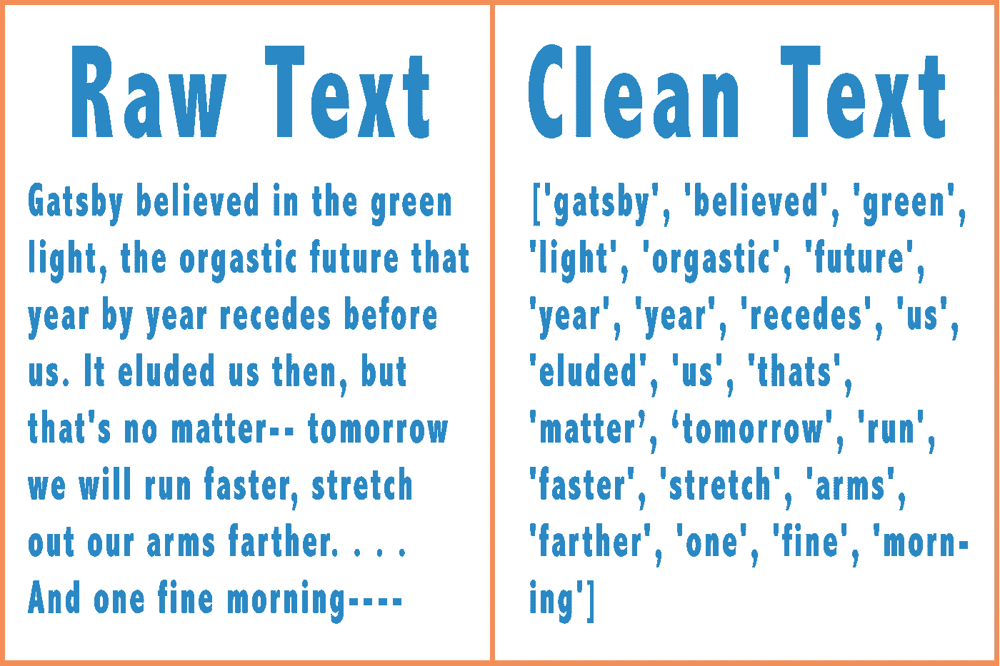
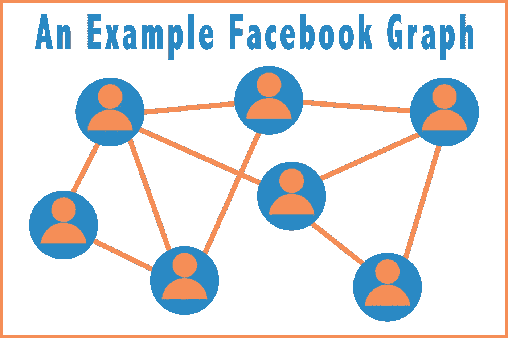
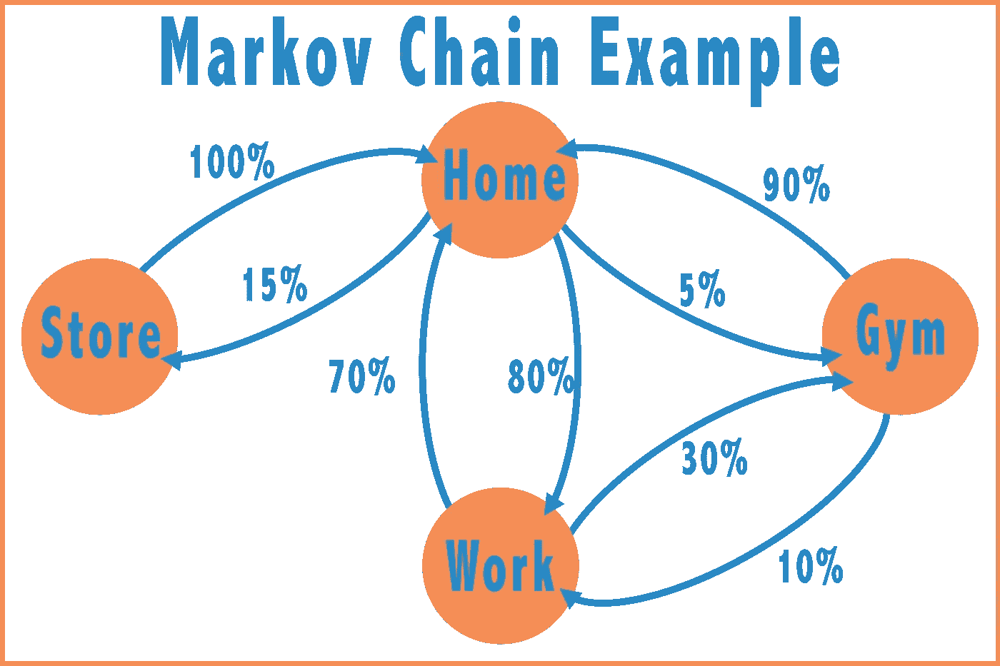
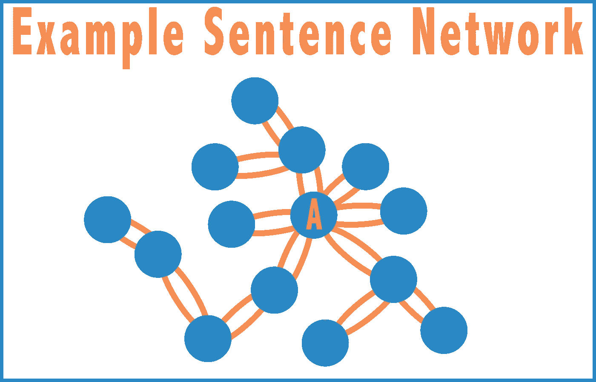
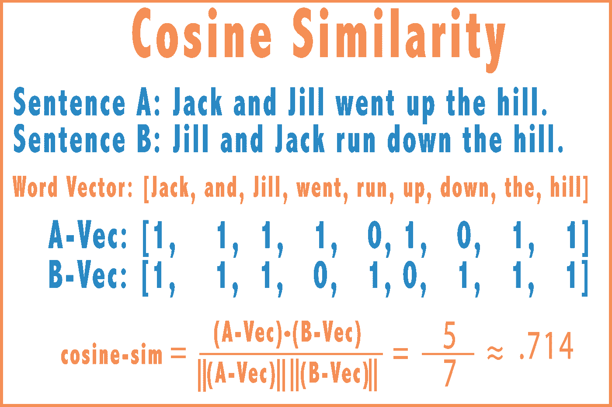
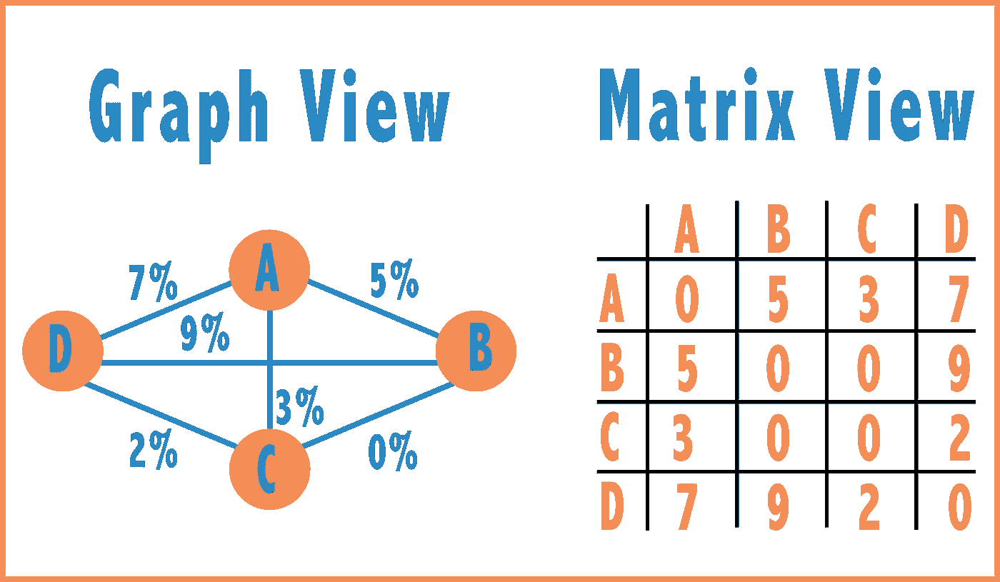

# 用自然语言处理技术总结《了不起的盖茨比》

> 原文：<https://towardsdatascience.com/summarizing-the-great-gatsby-using-natural-language-processing-9248ab8e9483?source=collection_archive---------9----------------------->

## 使用自然语言处理、马尔可夫链、邻接矩阵和机器学习的自动摘要介绍



如果在ᵗʰ10 个年级的英语课上有一个一致的任务，那就是写一篇《了不起的盖茨比》(TGG)的摘要(T3)。《TGG》是一部引人入胜、激动人心的文学作品。它有贯穿整部小说的中心主题——社会和阶级、财富和地位、现在和过去的主题。对于 10ᵗʰ的评分者来说，一个有说服力的简明摘要不是一件容易的事情。

在本文中，我们将使用自然语言处理(NLP)中的一些方法来总结 TGG。 **NLP** 是人工智能和机器学习的一个子领域，**分析计算机如何处理和理解有机的交流方法(如书面语言)。虽然这些流行语可能令人生畏，但其背后的概念却并非如此。**

# 清理和聚集 TGG

在我们做任何总结之前，我们需要实际得到这本书。我们从澳大利亚古登堡计划提供的[副本](http://gutenberg.net.au/ebooks02/0200041.txt)开始。首先，我们需要删除停用词。停用词是像 *the，and，in，for，an 等*这样的词。这些单词对于创建结构良好的句子是必要的，但它们不会添加容易辨别的含义，并且会扭曲词频分析。我们将在这里使用[停用词列表](https://gist.github.com/sebleier/554280)。其次，我们将把 TGG 分解成(键，值)对的映射。**我们地图中的关键字将是完整的句子(包含停用词和所有内容)。这些值将是表示句子的干净版本的数组。**



# 余弦相似马氏链

对于那些不熟悉图论的人来说，这非常简单。基本图有两部分:**节点和边**。一个**节点**代表一个真实世界的概念，比如人、电话号码或城市。一条**边**是两个节点之间的连接。图形的一个常见例子是脸书。这些节点将是脸书用户。如果这两个脸书用户是朋友，则两个节点之间会有边。这里有更多关于图论的内容。



出于我们的目的，我们将把 TGG 表示为一个图形。我们每个句子都会有一个节点。两个节点之间有一条边，这条边等于它们的句子相似度(我们一会儿会讲到)。但是，在此之前，为什么这种表示是有帮助的呢？

这允许我们将 TGG 表示为一个马尔可夫链。[马尔可夫链](https://brilliant.org/wiki/markov-chains/)是一种概率模型，通过定义从一种状态转移到另一种状态的概率来描述一系列状态。

假设我想把我开车去的地方表示成马尔可夫链。假设我只开车往返于 4 个地方:家、工作单位、商店和健身房。对于每个可能的地点，我都有可能开车去不同的地点。下图对此进行了说明。如果节点没有连接，有 0%的概率。在下面的图表中，我从来没有在没有先回家的情况下在商店和健身房之间开车。



我们可以用这个马尔可夫链找到我在任何给定位置的**平稳概率**。在上图中，我很可能在任何给定的时间都在家，这很直观。这是因为有很多节点大概率指向 home。

现在，回到盖茨比身上！让我们将两个句子之间的转移概率定义为等于两个句子之间的余弦相似度。然后我们会找到马尔可夫链的**平稳概率分布**。具有最高固定概率的句子是在我们的图中连接得最好的节点。在下面的例子中，**节点 A** 可能具有最高的稳定概率。



**高度连接的节点将具有高的稳定概率。这些节点应该代表一个关键主题的摘要，因为这些节点与许多其他句子最相关。**但是，在我们走得太远之前，我们需要定义**余弦相似度**。

假设我们有两个句子——“杰克和吉尔上山了”和“吉尔和杰克跑下山了”。余弦相似度将这些句子视为词的向量，并使用下面的公式测量它们的重叠。余弦相似度计算两个单词向量的[点积](http://tutorial.math.lamar.edu/Classes/CalcII/DotProduct.aspx)，并将其除以每个向量的幅度的[的乘积。](https://mathinsight.org/definition/magnitude_vector)



现在我们都准备好了。我们将用矩阵来表示我们的图形。索引 **(X，Y)** 处的值将是句子 **X** 和*句子**Y** *之间的余弦相似度。*该值是句子 **X** 和句子 **Y** 之间的转移概率。我们将使用这些转移概率来找到每个节点的稳定概率。*



在马尔可夫链中，寻找平稳概率是相对简单的。我们可以重复地将转移概率矩阵乘以自身，直到我们达到一个**稳定状态——此时所有的转移概率都收敛到一个单一值**。更有效的解决方案是使用左特征向量。对这个方法感兴趣的，看[这里](http://people.duke.edu/~ccc14/sta-663-2016/homework/Homework02_Solutions.html#Part-3:-Option-2:-Using-numpy.linalg-with-transpose-to-get-the-left-eigenvectors)。

现在我们有了一个稳态，我们可以寻找最高的概率。**稳态概率最高的句子如下。**

```
**"I'm Gatsby," he said suddenly.** 
--------------------------------------------------------------------
**"You two start on home, Daisy," said Tom. "In Mr. Gatsby's car."** 
--------------------------------------------------------------------
**"I told you I went there," said Gatsby.** 
--------------------------------------------------------------------
**"I want you and Daisy to come over to my house," he said, "I'd like to show her around."** 
--------------------------------------------------------------------
**She had told him that she loved him, and Tom Buchanan saw. He was astounded. His mouth opened a little and he looked at Gatsby and then back at Daisy as if he had just recognized her as some one he knew a long time ago.**
```

**现在，数据科学最有趣的部分来了——得出我们的数据不*不*支持**的结论。下面来评价一下我们的总结。

在我们的最后一句话中，黛西告诉盖茨比她爱他，她丈夫汤姆·布坎南看到了。这句话抓住了盖茨比、黛西和汤姆之间的复杂关系。在第四句中，我们看到盖茨比想带黛西参观他的房子。他确信，如果黛西看到他现在富有而成功，她会想和他在一起。这抓住了盖茨比努力用他目前的成功掩盖他的过去，这是小说的中心主题。我们的第一句话抓住了盖茨比自我介绍的标志性时刻。我们的模特做到了！我们已经总结了了不起的盖茨比！


Credit: The Great Gatsby, Warner Brothers, 2013

从我们的分析中有一个简单的方法可以得出上面的段落。它只需要一跳，一跳，一跳。我们的数据绝不意味着上述情况。我们的方法是强有力的，我们的分析是周到的。但是我引入了很多外界的知识来得出上面的结论。

我们强调这一点并不是要减少这种方法，而是要认识到我们方法的局限性。我们可以合理地推断出*盖茨比*、*黛西*和*汤姆*是相关的角色，并且*盖茨比*和*黛西*之间存在某种关系。我们当然已经找到了一些关键的想法，但我们还远远没有形成一个完整而全面的总结。

# 展望未来

当然，我们可以做一些事情来改进我们的方法，主要围绕句子相似性的确定。我们可以使用 [TF*IDF](https://skymind.ai/wiki/bagofwords-tf-idf) 来查看哪些单词在一个句子中最相关，并相应地对它们进行加权。当测量余弦相似性时，我们不需要只考虑严格相等。我们可以考虑词义相近但拼写不相似的词(如 happy 和 ealthed)。如果我们想变得更强烈，我们可以使用高级主题模型，如[潜在狄利克雷分配(LDA)](/topic-modeling-and-latent-dirichlet-allocation-in-python-9bf156893c24) 。

自动摘要被分为两个主要的领域— **提取方法和抽象方法**。我们在这里谈论的一切都是一种提取方法。我们正试图从文本本身提取相关信息。但是没有人会写这样的摘要。人类接受概念，概括它们，考虑模式，并产生一个结果。这是一个抽象的方法。为此，我们需要计算机科学中最热门的三个词:**深度神经网络**。

我们很快就会使用这种方法，所以请留意那篇文章。

# 密码

对于那些感兴趣的人来说，运行它所需的所有代码都可以在 [Github repo 这里](https://github.com/andrewjoliver/NLPSummarization/tree/master/src)找到。有 Python 代码和 Jupyter 笔记本。清理数据和计算邻接矩阵确实需要一点时间。使用 Jupyter Notebook，您只需运行这些方法一次。方法定义和代码结构与本文类似，因此很容易理解。

# 感谢阅读！

*疑问？评论？在*[*andrew.oliver.medium@gmail.com*](mailto:andrew.oliver.medium@gmail.com)*给我发邮件。我很想收到你的来信！*