# 超级碗预测模型

> 原文：<https://towardsdatascience.com/super-bowl-prediction-model-99048f366fed?source=collection_archive---------21----------------------->

## 根据 1966 年至 2019 年的常规赛数据预测 2019 年超级碗的冠军

NFL Super Bowl Trophy (Lombardi Trophy) image source: Wikipedia

*作者:*

Matthew Littman 商业分析硕士

UCI 艾迪·达姆商业分析硕士

*撰稿人:*韦丹克希尔萨加尔，UCI 商业分析硕士

# 介绍

超级碗是一项非常受欢迎的体育赛事，每年举行一次，以确定国家橄榄球联盟(NFL)的冠军球队。在二月的一个星期天，数百万球迷聚集在电视机前，庆祝这个事实上的全国性节日。超级碗在 170 多个国家播出，是世界上最受关注的体育赛事之一。以精心制作的中场表演、名人亮相和令人捧腹的商业广告为特色，增加了吸引力。经过 50 多年的存在，超级碗已经成为美国文化的传奇象征。

随着常规赛在九月开始，超级碗结束了赛季。去年 LIII 超级碗的电视转播吸引了全球约 9820 万电视观众。这使得它成为今年最流行的话题之一。出于这个原因，我们的团队决定建立一个预测模型，利用国家足球联盟官方网站 nfl.com 和其他几个网站上发布的数据来预测超级碗 LIV (54 岁)的冠军。

超级碗对美国人来说是一场盛大的庆祝派对。全球有 9820 万观众，这使得超级碗成为美国最受关注的体育赛事。各大商家为一个 30 秒的广告支付了 500 万到 550 万美元，而且价格还在竞相上涨。这些巨大的数字和对游戏的热情吸引了我们对这个项目的关注。今年也是这项美国最受欢迎的运动的 100 周年纪念。

NFL 100 year anniversary logo. image source: Wikipedia

# 数据汇总

我们使用了 3 个不同的网站来收集我们所有的数据:NFL.com，pro-football-reference.com 和 topendsports.com。利用 Python 中漂亮的汤包，我们开始刮。我们希望收集过去的所有数据，从 1966 年的第一届超级碗开始，一直到现在(NFL 的第 13 周)。从 NFL.com 开始，统计数据分为进攻和防守两类，进攻有 11 张表，防守有 8 张表。NFL.com，NFL 的官方网站，是我们收集历史数据的主要资源，因为他们有着广泛的数据记录和整洁。该网站的一个缺点是，它不包含每个团队的赢、输和平局记录。我们的项目需要这些重要的指标，所以我们包含了来自一个名为“职业足球参考”的网站的数据。在搜集了 1966 年以来每支球队的记录后，我们最不需要的就是知道哪些球队在过去赢得了超级碗。在收集了所有这些数据之后，我们合并了基于球队和年份的信息，以便让每一行都成为一个球队和他们所有相应的统计数据。按照年份升序排序后，我们的数据集包含 1579 行、242 列和近 40 万个数据点。它已经准备好清洗了。

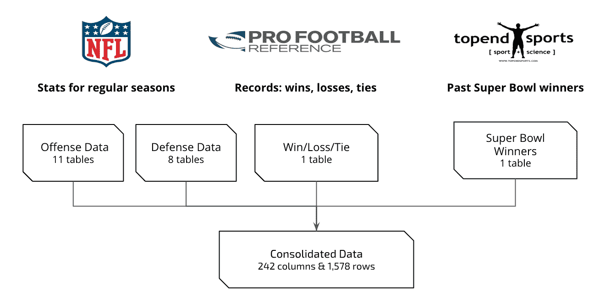

**Figure 1\.** Scraped data sources

# 清洁

*   列名不直观，需要反映信息的来源。
*   需要将包含多条信息的列分成多列。
*   许多数据类型不正确，需要调整。
*   重新排列各列以确保可读性。
*   需要手动更改与其他表同名的列，以避免混淆。
*   同时，我们用“-99999”替换了缺失的值或 NAs
*   最重要的问题是许多列包含缺失的数据。

经过进一步的探索，很明显，某些统计数据直到某些年份才被记录下来。例如，大多数防守和踢腿的数据直到 1991 年才被记录下来。进攻线的数据直到 2009 年才被记录下来。在我们的 242 列中，有 89 列包含所有不同年份的缺失数据。

每个团队的统计数据都是特定年份中与该团队相关的独立事件。这意味着所有的计算或比较都必须在按年份分组后进行。我们还没有删除任何列，因为我们计划构建模型来只选择最重要的变量。

# 探索性分析

我们首先关注的是从 1966 年到 2018 年这 53 年间的超级碗冠军。图 2 显示匹兹堡钢人队和新英格兰爱国者队各以 6 胜领先，其次是旧金山 49 人队和达拉斯牛仔队，各以 5 胜领先；纽约巨人队和绿湾包装工队以 4 胜紧随其后。华盛顿红人队和丹佛野马队各有 3 胜，其次是奥克兰突击者队、迈阿密海豚队和巴尔的摩乌鸦队，各有 2 胜，排名最后的 11 支球队各有 1 胜。

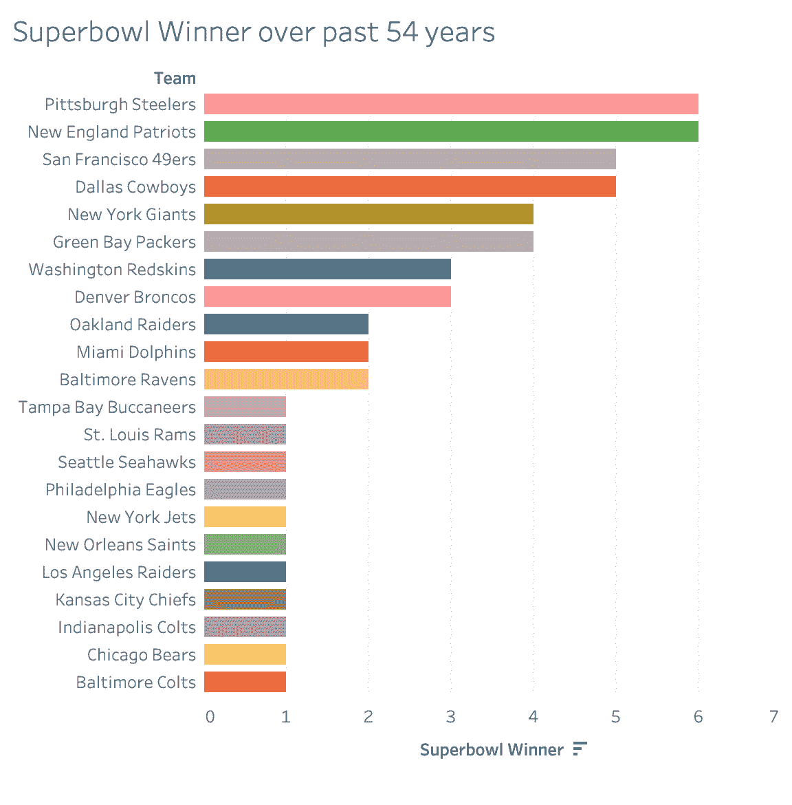

**Figure 2\.** Ranking of Super Bowl winners from 1966 to 2018

下面的图 3 显示了过去 53 年中所有球队的输赢分布。每个红圈代表一个球队的常规赛记录，没有超级碗冠军，而绿圈代表超级碗冠军。请注意，其中一些是堆叠的，因为团队可以有相同的记录。请注意，除了 1982 年的红人队，没有哪支球队赢得超级碗的胜场数少于 9 场，但由于罢工，那个赛季只有 9 场比赛。图 3 中标出了两个关键点；1972 年迈阿密海豚队和 2007 年新英格兰爱国者队。1972 年，迈阿密海豚队在常规赛中保持不败，赢得了超级碗。在令人印象深刻的赛季之后，海豚队想出了一个传统，当所有球队在整个赛季中至少输了一次时，就庆祝一下，这意味着他们将成为唯一一支不败的球队。2007 年，新英格兰爱国者队几乎打破了 35 年的传统，他们赢得了所有 16 场比赛，但不幸的是输掉了超级碗。需要注意的是，以前常规赛只有 14 场，1978 年这改成了 16 场。

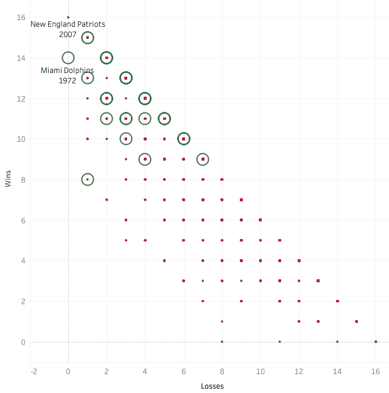

**Figure 3\.** Super Bowl wins and losses from 1966 to 2018

看触地得分统计，足球比赛中有 8 种方式可以触地得分；4 个来自进攻，4 个来自防守。如图 4 所示，在 NFL 的整个历史中，接发球和抢攻触地得分占所有触地得分的大部分，分别占总数的 55%和 36%。这是所有球队的平均值，不管超级碗的赢家还是输家。有趣的是，当看具体的超级碗冠军球队和他们的平均水平时，中心趋势是 55%和 36%左右，但范围变化很大。这让我们相信，在那些年获胜的球队正在做一些与其他人不同的事情，根据年份的不同，他们要么跑得更多，要么扔得更多。这一探索向我们表明，一个球队抢断或接球的达阵率将是超级碗冠军的重要预测因素。

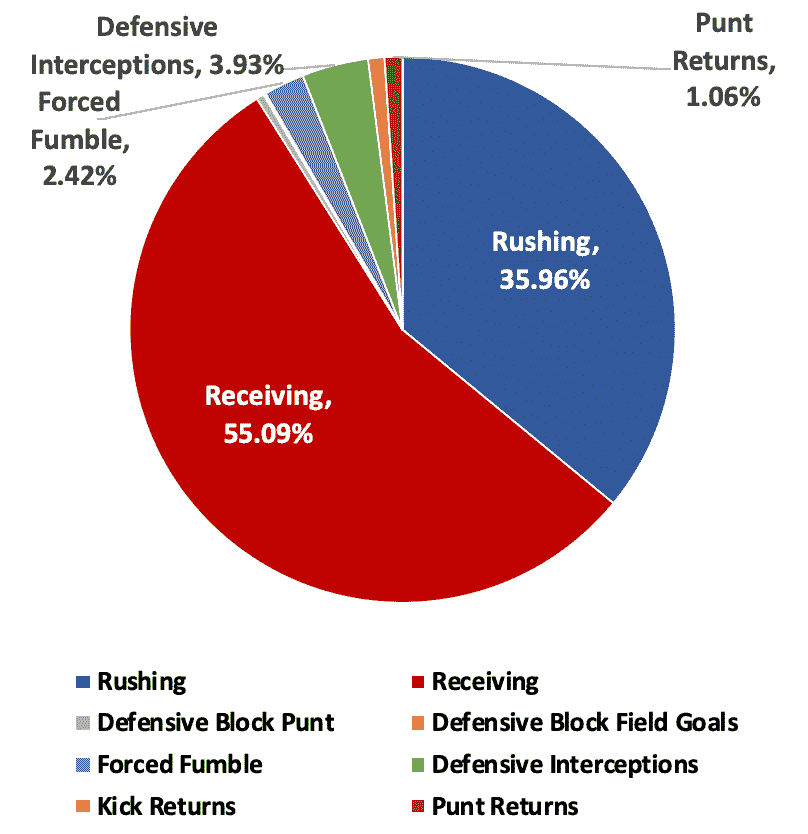

**Figure 4\.** Distribution of 8 types of touchdowns

我们看了几个区分超级碗赢家和其他人的统计数据。很自然，常规赛的胜利数是决定谁将赢得超级碗的一个重要因素。历史上，超级碗冠军平均每场比赛多 3.18 次进攻冲刺。这表明球队应该尝试更多的跑动进攻。超级碗赢家的平均传球距离也比非赢家高 0.75 码。建议球队应该把球扔得更远，以增加获胜的机会。

赢家和输家在进攻比赛数据失误方面的明显差异表明，失误是谁赢得超级碗的一个巨大差异。最后，超级碗冠军的防守传球比其他人高出 7.15 分。强大的防守导致更多的盖帽，这可能会导致更多的失误！

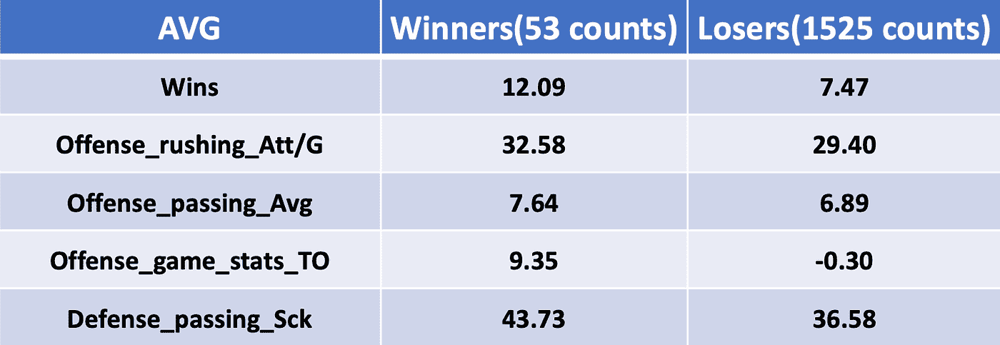

**Table 1\.** Comparison of key statistics between Super Bowl winners and losers

在研究了所有数据后，由于数量庞大，很难找到所有变量之间的趋势或相关性。拥有超过 240 个统计数据，可以获得的洞察力大多是基于这项运动的先验知识。这种游戏意识有助于将我们的注意力引向这些领域。

# 建模

我们的数据集中需要解决的第一个问题是缺失数据。删除那些包含缺失值的列的问题是，它们中的许多捕获了游戏的非常重要的方面，这否定了我们有价值的年份的信息。用各自列的平均值填充这些值没有意义，因为有些列包含大约一半缺失值和一半现有值。这取决于 NFL 何时开始记录它们。使用平均值会严重扭曲这些列的结果，但最重要的是，团队绩效在这些年中变化很大，平均值不能反映这种变化。缺失的统计数据应该反映出团队当年的表现，这使得我们使用更先进的预测技术来填补缺失的数据。

# **数据插补**

## 线性回归

第一种技术使用线性回归，其中因变量是包含缺失数据的列之一，自变量是其他列。该模型基于这些列的现有数据进行训练，因此，将根据该团队和该年的其他列来预测每个缺失的观察值。应该指出的是，对于所有的预测插补方法，数据都在每年内进行了标准化，以便在预测时调整比例问题。为了进一步提高预测准确性，对每一列都执行了一种称为递归特征消除的技术。*递归特征消除*(或 RFE)是一种将列数减少到仅相关列的方法。它通过获取所有列的子集来做到这一点，然后允许您分配一个决策函数来决定该子集中的哪些列是最重要的列。在我们的案例中，我们使用了逻辑回归，它基于返回那些具有最高系数的变量。这些系数衡量该变量对因变量的总体影响。在删除该子集中影响最小的列之后，通过选取不同的子集来重复该过程。它重复这个过程，直到剩下的重要列数等于用户指定的列数，在我们的例子中是 20。这意味着要预测的丢失数据的每一列都使用特定于该列的一组不同的列来进行线性预测。在预测了所有缺失的数据点之后，这些点必须与以前的数据框架重新聚合。不幸的是，在将现有值与预测值进行比较后，很明显预测结果与现有值不符，因此无法使用。

## k-最近邻

在咨询了之前的统计学教授 Mohamed Abdelhamid 之后，有人建议使用*K-最近邻*(或 KNN)技术。这种技术将每个观察值视为其所有属性的集合，并在 n 维空间中绘制每个观察值，其中 n 是列数。对于缺失值，KNN 试图通过查找缺失值的当前观测值与其 K 个最近邻点之间的最小距离来解决这一问题，其中 K 是要查找的相邻点的数量。图 5 显示了一个例子，其中黑色值是我们希望估算的观察值。

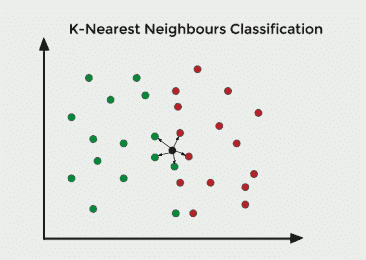

**Figure 5**. KNN visual for classification in order to impute missing values.

一旦设置了相邻要素的数量，该算法会将所有相邻要素值的平均值作为您尝试替换的值。在我们的例子中，我们使用了 5 个最近的邻居。如果多个列需要估算值，就像我们的例子一样，该算法将需要替换的列从最少的值到最多的值进行排序。这种算法只有在列缺少的值越少时才会越好，因此这种排序通过首先进行最佳预测来提供帮助。这种方法在理论上非常有效，但同样不能使用，因为预测值与已经存在的值不一致。

# 链式方程的多重插补

之前的两种插补方法都不起作用，最后尝试了名为*多重插补的链式方程*(或 MICE)法。这种方法也被称为“完全条件说明”或“序贯回归多重插补”。在 Azur Melissa 关于老鼠的文章(2011)中，她解释说这种技术已经用于随机缺失的数据。我们的数据不是随机缺失的(MNAR)，但是进一步的研究表明它依赖于数据集，并且其他人已经将它用于 MNAR 的数据。python 包“fancyimpute”被用于这个项目的 MICE 算法。

MICE 可以被认为是我们之前提出的线性回归方法和 KNN 算法的结合。它将每一列作为因变量，并运行回归，在这种情况下，贝叶斯岭回归。这样做是为了使用与该行相关的其他属性来预测该值。用户指定他们希望算法循环多少次，然后每个循环创建一个数据帧。具体来说，该算法工作如下:

*   取每一列缺失的数据(89 列中的一列)，对每一列运行 MICE 算法。
*   首先用中位数填充该列的缺失数据。
*   对第一列中缺少值每一行运行回归。
*   使用 4 个(用户指定的数量)最近邻回归值的平均值作为该行的缺失值。
*   填充完所有值后，检查用户指定的最大循环次数(在我们的例子中是 1000)。
*   每个周期产生 1 个数据帧，包含该列的填充值。
*   根据以下两个选项中先出现的一个，算法停止处理它正在处理的列:
*   如果值已经收敛，并且没有根据用户指定的停止容差从一个周期到另一个周期发生变化，则使用该收敛值作为该行的缺失值。
*   否则重复前面的过程，直到创建了 1000 个数据帧。
*   如果这些值没有收敛，该算法将汇集/收集该特定行中已创建的所有 1000 个数据框的结果。
*   基于这些值创建分布。
*   最可能的值(分布的最高峰)用作该行的缺失值。
*   该列的所有值现在都应该被填充，并对其余的列重复

图 6 直观地展示了该算法的工作原理。循环的数量被设置为 3，从而创建了 3 个数据帧，而不是我们示例中的最大值 1000。

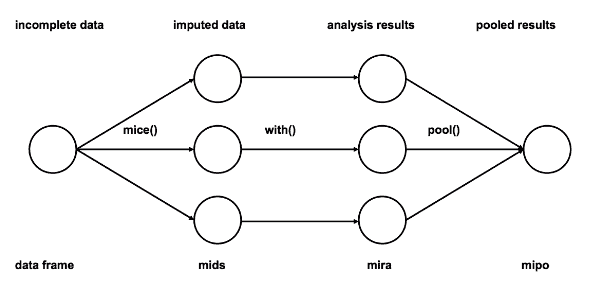

**Figure 6\.** Visual representation of MICE algorithm with cycles = 3 for one column (Stef Van Buuren, 2011)

评估这种方法的结果证明是非常有希望的。大多数值在其各自的行中都是有意义的，因为数据在输入到算法之前是标准化的，所以结果输出遵循基本的正态分布。预测值大多落在平均值左右 1 个标准偏差内或在 0.3 和 0.7 之间。

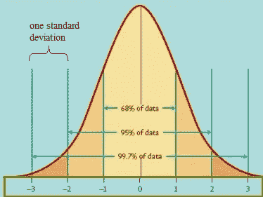

**Figure 7.** Shows the normal distribution of the output prediction imputations. image source: statisticshowto.datasciencecentral.com

# 处理不平衡数据

既然丢失的数据已经得到处理，现在是处理不平衡数据问题的时候了。过去的超级碗冠军只有 53 支，每个赛季有 32 支球队(早些年的球队更少)，这导致了 1525 支球队“非冠军”和 53 支球队冠军的不平衡。由于我们总人口中只有大约 3%的人是赢家，很难有一个模型在没有干预的情况下预测这些值。这类似于将交易标记为欺诈的问题，其中大多数交易是真实的，只有少数是欺诈的。当然，预测一个超级碗冠军作为一个非超级碗冠军不会有巨大的成本，就像交易一样。这种不平衡使得建模困难。以下是处理不平衡数据的一些方法及其功效:

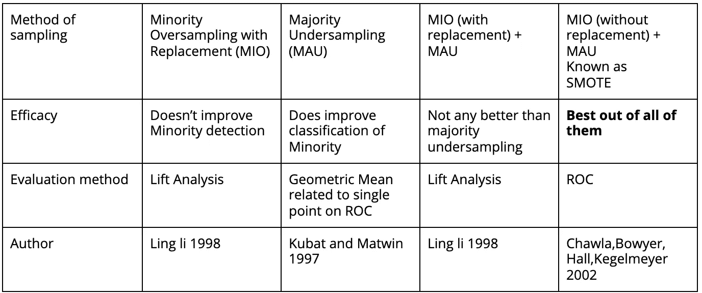

**Table 2\.** Summary table of sampling methods described in original SMOTE research paper (Chawla,Bowyer,Hall,Kegelmeyer, 2002)

在研究了可能的采样方法后，无论是对少数进行过采样(不会导致更好的少数检测)还是对多数进行欠采样，或者是两者的某种组合，*合成少数过采样技术*(或 SMOTE)被证明是最佳选择。

# SMOTE 如何工作

除了(Chawla 等人，2002)中提到的对多数采样不足之外，少数过采样方法是这种采样方法背后的真正天才之处。第一项是决定需要进行多少过采样。在我们的案例中，我们希望“赢家”和“非赢家”各占一半。SMOTE 是用 Python 中的“imblearn”包实现的。

出于示例目的，我们将对少数部分进行 200%的过采样。这意味着每个少数民族点将负责创建 2 个额外的合成点，以便将我们的少数民族数据点计数增加三倍。接下来，用户必须决定使用多少个最近邻进行生成，在(Chawla 等人，2002 年)中，他们使用了 5 个。做出这些决定后，算法会执行以下操作:

*   选择要使用的第一个少数点。
*   找到用户指定的 K 个最近邻(在我们的例子中是 5 个)。

(注意，这些最近的邻居只是少数邻居，而不是所有的点)

*   在这 5 个点之间画边。
*   检查需要执行的过采样量(如果是 500%，您将为所有 5 条边的每条边创建一个新点)
*   因为我们的例子百分比是 200%，随机选择 5 个创建的边中的 2 个来创建新点。
*   随机选择一个介于 0 和 1 之间的数字，该数字将确定沿已创建的边的距离。(其中 1 将位于相邻点的正上方)。
*   对所有少数点数重复该过程，以获得开始时的三倍金额。

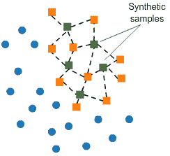

**Figure 8\.** Synthetic samples visual from Kaggle sampling technique article (Rafjaa, 2017)

**Table 3\.** SMOTE results before and after

# 特征选择

如上文数据插补-线性回归部分所述，递归特征消除(RFE)是一种将列数减少到最重要的列数的便捷方法。现在，缺失的数据已经被填充，不平衡的少数已经被平衡，我们进行了 RFE 筛选出谁将赢得超级碗的前 20 个最有影响力的专栏。它们如下:

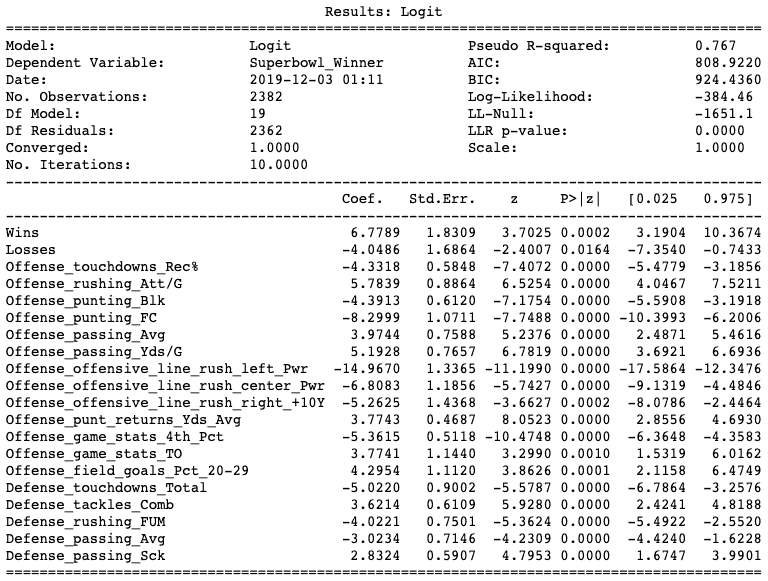

**Figure 9\.** Top 20 most impactful columns after using RFE

选择了 20 个最有影响力的专栏，所有的系数都有意义，除了进攻线统计。这些数据在 2009 年才开始被记录，因此缺少的数据最多。当这些柱子被取出时；然而，其他列的系数不再有意义。胜率变成了负数，正如我们之前在探索性分析中提到的，考虑到胜率越多，进入超级碗的可能性就越大，这显然应该是一个正系数。我们的假设是，这 3 列被用作添加的噪声，以便其他列做得更好并避免过度拟合，因此我们将它们留在我们的模型中。为了验证，我们检查了相关表，以确保变量之间没有多重共线性。虽然赢和输之间有很强的负相关性，但我们决定将这两者作为我们的模型正确运行的指标。这个相关表可以在下面找到。

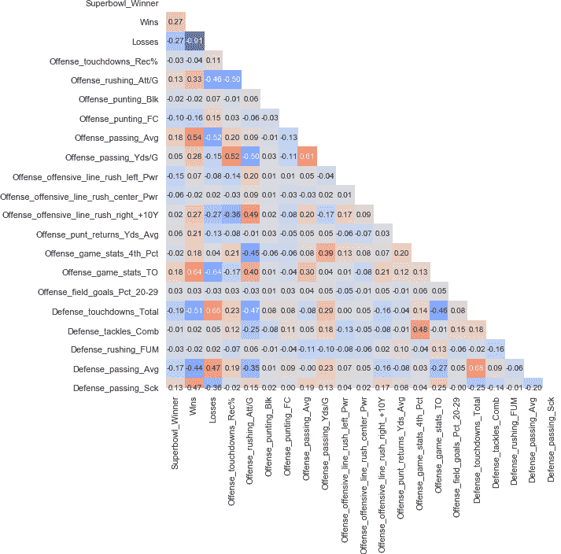

**Figure 10\.** Correlation table with 20 columns used for model

使用 RFE 后，我们回过头来在超级碗赢家和非赢家之间进行了两个样本的独立 T 检验，并选择了它标记为重要的列。我们只在模型中运行这些选定的列，并通过这些列过滤数据集，然后对 T-test 过滤结果执行 RFE。总的来说，就准确性和召回率而言，最好的方法是使用 RFE。

# 预测算法

我们已经修复了所有缺失的数据，我们不平衡的少数，并选择了 20 个最有影响的列，我们希望输入到预测算法中。我们选择使用逻辑回归，因为它的可解释性和易用性，尽管神经网络可能有潜力给定我们拥有的数字数据量。这有可能在未来进行探索。

我们使用了 20-80%的训练验证分割，其中我们在 1966-2018 年的 80%随机样本上进行训练，然后在另外 20%上验证我们的模型。这产生了 95%的测试准确度。

**Table 4\.** Confusion Matrix from Logistic Regression showing actual versus predicted results

**Table 5\.** Classification report from Logistic Regression validating accuracy, recall, and precision

非赢家的召回率为 89%，赢家的召回率为 100%，总体准确率为 95%，当赢家实际上不是赢家时，我们的模型在预测赢家方面的误差更大。它还预测 0 非赢家为赢家，这意味着我们的模型实际上更有可能说某人是赢家，而他们不是。这实际上是有利的，当考虑到一个球队在赛季中的实际预测。我们宁愿让我们的模式给更多的人一个“潜在”机会，而不是把每个人都贴上非赢家的标签。利用一个非常有前途的混淆矩阵，我们绘制了我们的 ROC 曲线，显示曲线下的面积为 95%。

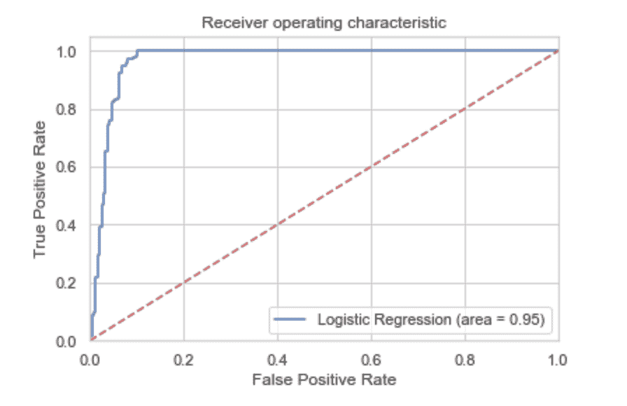

**Figure 11\.** ROC curve shows an AUC of .95

# 结果

**预测赢家**

在训练和验证之后，是时候通过尝试预测当前的 2019 赛季来测试我们的模型了。如图 12 所示，我们的模型能够根据获胜的机会对每支球队赢得超级碗的机会进行排名，最高百分比的球队位于顶部。预计旧金山 49 人队和新英格兰爱国者队分别有 96%和 76%的机会赢得超级碗。在当前的 2019 年 NFL 季后赛中，49 人队将被列入外卡名单，战绩为 10 胜 2 负。爱国者队是分区领先者之一，也有 10 胜 2 负的记录。此外，所有我们的模型给了百分之十机会的球队，都是预定进入季后赛的球队，或者有很大机会进入季后赛的球队。唯一的例外是卡罗莱纳黑豹队。

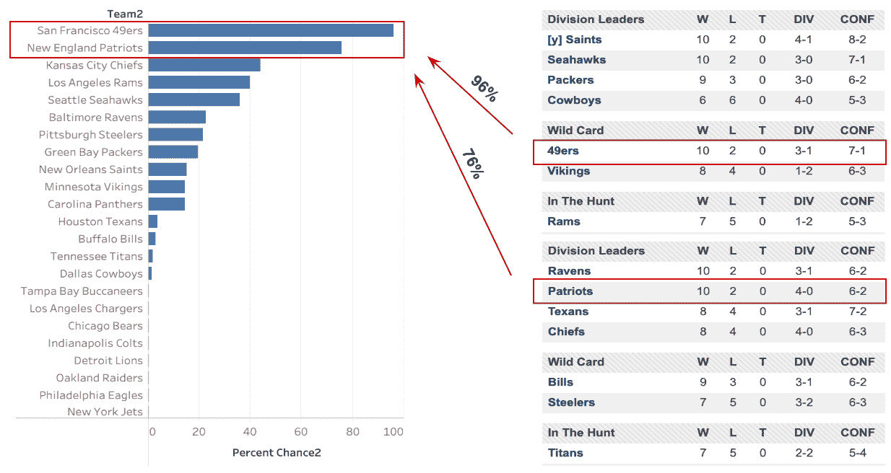

**Figure 12\.** Winners that our model predicts vs. current NFL results

**预测失败者**

我们的模型不仅以惊人的准确性预测了球队成为冠军的可能性，还预测了赢得超级碗的可能性低到零的球队。如图 13 所示，我们的模型预测狮子队、红雀队、猎鹰队、巨人队、海豚队和孟加拉队没有机会赢得超级碗，考虑到他们甚至已经被淘汰出季后赛，这是有道理的。我们的模型还预测其他几个团队的机会为零，这些团队被称为“在狩猎中”。这意味着如果他们能在赛季的最后 4 场比赛中提高他们的记录，他们仍然有机会进入季后赛。我们的模型认为这些团队做不到。在图 12 中，底部的团队被剪掉以提高可视性，而在图 13 中，中间的团队被剪掉。这解释了每个图中列出的不同团队名称。

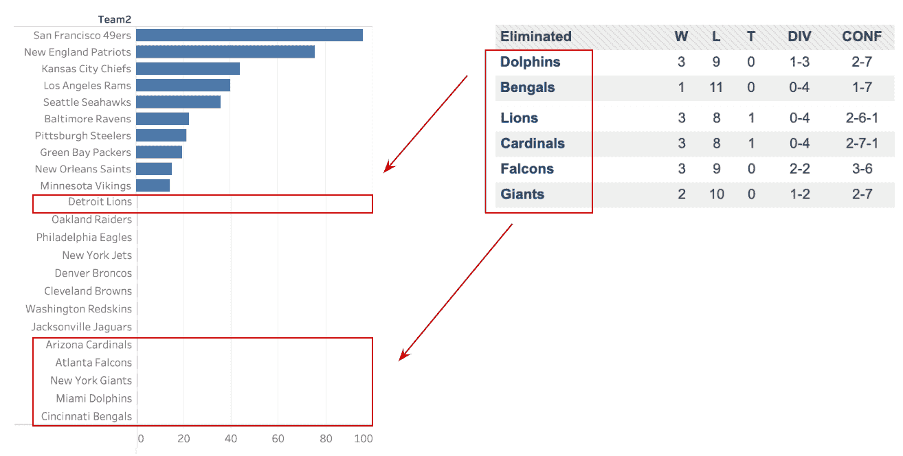

**Figure 13\.** Losers that our model predicts vs. current eliminated NFL teams

# 结论

总之，为我们的模型提供最高预测准确性的最佳方法是使用 MICE、SMOTE、RFE 和逻辑回归的顺序技术。这种方法给我们的曲线下面积为 0.95，非获胜者的召回率为 0.89，获胜者的召回率为 1.00。此外，F1 的非获胜者分数为 0.94，获胜者分数为 0.95。这个统计数据代表了精确度和召回率的调和平均值

预测 2019 年超级碗冠军的一些最重要的属性是:

1.  接受触地得分的进攻百分比
2.  每场比赛进攻抢攻次数
3.  每场比赛平均进攻传球码数
4.  平均防守传球码数
5.  周转差额
6.  防御袋
7.  防守触地得分总数

对于未来的项目，我们希望探索利用我们的数据使用神经网络的可行性，以及利用球员统计数据、天气数据、主场比赛还是客场比赛以及球队比赛历史来预测比赛水平的比赛。

此外，我们认为受伤预测的定量方法，使预防措施成为可能，对球员和球队管理都是有益的。考虑到许多伤害是作为事故而不是退化发生的，这将是具有挑战性的，并且可能是不可能的。

使用相同的数据集，发现好的防守和好的进攻哪个对赢得超级碗更重要会很有趣。

最后，我们认为为购买/交易球员或建立梦幻足球队建立一个推荐系统，类似于网飞的高级推荐系统可能是非常有价值的。像这样的模型必须捕捉团队动态，以及什么标准构成好的团队，然后评估当前的团队，并根据团队的弱点推荐球员。

我们所有的代码都可以在

github:[https://github.com/kelandrin/NFL-Superbowl-Prediction](https://github.com/kelandrin/NFL-Superbowl-Prediction)

(目前正在制作一个可以使用该代码的 web 应用程序)

# 相关作品/参考文献

**超级碗历史**

History.com 编辑。"超级碗历史"History.com，A&E 电视网，2018 年 5 月 11 日，[https://www.history.com/topics/sports/super-bowl-history.](https://www.history.com/topics/sports/super-bowl-history.)

**超级碗收视率**

佩雷斯莎拉。"超级碗 LIII 创下流媒体记录，而电视收视率大幅下降."TechCrunch，TechCrunch，2019 年 2 月 5 日，[https://TechCrunch . com/2019/02/05/super-bowl-liii-set-streaming-records-while-TV-viewership-saw-massive-drop/。](https://techcrunch.com/2019/02/05/super-bowl-liii-set-streaming-records-while-tv-viewership-saw-massive-drop/.)

**通过链式方程进行多重插补**

圣乔治的德拉科斯。"处理机器学习中的缺失值:第 2 部分."中，走向数据科学 2018 年 10 月 5 日[https://Towards Data Science . com/handling-missing-values-in-machine-learning-part-2-222154 B4 b 58 e](/handling-missing-values-in-machine-learning-part-2-222154b4b58e)

《链式方程的多重插补:它是什么？它是如何工作的？》国际精神病学研究方法杂志，美国国家医学图书馆，2011 年 3 月，[https://www.ncbi.nlm.nih.gov/pmc/articles/PMC3074241/#R8.](https://www.ncbi.nlm.nih.gov/pmc/articles/PMC3074241/#R8.)

Buuren、S. van 和 K. Groothuis-Oudshoorn。“小鼠:r .*Stef Van Buuren*，2011 年 12 月 1 日，[https://stefvanbuuren . name/publication/2011-01-01 _ vanbuuren 2011 a/。](https://stefvanbuuren.name/publication/2011-01-01_vanbuuren2011a/.)

**合成少数过采样技术**

《SMOTE:合成少数过采样技术》对 SMOTE 的看法:合成少数过采样技术，人工智能研究杂志，2002 年 6 月，[https://www . Jair . org/index . PHP/Jair/article/view/10302/24590。](https://www.jair.org/index.php/jair/article/view/10302/24590.)

拉夫贾。"不平衡数据集的重采样策略."Kaggle，Kaggle，2017 年 11 月 15 日，[https://www . ka ggle . com/RAF jaa/重采样-不平衡数据集策略。](https://www.kaggle.com/rafjaa/resampling-strategies-for-imbalanced-datasets.)

**递归特征消除**

李，苏珊。"用 Python 一步一步地构建逻辑回归."中，走向数据科学，2019 年 2 月 27 日，[https://Towards Data Science . com/building-a-logistic-regression-in-python-step-by-step-becd 4d 56 c 9 c 8](/building-a-logistic-regression-in-python-step-by-step-becd4d56c9c8)

Keng，Brian 等人，深入研究数据，2014 年 12 月 20 日，[https://blog . Data dive . net/selecting-good-features-part-iv-stability-selection-rfe-and-everything-side-by-side/](https://blog.datadive.net/selecting-good-features-part-iv-stability-selection-rfe-and-everything-side-by-side/)