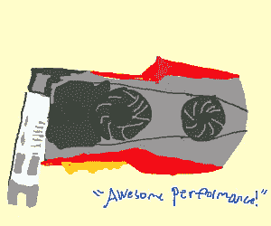
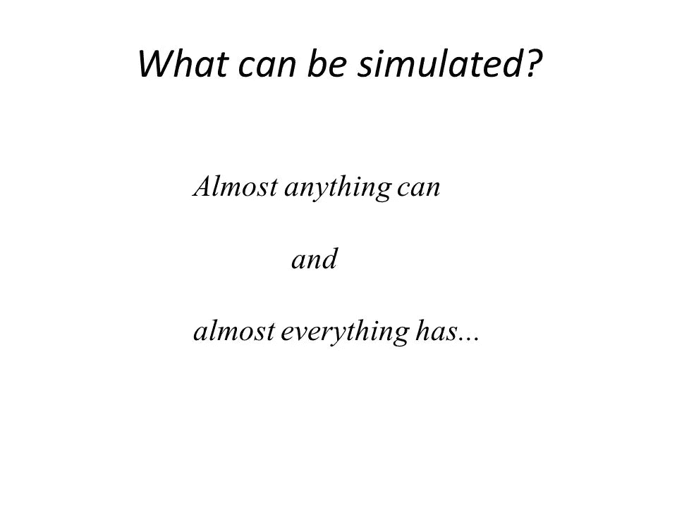
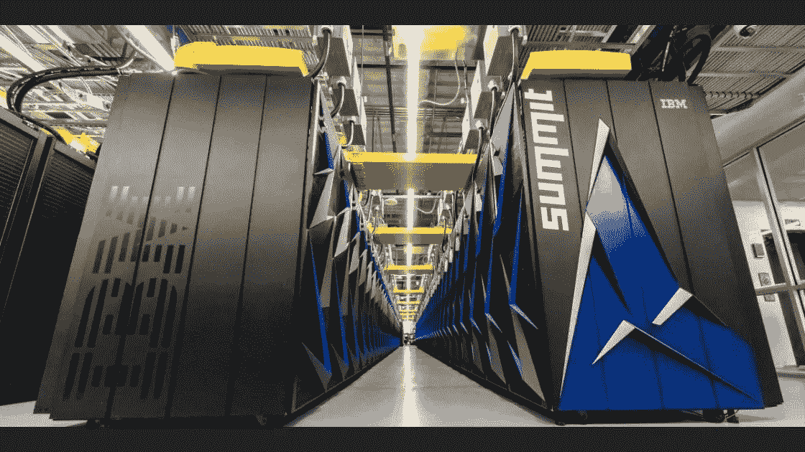

# 超级计算

> 原文：<https://towardsdatascience.com/super-computing-168be247335b?source=collection_archive---------24----------------------->

随着我们文明的进步，对越来越强大的计算机的需求与日俱增。科技进步越来越快。计算能力的提高使这成为可能。超级计算机的功能和计算机一样强大。

# 什么是超级计算机？

超级计算机是高功率和高性能的计算机，用于执行非常特殊的任务，需要大量的计算。这种计算由强大的 CPU 提供，但大部分来自称为 GPU 的特殊处理设备，与 CPU 中的 4、8 或 16 个核心相比，GPU 可能由数千个核心组成。

GPU 是图形处理单元，顾名思义，它们是用来渲染图形和其他图像处理任务的。这需要大量的计算，但是大部分计算可能是重复的。GPU 广泛用于 3D 图形渲染、游戏、模拟等。

GPU 和我们正常的 CPU 有什么不同。他们在核心上是一样的(懂了！)但它们仍然非常不同。CPU 和 GPU 都旨在执行数学计算，但有些任务 GPU 比 CPU 做得更有效。

如果你有一个顺序计算，也就是说，每一步都依赖于前一步，那么 GPU 就不行，你需要一个 CPU。但是，如果你有相互独立或重复的计算，那么 GPU 会做得更好，因为 GPU 只是为了做这些而优化。

GPU 非常适合机器学习任务，因为大多数神经网络架构都是令人尴尬的[并行](https://en.wikipedia.org/wiki/Embarrassingly_parallel)。这意味着它们可以彼此独立运行，最终结果不会受到影响。这是 GPU 肯定能打败 CPU 的一件事。

下面是来自[维基百科](https://en.wikipedia.org/wiki/Graphics_processing_unit)的 GPU 的正式定义:

> 一个**图形处理单元** ( **GPU** )是一个专门的[电子电路](https://en.wikipedia.org/wiki/Electronic_circuit)，设计用于快速操作和改变[存储器](https://en.wikipedia.org/wiki/Memory_(computing))，以加速[帧缓冲器](https://en.wikipedia.org/wiki/Frame_buffer)中[图像](https://en.wikipedia.org/wiki/Image)的创建，用于输出到[显示设备](https://en.wikipedia.org/wiki/Display_device)。GPU 用于[嵌入式系统](https://en.wikipedia.org/wiki/Embedded_system)、[手机](https://en.wikipedia.org/wiki/Mobile_phone)、[个人电脑](https://en.wikipedia.org/wiki/Personal_computer)、[工作站](https://en.wikipedia.org/wiki/Workstation)、[游戏机](https://en.wikipedia.org/wiki/Game_console)。现代图形处理器在处理计算机图形和图像处理方面效率很高。

如果您曾经玩过高端游戏或执行过任何计算密集型任务，如运行繁重的软件，您可能会注意到您的系统变热，并且您会听到风扇的声音变快，但为什么会这样呢？

当处理器进行计算时，它需要能量，这种能量可能会以热量的形式消耗掉，我们需要移除这些热量，否则它会损坏我们的处理器。为此，我们需要风扇和/或散热器来散热。一些游戏电脑更进一步，还包括水/油冷却系统，在冷却处理器方面效率更高。

这个问题在超级计算机上更加突出。超级计算机需要大量的能量，因此会消耗大量的热量。为了冷却这种热度，我们需要做大量的安排，这使得安装超级计算机相当困难和昂贵。

# 他们能做什么？

但是，当我们可以在 1000 美元的机器上同样良好地浏览时，我们为什么要使用超级计算机呢？答案很简单——它们不适合日常使用。它们的主要目的是执行我们的普通计算机甚至大型计算机组无法执行的计算。

超级计算机最重要的用途之一是为事物提供模拟模型，如根据天气数据进行天气预测或模拟药物、分子等。更多地了解它们的内部结构。

在计算机环境中，模拟可以被认为是真实世界的数学模型。但是模拟的理解和定义要复杂得多。如此复杂，以至于有些人甚至无法区分模拟和现实，因为这两个术语似乎都没有非常明确的定义。因此，许多人认为我们可能生活在一个模拟世界中，很可能是由某个高级文明所运行的。一些人还认为，如果有足够的计算能力，你可以模拟整个宇宙。

模拟非常有用，因为我们可以在模拟中做一些在现实生活中可能做不到的事情，比如改变一些条件/变量，并测量它们的影响。例如，爱德华·洛伦茨发现，即使是自然条件的微小变化也可能对天气产生巨大影响。这种现象被称为蝴蝶效应。他的理论为“[混沌理论](https://en.wikipedia.org/wiki/Chaos_theory)奠定了基础。

模拟分子需要大量的计算能力，因为粒子之间的相互作用数量巨大，数学建模相当费力。但是，如果我们能做到这一点，我们应该能够模拟分子的组合，并找出它们是否对某些疾病有效。这可以彻底改变医疗行业和药物的生产方式。尽管超级计算机功能强大，但这仍然是不可能的。我们需要被称为[量子计算机](https://khansaadbinhasan.github.io/Understanding-Quantum-Computers/)的不同种类的计算机来做这件事。

我们还可以使用超级计算机进行流体模拟，模拟宇宙中的一些事件，或者根据从遥远的星系获得的数据重建一幅可能发生的画面。

超级计算机今天被广泛应用，如模拟量子计算机以检查量子计算机给出的答案是否正确，预测地震，[模拟黑洞，](https://phys.org/news/2019-06-most-detailed-ever-simulations-black-hole-longstanding.html)模拟蛋白质折叠，[模拟人脑](https://www.scientificamerican.com/article/a-new-supercomputer-is-the-worlds-fastest-brain-mimicking-machine/)等。

# 这场比赛

但是，我们如何比较哪台超级计算机更好，即哪台具有更高的计算能力？为了测量超级计算机的能力，我们使用 [FLOPS](https://en.wikipedia.org/wiki/FLOPS) 或每秒浮点运算。

例如，现代超级计算机的性能是以 petaflops 来衡量的，我们普通的计算机可以执行 gigaflops。超级计算机在 80 年代也是这个速度。因此，超级计算机不是用绝对术语定义的，而是用相对术语定义的，即当时最强大的计算机。

计算能力越来越成为权力的象征。例如，挖掘比特币等加密货币需要巨大的计算能力。如果你有这种能力，你可能什么都不做就能赚几百万。如果有足够的计算能力，你也许能够破解加密或者攻击另一个国家的军队。因此，计算能力在现实世界中变得越来越强大，谁拥有大量的计算能力，谁就一定有优势。

这导致各国建造自己的越来越强大的超级计算机(当然是为了有用的目的)，人们不断比较它们，看看哪个国家在这场竞赛中领先。Top500 是一个列出并排列世界上 500 个最强大的非分布式计算机系统的项目。

超级计算机也可能表明一个国家实力的增强。例如，在 2005 年，中国没有超级计算机进入 500 强，但今天他们有一些最快的超级计算机，不仅如此，他们有 200 多台超级计算机进入 500 强，这也是任何国家拥有的最高水平。

# 摘要

计算机从机械计算器到机电设备再到我们今天知道的电子计算机的发展方式令我着迷。这些不可思议的机器背后的进化和丰富的历史令人着迷，并促使我们相信看似未来和不可能的事情可能是可能的。超级计算机是计算机能力的一个极端例子。

在这篇博客中，我们深入研究了超级计算机。我们看了超级计算机的构建模块，GPU 以及超级计算机可以用来做什么，特别是模拟。然后，我们看到了如何进行一场竞赛，以积聚尽可能多的计算能力。

计算的未来看起来令人兴奋，不同种类的材料，从水到碳到用于计算的 DNA，以及应用于计算的各种方法，如量子力学的使用。不同研究和计算分支的结合似乎为各种令人兴奋的应用铺平了道路。