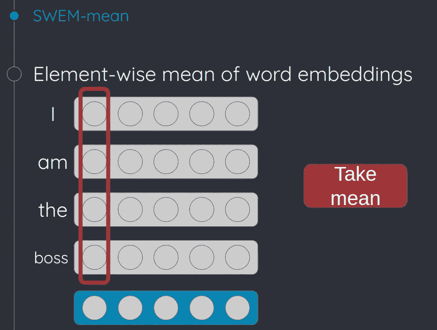

# 使用 Python 中的 fastText 实现句子嵌入的超级简单的方法

> 原文：<https://towardsdatascience.com/super-easy-way-to-get-sentence-embedding-using-fasttext-in-python-a70f34ac5b7c?source=collection_archive---------15----------------------->

Photo by [Patrick Tomasso](https://unsplash.com/@impatrickt?utm_source=medium&utm_medium=referral) on [Unsplash](https://unsplash.com?utm_source=medium&utm_medium=referral)

通过 [tofunlp/sister](https://github.com/tofunlp/sister) 获得单词嵌入的超级简单的方法。

当您在使用包含一些 NLP 技术的应用程序时，通常会希望文本数据中嵌入单词。这样你就可以做各种各样的事情，比如计算句子的距离，分类或者很酷的可视化。

但是下载预先训练好的单词嵌入(例如， [word2vec](https://code.google.com/archive/p/word2vec/) ， [fastText](https://github.com/facebookresearch/fastText/blob/master/docs/pretrained-vectors.md) )并以某种方式加载它们通常需要一些时间。而且这些过程不是很有趣(至少对我来说)，也不容易管理和保持这些代码的整洁。

所以在本文中，我要介绍一个小 python 库，命名为[姐姐(简单句嵌入器)](https://github.com/tofunlp/sister)。(是的，我喜欢给我的项目取奇怪的名字)。这个 pip 可安装的库允许你做两件事，1)下载预先训练的单词嵌入，2)提供一个简单的界面来使用它嵌入你的文本。作为一个额外的功能，因为我写这个库是为了易于扩展，所以支持新的语言或算法来嵌入文本应该是简单和容易的。

现在，让我告诉你它有多容易使用。只需 4 行代码就可以完成。

看到了吗？非常容易。

你不需要做任何下载或构建，当你第一次使用 *MeanEmbedding* 时，它会自动下载预先训练好的[Facebook research/fast text](https://github.com/facebookresearch/fastText)vector。

目前，该库仅支持英语和日语。不过，由于实现是可扩展的，只需在这里的给预先训练好的向量[添加 URL，就可以轻松添加自己喜欢的语言。或者您可以为请求创建一个问题，以便我可以添加它。](https://github.com/tofunlp/sister/blob/master/sister/word_embedders.py#L10)

下面展示了 *MeanEmbedding* 创建句子向量的方式，这是一个非常简单但也非常有效的方法(参考:[我最喜欢的论文之一](https://arxiv.org/abs/1805.09843))。

How it gets sentence vector from sequence of words.

正如您在上图中看到的，它首先将所有给定的单词转换成单词嵌入，然后获取它们在元素方面的含义。因此，句子向量的大小与每个单词嵌入的大小相同(在前面的示例代码中为 300-dim)。

在本文中，我们介绍了如何使用单词嵌入来获得句子嵌入。希望你喜欢，自己嵌入一堆句子！