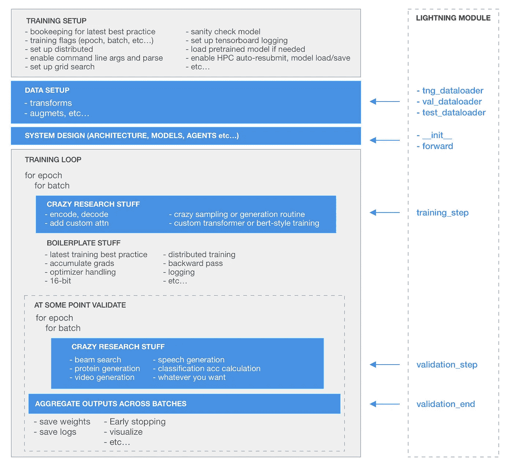

# Pytorch 闪电的 36 种方式可以增强你的人工智能研究

> 原文：<https://towardsdatascience.com/supercharge-your-ai-research-with-pytorch-lightning-337948a99eec?source=collection_archive---------14----------------------->


Come at me AGI

AGI 不会自己解决问题(在内心深处你知道我们是另一个人工智能的 AGI🤯).

但是让我们假设它做到了…

想象一下，翻开你的笔记本电脑，你会发现一个为你编写的这样的算法。

```
def AGI(data):
    data = clean(data)
    agi = magic(data)
    return agi
```

嗯好的🤔。让我们看看这是怎么回事。你说服你的研究小组你需要对此进行一些试验。

但是 obvs 这不会像写的那样运行。首先，我们需要一个训练循环:

```
for epoch in range(10):
    for batch in data:
        agi = AGI(batch)
        agi.backward()
        ...
```

好了，现在我们算是训练了。但是我们仍然需要添加一个验证循环…

```
def validate(dataset):
   # more magic
```

毒品。但是 LOL AGI 在一个 CPU 上？

你想得美。

让我们在多个 GPU 上运行这个…但是等等，你也已经[读到过](/9-tips-for-training-lightning-fast-neural-networks-in-pytorch-8e63a502f565)16 位可以加速你的训练。天哪，但是有 3 种方法可以进行 GPU 分布式训练。

所以你花了一周的时间编写代码。但是仍然很慢，所以您决定使用计算集群。现在事情变得有点复杂了。


Sad times

与此同时，你的 AGI 有一个 bug，但你不确定这是你的 GPU 分配代码，还是你如何加载你的数据，或者其他任何你可能编码错误的事情。

你决定你不太想处理所有的训练细节，你尝试 Keras，但是它不能让你很好地实现 AGI 函数，因为你需要对训练有更多的控制。Fast.ai 也是不可能的，因为这不是现成的算法。

好吧，那太糟糕了，现在你已经自己编码了…

没有。

# Pytorch 闪电


How you feel when running a single model on 200 GPUs

[Pytorch Lightning](https://github.com/williamFalcon/pytorch-lightning) 已经为你编写了所有这些代码，包括[测试](https://travis-ci.org/williamFalcon/pytorch-lightning)到**保证**程序的那部分没有错误。

这意味着你可以专注于研究的核心，而不必担心所有繁琐的工程细节，如果你不必专注于核心研究理念，处理这些细节会很有趣。

这里有一个清晰的图表，显示了什么是自动化的。灰色部分是自动化的，通过教练旗控制。你可以使用你想要的任何底层模型(你自己的、预训练的东西、fast.ai 架构等等)，将蓝色部分定义为你想要的任意复杂。



You own the blue. Lightning owns the rest.

# 闪电模型

Lightning 的核心是两件事，一个 LightningModel，一个 Trainer。LightningModel 是你 90%的时间花在这里的地方。

Lightning Module Template

请注意，您正在定义培训循环中发生的事情

```
for epoch in range(10):
    for batch in data:
      # training_step above is what happens here
      # lightning handles the rest (backward, gradient clip, etc...)
```

验证也是一样

```
for val_batch in data:
    # validation_step above is what happens here
    # with no grad, eval, etc... all handled for you automatically
```

上面这两个函数会变得非常复杂。事实上，您可以在这两个函数中定义一个完整的 transformer，seq-2-seq，fairseq 模型。

# **培训师**


培训师处理您不想编码的东西的所有核心逻辑，但是您需要保证它被正确地完成并且使用最新的最佳实践。

只需设置几个标志，你就可以在 CPU、[多 GPU](https://williamfalcon.github.io/pytorch-lightning/Trainer/Distributed%20training/#Multi-GPU)或[多节点](https://williamfalcon.github.io/pytorch-lightning/Trainer/Distributed%20training/#Multi-node)集群上训练你的 AGI。不仅如此，您还可以启用[渐变裁剪](https://williamfalcon.github.io/pytorch-lightning/Trainer/Training%20Loop/#gradient-clipping)、[累积渐变](https://williamfalcon.github.io/pytorch-lightning/Trainer/Training%20Loop/#accumulated-gradients)、 [16 位精度](https://williamfalcon.github.io/pytorch-lightning/Trainer/Distributed%20training/#16-bit-mixed-precision)、[自动聚类保存](https://williamfalcon.github.io/pytorch-lightning/Trainer/Distributed%20training/#Multi-node)、[超参数快照](https://williamfalcon.github.io/pytorch-lightning/Trainer/Logging/#save-a-snapshot-of-all-hyperparameters)、[张量板可视化](https://williamfalcon.github.io/pytorch-lightning/Trainer/Logging/#tensorboard-support)等

你明白了。

你不仅可以获得训练人工智能系统的最新和最棒的技巧，还可以保证它们能够正常工作并且经过正确的测试。

这意味着你只需要担心你的部分——新算法——是否正确。如何加载数据以及在培训的核心部分做些什么由你决定。

那么，Pytorch 闪电的 36 种帮助方式呢？大约有 36 个你通常自己实现的东西可能会有 bug。Lightning 会做并测试它，所以您不必这样做！

点击这里查看完整列表

恭喜你。你可以利用刚刚回来的所有空闲时间来完成你正在做的兼职项目(可能是你小狗的聊天机器人，或者是优步的瑜伽裤)。

