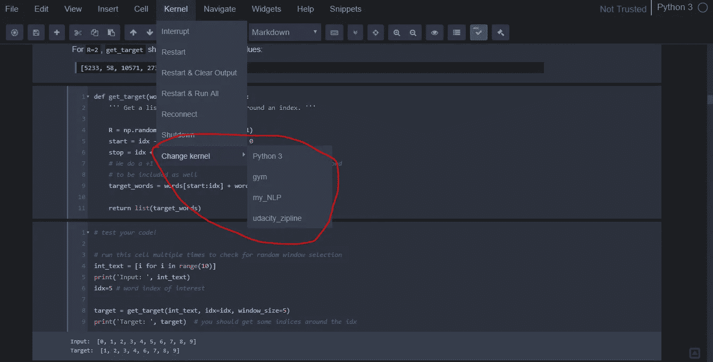
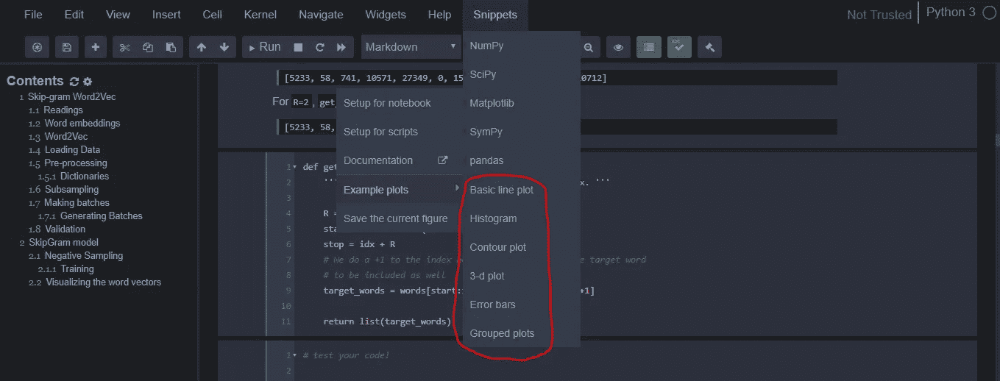
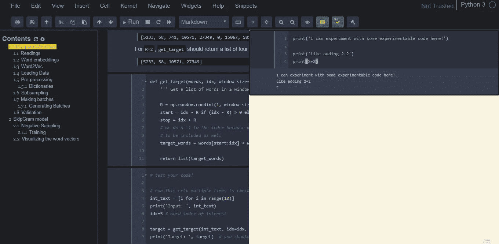

# 超级 Jupyter 笔记本

> 原文：<https://towardsdatascience.com/supercharging-jupyter-notebooks-e22f5ad7ca18?source=collection_archive---------8----------------------->

Jupyter 笔记本目前是全世界 Pythonistas 最热门的编程环境，尤其是那些对机器学习和数据科学感兴趣的人。几个月前，当我开始认真研究机器学习时，我发现了 Jupyter 笔记本。最初，我只是惊讶，喜欢我的浏览器里面的一切。然而，我很快就失望了，发现 stock Jupyter 笔记本界面非常简单，缺少几个有用的功能。那时，我决定去寻找一些 Jupyter 笔记本电脑黑客。

在这篇文章中，我介绍了几个 jupyter 笔记本插件/扩展和几个 Jupyter 命令，它们将增强您的 Jupyter 笔记本并提高您的工作效率。简而言之，*为你的* Jupyter 笔记本充能。

一旦您按照下面的说明操作，您的 Jupyter 笔记本将拥有以下出色的功能(如果您愿意，还可以有更多功能):

1.  能够*在多个 Conda 环境*之间动态切换，无需重启 Jupyter 笔记本。
2.  1-click 可点击*目录*代(你会喜欢这个的！)
3.  一个超级有用的弹出*便笺本*(我最喜欢的功能！)，您可以在那里试验和测试您的代码，而无需更改主笔记本中的任何内容。
4.  *代码单元内的代码折叠*。我想知道为什么 Jupyter 笔记本没有这个功能。
5.  1-click *代码单元格隐藏*，这是您通过可视化讲述数据故事时的一个重要功能…人们通常对你的图表感兴趣，而不是代码！
6.  一个超级酷的*变量检查员！*
7.  用于降价单元格的*拼写检查器*。
8.  那些深夜的编码会议。
9.  一个*代码片段*菜单，用于添加常用的 python 构造，比如动态的*列表理解*。
10.  最后，绝对最棒的功能， ***舒缓美丽的午夜蓝配色拯救你的眼睛*** ！

# 是时候充能了！

首先，我们将确保我们的笔记本有一个很好的黑色主题，可以舒缓眼睛。如果你每天长时间工作，白色的背景会让你的眼睛出血。无论如何，*一旦你陷入黑暗，你就再也无法切换回来😉*

使用以下命令安装黑暗主题，

```
# Kill and exit the Notebook server
# Make sure you are in the base conda environment
conda activate base# install jupyterthemes
pip install jupyterthemes# upgrade to latest version
pip install --upgrade jupyterthemes
```

一旦软件包被安装和升级，运行下面的命令，把你的股票白色主题 Jupyter 笔记本变成可爱的*深蓝色午夜主题*。你的眼睛会因此爱上你的。

```
# Enable Dark Mode
jt -t onedork -fs 95 -altp -tfs 11 -nfs 115 -cellw 88% -T
```

接下来，让我们看看是否可以将在 Anaconda 中创建的所有自定义环境作为内核添加到 Jupyter 笔记本中。这将确保我们可以通过简单地在*内核*菜单中选择它们来切换环境。切换内核时无需重启笔记本。

假设您已经在 Anaconda 中创建了两个定制环境， *my_NLP，*和 *gym* 。要将这些添加到您的 Jupyter 笔记本中，请按照以下步骤操作，

```
# Stop and exit your Jupyter Notebook server first
# Activate your environment in the terminal 
conda activate my_NLP
# Install the IPython Kernel 
pip install ipykernel
# Link your environment with Jupyter 
python -m ipykernel install --user --name=my_NLP# Repeat steps for the other environment, gym. 
conda activate gym
pip install ipykernel 
python -m ipykernel install --user --name=gym
```

现在打开你的 Jupyter 笔记本，进入*内核*菜单中的*改变内核*选项，然后…嘣！你应该可以看到所有的内核都列在那里，你现在可以通过点击它们来激活它们。



This is where the newly added Kernels should show up. Notice the soothing midnight blue theme.

对于我上面提到的所有其他酷功能，我们需要安装一个叫做[nb extensions for Jupyter Notebooks](https://jupyter-contrib-nbextensions.readthedocs.io/en/latest/install.html)的东西。安装 nbextensions 很容易，只需按照以下步骤操作，

```
# Stop and exit your Jupyter Notebook server 
# Make sure you are in the base environment
conda activate base# Install the nbextensions 
pip install jupyter_contrib_nbextensions
# Install the necessary JS and CSS files 
jupyter contrib nbextension install --system
```

启动 Jupyter 笔记本服务器，您应该会在开始页面看到第四个选项，名为 *Nbextensions* 。点击它，查看您一直想要的 Jupyter 笔记本电脑的强大功能。


The Nbextensions tab!

正如你在上面看到的，扩展列表非常庞大，甚至乍一看有点吓人。不是所有的都有用，这里是我用的一些，

1.  *目录(2) —* 只需点击一下鼠标，即可为整个笔记本生成一个*目录*，其中包含指向各个部分的超链接。
2.  *Scratchpad —* 在我看来绝对是最好的扩展。一个单独的空间，让你在不干扰笔记本其他部分的情况下试验代码。
3.  代码折叠— 这里不需要任何解释。
4.  *隐藏所有输入—* 隐藏所有代码单元格，同时保持输出和降价单元格可见。如果你试图向非技术人员解释你的结果，这是一个非常有用的功能。
5.  *变量检查器—* 将您从调试中解救出来，类似于 Spyder IDE 中的变量检查器窗口。
6.  *拼写检查器—* 对减价单元格中的内容进行拼写检查。
7.  *Zenmode —* 去除屏幕上多余的杂乱，这样你就可以专注于重要的东西，即代码。
8.  *代码片段菜单—* 一个很酷的常用代码片段的集合，从列表理解到熊猫以及任何介于两者之间的东西。最棒的部分？您可以修改小部件并添加您的自定义片段。

上面的列表包含了我最常用的扩展，但是我们鼓励您尝试其他的扩展。有意思的有 *ScrollDown、**table _ beautiier、腹地。*



The Snippets extension in action along with the Table of Contents generation extension at work.



The Scratchpad extension

请告诉我您对 Jupyter 笔记本电脑的这些增强功能有何看法。如果您在安装扩展时遇到任何错误，请随时发表评论。

**编辑:**

1.  如果您的系统上没有安装 Anaconda，只需忽略包含 *conda* 的命令。此外，忽略我们讨论将 Anaconda 环境添加到 Jupyter 笔记本的部分。
2.  您可能需要管理员权限才能在您的系统上安装所有这些扩展。
3.  如果你不喜欢笔记本上的午夜蓝主题，只需在终端中执行 ***jt -r*** 即可将一切恢复正常。你将不得不重启你的 Jupyter 笔记本，你也可能不得不清除你的浏览器缓存，以防重启后你仍然看到午夜蓝主题。