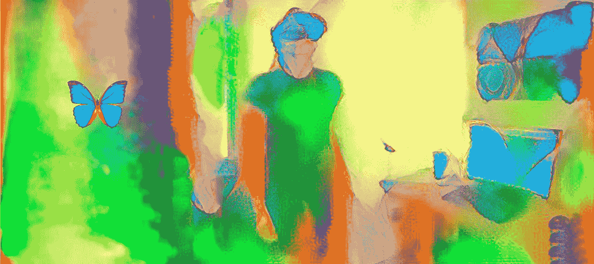
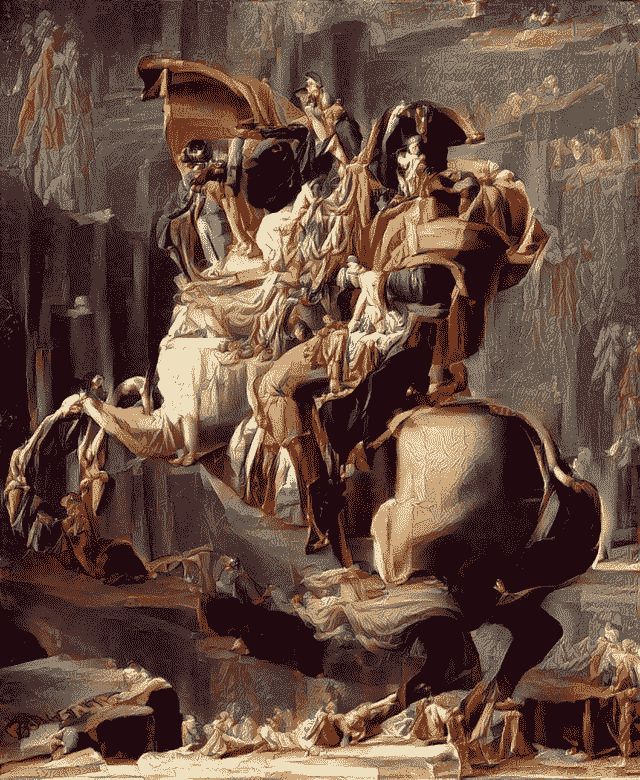
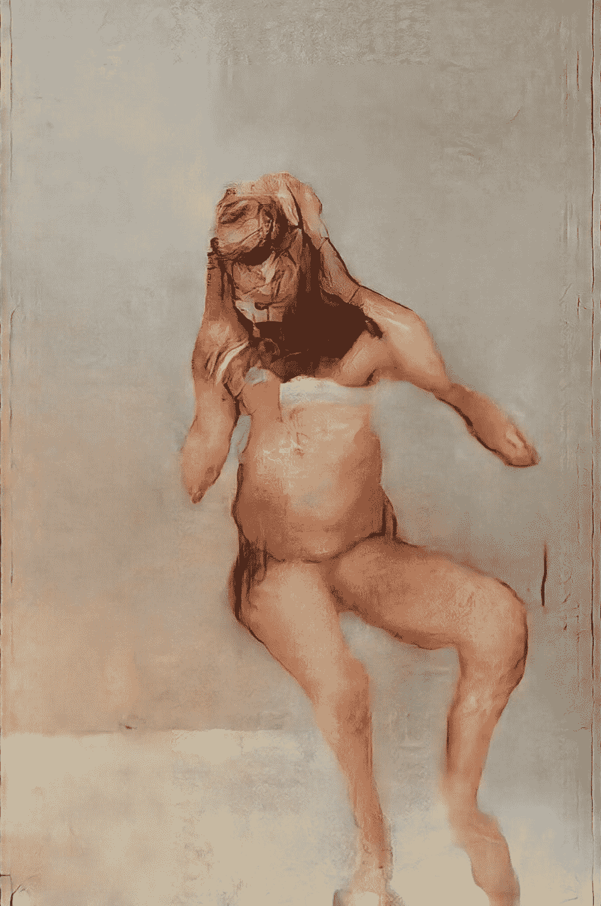
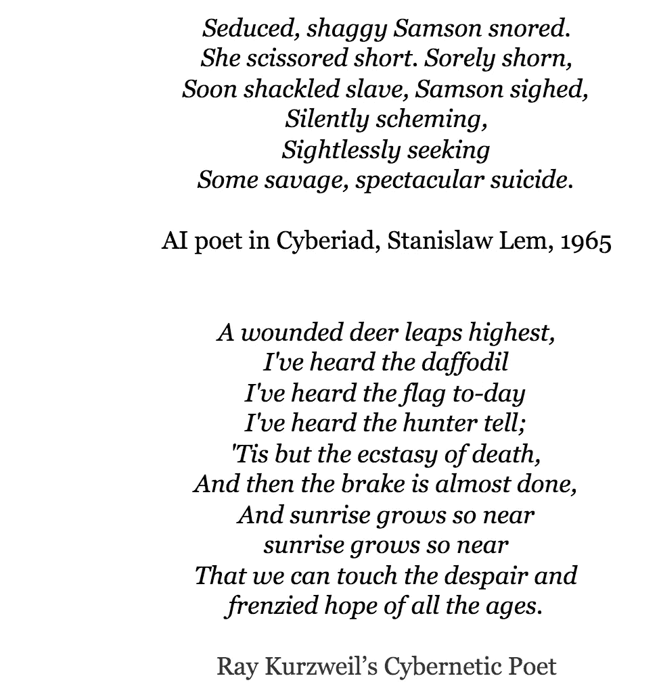
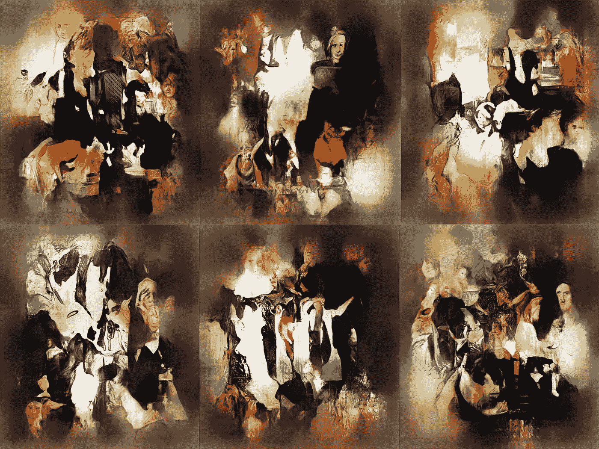
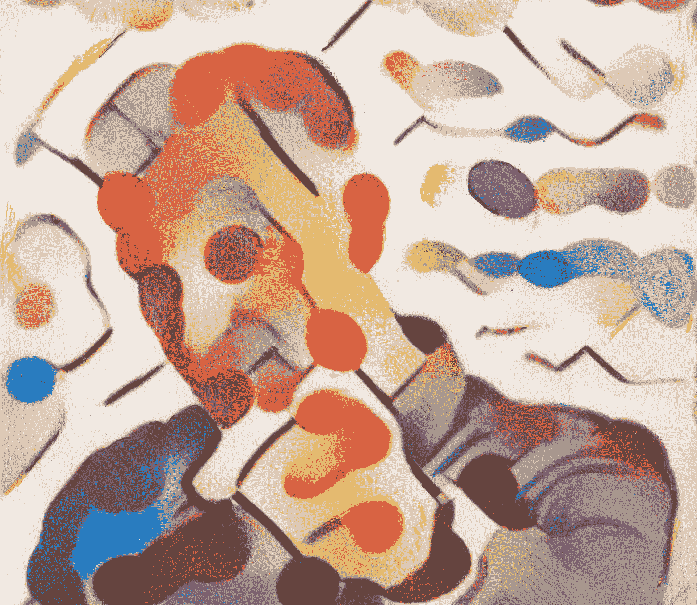
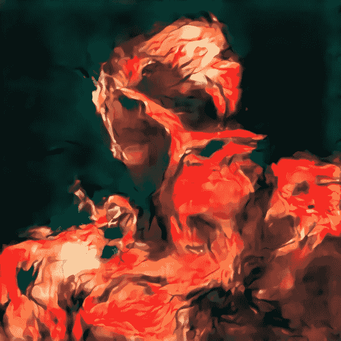
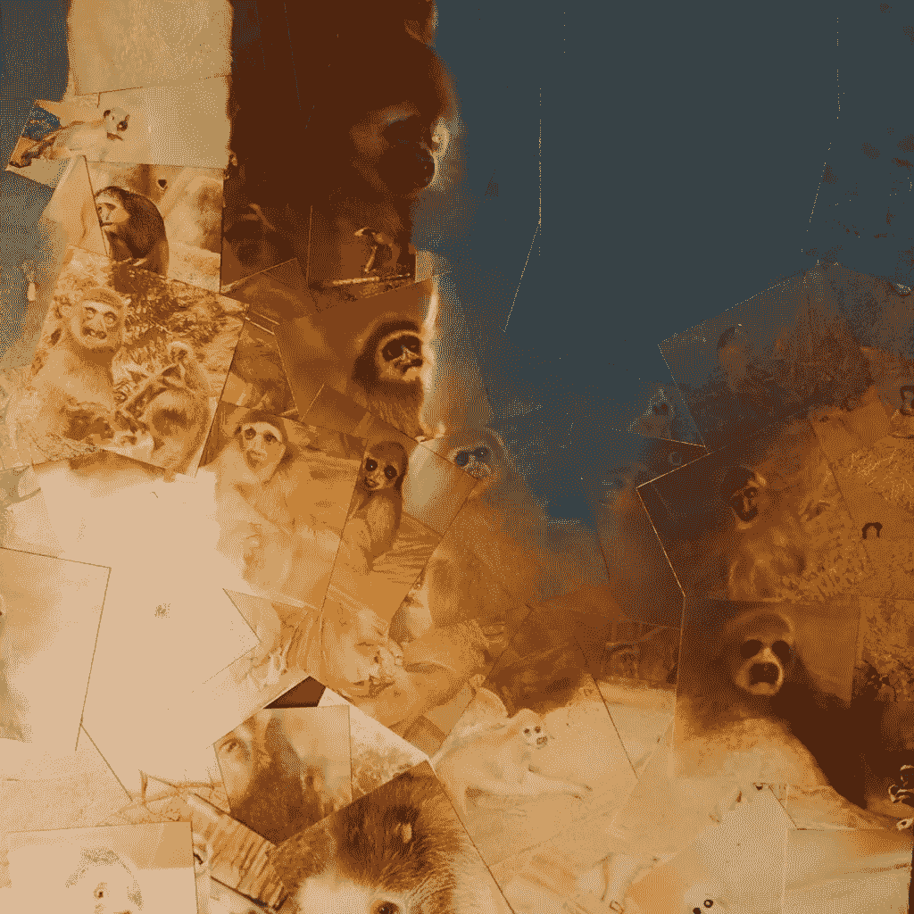
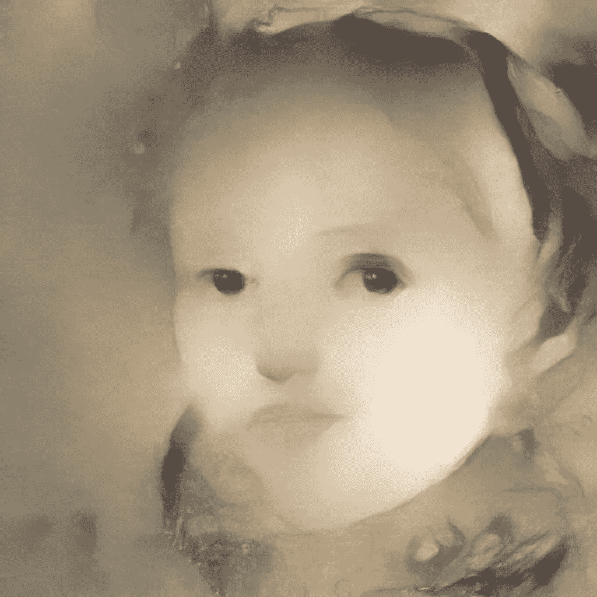

# 超创造力

> 原文：<https://towardsdatascience.com/supercreativity-b4114ebd0357?source=collection_archive---------7----------------------->

Opal Butterfly VR, courtesy of [Pamela Davis Kivelson](https://www.neur-on.com/)

## 人工智能可能很快会超越人类的艺术创造力

[**塞拉菲姆**](https://www.linkedin.com/in/serafim-batzoglou-89a148/) **和** [**塞奥多罗斯**](https://www.linkedin.com/in/theodoros-evgeniou-5397b/)

**总结。我们对艺术的体验——绘画、音乐、雕塑、诗歌——触及多种感官、联想、记忆和情感，并涉及人们可能称之为意识的部分。今天的人工智能(AI)缺乏主观经验和多模态，但开始获得艺术创造力。创造力需要意识体验的能力吗？我们断言答案是否定的。专业化的人工智能可能很快就会变得比人类更具创造力，更擅长捕捉和表现集体经验，因为多模态、监督学习和与人类的合作将显著增强今天的创意机器人。许多艺术是关于识别和操纵复杂的感觉模式和联想，这是人工智能擅长的任务；因此，超创造力——远远超过人类能力的创造性过程和结果——可能就在眼前。**

> “哦，这是毫无疑问的。是的，是的，一百万次是的。[创意简单](https://www.computerhistory.org/atchm/algorithmic-music-david-cope-and-emi/)；意识，智力，那些都很难。”大卫·柯普

AI generated work based on [Napoleon Crossing the Alps](https://en.wikipedia.org/wiki/Napoleon_Crossing_the_Alps). By [u/vic8760](https://www.reddit.com/user/vic8760/) in [Reddit](https://www.reddit.com/r/pics/comments/5ptygn/working_with_ai_ive_created_this_art_by_accident/).

我们对艺术的体验包含多种感官、联想、记忆和情感。它利用了有意识和无意识的过程。想象一下听你最喜欢的音乐:每一个旋律主题、和声延续和节奏都与不同的情绪有微妙的联系，如兴奋、宁静、怀旧、嬉戏等等。音乐激发的图像、场景或思想流在你的脑海中跳跃。与历史事件和文化参考的关系可能跃入脑海。音乐具有很强的暗示性，并能改变伴随体验的情感诠释。电影制作人很清楚这一点，并使用合适的配乐来操纵你对每个场景的情绪反应。同样，绘画、雕塑、故事和诗歌会引发情感、记忆和其他感官联想。公平地说，不能引发多感官情感体验和丰富联想的艺术不是好艺术。

尚不清楚的是，人类水平的体验艺术的能力在多大程度上需要创造艺术。尽管缺乏像人类一样体验艺术和现实的能力，人工智能能创造出与人类作曲家或画家一样的艺术吗？越来越多的经验证据，特别是在绘画和音乐领域，表明*艺术创造力可能不需要主观经验的能力*，而是可以通过人工智能从人类创造的艺术和反馈中学习。我们相信，随着人工智能在模式和关联学习方面变得更好，随着它从人们那里获得更多反馈，它将创造出能够引发越来越丰富的多感官和情感*人类* *体验*日益复杂的关联的艺术:也就是说，越来越好的艺术，可能超越人类创造的艺术。

> *艺术创意可能不需要主观经验的能力*

[科技一直使人类的创造力得以发挥](https://en.wikipedia.org/wiki/Timeline_for_invention_in_the_arts):将史前洞穴中用原始工具制作的画与几个世纪后用画笔和丰富色彩制作的画进行比较，或者考虑钢琴的发明或电影的发展，被称为“第七艺术”。人类和机器之间的合作即将成为艺术领域的下一次技术飞跃，并创造出我们从未体验过的艺术品。

# 人工智能与今日艺术

深度学习的应用已经产生了不可否认的艺术质量的绘画，要么是模仿人类画家的风格——通过卷积神经网络的[风格转移](https://medium.com/tensorflow/neural-style-transfer-creating-art-with-deep-learning-using-tf-keras-and-eager-execution-7d541ac31398)将与大师风格相关的模式编码为低级笔触，一直到空间感知和构图——要么是原创作品——其中[生成对抗网络(GANs)](https://www.kdnuggets.com/2018/10/ai-art.html/2) 生成写实绘画，如肖像或[抽象裸体](https://www.kdnuggets.com/2018/10/ai-art.html/2)。第一幅被拍卖的人工智能画作，使用最初由 19 岁的斯坦福大学研究员 Robbie Barrat 在佳士得拍出了 432，500 美元。Barrat 和 [Mario Klingemann](https://twitter.com/quasimondo) 这样的艺术家仍然做出大多数创造性的选择，如策展输入、训练人工智能和选择最佳结果艺术。然而，基于人工智能的艺术往往很难与人类艺术区分开来，越来越独立的人工智能画家可能即将出现。

The Butcher’s Son, winner of the [Lumen Prize, 2018](https://lumenprize.com/artwork/the-butchers-son/), [Mario Klingemann](https://twitter.com/quasimondo)

在音乐方面，作曲家、UCSC 大学音乐教授大卫·柯普的开创性工作远远早于现代深度学习。自 1981 年以来，Cope 一直致力于在算法中提取音乐作品的精髓，这些算法被输入给特定作曲家的音乐，解构它，识别模式，并在相同风格的新作品中重新组合这些模式。他的第一个重大成功是《艾美奖》(EMI，音乐智力实验，如尤瓦尔·赫拉利的《德乌斯人》中所讨论的)产生了巴赫、[、维瓦尔第](https://www.youtube.com/watch?v=lxLmXPbbZqc)、[肖邦](https://www.youtube.com/watch?v=t6WeiyvAiYQ)等风格的令人信服的音乐，而[早在 1997 年就愚弄了现场观众](https://www.nytimes.com/1997/11/11/science/undiscovered-bach-no-a-computer-wrote-it.html)。最近，索尼的流动机器产生了高度可听的歌曲(例如，听听[爸爸的车](https://www.youtube.com/watch?v=cTP0Sr_ehmY)、[影子先生](https://www.youtube.com/watch?v=lcGYEXJqun8)或[一个 Mon Sujet](https://www.youtube.com/watch?v=9uTIyJ8vDRM)——你能说出它们是由人工智能产生的吗？)，而初创公司 [Aiva](https://www.aiva.ai/) 和 [Amper](https://www.ampermusic.com/#score) 开发深度学习方法来按需生成音乐，并可能很快实现[个性化音乐](https://www.youtube.com/watch?v=wYb3Wimn01s)。在不久的将来，即使人类音乐家围绕某些歌词创作主要的音乐主题和歌曲进展，伴奏的整个配器和创作也是一个充满挑战和艰巨的过程，很可能由 AI 接管。随着我们学习如何更好地设计这种人机合作，我们可能会提高人类和人工智能的创造力。

即使没有人类的经验，诗歌也是可能的:已经出现了产生巧妙俳句的机器人，因为诗歌的质量部分来自语言的美和节奏——这可能是可以学习的——部分来自读者赋予它的意义，[诗歌机器人早在 2010 年就已经愚弄了文学期刊](https://medium.com/@Yisela/computer-generated-poetry-will-knock-your-socks-off-763c815a1b52)。如果你认为你能从机器人诗歌中分辨出人类，欢迎你在[机器人或](http://botpoet.com/vote/nude-descending-lift-shaft/)中挑战自己。

除了音乐、绘画和诗歌，人工智能在许多其他艺术形式和创造性任务中的应用以及用于产生艺术的人工智能工具开始出现。[麻省理工学院的一个创新团队](https://howtogeneratealmostanything.com/index.html)将展示人类和人工智能之间的合作可以产生新的艺术和手工艺[人类独自无法想象](https://medium.com/@howtogeneratealmostanything/how-to-generate-almost-anything-2161f29578b4):音乐、产品和产品设计、时尚、香水、巧克力松露、珠宝、鸡尾酒和戏剧。斯坦福大学讲师兼沃尔沃集团驻校艺术家 [Pamela Davis Kivelson](https://www.neur-on.com/) 创新性地将包括摄影、人工智能风格转移绘画、[肖像视频](https://www.neur-on.com/copy-of-ai-artwork)甚至人工智能诗歌在内的艺术形式与硅谷正在开展的活动的技术主题相结合。她说，“*人工智能艺术让我能够[[……]]创造一种基于 NLI 或‘非线性身份’的新颖视觉语言。[[……]]一个物理学家实际上可以被描述成费米液体中的一组电子，或者是量子隧道，或者是一个量子比特。我想重新设想这幅画像——挑战我们集体的无意识偏见和推论。这些隐藏的偏见影响着我们的行为。*

# 通往超级创造力的道路

在斯坦尼斯拉夫·莱姆(Stanislav Lem)1965 年的科幻小说《赛博亚》(Cyberiad)中，“构造者”特鲁尔(Trurl)着手开发一台诗歌机器，并意识到诗人的心灵包含了诗人文明和文化的所有经验。为了将所有这些编程到机器中，Trurl 建造了一台超级计算机，可以模拟整个宇宙的进化，一直到诗人的出生和文化教养。他由此产生的人工智能诗人是天才；人类诗人首先不理会它，但最终却因为失去了生活的主要目标而集体自杀。Trurl 的人工创造的工程化道路有些不切实际；新兴的实践路径避开而不是复制人类的创造过程。

那么，假设人工通用智能还在遥远的未来，专业化的 AI 能变得有多有创造力呢？沿着三条尚未探索的道路，专业人工智能还有很大的改进空间:训练、多模态和人-人工智能合作。

“We made our own artificial intelligence art and so can you”, WIRED magazine, Tom Simonite

**持续的反馈和培训。迄今为止，人工智能在绘画和音乐方面的进步还没有利用太多的人类反馈。相比之下，作为一个人类艺术家体验艺术，她是一个即时的——尽管有偏见的——对其作品的批评家。机器可能没有自己的主观经验来指导它们，但它们可以通过人类生成的训练数据和反馈来利用人类的经验——例如，随着乐谱或绘画草图的进展，通过评级或点击“心”(以[潜望镜](https://www.periscope.tv/)的风格)。来自许多艺术家——或艺术评论家，或普通大众——的反馈可能比*一位*艺术家的主观体验更好。此外，这样的反馈过程可能会产生新的艺术风格、社区和前卫作品。**

多模态和联想学习。当我们听自己喜欢的音乐或沉浸在一幅画中时，我们经历的是复杂的多模态感觉和联想，这将我们提升到一个由图像、记忆、解释、分析思维、历史和文化联系以及感官运动体验组成的精神世界，我们将这些都归功于最高形式的艺术。

> *“画是看到的而不是感受到的诗，诗是感受到的而不是看到的画。”*达芬奇

人工智能能创造出具有“[规模和亲密度、增强的[…]色彩和感官客观性](https://www.theguardian.com/music/tomserviceblog/2013/feb/11/contemporary-music-guide-toru-takemitsu)”的音乐吗？它能像音乐家、画家、雕塑家、歌词作者、诗人和作家[莱拉·奥尔巴赫](https://www.gramophone.co.uk/feature/contemporary-composer-lera-auerbach)一样，以相互影响的方式创作音乐、绘画、诗歌和文学吗？我们如何教授人工智能协会跨越形态，艺术形式，事件和社会趋势？

大量的训练数据已经存在:有配乐的电影、有歌词的歌曲、绘画评论、音乐专辑、电影和表演。作为补充，众包活动可以设计成大规模的多模态关联标签。看书时挑选音轨，听音乐时浏览 wordnets，选择与给定曲调最匹配的图像，听音乐或观看绘画时回忆事件，将当前或过去的事件或新闻文章与特定的艺术作品相链接。由此产生的概念网络可以是高度个性化的，并且*反映了具有重要历史价值的文化和世代关联*——很像艺术家的作品。这种网络还将具有巨大的商业价值——例如，音乐制作人可以根据流行的网飞系列开发音乐，产品设计师可以根据热门趋势和文化开发创新。

通过大规模训练和多模态关联地图，人工智能还可以学会准确预测人类对艺术的感官和情感反应，并在创造音乐、绘画、诗歌和多模态体验的沉浸式作品方面远远超过人类的能力。

Study of Quantum Materials, artist [Pamela Davis Kivelson](https://www.neur-on.com/); scientific imagery courtesy of [Robert Cava](https://en.wikipedia.org/wiki/Robert_Cava)

**人机协作。当部署大规模培训和多模态联想学习时，迄今为止在人-AI 艺术合作方面的开创性工作将得到扩展。众包音乐可能涉及艺术家创作一个基本曲调，人工智能根据在线反馈对其进行改进和编排。同时，学习的多模态地图可以*通过艺术形式和体验*被例如推荐伴随图像的人遍历，并且这些图像反过来影响乐谱的发展。类似的反馈回路可以让人们与几乎任何艺术形式的人工智能进行合作——甚至是文学，因为人工智能正在迅速获得产生类似人类文本的能力。**

人类和机器之间的新协作流程有望催化新人工智能能力的发展，并最终促进人类和机器的创造力。Kivelson 设想了一个未来，在这个未来中，集体创造性的人工智能扩展了我们的全球联系，重新定义了工作室实践的性质，同时挑战身份政治，并扩展了我们对新思想的自由和开放的访问。

> 人工智能生成的艺术可能成为社会最有效的镜子，有可能重新定义我们的身份概念

此外，就像人类艺术经常从其历史和社会背景中获得价值一样，人工智能生成的艺术可以结合来自人群、其他艺术品和背景信息的输入，并有可能成为*社会最有效的镜子，捕捉我们的集体经历，并有可能重新定义我们的身份概念。*

最后，人工智能可以超越人性对创造力的限制。考虑一首赋格曲。约翰·塞巴斯蒂安·巴赫的《音乐祭》中的[六声部乐曲](https://www.youtube.com/watch?v=geQy17YKDjk)号称是有史以来[最好的作品](https://www.nytimes.com/1999/04/18/magazine/best-piano-composition-six-parts-genius.html)，并且是一首极其复杂的作品。为什么用六种以上的声部创作一首音乐效果很好的赋格曲很有挑战性？人类作曲家在身体上受到限制，只能用十个手指来弹奏键盘，一个[工作记忆](https://en.wikipedia.org/wiki/Working_memory)最多只能容纳四到七个独立的项目。人类画家、雕塑家和诗人同样受到限制。机器没有这样的限制，因此可能会将艺术的界限推到人类无法企及的地方。

Faceless Portrait #1, [Artrendex Inc.](http://www.artrendex.com)

# 意识体验对模仿

当我们享受艺术时，我们参与了当今人工智能中所缺乏的神经机制:一个连接我们大脑和神经内分泌系统的复杂情感系统，该系统释放控制我们感觉和行为的激素；物理感觉绑定，如鸡皮疙瘩、欣快、心跳和呼吸的变化；对个人经历或历史事件的记忆，是感官和概念联想的桥梁。许多人认为艺术需要体现。Kivelson 说"*舞者在身体的特定部位感受运动。当我们看他们跳舞时，我们感觉到他们发自内心地表达情感[[……]]，随着我们集体体现的创造性智能的发展，使用人工智能艺术的新形式的创造力将会出现。*

把意识的难题留到将来讨论，没有这个体现机制，今天的人工智能完全缺乏我们对艺术的主观体验，即使它获得了创造力。从本质上来说，*创造力正在从为创作过程提供反馈所需的意识中分离出来* : Trurl 的人工智能诗人通过吸收人类的艺术作品和反馈，将意识体验外包给人类。*它挖掘了人类的集体意识。*

此外，不久的将来，计算艺术家将创造艺术，以便优化预先指定的功能，如体验者的沉浸水平，而不是为了满足表达其内心世界的(不存在的)愿望。人工智能的创作动力将与人类艺术家完全不同。这指出了有意识的经验驱动的创造力和模仿之间的明显区别。很像[动物拟态](https://en.wikipedia.org/wiki/Mimicry)，AI 将学习引发人类期望的感官-情感反应的模式，而无需获得化身和有意识的主观经验。

Inverse collage, courtesy of [Mario Klingemann](https://medium.com/u/a2ecec305dc6?source=post_page-----b4114ebd0357--------------------------------)

我们能否设计一种测试——对抗过程——来区分人类创作的艺术和计算机创作的艺术？如果人工智能完全通过这样一个类似图灵的测试，那么无意识人工智能对人类艺术家的完美模仿是可能的，创造力不需要经验和感觉的能力。

> 创造性人工智能将成为一种强大的工具——一种新的显微镜——用于对人类的创造力和沉浸式体验进行定量测量

*创造性人工智能将成为一种强大的工具——一种新的显微镜——用于对人类的创造力和沉浸式体验进行量化测量。它可以帮助我们回答一些难以捉摸的问题，比如什么影响人类的创造力，什么影响我们的艺术体验，以及一件创造性作品的各个方面如何改变体验者的精神和心理反应水平。随着我们更好地理解这些问题，我们也可能在今天看来是一个遥远的目标上取得进展:未来的人工智能+群体超级创造实体能够拥有自己的意识体验吗？我们如何才能设计它，并在这个过程中理解人类意识是什么？*

具体来说，需要复制什么样的人类神经过程才能使计算机，尽管它们的物理组成不同，达到人类体验艺术的能力？毕竟，艺术的主观体验恰恰是艺术的目标。我们尚未理解导致意识体验的物理过程或一系列计算:理论从“意识是一种幻觉”到“一切都是有意识的”，再到介于两者之间的一切，如基于物理学的理论(“[意识是一种物质状态](https://arxiv.org/pdf/1401.1219.pdf)”)， "[意识产生于量子波函数](http://quantum-mind.co.uk/theories/henry-stapp/)")的坍缩，它区分了计算 I/O 和主观体验，也假设了*潜在的* [*计算的物理基础*](https://www.ft.com/content/117d0ca0-b326-11e9-bec9-fdcab53d6959) *的重要性。* 这是有意义的:有意识的体验比计算 I/O 更重要，一个有能力的人工智能艺术家的例子证明了这一点，他没有用于有意识体验的机器；没有证据表明计算可以独立于物质基础而有意识，就像没有证据表明灵魂独立于物质而存在一样。

> *创造性人工智能可能是人工通用智能的下一个里程碑，它推动了多模态和联想学习工程以及有效的人-人工智能协作流程的发展*

就像国际象棋、围棋和图像识别被证明是导致专业人工智能进步的重要挑战一样，创造性人工智能可能是人工通用智能的下一个里程碑，它推动了多模态和关联学习的工程以及有效的人-人工智能协作过程的发展。正如巴斯蒂安·特龙所说，“*我们甚至还没有开始理解人工智能会变得多么有创造力。如果你把世界上所有的知识和创造力都放进一个瓶子里，你会对瓶子里的东西感到惊讶。*

Unnamed pastel portrait, courtesy of [Mario Klingemann](https://medium.com/u/a2ecec305dc6?source=post_page-----b4114ebd0357--------------------------------)

# 承认

我们感谢[凯特·巴兹](https://www.linkedin.com/in/kate-batz-1b37a9b7/)、莉莉娅·叶夫根尼欧、[沃洛季米尔·库里肖夫](https://www.linkedin.com/in/volodymyr-kuleshov-6aa83294/)、帕特里克·西格勒·拉斯罗普、[尼克·纳苏菲斯](https://www.linkedin.com/in/nick-nassuphis-8029372/)和[巴斯蒂安·特龙](https://www.linkedin.com/in/sebastian-thrun-59a0b273/)的反馈和编辑，以及马里奥·克林格曼允许展示他的作品。我们特别感谢艺术家 Pamela Davis Kivelson 对“蛋白石蝴蝶 VR”和“量子材料研究”的评论、反馈和图像。