# 具有深度学习的超人“细胞视觉”

> 原文：<https://towardsdatascience.com/superhuman-cell-sight-with-deep-learning-12003e309a01?source=collection_archive---------21----------------------->

## 使用“电子标记”来预测未标记图像中的荧光标记以及细胞形态、成分和结构。

*一篇论文的分析:在《细胞》杂志上发表的未标记图像中预测荧光标记。*

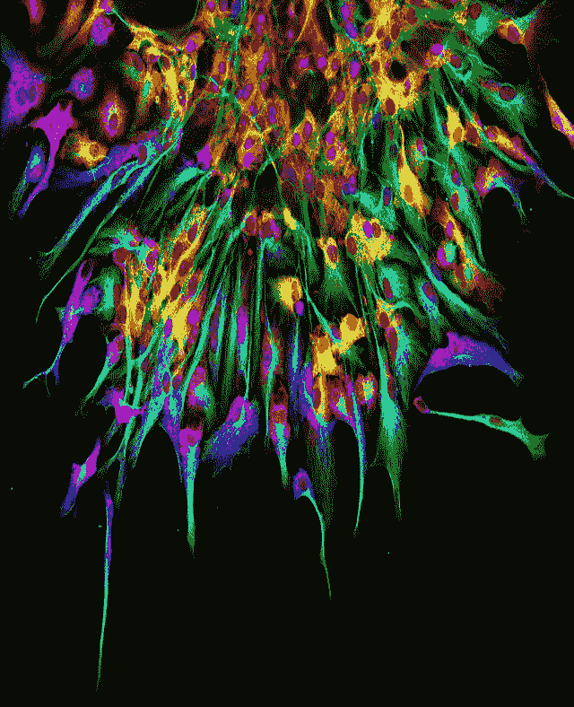

Fluorescently tagged neuronal cell culture. S[ource](https://www.the-scientist.com/image-of-the-day/image-of-the-day-39924)

看看这张图片，告诉我你看到了什么。

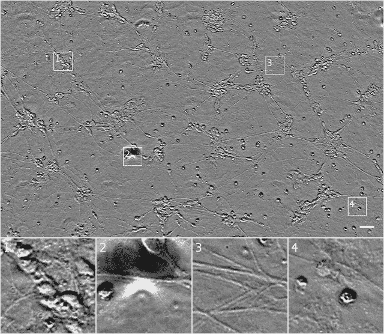

Figure 1\. Source: [Finkbeiner lab](https://labs.gladstone.org/finkbeiner/) at the Gladstone Institutes. Bottom pictures are Outset 1, 2, 3 and 4.

如果你是一个相当聪明的人，有一些生物学背景(或者没有)，你可能会猜到“一些细胞？”

恭喜你。你现在是生物学家了。

开玩笑，不是*相当于*。更具体地说，这一个人的[运动神经元培养](https://en.wikipedia.org/wiki/Motor_neuron)来源于[诱导多能干细胞](https://en.wikipedia.org/wiki/Induced_pluripotent_stem_cell)。

如果你设法猜到了，让我再问你一些问题。

1.  开头 1 的群集中有多少个单元？
2.  你能清楚地识别出开头 2 和 3 中的神经突和下面的细胞吗
3.  开头 4 中的细胞是活的还是死的？

如果你是一名训练有素的生物学家，你可能会回答第三个问题，也可能是第一个问题。如果你真的很努力地试了试，也许你能回答所有的问题，只是非常错误。

现在去问问你其他的生物学家朋友。他们可能同意你的第三个答案，但不同意第一个。否则他们两个都会不同意。或者三者都有。啊，人类的判断——总是主观的，有时不可靠。

事实是，与生物技术的发展速度相比，我们的显微镜技术已经落后了。

想想看，我们的智能手机上有 DSLR 质量的相机，我们的手机图像看起来仍然像…这个？

*真的吗？*

# 我们可以升级显微镜方法。

上图使用的是所谓的*透射光* *显微镜，*当样品的一面被照亮时，样品被成像——非常简单的技术。它对生物体相对无害，但至少可以说，解释实际图像是相当困难的。

具体来说，图 1 来自于[相衬](https://en.wikipedia.org/wiki/Phase-contrast_microscopy)显微镜——像素的强度(有多亮/多暗)显示了当光通过样品时有多少光发生了相移。

现在，透射光显微镜有一个巧妙的技巧，可以让我们更好地观察实际细胞，称为 **Z-stack。**

Z 堆栈中的 Z 代表( **x，y，z** )三维坐标系中的 **z** 。这组图像被记录在(x，y)中，因为它们是 2D，而 **z 是离相机的距离。**由于你(系统地)改变了与相机的距离，你得到的多幅 2D 图像会略有不同，因为**不同的部分进入和离开焦点。**

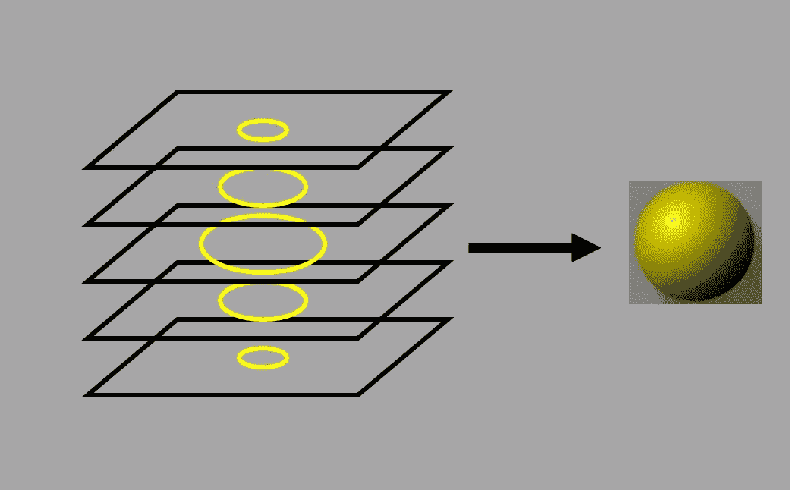

Z-stack of a sphere. [Source](https://cam.facilities.northwestern.edu/588-2/z-stack/)

这给了我们一个 ***更好的*** 三维表示，但是它的**仍然很难理解。**科学家还是要靠目测手动分析这些图像。

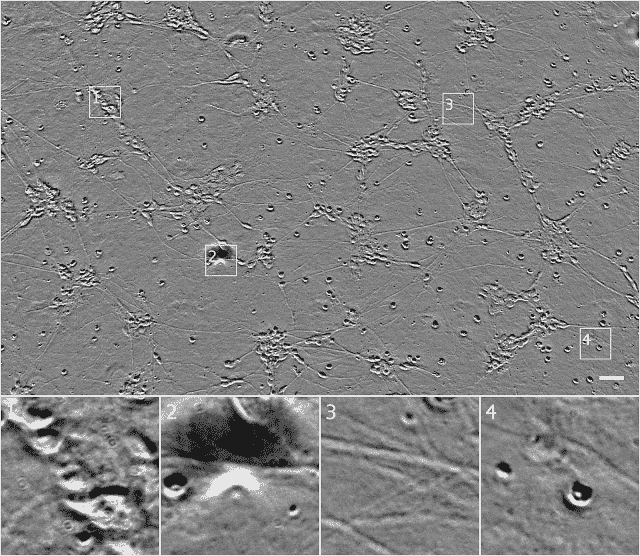

Figure 2: phase contrast z-stack of Figure 1\. [Source](https://ai.googleblog.com/2018/04/seeing-more-with-in-silico-labeling-of.html)

回到我之前问你的问题，看看你能否使用 z-stack*回答其中的一些问题。大概现在*比较容易*回答了，但是你还是没有一个**明确的**答案。

*(请注意，您现在可以推断出开头 4 中的突出细胞可能经历了细胞凋亡，这是一种非常酷的程序性细胞收缩死亡机制)

现在我们来介绍一下 ***荧光显微镜*** 。样本经过荧光分子处理，这使得某些细胞结构(如细胞核)的可视化变得更加容易。

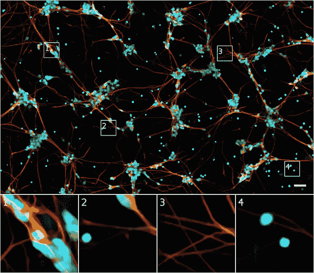

This is the SAME culture of human motor neurons as above! [Source.](https://ai.googleblog.com/2018/04/seeing-more-with-in-silico-labeling-of.html) Blue fluorescent labels detect DNA, thereby highlighting cell nuclei. Green labels detect a type of protein only found in dendrites. Red labels show axons.

现在，这种形象从翻盖手机的质量变成了布兰登·沃尔费尔的 Instagram feed *真快*。

虽然生动的图像看起来像是属于好莱坞科幻电影，但它确实需要像好莱坞电影一样长的准备时间(这只是稍微有点夸张)。也像好莱坞电影一样，它被许多许多问题所困扰。

*   样品制备**耗时**且**复杂**
*   您需要**特殊试剂**(材料)，由于抗体交叉反应性，这些试剂经常产生 ***非特异性*** 信号*
*   标记协议(程序)可以 ***潜在地杀死细胞*** ！甚至*活细胞*协议都可以 [**光毒性**](https://www.microscopyu.com/references/cellular-phototoxicity) ****！**
*   ***不同*** 不同**不同批次**(还有人对人！)
*   ***不会永远*** ！最终，它们停止表达荧光信号。
*   **不同颜色的标记可以*彼此重叠*** (光谱重叠)，使得很难看出哪种颜色属于哪种标记(这限制了研究人员在每个样品中同时使用 3 或 4 种荧光标记)
*   测量标记(即荧光标记信号有多强)**需要一个光学系统**——这样它可以在样品中的*和其他*标记之间进行分离，并检测*荧光团漂白* ***

* **抗体交叉反应**是当*不同的*抗原出现*类似*于免疫系统。

***当荧光标记的**细胞**持续暴露在激光和高强度灯的照射下时，会发生光毒性**。

*** **荧光团漂白**基本上是**褪色—** 是指细胞因化学损伤而失去表达荧光信号的能力

> 更好的(深度)选择！

所以问题是，**计算机*能否预测*和*在*未标记的*图像中找到*以前不知道的*特征***(例如。荧光)？

## 换句话说，我们能在没有标签的情况下突出显示单元格的某些部分吗？

正如你可能从我的标题中知道的——是的！

科学家们创造了一种称为 ***的新方法，即电子标记(ISL)*** ，它可以**从样本的未标记 z 堆叠中推断出荧光标记**。它还可以预测其他标签(例如细胞类型(神经、肝脏)和细胞状态(死亡或存活))。

它是一致的，不受*光谱重叠*的限制，并且不涉及改变或接触样品。它还可以产生某些生物测量值，这些测量值在以前是很难甚至不可能被 T42 获得的。

这是对*电子贴标*的概述。

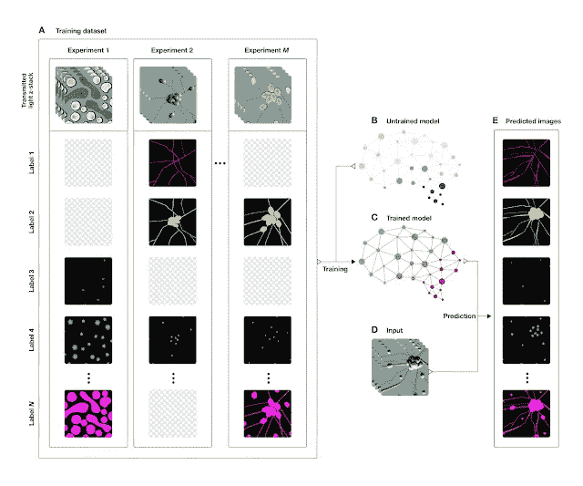

Overview of a System to Train a Deep Neural Network to Make Predictions of Fluorescent Labels from Unlabeled Images. Source: [1]

该网络由许多 z 叠堆(图 1 左上)及其相应的荧光标签(图 1 左下)训练而成。

理想情况下，我们希望模型:

> 取一个看不见的 z-stack →预测不同荧光标记的归属

输出图像的每个**像素**在 256 个强度值(8 位像素)上有一个*离散概率分布*——这意味着每个像素都有可能是某个标签(例如，这个特定像素是 *x%* 可能是轴突)。为了制作图像，你取每个像素的预测分布的中值

在评估模型时，我们可以通过**比较荧光标签与荧光样本的实际图像的相似程度**来衡量性能(这是通过定性(观察)和定量(使用统计)来完成的)。

# 网络体系结构

该模型的网络架构类似于 Google 的 **Inception** 网络(通过重复模块的使用)并受到 [**U-Net**](https://arxiv.org/abs/1505.04597) (一种用于生物医学图像分割的卷积网络)的启发。

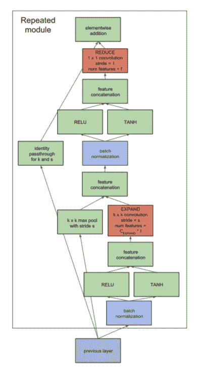

Each individual module. Red: expanding/reducing convolutions. Source [1].

在右侧路径上，输入**通过卷积扩展**特征尺寸，然后**减小**特征尺寸。在左侧，从输入复制特征值，形成一个*剩余连接。*下一个模块的输入是两个路径相加的和。

残余连接基本上防止了渐变消失的问题，当你添加更多的层时，渐变会逐渐变小。欲了解更多信息，[请查看](/implementing-a-resnet-model-from-scratch-971be7193718?source=friends_link&sk=b7203af8909d1165ab81dd6ab42d63fc)。

宏观架构类似于《盗梦空间》的模块。

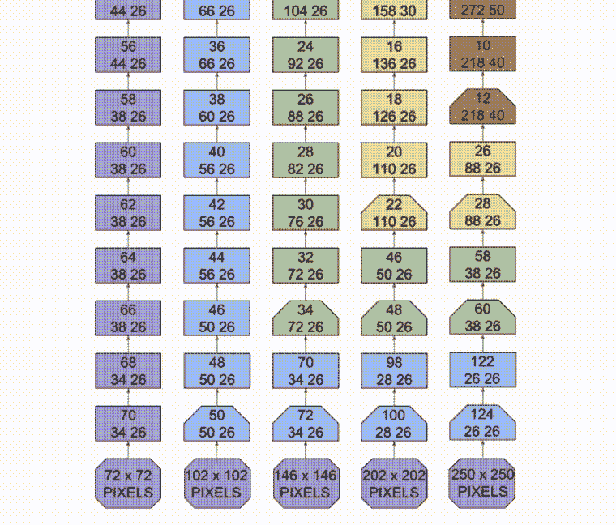

Model Architecture. Source: [1]

如你所见，它有一个**多刻度**输入。z 堆栈中同一图像的多个“裁剪”(具有相同的焦点)—红框、蓝框、绿框等。计算多个特征。这允许模型学习**上下文**和**细节**！

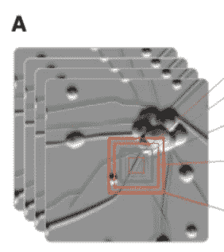

Same center, different sizes.

最小的“裁剪”处理小规模的**精细细节***(上图左侧，建筑的紫色路径)，而最大的裁剪处理**粗略背景**和广泛特征(上图右侧，建筑的多色路径)——以及它们之间的三条中间路径。

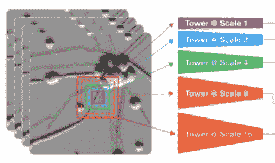

Each color corresponds to a different computational path/tower.

与其他图像分类模型相比，这种架构的独特之处在于，这种**不包含空间缩减** **，而空间缩减** **会破坏精细细节**，例如盗梦空间。

这是因为它部分受到了 [**U-Net** 、](https://arxiv.org/abs/1505.04597)的启发，其中最左边的路径保持输入的原始长度比例，因此**信息可以从输入流到输出而不会模糊**——允许网络学习细节！

在**特征拼接**之后，五条路径合并成一条路径，输出预测。

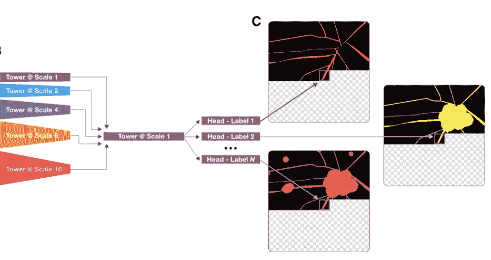

The final path splits into the separate labels. Outputs a probability distribution for the intensity values per pixel, and the median is taken to form the final image.

这是模型的整体机器学习工作流程:

Machine-Learning Workflow for Network Development. Notice how the different Towers correspond to the 5 different computational paths in the model architecture above. They all then merge into a final path (the middle Tower @ Scale 1) and then split into multiple heads. Source: [1]

有了这组特定的训练图像，模型可以

*   几乎相同地**预测细胞核的位置**

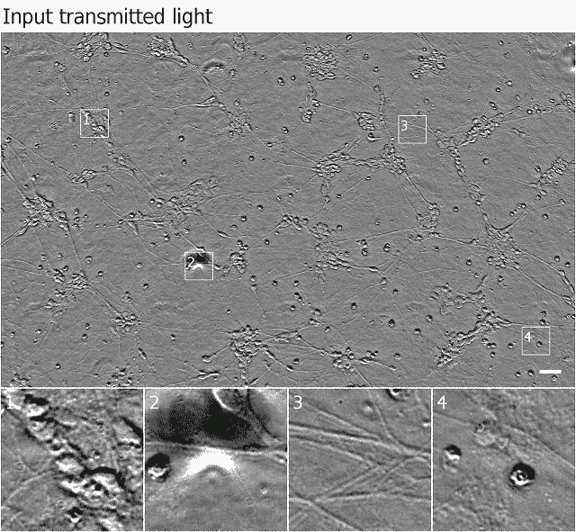

Input images/true labels/predicted labels. [Source](https://ai.googleblog.com/2018/04/seeing-more-with-in-silico-labeling-of.html)

*   **识别细胞是死是活** *98%* 的时候(相比人类 80%的准确率——即使是经验丰富的生物学家也能对同一张图像给出两种不同的答案)。它甚至在大量死亡细胞中检测出一个活细胞*！*
*   生成精确的**细胞大小测量值**
*   **能否区分某些细胞成分** *与人类*的准确度相匹配(如树突和轴突)

> 未来影响

通过这个实验，ISL 已经显示出它展示了**迁移学习** —它可以将它在*以前的*映像上所学到的东西应用到全新的映像上！通过进一步的训练，我们可以教会这个模型分析 ***各种细胞*** 。

> 但是真正的问题是，我们能发现在之前我们不能发现的细胞特征吗？

机器有可能发现关于细胞的事实，从而导致下一个癌症疗法的发现吗？

这个模型已经差不多达到*人类视力*的水平了。

谁知道呢，它最终会被训练得足以拥有人类的超级视力。

> 关键要点

*   目前的显微镜方法要么**难以分析**要么**潜在危险**
*   一种标记图像的深度学习方法，“在计算机上标记的*，*”可以**预测细胞的看不见的图像上的荧光标记**
*   电子标记还可以预测细胞结构的**位置**、**细胞长度**和**细胞是死是活**
*   **迁移学习**允许该模型用于其他细胞并预测新特征

## 来源

[1] E. Christiansen，S. Yang，D. Ando，L. Rubin，P. Nelson，S. Finkbeiner， *In Silico Labeling:预测未标记图像中的荧光标记(2018)，*

如果您有任何问题，请随时联系:

*   电子邮件:gracelyn.shi@gmail.com
*   领英:[https://www.linkedin.com/in/gracelynshi/](https://www.linkedin.com/in/gracelynshi/)
*   推特:[https://twitter.com/GracelynShi](https://twitter.com/GracelynShi)