# 监督学习:分类基础和主要算法

> 原文：<https://towardsdatascience.com/supervised-learning-basics-of-classification-and-main-algorithms-c16b06806cd3?source=collection_archive---------5----------------------->

Picture from [Unsplash](https://unsplash.com/photos/2EJCSULRwC8)

# 介绍

正如本系列第一篇文章所述，分类是监督学习的一个子类，其目标是基于过去的观察预测新实例的类别标签(离散、无序值、组成员)。

分类问题主要有两种类型:

*   二元分类:典型的例子是邮件垃圾邮件检测，其中每封邮件都是垃圾邮件→ 1 封垃圾邮件；或者不是→ 0。
*   多类分类:像手写字符识别(类从 0 到 9)。

下面的例子很有代表性地解释了二元分类法:

有两个类别，圆和十字，以及两个特征，X1 和 X2。该模型能够找到每个数据点的特征与其类别之间的关系，并在它们之间设置边界线，因此当提供新数据时，它可以估计其所属的类别，给定其特征。

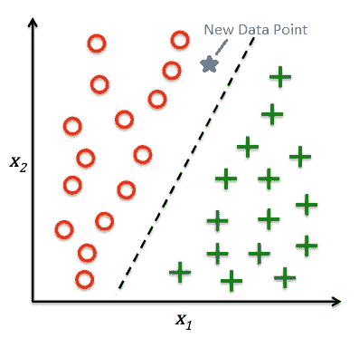

Figure by Author

在这种情况下，新数据点落入圆形子空间，因此，模型将预测其类别为圆形。

**不同的阶层**

值得注意的是，并非每个分类模型都有助于从数据集中正确分离不同的类。一些算法，如感知器(基于基本的人工神经网络)，如果类不能被线性决策边界分开，则在学习模型的权重时不会收敛。

下图展示了一些最典型的案例:

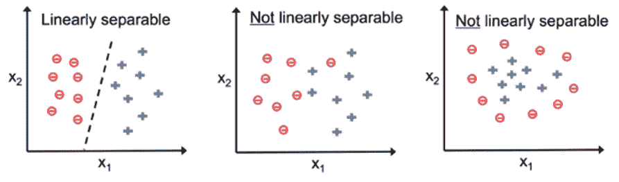

Figure by Author

因此，选择一个合适的算法的任务在分类问题中变得至关重要，这将是整篇文章中讨论的主要话题之一。

**实践中的分类**

在实践中，总是建议尝试和比较不同算法的性能，以便选择最合适的方法来解决问题。这种性能会受到可用数据、特征和样本数量、不同类别以及它们是否线性可分的影响。

提醒我们自己开发机器学习模型的六个主要步骤:

1.  收集数据。
2.  选择衡量成功的标准。
3.  设置评估协议。
4.  准备数据
5.  开发基准模型
6.  开发更好的模型并调整其超参数

接下来，我们将继续探索不同的分类算法，并了解哪种算法更适合执行每项任务。

# 逻辑回归

分类问题中的一个主要问题是在训练过程中，算法在权值更新时不收敛。

当类不是完全线性可分的时候就会发生这种情况。因此，为了解决二元分类问题，逻辑回归是最常用的算法之一。

逻辑回归是一个简单但强大的分类算法(尽管它的名字)。它在线性可分类上工作得非常好，并且可以通过 OvR 技术扩展到多类分类。

**优势比**

为了理解逻辑回归背后的思想，比值比是一个重要的概念。

比值比是某一事件发生的概率。它可以写成:

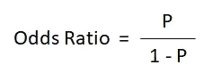

其中 P 代表积极事件(我们试图预测的事件)的概率。

由此我们可以定义 logit 函数。

**Logit 功能**

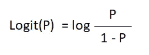

logit 函数就是比值比的对数(log-odds)。该函数将范围[0，1]内的值作为 am 输入值，并将其转换为整个实数范围[-∞，∞]内的值。

我们将使用它来表达特征值和对数优势之间的线性关系。

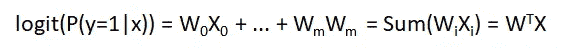

其中 P(y=1|x)是给定其特征 x，特定样本属于类别 1 的条件概率。

我们背后的真正动机是预测样本属于某一类的概率。这是 logit 函数的逆函数，通常称为 sigmoid 函数。

**s 形函数**

sigmoid 函数的公式为:

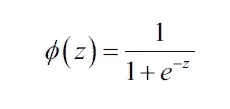

z 是净输入，它是权重和样本特征的线性组合，可计算如下:

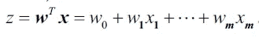

当用图形表示时，它采用以下形状:

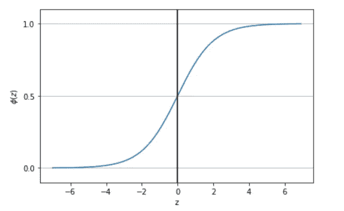

Figure by Author

我们可以看到，在等于 1 和 0 的(z)值中有两个极限。这意味着，如果 z 趋于无穷大，函数就接近 1，如果 z 趋于负无穷大，函数就接近 0。

因此，它采用实数值并将其转换到[0，1]范围，截距为(z) = 0.5。

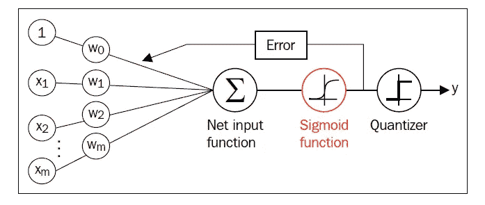

Figure by Author

总之，这就是逻辑回归模型在被训练时所做的事情。sigmoid 函数的输出被解释为某个样本属于类别 1 的概率，假设其特征 x 由权重 w 参数化为，*ψ(z)= P(y = 1 | x；w)。*

预测概率可以通过单位阶跃函数(量化器)转换成二进制结果:

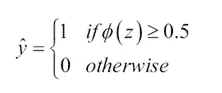

查看前面的 sigmoid 图，等价关系为:

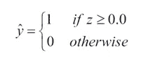

这是逻辑回归算法如此受欢迎的主要原因之一，因为它返回某个样本属于某个特定类别的概率(0 到 1 之间的值)。

这在天气预报等情况下非常有用，在这种情况下，你不仅想知道是否会下雨，还想知道下雨的可能性。或者预测病人患某种疾病的几率。

# 支持向量机(SVM)

这个算法可以认为是感知器算法的[的扩展。在 SVM 中，优化目标是通过最大化该线和最接近该超平面的样本点之间的余量来设置分隔类别的决策线。这些点被称为支持向量。](/perceptron-learning-algorithm-d5db0deab975)

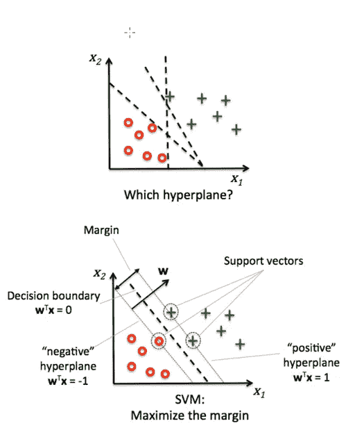

Figure by Author

**最大保证金**

为了设置最大边距，添加了两条平行线(边距),我们试图最大化它们到原始决策线的距离。我们将考虑错误分类的点(错误)以及页边空白和线条之间的点。

通常，具有较大边距的决策线往往具有较低的泛化误差。另一方面，利润率小的模型往往不太容易过度拟合。

最大化函数(误差余量)计算如下:

1.  正负超平面可以表示为:

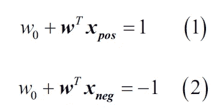

2.将(1)和(2)相减:

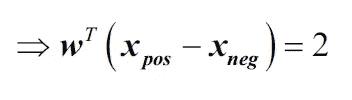

3.通过 *w* 向量的长度归一化前面的等式，其中:

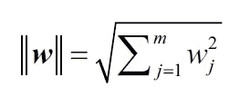

4.我们得出边际误差方程:

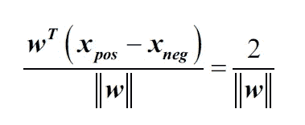

哪个左侧被解释为正超平面和负超平面之间的距离，换句话说，就是我们试图最大化的边距。

在实践中，更容易最小化倒数项，这可以用二次规划来解决。

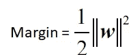

**松弛变量:处理非线性可分离类**

松弛变量ξ it 用于软边分类。其动机是需要放松线性约束，以便在处理非线性可分离数据时允许优化过程的收敛。

它被添加到线性约束中，新的最小化函数变成:

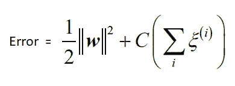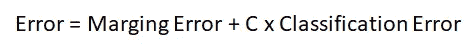

通过改变函数的 C 变量，我们可以控制错误分类的惩罚，并控制边缘的宽度。以这种方式调整偏差-方差权衡。

最佳的界限将取决于我们试图解决的问题。如果我们正面临一个医疗问题，我们不希望出现任何差错。而在面对其他类型的问题时，我们可以处理一些错误。

这是 C 值发挥作用的时候。

*   大的 C 值对应于大的误差损失。
*   较小的 C 值意味着我们对误分类错误不太严格。

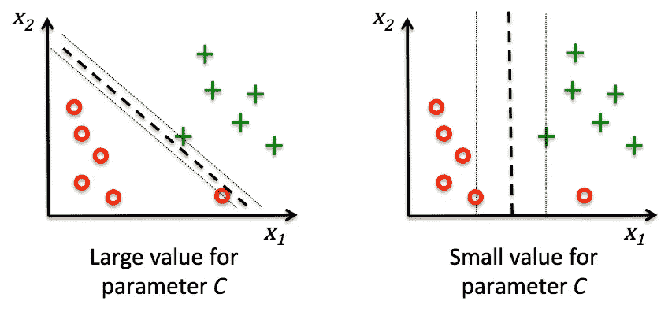

Figure by Author

**多项式核 SVM**

SVM 是一个非常流行的算法分支，因为它可以用来解决非线性分类问题。这是通过一种叫做内核化的方法来实现的。

当处理原始特征的非线性组合时，使用核的基本思想是通过映射函数将它们投影到更高维的空间，因此数据变成线性可分的。

直观地说，原始数据集被转换到一个更高维的数据集，然后应用一个投影使类别可分离。

然后应用该算法，分类被分割，并应用投影函数的逆来返回数据的原始分布。

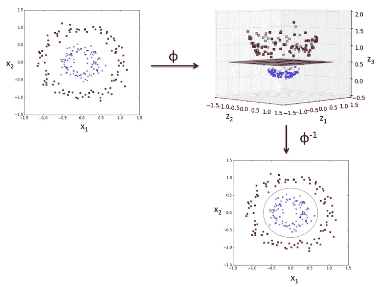

Figure by Author

**RBF 内核**

也用于处理非线性可分数据，如下所示:

Figure by Author

Figure by Author

这个想法是定位与每个类相一致的山脉和山谷。投影线分开两个类，也切断山谷线，原始线:

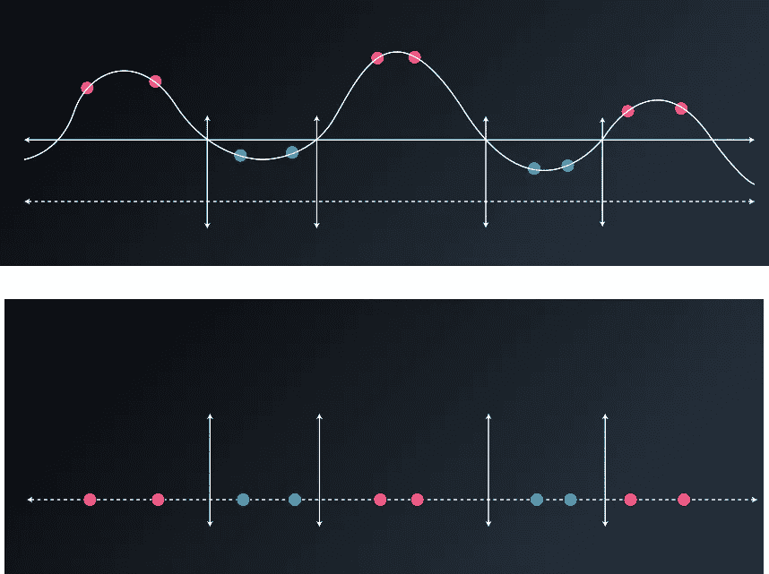

Figure by Author

投影将有效地分离原始数据集中的每个类。

为了改变山脉和山谷的宽度，我们将使用伽马参数γ。

gamma 参数是一个超参数，我们在训练期间对其进行调整，用于:

*   较大的γ值→将产生狭窄的山脉/山谷，这将倾向于过度拟合。
*   较小的值→将产生宽阔的山脉/山谷，这些山脉/山谷往往会被淹没。

此参数来自正态分布的公式:

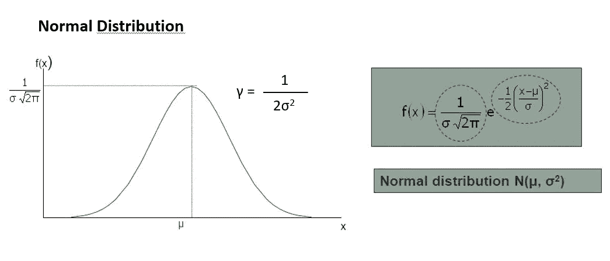

Figure by Author

# 决策树算法

决策树算法通过提问来分解数据集，直到它们将数据缩小到足以做出预测。

这是一个决策树示例，用于决定是否将汽车借给某人:

Figure by Author

基于训练集的特征，决策树学习一系列问题来推断样本的类别标签。

起始节点称为树根，算法将在包含最大信息增益的要素上迭代拆分数据集，直到叶子(最终节点)是纯的。

**决策树超参数**

a)最大深度:

最大深度是从根部到叶子的最大长度。大深度会导致过度拟合，小深度会导致欠拟合。为了避免过度拟合，我们将通过设置具有最大深度的超参数来修剪决策树。

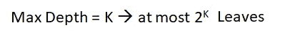

b)最大样本数量:

当分割一个节点时，可能会遇到这样的问题:一个分割中有 99 个样本，另一个分割中有 1 个样本。这将是一种资源浪费，为了避免这种情况，我们可以为每片叶子设置一个最大的样本数。它可以被指定为整数或浮点数。

样本数量少会导致过度拟合，而数量多则会导致欠拟合。

c)最小样本数量:

类似于前一个，但具有最小值。

d)最大特征数量:

很多时候，我们需要很多特征来构建一棵树。在每次分割中，我们必须检查每个要素的整个数据集，这可能非常昂贵。

这个问题的解决方案是限制在每次分割中寻找的特征的数量。如果这个数字足够高，我们很可能会在我们寻找的特征中找到一个好的特征(尽管它可能不是完美的)。然而，如果它没有特征的数量大，它将显著地加速计算。

# 随机森林

如果我们有一个包含许多特征(列)的数据集，决策树算法通常会过度拟合，使模型和学习过程变得过于复杂。

我们可以通过随机选择每个列并为每批列制作决策树来解决这个问题。

Original picture from [this article](https://medium.com/@williamkoehrsen/random-forest-simple-explanation-377895a60d2d)

因此，我们的想法是开发一种集成学习算法，将一些较弱的模型结合起来，建立一个更健壮的模型。

该算法将执行以下步骤:

*   抽取大小为 n 的随机 bootstrap 样本
*   从 bootstrap 样本生成决策树。在每个节点:将随机选择 d 个特征而不替换，节点将被分裂以最大化信息增益。
*   前面的过程将重复 k 次。
*   同意每棵树所做的预测，通过多数投票指定类别标签。

这种方法的主要优点是，我们通常不需要修剪随机森林(因为模型对噪声相当鲁棒)。然而，它们比决策树更难理解。

我们需要调整的唯一超参数是树的数量。通常情况下， *K* 越大，模型的性能越好，但这会大幅增加计算成本。

# k-最近邻(KNN)

k-最近邻算法或 KNN，属于一种特殊类型的机器学习模型，通常被称为“懒惰算法”。

他们之所以得到这个名字，是因为他们没有学会如何用优化函数来区分数据集，而是记住了数据集。

“懒惰算法”这个名字也指一种叫做非参数的算法。这些是基于实例的算法，它们的特点是记忆训练数据集，而懒惰学习是这些算法的一个特例，与学习期间的零计算成本相关。

**算法**

该算法遵循的总体过程是:

1.  选择 k 的数量和距离度量。
2.  找到要分类的样本的 k 个最近邻
3.  通过多数投票分配类别标签

Figure by Author

该算法基于其对距离度量的预测，找到最接近要分类的点的 k 个样本。

主要的优点是，由于它是基于记忆的算法，它适应新的训练数据。不利的一面是计算成本随着训练数据的大小而线性增加。

**需要考虑的事情**

*   在算法面临平局的情况下，它将优先选择与分类样本距离较近的邻居。在距离相似的情况下，KNN 将选择数据集中最先出现的分类标注。
*   为了在过拟合和欠拟合之间取得良好的平衡，选择正确的 k 值是非常重要的。
*   建立适当的距离度量也很重要。通常使用“闵可夫斯基”距离，它是欧几里德距离和曼哈顿距离的推广。该距离定义如下:

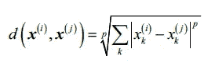

# 结论

在本文中，我们学习了分类的基础和主要算法，以及如何根据所面临的问题来调整它们。

在下一篇文章中，我们将探索其他非常常见的分类算法，称为“朴素贝叶斯”，我们将在一个项目中执行一个实现，在这个项目中，我们将建立一个分类模型，根据它的单词正确预测电子邮件是否是垃圾邮件。

感谢阅读，敬请关注！