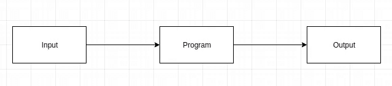
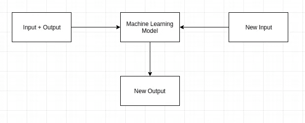
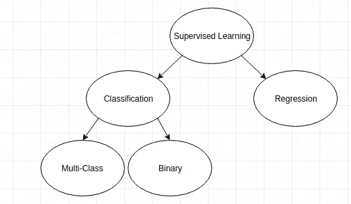
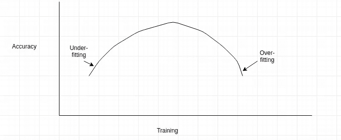

# 监督机器学习

> 原文：<https://towardsdatascience.com/supervised-machine-learning-f3bea1794fbd?source=collection_archive---------24----------------------->

## 在我们开始这篇关于监督机器学习的文章之前，我们应该对什么是机器学习以及机器学习算法如何影响我们的决策有一个清晰的概念。

# 什么是机器学习？

机器学习是让计算机从例子中学习的实践，通过向它们提供数据，而不是显式地编程让它们这样做。机器学习使用统计学和计算机科学来开发实现计算机学习的算法。

A traditional Computer Program Photo By Ayush Kalla

A Machine Learning Model Photo By Ayush Kalla

# 机器学习模型与机器学习算法

**机器学习算法**是一种数学和统计学的通用规则，机器遵循它来“训练自己”。

**机器学习模型**是真实世界数据在一个或多个机器学习算法上的实现。

例如，**线性回归算法**是数学和统计学中的一组规则，使我们能够将点拟合到 y = mx + c 线上。另一方面，**线性回归模型**将使用这种线性回归算法来表示现实世界的问题，并可以根据新的输入为我们提供新的输出。例如，线性回归模型可以为我们提供线性方程 y = 2x + 3，其中常数 2 和 3 通过应用线性回归算法来确定。该模型可以根据输入(x)生成输出(y)。

现在我们知道了机器学习，就可以谈谈**监督学习了。监督学习**是一种通过向机器提供以前的实例及其输出来让机器学习的技术。**例如，**给机器学习模型输入数以千计不同的猫和狗的图像，并给出正确的输出，这将允许机器在未来区分猫和狗。

Supervised Learning Photo By Ayush Kalla

**分类:**预测我们预测的变量属于哪一类**(狗或猫)**

**多类分类:**如果预测变量有 2 类以上，称为多类分类。例如，天气类型(热、雨、冷、风)。这是一个包含 4 个类别的多类别分类。

**二元分类:**如果预测变量有 2 类，称为二元分类。例如，今天会下雨吗(会还是不会)

**回归:**预测连续变量，例如股票价格、平均收入等。回归被广泛用于处理金融数据。

# **培训和测试数据**

在机器学习中，经常建议测试我们的模型。为此，我们可以将数据分为训练数据和测试数据。

**训练数据:**训练我们的机器学习模型的数据。

**测试数据:**用于测试模型效率的数据。

# 过度装配和装配不足

**过拟合**:如果模型被训练得太多，以至于它在训练数据上表现很好，但在测试数据上却不能给出类似的结果，这就叫做过拟合。
**欠拟合**:如果模型训练不够，称为欠拟合。

# **模型的精确度**

模型的准确性告诉我们，我们的模型在使用新数据时表现如何。通过将模型与测试数据的实际输出和模型预测的输出进行比较，来确定模型的准确性。模型的高精度可以表明模型是一个好的模型，它可以很好地处理实时数据，并可以部署到实践中。

如果您有任何意见、建议或问题，请告诉我，我将很高兴收到您的来信。