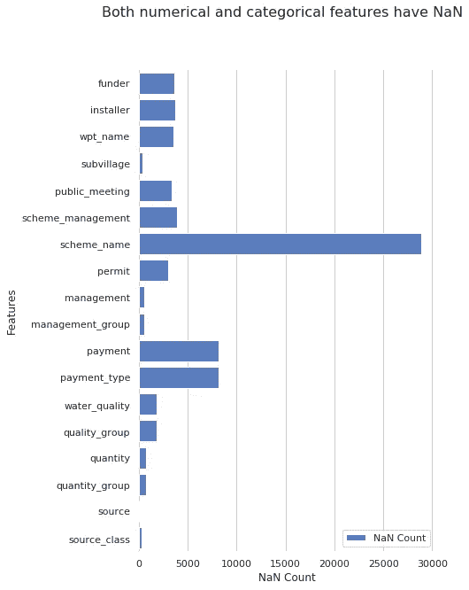
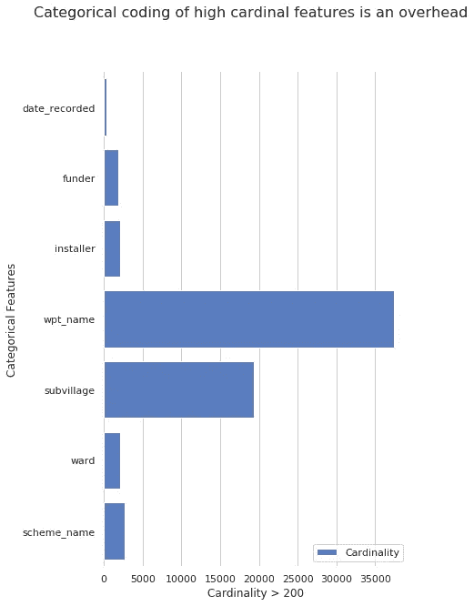
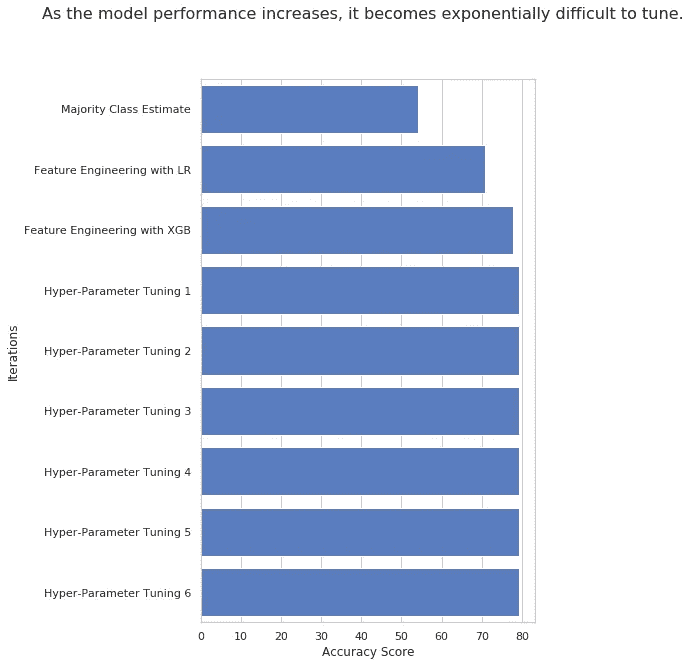

# 监督机器学习:特征工程和超参数调整

> 原文：<https://towardsdatascience.com/supervised-machine-learning-feature-engineering-and-hyper-parameter-tuning-a3da583dd7b9?source=collection_archive---------16----------------------->

## **特征工程**是使用数据的领域知识来创建使机器学习算法工作的特征的过程。**超参数优化**或调谐是为学习算法选择一组最佳超参数的问题。与选择特定的模型相比，这些对模型验证的影响更大。在这里，我提供了一步一步的特征工程和超参数调整概述。

在这里，我们深入探讨特征工程和超参数调整步骤。在我们开始更好地理解模型验证之前，看看我以前的博客。 [*监督机器学习:模型验证，一步一步逼近*](/supervised-machine-learning-model-validation-a-step-by-step-approach-771109ae0253) *。*

我将使用来自**驱动数据**的数据集。数据集用于从 **Taarifa** 和**坦桑尼亚水利部**的 水位表中 [*数据挖掘。这是一个具有高基数特征的多类分类问题。*](https://www.drivendata.org/competitions/7/pump-it-up-data-mining-the-water-table/)

## **特色工程**

正如我之前的 [*博客*](/supervised-machine-learning-model-validation-a-step-by-step-approach-771109ae0253) 中提到的。**特征工程**是指识别独立特征和从属特征之间的关系。然后，我们可以将识别的关系添加为多项式或交互特征。

> 特征工程步骤是连续迭代的入口点。这是一个关键步骤，与模型验证相比，它在预测中起着更大的作用。

手头问题的领域知识将对特征工程有很大的用处。在这里，我将为新的识别特性提供一些思想模型。

让我们先看一下数据。似乎存在具有高基数和 NaN 值的要素。

如果需要，我们可以删除具有高基数和 NaN 值的列。同样对于数字特征，我们可以用其平均值、中值或众数来填充 NaN 值，而不是丢弃它。同样，对于分类特征，我们可以将 NaN 归类为一个单独的类别。

同样基于地下水位数据集，我们可以设计一些特征，如:

*   **经度**和**纬度**中的 NaN 值用其平均值更新。

*   识别**出资方**是否至少出资了 5 台泵的二元特征。同样确定**安装人员**是否安装了至少 5 台泵。

*   基于前缀对高基数的分类特征数据进行分组。更好的方法是详细分析数据集，并尝试根据某种逻辑结构对它们进行分组。

*   根据同一病房其他泵的中值更新**建造 _ 年份**。

*   将**日期记录**拆分为**年记录**和**月记录**。甚至分组在不同箱中。

*   根据**建造年份**和**记录年份**计算泵的年龄。

## 超参数调谐

**超参数优化**或**调整**是为学习算法选择一组最优超参数的问题。同一种机器学习模型可能需要不同的约束、权重或学习速率来概括不同的数据模式。这些措施被称为超参数，必须进行调整，以便模型可以最优地解决机器学习问题。超参数优化找到超参数元组，该元组产生最佳模型，该模型最小化给定独立数据上的预定义损失函数。目标函数采用一组超参数并返回相关损失。交叉验证通常用于评估这种泛化性能。

来源: [*维基百科*](https://en.wikipedia.org/wiki/Hyperparameter_optimization)

> 简而言之，超参数调优意味着找到参数的最佳值。作为其中的一部分，我们选择了一系列值来调整参数。然后根据交叉验证结果确定哪个值更合适。然后进入下一组模型参数。超参数调整是一个微妙而繁琐的比较和排除过程。

这里我们用[*xgb classifier*](https://xgboost.readthedocs.io/en/latest/python/python_api.html#module-xgboost.sklearn)进行分类。 [*GridSearchCV*](https://scikit-learn.org/stable/modules/generated/sklearn.model_selection.GridSearchCV.html#sklearn-model-selection-gridsearchcv) 用于与独立测试数据集的交叉验证。为了简洁起见，让我们跳过管道和 param_grid 创建的细节。详情参考之前的博客。这里我来举例说明 **XGBClassifier** 的参数 **max_depth** 和 **min_child_weight** 的调整。

**max_depth (int) —** 基础学习者的最大树深度。

*   用于控制过度拟合，因为较高的深度将允许模型学习特定样本的特定关系。
*   典型值:3–9

**min_child_weight (int)** —一个孩子所需实例重量的最小总和(hessian)。

*   用于控制过度拟合。较高的值会阻止模型学习可能高度特定于为树选择的特定样本的关系。
*   过高的值会导致拟合不足，因此应该使用 CV 进行调整。典型值:1–5

参数调整的第一次迭代的输出:

*   **交叉验证得分:**0。46860 . 66866868661
*   **最佳参数:**{ ' xgb classifier _ _ max _ depth ':5，' xgb classifier _ _ min _ child _ weight ':1 }

在第一次迭代中，我们以两步递增参数值。因此，在第二次迭代中，让我们进一步缩小参数范围并进行检查。

在第二次迭代期间， **max_depth 的最佳值是 5** 。现在是 **6** 。所以在第三次迭代中，让我们再次确认 max_depth 的值。现在让我们将**最小 _ 子 _ 重量**参数固定为 1。

参数调整的第三次迭代的输出:

*   交叉验证分数:0。46860 . 68686868661
*   **最佳参数:**{ ' xgb classifier _ _ max _ depth ':6，' xgb classifier _ _ min _ child _ weight ':1 }

从第三次迭代中，我们可以确定**最大深度**的值为 **6** 。以同样的方式，我们可以选择其他参数并调整它们的优化值。

注:本博客旨在提供关于特征工程和超参数调整的快速介绍。这里的想法是理解过程，所以代码没有优化。使用这种方法来设置基线指标得分。提高我们每次迭代的模型验证分数。

在此 获取完整笔记本 [*。*](https://github.com/ShreyasJothish/blognotebooks/blob/master/DS1_Predictive_Modeling_Challenge_Parameter_Tuning.ipynb)

你可能会觉得我的其他博客很有趣。一定要去看看。

[*分析转发率，确定社会影响力。*](/analyse-retweet-ratio-to-determine-social-influence-d83bda0559d)

[*为什么我们要让特朗普的推文影响我们的心情？*](/why-are-we-letting-trumps-tweet-affect-our-mood-7f9baafae3a7)

## 参考资料:

 [## XGBoost 中参数调整的完整指南(带 Python 代码)

### 如果在预测建模中事情没有按照你的方式发展，使用 XGboost。XGBoost 算法已经成为终极…

www.analyticsvidhya.com](https://www.analyticsvidhya.com/blog/2016/03/complete-guide-parameter-tuning-xgboost-with-codes-python/)