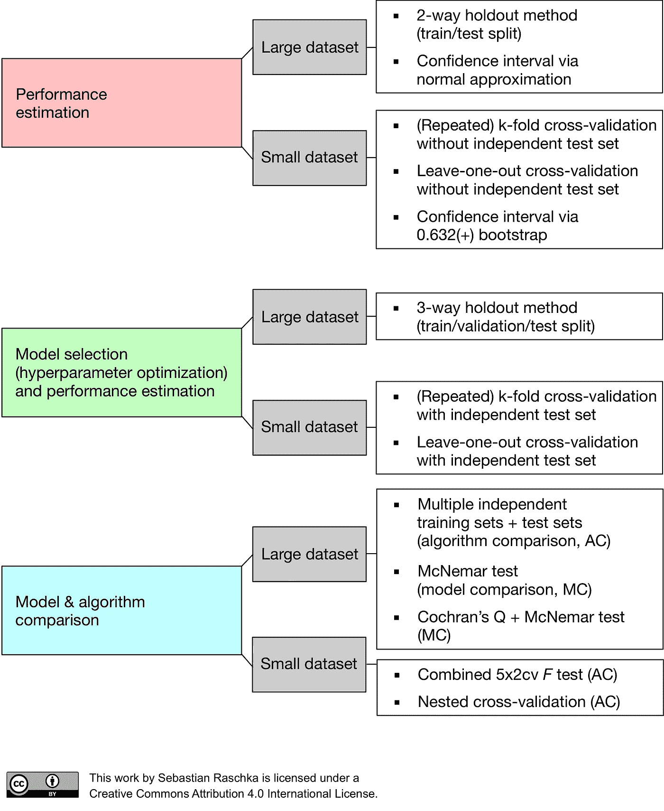

# 监督机器学习:模型验证，一步一步的方法

> 原文：<https://towardsdatascience.com/supervised-machine-learning-model-validation-a-step-by-step-approach-771109ae0253?source=collection_archive---------3----------------------->

## 模型验证是在测试数据集上评估已训练模型的过程。这提供了训练模型的泛化能力。在这里，我提供了一个逐步的方法来在几分钟内完成模型验证的第一次迭代。

> 应用监督机器学习模型的基本方法是:
> 
> 选择一类模型
> 
> 选择模型超参数
> 
> 使模型符合训练数据
> 
> 使用模型预测新数据的标签
> 
> 摘自**杰克·范德普拉斯**撰写的 [Python 数据科学手册](http://shop.oreilly.com/product/0636920034919.do)

Jake VanderPlas 用四个简单明了的步骤给出了模型验证的过程。在我们开始他的第一步之前，还需要一个完整的过程。比如从数据中获取我们需要的所有信息，以便对选择类模型做出良好的判断。还提供收尾工作，以确认之后的结果。我将深入讨论这些步骤，并进一步分解。

*   数据清理和争论。
*   将数据分为训练数据集和测试数据集。
*   定义模型优化的指标。
*   快速获得初始指标评估。
*   优化指标的特征工程。(*第一遍跳过这个)。*
*   数据预处理。
*   特征选择。
*   型号选择。
*   模型验证。
*   解读结果。
*   获得最佳模型，并对照测试数据集进行检查。

我将使用来自 **UCI 机器学习库**的数据集。数据集来自台湾新竹市的 [*输血服务中心*](https://archive.ics.uci.edu/ml/datasets/Blood+Transfusion+Service+Center) 。这是一个分类问题。这背后的思想也延伸到回归问题。

## 数据清理和争论。

输血服务中心数据集是一个干净的数据集。对于大多数其他数据集来说，情况并非如此。因此，这是检查和清理数据的步骤，例如处理丢失的值…

## 将数据分为训练数据集和测试数据集。

有许多方法可以获得用于模型验证的训练和测试数据集，例如:

*   获取训练、验证和测试数据集的三向保持方法。
*   独立测试数据集的 k 重交叉验证。
*   独立测试数据集的留一交叉验证。

**塞巴斯蒂安·拉什卡的** [*博客*](https://sebastianraschka.com/blog/2018/model-evaluation-selection-part4.html) 对于确定这一点有很好的借鉴作用。

我将利用独立测试数据集进行**五重交叉验证。所以把数据分成训练和测试数据集。**

## 定义模型优化的指标。

分类和回归问题中使用的度量标准各不相同。分类问题使用准确性、精确度和召回率等指标...回归问题使用平均绝对误差、R2 分数等指标...

[*scikit 中的分类指标——学习*](https://scikit-learn.org/stable/modules/classes.html#classification-metrics)

[sci kit 中的*回归指标-学习*](https://scikit-learn.org/stable/modules/classes.html#regression-metrics)

既然这是一个分类问题，我这里就用**准确率评分**。

## 快速获得初始指标评估。

这个步骤背后的主要思想是获得正在优化的度量的基线估计。该基线将作为模型验证的进一步步骤的参考。有几种方法可以得到分类问题的基线估计。我使用多数类进行预测。基线准确度分数约为 **77%** 。

## 优化指标的特征工程。

> 特征工程是使用数据的领域知识来创建使机器学习算法工作的特征的过程。特征工程是机器学习应用的基础，既困难又昂贵。
> 
> 来自[维基百科](https://en.wikipedia.org/wiki/Feature_engineering)

这意味着识别独立特征和从属特征之间的关系。这是借助于图表，如对图或相关矩阵。然后，我们可以将识别的关系添加为多项式或交互特征。

> 特征工程步骤是连续迭代的入口点。这是一个关键步骤，与模型验证相比，它在预测中起着更大的作用。

作为快速解决方案，我们可以使用 sci-kit learn 中的 [*多项式特性添加一些多项式特性。*](https://scikit-learn.org/stable/modules/generated/sklearn.preprocessing.PolynomialFeatures.html#sklearn-preprocessing-polynomialfeatures)

手头问题的领域知识将对特征工程有很大的用处。这本身就是一个更大的主题，需要投入大量的时间和资源。

## 数据预处理。

数据预处理将特征转换成更适合评估者的格式。一般来说，机器学习模型更喜欢数据集的标准化。在我们的例子中，我将使用**鲁棒定标器**。

详细信息请参考 sci-kit learn 的 [*预处理数据*](https://scikit-learn.org/stable/modules/preprocessing.html#preprocessing-data) 部分。

## 特征选择。

数据集的特征选择或维度缩减有助于

*   要么提高模型的准确度

或者

*   来提高它们在高维数据集上的性能。

我会用 **SelectKBest** ，单变量特征选择法。用于分类和回归问题的评分函数会有所不同。

详细信息请参考 sci-kit learn 的 [*功能选择*](https://scikit-learn.org/stable/modules/feature_selection.html#feature-selection) 章节。

## 型号选择。

由于我们正在处理分类问题，我将使用**逻辑回归**模型。对于回归问题，我们可以使用**线性回归**或**岭**模型。模型的选择取决于手头的问题。根据数据的复杂性，我们可以使用简单的线性模型或高级模型。

有关详细信息，请参考 sci-kit learn 的 [*广义线性模型*](https://scikit-learn.org/stable/modules/classes.html#module-sklearn.linear_model) 部分。

使用 sci-kit learn 的 [*管道*](https://scikit-learn.org/stable/modules/classes.html#module-sklearn.pipeline) ，有一种优雅的方式可以将以上三个步骤结合起来。**流水线**在最终模型之前应用一系列转换。

## 模型验证。

超参数是模型本身不知道的参数。超参数作为参数传递给管道中步骤的构造函数。基于交叉验证分数，可以获取最佳的可能参数。

对于超参数调整**，GridSearchCV** 是选项之一。它对模型的指定参数值执行穷举搜索。这里，我们使用 **param_grid** 将超参数传递给管道中的步骤。 **cv** 设置为 **5** ，因为我们要进行 5 重交叉验证。**评分**被设置为**准确度**，因为我们想要预测模型的准确度。

有关详细信息，请参考 sci-kit learn 的 [*调整估计器的超参数*](https://scikit-learn.org/stable/modules/grid_search.html#tuning-the-hyper-parameters-of-an-estimator) 部分。

## 解读结果。

GridSearchCV 返回一些重要信息，如:

*   **best_estimator_** ，给出最高分的评估者。利用这一点，我们可以获得关于所选特征的信息。
*   **best_score_，**表示 best_estimator 的交叉验证分数。对于我们的问题集，我们在第一次迭代中得到了最好的分数 **78%** 。这看起来不多，但我们已经打破了我们的基线准确性得分。
*   **best_params_** ，给出保持数据最佳结果的参数设置。对于传递给模型的超参数，以下设置给出了最佳结果。

1.  逻辑回归 __C': 1.0
2.  ' logistic regression _ _ class _ weight ':无
3.  selectkbest__k': 4

这就结束了模型验证的第一次迭代。现在，我们可以返回并重复从特征工程步骤开始的过程。在每次迭代结束时，我们可以检查准确性分数的变化。重复该过程，直到达到期望的准确度分数或选择的度量。

## 获得最佳模型，并对照测试数据集进行检查。

选择最终模型后，使用测试数据集检查其性能。在这里，我们在测试数据集上获得了 75%的准确率分数。

注意这个博客是为了提供一个关于监督机器学习模型验证的快速介绍。这里的想法是不要在第一次迭代中获得最佳的度量分数。使用这种方法来设置基线指标得分。提高我们每次迭代的模型验证分数。

在此 获取完整笔记本 [*。*](https://github.com/ShreyasJothish/blognotebooks/blob/master/model_validation.ipynb)

你可能会觉得我的其他博客很有趣。一定要去看看。

[*分析转发率，确定社会影响力。*](/analyse-retweet-ratio-to-determine-social-influence-d83bda0559d)

[*为什么我们要让特朗普的推文影响我们的心情？*](/why-are-we-letting-trumps-tweet-affect-our-mood-7f9baafae3a7)