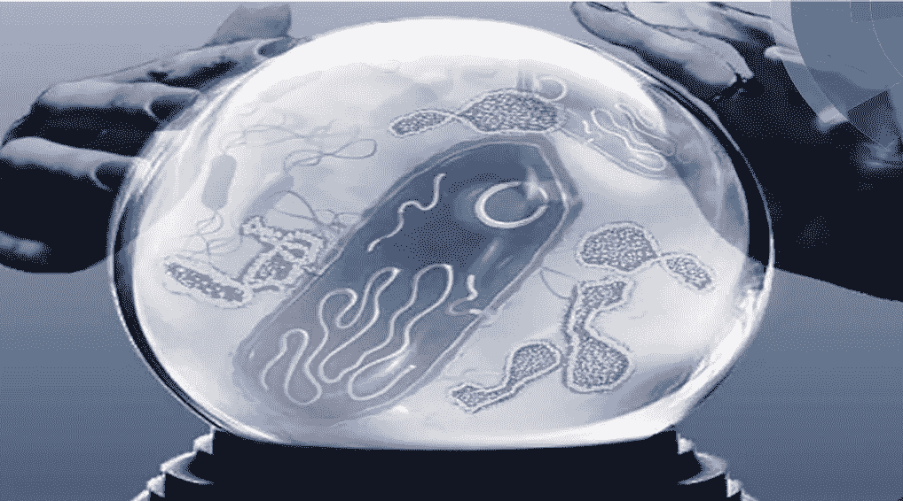
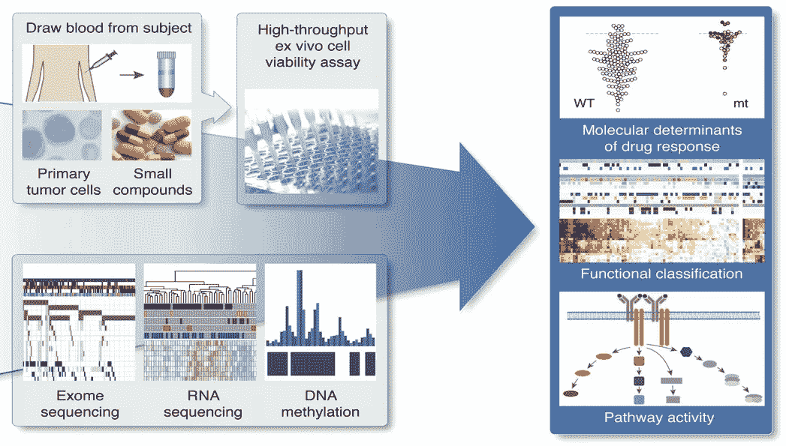
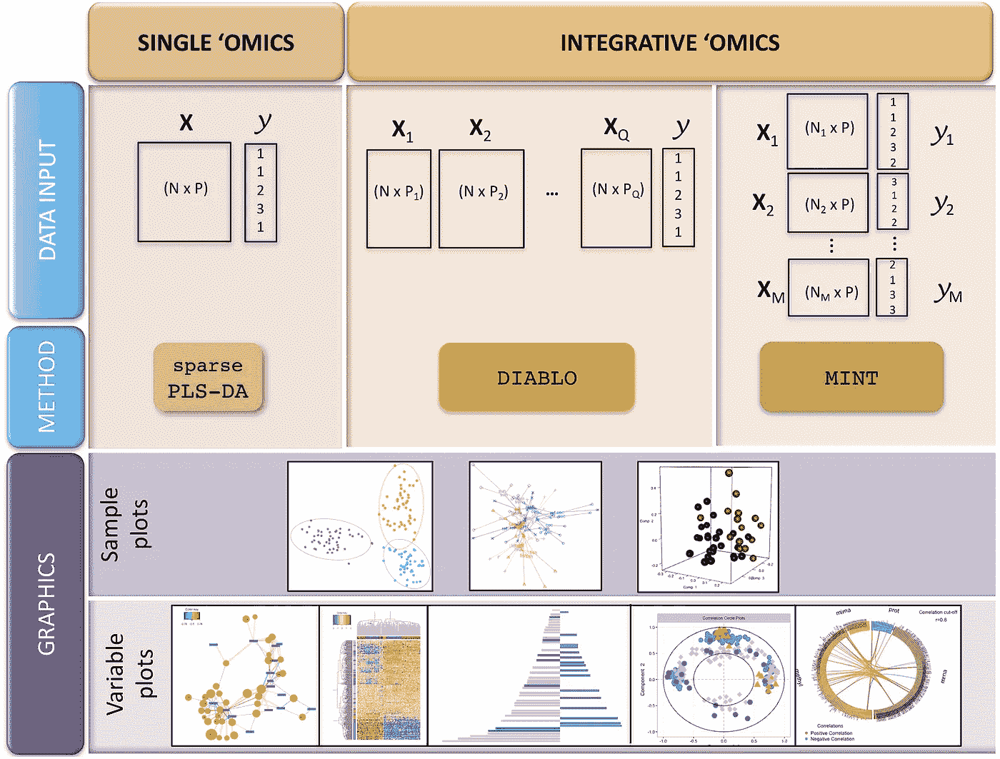
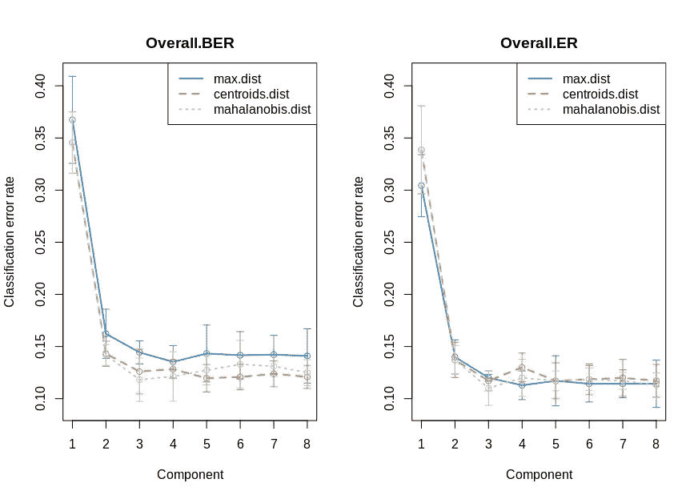
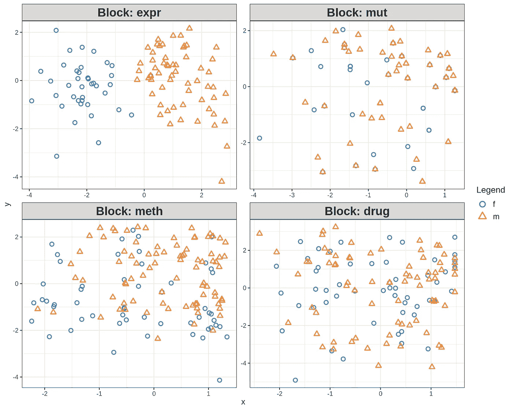
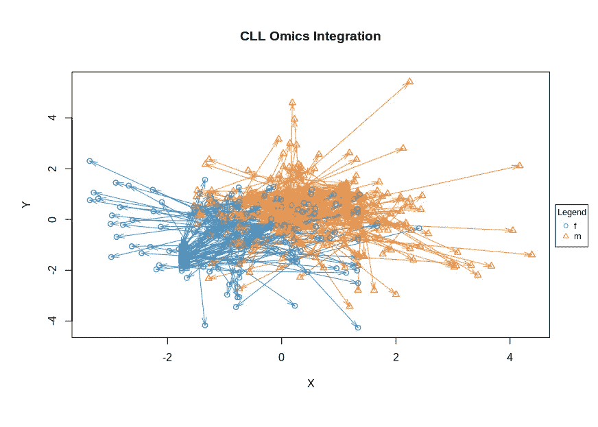
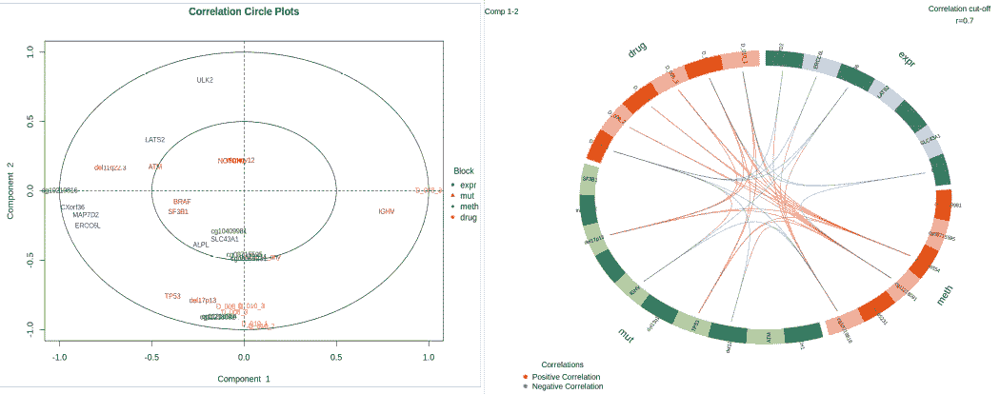
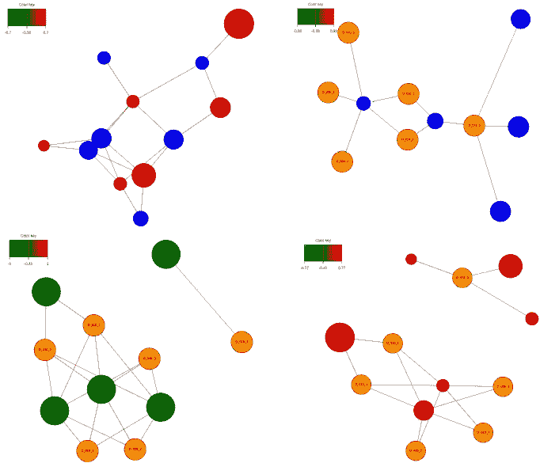

# 监督组学整合

> 原文：<https://towardsdatascience.com/supervised-omics-integration-2158e1a6d23f?source=collection_archive---------13----------------------->

## [生命科学的数理统计和机器学习](https://towardsdatascience.com/tagged/stats-ml-life-sciences)

## 结合多种生物信息来源

[Image source](https://pubs.rsc.org/en/content/articlepdf/2018/mo/c7mo00051k)

在这篇来自我的专栏 [**生命科学的数理统计和机器学习**](https://towardsdatascience.com/tagged/stats-ml-life-sciences?source=post_page---------------------------) 的文章中，我将扩展**分子组学集成**的主题，以便更好地对生物细胞进行建模。在之前的[文章](/select-features-for-omics-integration-511390b7e7fd)中，我介绍了这个主题，并解释了为什么我们需要在进行集成之前进行特性选择。这里我将解释如何使用**【PLS】****回归和判别分析**执行**监督的**组学整合。

# 慢性淋巴细胞白血病(CLL)数据集

随着大数据在这里成为现实，多分子组学的集成代表了计算生物学和生物医学中的当代挑战。我们将在此使用的**多组学**生物医学数据的一个例子是对**慢性淋巴细胞白血病(CLL)的研究。**这项研究将**药物反应**与**体细胞突变**信息、**转录组**图谱分析和 **DNA 甲基化**测定相结合。

From Dietrich et al., Journal of Clinical Investigation, 2017, [image source](https://www.jci.org/articles/view/93801)

**几十年来，执行整合的传统生物学方法**一直是组学层的**成对相关**。尽管其**可解释性**和**简单性**，这种方法被认为在多个组学集的情况下提供了不一致的信息。为了克服不同数据集之间**技术差异**的问题，组学集成的一个更有前途的想法是用**潜在变量**来表示每个数据集，这些潜在变量不包含它们产生的技术记忆。

# PLS-DA 与 DIABLO 的集成

当来自不同组学的**最具信息性特征** **以其第一个 PLS 成分**之间相关性的**约束被选择时，潜在变量概念的最直接实施是基于偏最小二乘(PLS)回归和判别分析的多组学的多元整合。这种方法由于其简单性和在 R 包 [**混合组学**](http://mixomics.org/) 中的高效实现而变得非常流行。**

Rohart et al., Plos Computational Biology, 2017, [image source](https://journals.plos.org/ploscompbiol/article?id=10.1371/journal.pcbi.1005752)

混合组学包括几个优雅的统计算法，其中 [**MINT**](http://mixomics.org/mixmint/) 代表**跨样本**整合，类似于 [**批量效应校正**](https://www.cell.com/trends/biotechnology/pdf/S0167-7799(17)30036-7.pdf) ， [**DIABLO**](http://mixomics.org/mixdiablo/) 代表**跨组学**整合，这是**真正的**多组学数据整合，我们将在此用于 CLL 数据集。

# CLL 经济集团与暗黑破坏神的整合

我们将从阅读 CLL 的数据开始，并用简单的中位数估算法估算缺失值。我们将使用性别作为感兴趣的特征，因此 PLS-DA 算法将跨多个组学同时执行特征**的提取，这些组学在低维潜在 PLS 空间中最大化雄性和雌性**之间的**分离。由于我们使用性别变量指导特征提取，这是一种**监督组学整合方法**。**

接下来，我们将 n=200 个 CLL 样本分成训练(n=140)和测试(n=60)数据集，用于稍后测试模型的**预测准确性**。由于突变代表二进制数据，由于用 0 和 1 编码，总会有一个**缺少变化**。因此，我们将通过排除个体间方差接近于零的位点来预过滤突变矩阵。接下来，由于基因表达和甲基化数据集是高维的，我们使用 LASSO 以我在[上一篇文章](/select-features-for-omics-integration-511390b7e7fd)中描述的方式执行特征**预选**。查看我的 [github](https://github.com/NikolayOskolkov/SupervisedOMICsIntegration) 笔记本中的完整代码，了解这些步骤的详细信息。接下来，我们执行**交叉验证**来选择预测组件的最佳数量:

Selecting optimal number of PLS components through M-fold cross-validation

分类错误率似乎在 ncomp=2 时达到其平稳状态，因此我们将使用该数量作为预测组件的最佳数量，以保留在进一步的下游分析中。上面的**设计矩阵**定义了组学之间的预期协方差。由于缺乏**先验知识**，我们在组学之间选择一个**强相关** 1。此外，我们将再次使用交叉验证，以便在运行稀疏 PLS-DA 时，确定每个 OMIC 的最佳特征数，用于提取**LASSO**最具预测性的变量。最后，在我们找到每个 OMIC 中预测成分和变量的最佳数量后，我们运行稀疏 PLS-DA 进行组学整合。

Low-dimensional latent PLS space representation of each individual OMIC

Consensus plot across OMICs as a result of OMICs integration. Males and Females are linearly separable

上面的四个图显示了进行综合特征提取后单个组学的低维 PLS 表示。相比之下，下面所谓的**箭头图**可以被认为是整个组学的**共识图。由于使用 PLS-DA 跨组学特征提取的同时**和**，它显示了非常清晰的男性和女性之间的分离。**

# 整合结果的生物学解释

混合组学为数据的生物学解释提供了许多令人印象深刻的可视化。在这里，我们展示了**相关性** **圆形图**，其中叠加了来自每个组学的最高负荷的变量。围绕圆的极点的变量**的聚类意味着来自组学数据集的变量之间的强相关性。相关圆图的**相反极点**上的变量暗示强**反相关**。**

Correlation Circle Plot (left) and Circus Plot (right) demonstrate feature connection across OMICs

另一种呈现组学中最具信息特征之间相关性的方法是所谓的 **Circos 图**。同样，该图的变量同时选自所有组学，即它们不同于从每个单独的 OMIC 单独获得的变量。**关联网络**是另一种以成对方式展示组学数据集中最具信息性特征之间关联的方式。

Correlation Network demonstrate par-wise correlations between features across OMICs

# 暗黑破坏神综合模型预测

现在是预测的时候了。一旦我们训练了 PLS-DA 模型，我们就可以使用它并利用 60 个测试样本来预测它们的性别并评估预测的准确性:

通常，在 CLL 数据集上，从 DIABLO 整合模型预测性别的成功率(准确性)为**60–70%**，这并不令人惊讶，因为这是一种**线性**整合方法。我们可以通过**人工神经网络**用非线性整合模型做得更好，我将在接下来的帖子中解释。

# 摘要

在这篇文章中，我们了解到 **PLS-DA** 是一种优雅的多变量组学整合方法，它**将单个数据集投影到一个公共的潜在低维空间**上，在那里数据集释放了它们初始**技术差异**的**内存**。组学可以在这个共同的潜在空间中合并，并且性状类别(也称为疾病-健康)变得**线性** **可分离**。

请在下面的评论中告诉我，生命科学中的哪些分析对你来说似乎是 T2 特别神秘的，我会在这个专栏中尝试回答这些问题。在我的 [github](https://github.com/NikolayOskolkov/SupervisedOMICsIntegration) 上查看完整的笔记本。在 Medium [关注我，在 Twitter @NikolayOskolkov 关注我，在 Linkedin](https://medium.com/u/8570b484f56c?source=post_page-----2158e1a6d23f--------------------------------) 关注我。下次我们将讨论**无监督组学整合方法**，敬请关注。