# 支持向量机解释

> 原文：<https://towardsdatascience.com/support-vector-machine-explained-8bfef2f17e71?source=collection_archive---------15----------------------->

## 理论、实现和可视化

支持向量机(SVM)可能是数据科学家使用的最流行的 ML 算法之一。SVM 是强大的，易于解释，并在许多情况下推广良好。在本文中，我将解释 SVM 背后的基本原理，并展示 Python 中的实现。为了简单起见，本文中我将重点讨论二进制分类问题。然而，SVM 支持多分类。

# 1.理论

## 1.1 背后的总体思路

SVM 寻求最佳决策边界，该边界将具有最高概括能力的两个类分开(为什么关注概括？我会在后面的内核部分解释)。人们问的第一个问题是 SVM 如何定义最优性。

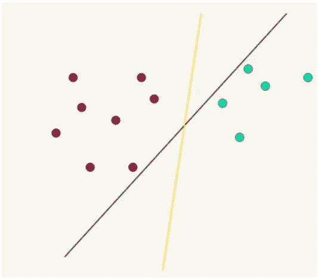

Which decision boundary should we pick? from [MIT](http://web.mit.edu/6.034/wwwbob/svm.pdf)

与通过总体概率定义最优性的逻辑回归不同，SVM 希望数据点和决策边界之间的最小距离尽可能大。换句话说，如果你把决策边界想象成街道的中心线，SVM 更喜欢 8 线高速公路，而不是乡村公路。街道的宽度被称为**边缘**。

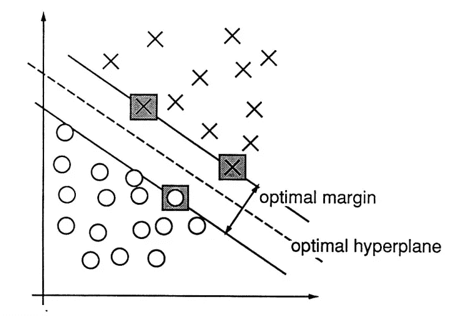

from Vapnik, [Support-Vector Network](http://image.diku.dk/imagecanon/material/cortes_vapnik95.pdf)

## 1.2 数学

**定义边距**

好吧，这个想法很直观。让我们找出边距的表达式。在我们开始之前，请记住本文中使用的符号:

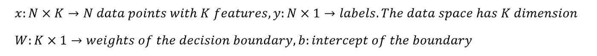

如果我们知道决策边界的权重和截距，则该边界可以由以下等式表示:

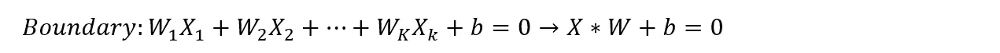

The equation for the broken line in the last figure

从数据点到边界的距离为:

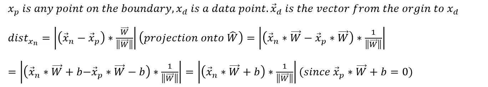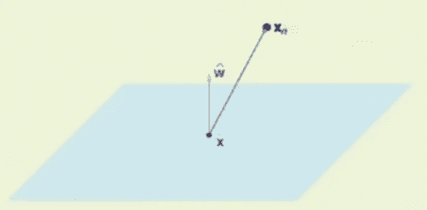

from [Lecture 14-Support Vector Machine, Caltech](https://www.youtube.com/watch?v=eHsErlPJWUU)

边距是从最近点到边界的距离:

**最终目标**

现在我们知道了如何计算利润，让我们尝试将需要优化的问题形式化:

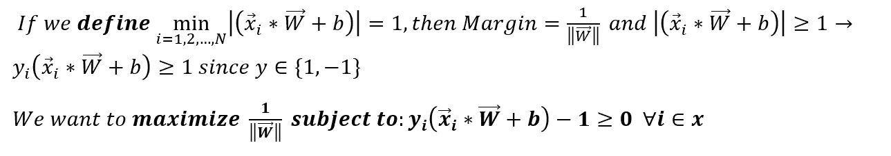

Final Objective

我不得不承认这是一个奇怪的函数。只要记住这一点:这就像线性回归的 RMSE，逻辑回归的交叉熵，一个需要优化的函数。

## **1.3 Python 实现**

现在我们了解了 svm 是如何工作的，让我们试试 SVM。Scikit-Learn 提供的 SVC 功能

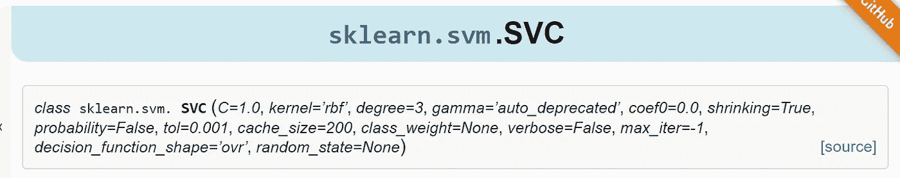

[from scikit-learn.org](https://scikit-learn.org/stable/modules/generated/sklearn.svm.SVC.html)

等等，这些参数是什么？目标中没有 C 或“内核”。你确定这是正确的功能吗？不幸的是，是的，我们只需要稍微深入一点 SVM 背后的数学。

## 1.4 又是理论…

现在我们需要谈谈如何优化目标函数。回想一下，该函数是:

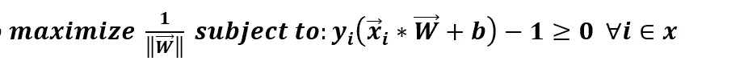

我们究竟如何最大化这个等式？我们不能求导就完事了，因为最终的 W 和 b 可能不满足约束。幸运的是，一个高中数学班的男生来拯救我们——拉格朗日。

**消除约束**

> 拉格朗日乘子的**方法是一种策略，用于寻找服从[等式约束](https://en.wikipedia.org/wiki/Constraint_(mathematics))(即服从一个或多个[方程](https://en.wikipedia.org/wiki/Equation)必须由所选变量值精确满足的条件)的[函数](https://en.wikipedia.org/wiki/Function_(mathematics))的局部[最大值和最小值](https://en.wikipedia.org/wiki/Maxima_and_minima)。[【1】](https://en.wikipedia.org/wiki/Lagrange_multiplier#cite_note-1)基本思想是将一个有约束的问题转换成一种形式，使得无约束问题的[导数测试](https://en.wikipedia.org/wiki/Derivative_test)仍然可以应用— [维基百科](https://en.wikipedia.org/wiki/Lagrange_multiplier)**

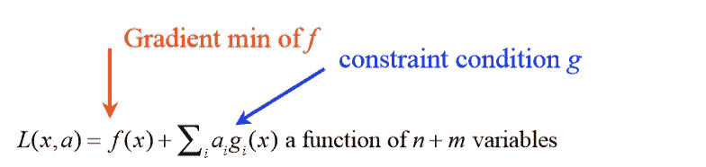

from [MIT](http://web.mit.edu/6.034/wwwbob/svm.pdf)

在拉格朗日乘数的帮助下，我们可以通过求解这个函数来找到上述问题的解:

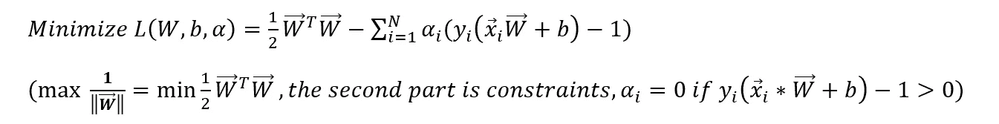

Unconstrained objective function

**算出 W 和 b**

现在，W，b 和α都是未知的。天哪，我们该怎么办？幸运的是，Vapnik Vladimir 为我们指出了这一点:

首先相对于 W 和 b 最小化 L(假设我们知道α)

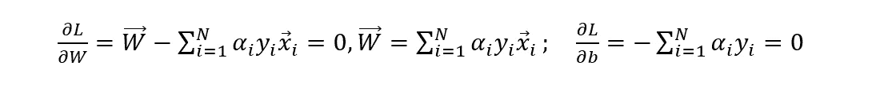

W and b are easy to find as long as we know alpha

用我们刚找到的 W 和 b 最大化 L w.r.t。

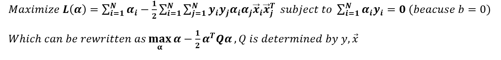

等等，为什么这突然变成最大化了？这被称为拉格朗日对偶。

> 拉格朗日对偶问题:我们可以根据之前获得的 w 和 b 的关系，在α(对偶变量)上最大化，而不是在 w，b 上最小化，受到α的约束—[SVM 白痴指南](http://web.mit.edu/6.034/wwwbob/svm.pdf)

上述函数有一个很好的形式，可以用[二次规划软件](https://scaron.info/blog/quadratic-programming-in-python.html)求解。只要把这个函数和约束传递给任何商业 QP 软件，它就会返回一个阿尔法列表。现在α解出来了，就可以计算 W 和 b 了。搞定了。

## **1.5 什么是参数‘C’**

在上面的定义中，我们假设所有点都必须在页边空白的边界上或超出它(一个所谓的硬 SVM)。实际上，通常不是这样。我们需要定义一个**软 SVM，允许轻微违反规则的行为受到一些处罚**:

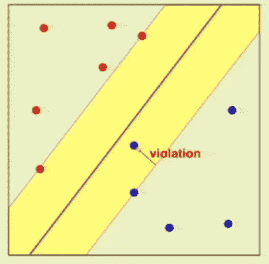

violation of constraints, from [Caltech](https://www.youtube.com/watch?v=XUj5JbQihlU)

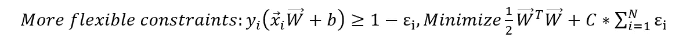

如您所见，C 决定了 SVM 对违规的严重程度。如果 C 是 0，那么 SVM 根本不关心违例，因为惩罚项已经没有了。如果 C 非常巨大，微小的违反将导致目标函数的巨大增量。这个函数的解可以用上面解释的相同方法导出。

## **1.6 什么是参数‘内核’**

内核技巧是一种强大的转换技术，它将数据从原始空间投影到转换后的空间，希望使数据更具线性可分性。

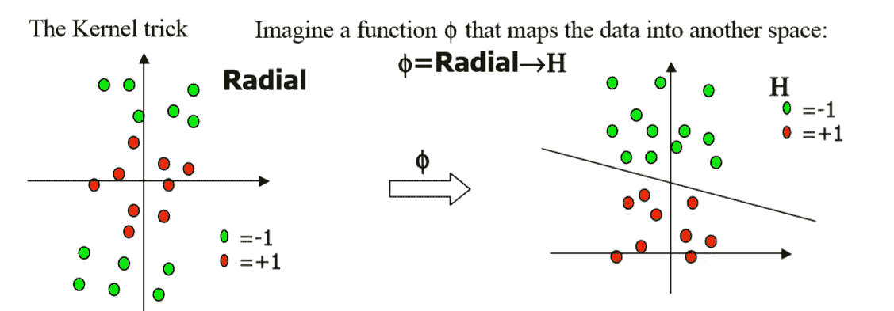

Radial kernel, fr[om An Idiot’s Guide to SVM](http://web.mit.edu/6.034/wwwbob/svm.pdf)

更严格地说，我们需要一个转换函数:

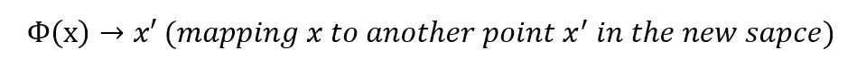

回想一下我们之前推导的目标函数:

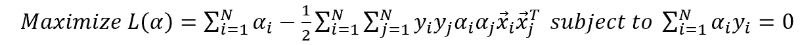

在新的空间中，我们必须计算这个函数:

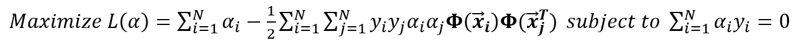

在内核转换的帮助下，我们将能够将数据映射到更高维度，并有更大的机会用超平面将它们分开。

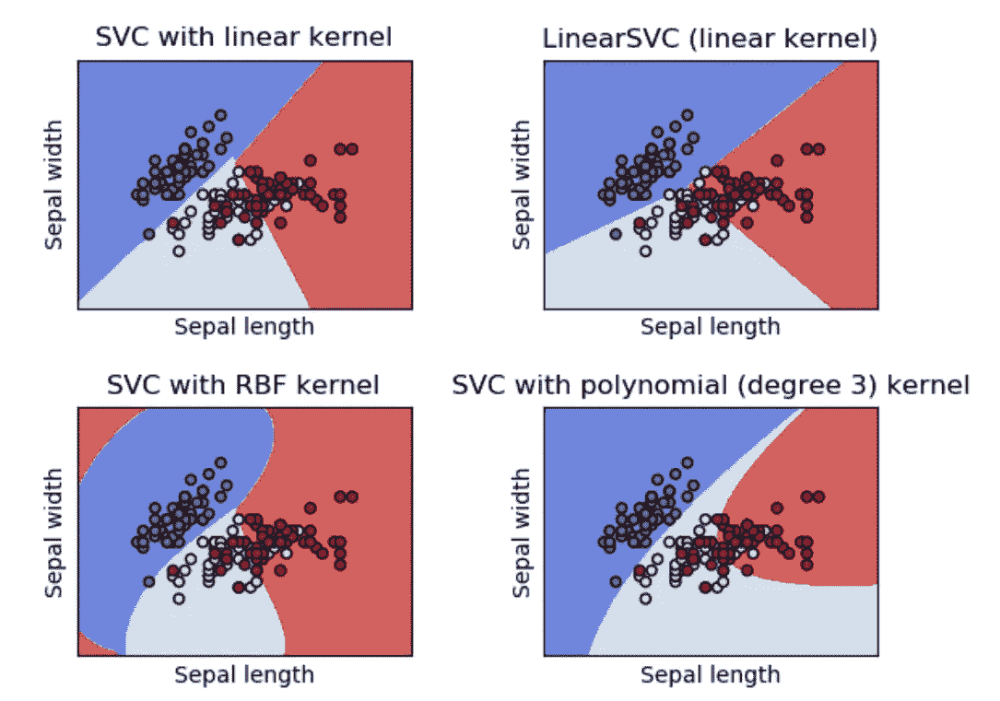

Decision boundary obtained with kernel methods, 3 classes, from [Scikit-Learn](https://scikit-learn.org/stable/modules/generated/sklearn.svm.SVC.html)

等等，为什么我们会得到非线性的边界？SVM 应该只找到线性边界。是的，你说对了一部分！你看到的决策边界是高维空间的投影。在我们在转换后的空间中完成分类后，**我们可以将超平面映射回来，边界可能会变成非线性的！**

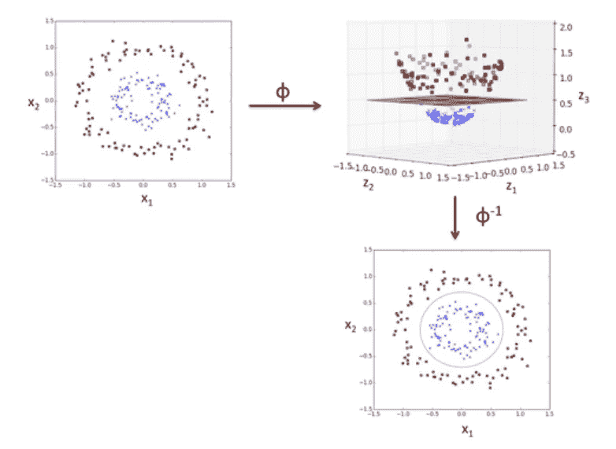

transformation of space, from [Sebastian Raschka](https://sebastianraschka.com/faq/docs/select_svm_kernels.html)

**当前转换的小问题**

变换函数将数据点投影到不同的空间。当投影空间变得更加复杂时，这个过程非常耗时。在某些情况下，我们甚至不知道变换方程。应该没有办法将一个数据点映射到一个无限维的空间。还是有？

如果我们再看一下变换后的目标函数，我们可以对它进行微小的修改:

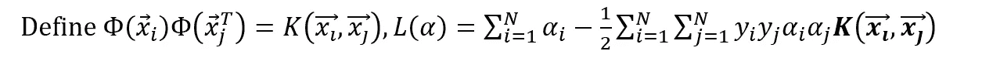

你可能会说:好吧，另一个定义，那又怎样？但是看，这是天才的部分。只要我们知道 K(xi，xj)是什么，我们就不需要变换函数。这意味着我们可以选择想要的空间，而不用担心中间的细节。有了这个，我可以定义在没有变换函数φ的情况下，变换后的空间的点积是什么样子。例如，一个无限的。

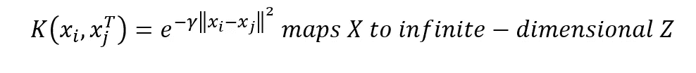

the See the proof [here](https://www.youtube.com/watch?v=XUj5JbQihlU)

您可能想知道一些著名的、经过充分测试的内核:

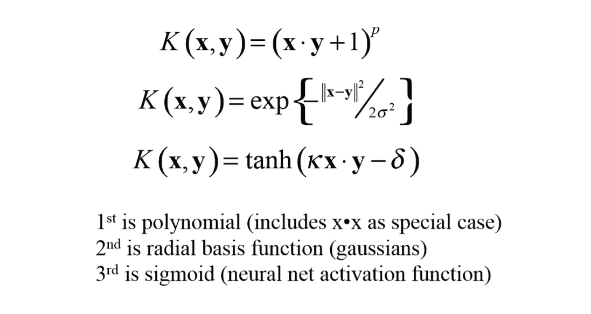

fr[om An Idiot’s Guide to SVM](http://web.mit.edu/6.034/wwwbob/svm.pdf)

# 2.又是 Python 实现

这一次，我们理解了这些参数的含义。让我们看看每个参数的效果。

## **C 的影响**

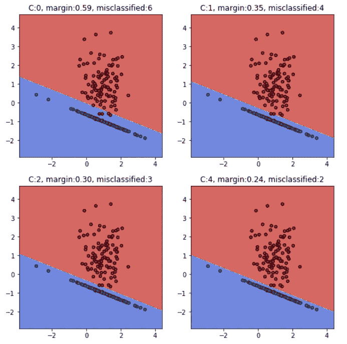

控制对错误分类点的关注。较大的 C 将迫使模型牺牲余量以支持正确的预测(可能导致过度拟合)

## **内核的影响**

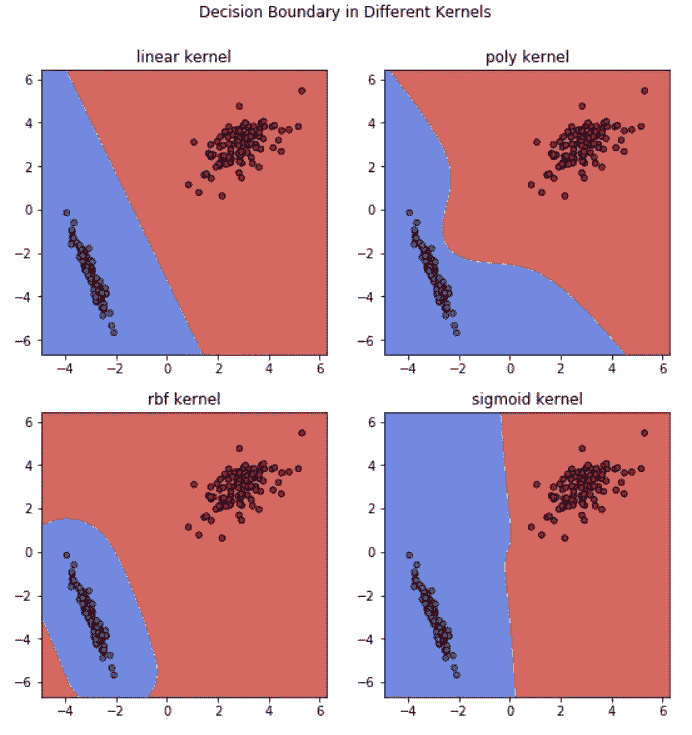

Effects of different kernel

# 优势和劣势

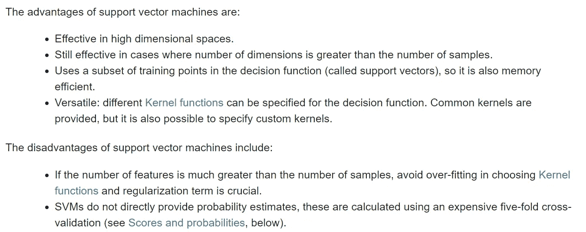

from [Scikit-Learn.org](https://scikit-learn.org/stable/modules/svm.html)

# 摘要

SVM 寻求决策边界的余量和错误分类点的数量之间的平衡。核技巧使 SVM 能够在不增加目标函数局部极小值的情况下引入强大的非线性。现在你明白了 SVM 是如何工作的，是时候在实际项目中尝试一下了！