# 支持向量机——公式和推导

> 原文：<https://towardsdatascience.com/support-vector-machine-formulation-and-derivation-b146ce89f28?source=collection_archive---------7----------------------->

Photo by [Andy Holmes](https://unsplash.com/@andyjh07?utm_source=unsplash&utm_medium=referral&utm_content=creditCopyText) on [Unsplash](https://unsplash.com/s/photos/solar-system?utm_source=unsplash&utm_medium=referral&utm_content=creditCopyText)

> 预测机器学习中的定性反应称为*分类*。

SVM 或支持向量机是最大限度地提高利润率的分类器。在下面的例子中，分类器的目标是找到一条线或(n-1)维超平面，它将 n 维空间中的两个类分开。

在下面给出的例子中，我们看到任何学习算法都会给出所提到的任何给定的行，但是什么可能是最好的行呢？

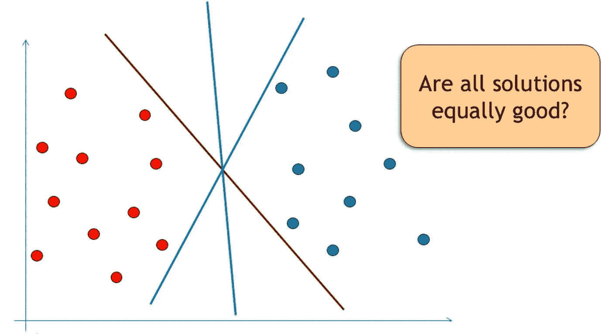

2 dimensional representation of binary classes

直观上，绿线看起来是最佳解决方案，因为它可能会对未来的测试数据集做出更好的预测。我们通过引入一个称为边缘的参数，即在没有任何训练样本的情况下，决策边界/分类器周围的带宽，来形式化分类器的*优度*的概念。

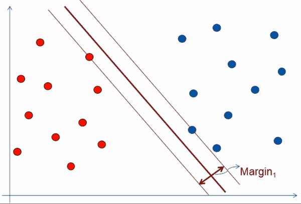

因此，目标是找到具有最大余量的决策边界。我们可以将边缘视为训练区域周围的区域，决策边界不能绕过该区域。随着半径的增加，可行域减小，它收敛到一条直线。

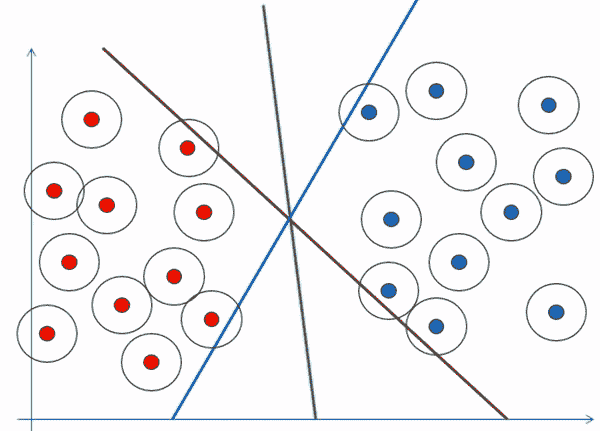

> 注意:只有少数带有气泡的训练样本触及了决策边界。这些样本本质上被称为支持向量。

# **打破维度诅咒**

1970 年，数学家 [Vapnik 和 Chervonenkis](http://mathworld.wolfram.com/Vapnik-ChervonenkisDimension.html) 给出了 VC 维的概念，他们将未来测试误差(R(α))估计为训练误差和 VC 维的某个函数(单调递增函数)。

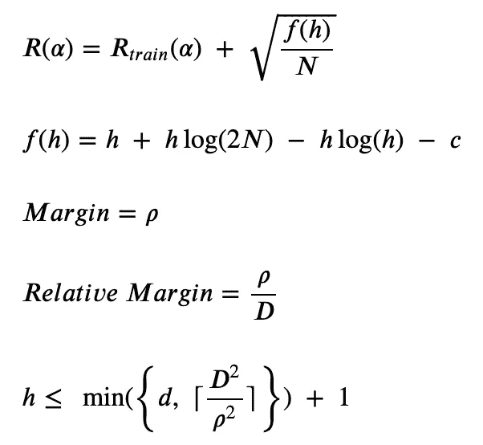

VC 维数 h 被写成相对裕度平方的倒数和数据维数的最小值。因此，如果我们可以最大化相对裕度，我们将最小化它的平方反比，如果它低于数据的维度，h 将变得独立于维度。

> 注意:相对裕度就是裕度除以包含所有训练点的圆的直径。

# **SVM 的提法**

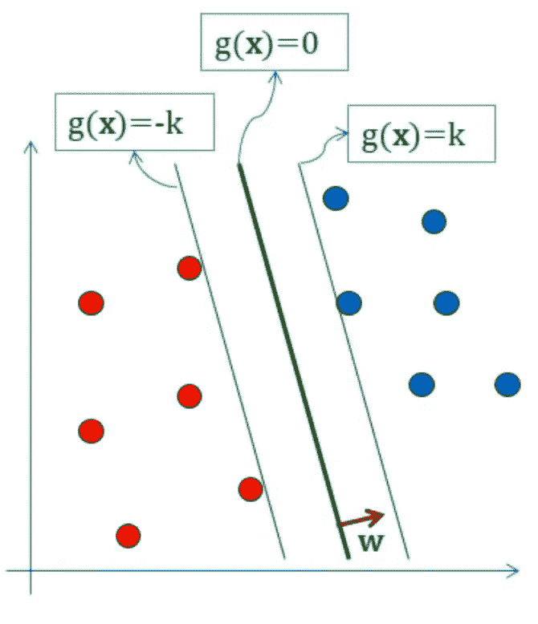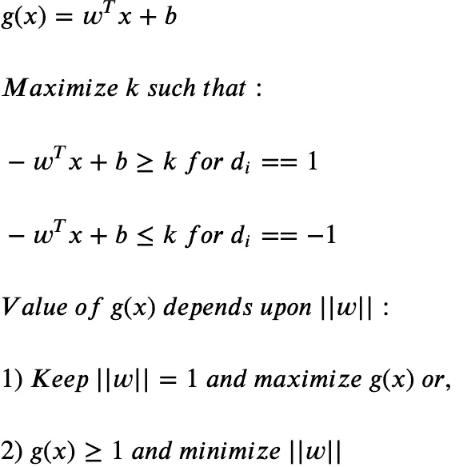

我们使用方法 2 并将问题公式化为:

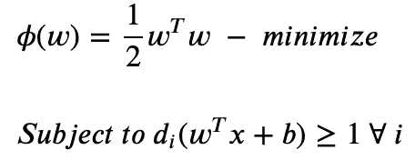

对[拉格朗日形式](https://en.wikipedia.org/wiki/Lagrange_multiplier)中的常数进行积分，我们得到:

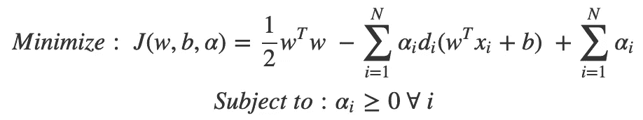

拉格朗日乘数法规定，如前所述，对于 w 和 b，J 最小化，但是对于 **α，J 必须**最大化**。**J 代表的点称为[鞍点](https://en.wikipedia.org/wiki/Saddle_point)。

函数 J 目前以它的[原始形式](https://en.wikipedia.org/wiki/Duality_%28optimization%29)表示，我们可以把它转换成它的对偶形式来求解。

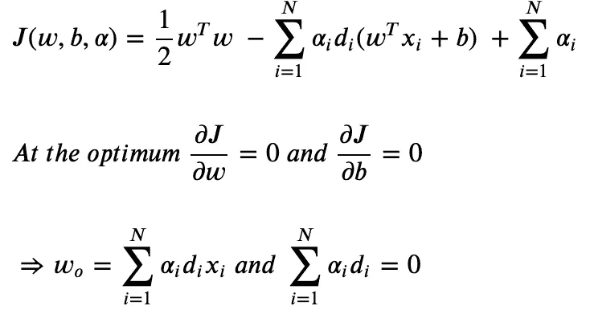

同样，从拉格朗日乘子的 [KKT 条件](https://en.wikipedia.org/wiki/Karush%E2%80%93Kuhn%E2%80%93Tucker_conditions)中，我们可以说 J 函数中对应于拉格朗日乘子的所有项在最优时应该趋向于 0。

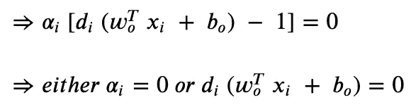

这意味着非零拉格朗日系数对应于支持向量数据点。利用上述等式，我们可以将 J 写成:

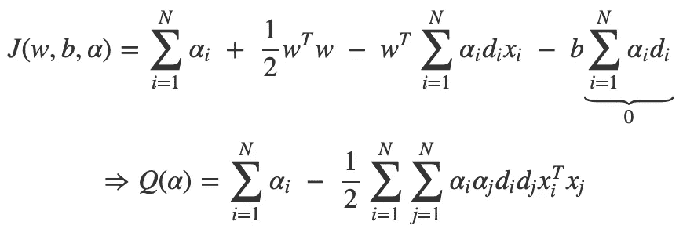

Q(α)代表 ***对偶形式*** J 它只依赖于α，其余都是已知的标量。我们可以用任何 QP 优化来求解 Q(α)，这超出了本文的范围。在得到α之后，我们得到 w，从这点出发，任何一个支持向量都可以根据 KKT 条件得到 b。

# 非线性可分离数据

我们研究了数据是线性可分的情况。现在，我们来看看数据可能不线性分离的情况，原因是

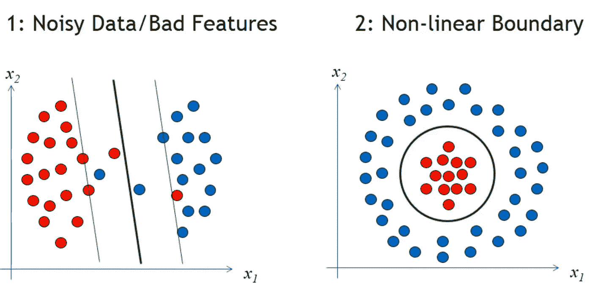

**噪声数据**

对于有噪声的数据，我们在估计/优化中引入一个训练误差参数。我们引入一个松弛变量，并增加额外的条件如下

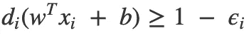

用拉格朗日系数重复同样的过程，我们得到

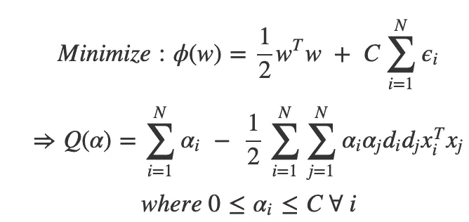

唯一的区别是现在拉格朗日系数有了限制。参数 C 控制训练误差和 VC 维数之间的相对权重。

# 非线性边界

任何具有非线性边界的数据集，如果投影到更高维度，理论上都是线性可分的。

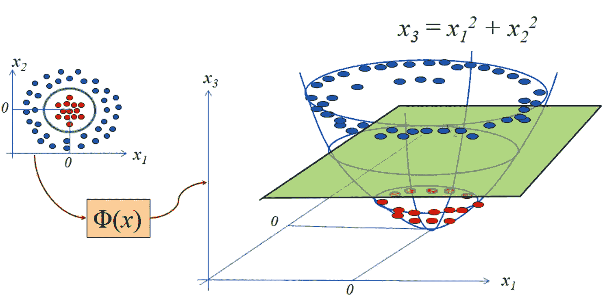

因此 Q(α)可以写成:

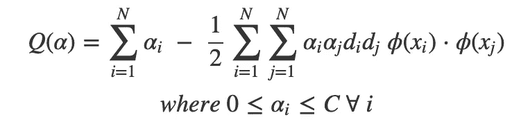

我们可以将 w 和其他测试相位方程写成:

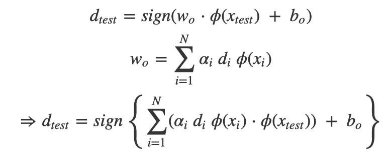

## 内核技巧

我们可以看到，在训练和测试中，映射都以点积的形式出现。由于我们不知道映射，我们可以找到一个函数 **K(x，y)** 它等价于映射的点积；我们可以避免显式映射到更高维度。

让我们举一个二次核的例子来更好地理解。

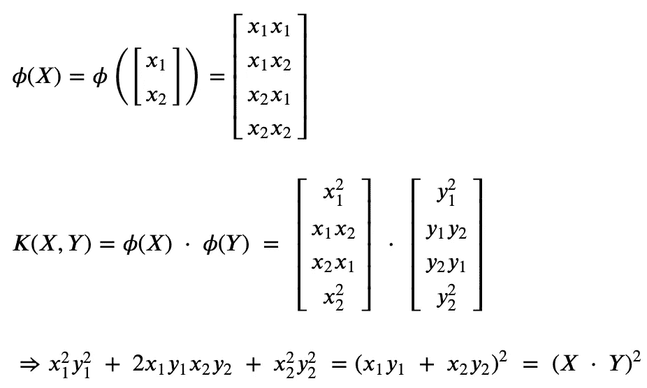

我们看到，与映射然后相乘相比，核函数的计算复杂度更低。
这个可以扩展到 n 维内核。因此，n 维映射/核可以表示为

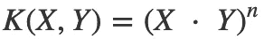

> 注意:添加两个有效内核也给了我们一个内核。这很容易证明。

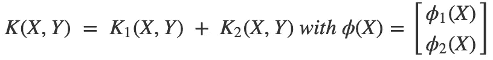

因此，为了映射到极高的维度，我们可以将内核计算为:

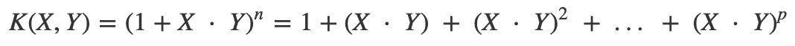

# 无限维度

理论上，如果映射到无限维超平面，数据集将是线性可分的。因此，如果我们能找到一个能给出无限超平面映射乘积的核，我们的工作就完成了。

这里出现了 [Mercer 定理](https://en.wikipedia.org/wiki/Mercer%27s_theorem)，它陈述了当且仅当 K(X，Y)是对称的、连续的和正半定的(那么 Mercer 的条件)，它可以表示为

意味着高维映射的线性组合的存在是有保证的。因此，现在我们只需检查函数是否满足 Mercer 条件，就可以得到无限维的映射。

我以此结束我关于 SVM 的博客，这是我用过的最好的分类器之一，观看这个空间的更多内容。