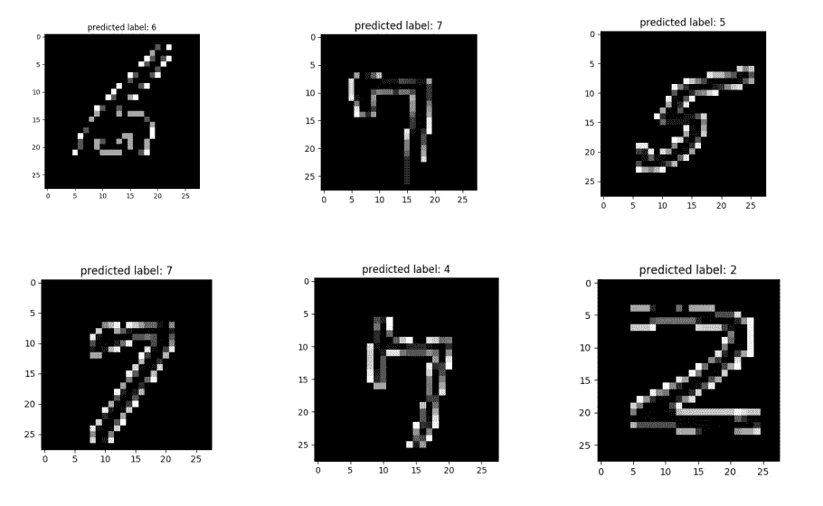

# 支持向量机:用 Python 实现数字分类:包括我手写的数字

> 原文：<https://towardsdatascience.com/support-vector-machine-mnist-digit-classification-with-python-including-my-hand-written-digits-83d6eca7004a?source=collection_archive---------4----------------------->

## 了解 SVM 系列:第三部分

在前面对 SVM 算法的详细讨论之后，我将用一个 SVM 对手写数字进行分类的应用程序来结束这个系列。这里我们将使用 MNIST [数据库](http://yann.lecun.com/exdb/mnist/)来存储手写数字，并使用 SVM 对数字从 0 到 9 进行分类。原始数据集处理起来很复杂，所以我使用 Joseph [Redmon](https://pjreddie.com/projects/mnist-in-csv/) 处理过的数据集。

我已经遵循了 Kaggle 竞赛程序，你可以从 kaggle 本身下载数据集。数据集基于手写数字的灰度图像，每幅图像高 28 像素，宽 28 像素。每个像素都有一个与之关联的数字，其中 0 表示暗像素，255 表示白像素。训练和测试数据集都有 785 列，其中“标签”列代表手写数字，其余 784 列代表(28，28)像素值。训练和测试数据集分别包含 60，000 和 10，000 个样本。我将使用我在[上一篇](/a-simple-example-of-pipeline-in-machine-learning-with-scikit-learn-e726ffbb6976)文章中介绍的几个技术，比如`GridSearchCV`和`Pipeline`，以及一些新概念，比如用`numpy`数组表示灰度图像。

我使用了来自训练和测试数据集的 12000 个样本和 5000 个样本，只是为了减少计算时间，建议使用完整的数据集来获得更好的分数，并避免选择偏差。

```
import math, time 
import matplotlib.pyplot as plt
import numpy as np 
import pandas as pdstart = time.time() MNIST_train_small_df = pd.read_csv('mnist_train_small.csv', sep=',', index_col=0)
#print MNIST_train_small_df.head(3)
print MNIST_train_small_df.shape>> (12000, 785)
```

我们可以通过打印出 `**value_counts()**`和/或标签分布图**来检查训练数据集是否偏向某些数字。**

```
sns.countplot(MNIST_train_small_df['label'])
plt.show()# looks kinda okay# or we can just printprint MNIST_train_small_df['label'].value_counts()>>
1    1351
7    1279
3    1228
6    1208
0    1206
9    1193
4    1184
2    1176
8    1127
5    1048
```


Figure 1: Bar plots of sample distribution in training data set

我们看到选择稍微偏向数字 1，并且标签 1 的样本计数比样本 5 高大约 30%，即使我们使用完整的训练数据集(60，000 个样本)，这个问题仍然存在。继续，是时候分开标签和像素列了，标签是数据帧的第一列。

```
X_tr = MNIST_train_small_df.iloc[:,1:] # iloc ensures X_tr will be a dataframe
y_tr = MNIST_train_small_df.iloc[:, 0]
```

然后，我将训练数据和测试数据分开，20%的样本用于测试数据。我使用了`**stratify=y**` **来保存标签的分布**(数字)—

```
X_train, X_test, y_train, y_test = train_test_split(X_tr,y_tr,test_size=0.2, random_state=30, stratify=y_tr)
```

由于像素值在 0-255 的范围内变化，是时候使用一些标准化了，我已经使用了`[StandardScaler](https://scikit-learn.org/stable/modules/generated/sklearn.preprocessing.StandardScaler.html)`，它通过移除平均值并将其缩放到单位方差来标准化特征。 ***同样在尝试了所有的核之后，多项式核取得了最好的成绩和最少的时间。*** 要了解更多关于内核的技巧，你可以查看[以前的帖子](/understanding-support-vector-machine-part-2-kernel-trick-mercers-theorem-e1e6848c6c4d)。

这里我们将设置`Pipeline`对象，用`StandardScaler`和`SVC`分别作为转换器和估计器。

```
steps = [('scaler', StandardScaler()), ('SVM', SVC(kernel='poly'))]
pipeline = Pipeline(steps) # define Pipeline object
```

为了决定`C, gamma`的值，我们将使用具有 5 重交叉验证的`GridSearchCV`方法。如果你想了解更多关于管道和网格搜索的知识，请查看我之前的[帖子](/a-simple-example-of-pipeline-in-machine-learning-with-scikit-learn-e726ffbb6976)。

```
parameters = {'SVM__C':[0.001, 0.1, 100, 10e5], 'SVM__gamma':[10,1,0.1,0.01]}grid = GridSearchCV(pipeline, param_grid=parameters, cv=5)
```

现在，我们准备测试模型并找到最合适的参数。

```
grid.fit(X_train, y_train)print "score = %3.2f" %(grid.score(X_test, y_test))print "best parameters from train data: ", grid.best_params_>> 
score = 0.96best parameters from train data:  {'SVM__C': 0.001, 'SVM__gamma': 10}>>y_pred = grid.predict(X_test)
```

**使用 12000 个样本获得了 96%的准确率**，我预计使用完整的 60000 个样本后，这个分数会有所提高。`GridSearchCV`部分比较耗时，如果你愿意，可以直接使用 C 和 gamma 参数。

我们可以检查一些预测

```
print y_pred[100:105]
print y_test[100:105]>> 
[4 2 9 6 0]
1765     4
220      2
932      9
6201     6
11636    0
```

我们现在可以使用 python matplotlib pyplot `imshow`来绘制数字。我们使用预测列表和来自测试列表的像素值进行比较。

```
for i in (np.random.randint(0,270,6)):
 two_d = (np.reshape(X_test.values[i], (28, 28)) * 255).astype(np.uint8)
 plt.title('predicted label: {0}'. format(y_pred[i]))
 plt.imshow(two_d, interpolation='nearest', cmap='gray')
 plt.show()
```

让我简单解释一下代码的第二行。由于像素值在数据集中排列成 784 列的一行，我们首先使用`numpy`‘reshape’模块将其排列成 28 X 28 的数组，然后乘以 255，因为像素值最初是标准化的。请注意`X_test.values`返回数据帧的‘numpy’表示。



Figure 2: Examples of digit classification on training data-set.

正如你在上面的图片中看到的，除了一个，所有的图片都被正确分类了(我认为图片(1，1)是数字 7 而不是 4)。要知道有多少数字被错误分类，我们可以打印出*混淆矩阵。*根据 [scikit-learn](https://scikit-learn.org/stable/modules/generated/sklearn.metrics.confusion_matrix.html) 中给出的定义

> 混淆矩阵 C 使得 c(i，j)等于已知在组 I 中但预测在组 j 中的观察值的数量

```
print "confusion matrix: \n ", confusion_matrix(y_test, y_pred)>>[[236   0   0   1   1   2   1   0   0   0]
 [  0 264   1   1   0   0   1   1   2   0]
 [  0   1 229   1   2   0   0   0   1   1]
 [  0   0   2 232   0   3   0   2   5   2]
 [  0   1   0   0 229   1   1   0   1   4]
 [  0   0   1   4   1 201   0   0   1   2]
 [  3   1   2   0   3   3 229   0   0   0]
 [  0   1   3   0   6   0   0 241   0   5]
 [  0   0   3   6   1   2   0   0 213   0]
 [  3   1   1   0   1   0   0   1   2 230]]
```

因此，如果我们考虑第一行，我们可以理解，在 241 个零中，236 个被正确分类，等等..

现在，我们将对测试数据集(mnist_test.csv)重复该过程，但我没有使用`GridSearchCV`来寻找 SVM (C，gamma)的最佳参数，而是使用了来自训练数据集的相同参数。

如前所述，我使用了 5000 个样本而不是 10000 个测试样本来减少时间消耗。

```
MNIST_df = pd.read_csv('mnist_test.csv')
MNIST_test_small = MNIST_df.iloc[0:5000]
MNIST_test_small.to_csv('mnist_test_small.csv')
MNIST_test_small_df = pd.read_csv('mnist_test_small.csv', sep=',', index_col=0)
```

下一步是选择特征和标签—

```
X_small_test = MNIST_test_small_df.iloc[:,1:]
Y_small_test = MNIST_test_small_df.iloc[:,0]
```

将特征和标签分为训练集和测试集

```
X_test_train, X_test_test, y_test_train, y_test_test = train_test_split(X_small_test,Y_small_test,test_size=0.2, random_state=30, stratify=Y_small_test)
```

设置`Pipeline`对象

```
steps1 = [('scaler', StandardScaler()), ('SVM', SVC(kernel='poly'))]
pipeline1 = Pipeline(steps1) # define
```

设置`GridSearchCV`对象，但这次我们使用通过 mnist_train.csv 文件估算的参数。

```
parameters1 = {'SVM__C':[grid.best_params_['SVM__C']], 'SVM__gamma':[grid.best_params_['SVM__gamma']]} grid1 = GridSearchCV(pipeline1, param_grid=parameters1, cv=5)
grid1.fit(X_test_train, y_test_train)print "score on the test data set= %3.2f" %(grid1.score(X_test_test, y_test_test))print "best parameters from train data: ", grid1.best_params_ # same as previous with training data set>>
score on the test data set= 0.93best parameters from train data:  {'SVM__C': 0.001, 'SVM__gamma': 10}>>y_test_pred = grid1.predict(X_test_test)
```

测试数据集上的得分为 93%，而训练数据集上的得分为 96%。下面是测试数据集中的一些随机图像，与预测水平进行了比较。


Figure 3: Examples of digit classification on test data-set.

我们可以检查测试数据集的混淆矩阵，以全面了解错误分类。

```
print "confusion matrix: \n ", confusion_matrix(y_test_test, y_test_pred)>>[[ 91   0   0   0   0   0   0   0   1   0]
 [  0 111   2   0   1   0   0   0   0   0]
 [  0   0  98   1   0   0   1   2   4   0]
 [  0   0   1  91   0   2   0   0   4   2]
 [  0   0   0   1  95   0   0   1   0   3]
 [  0   0   1   3   1  77   4   0   3   2]
 [  1   1   1   0   2   0  85   0   2   0]
 [  0   0   0   1   0   0   0 100   0   2]
 [  0   0   1   1   0   2   0   1  93   0]
 [  0   0   0   0   4   1   0   3   3  93]]
```

请注意，在 92 个标签中，只有 1 个数字 0 分类错误。现在我们将继续讨论对我自己的手写图像进行分类的可能性。

## 对自己的手写图像进行分类:

下面是我准备数据集，然后对从 0 到 9 的数字进行分类的步骤

1.  我已经使用 [*mypaint*](http://mypaint.org/) *首先编写(绘制)图像*，然后使用 *Imagemagick 来调整图像*的大小，使其高度和宽度为 28X28 像素。

```
convert -resize 28X28! sample_image0.png sample_image0_r.png
```


Figure 4: Resized (28X28) My Own Hand-written Images

2.*将图像转换为 numpy 数组*并检查像素值是如何分布的。你可以在我的 [github](https://github.com/suvoooo/MNIST_digit_classify/blob/description/codes/checkIMagePixel_stack.py) 上找到代码，下面是两个例子


Figure 5: Representing images with pixels using Image and Numpy

3.*将数组(28X28)展平为(784，)*转换为列表。然后写在一个 csv 文件，包括标签，即像素代表的数字。所以现在总列数是 785，与我以前使用的训练和测试 csv 文件一致。这些代码可在[github.com](https://github.com/suvoooo/MNIST_digit_classify/blob/description/codes/checkIMagePixel.py)获得。

4.把新的数据帧和测试数据帧连接起来，这样新文件就多了 10 行。

5.最后*用这个新文件*运行相同的分类过程，只有一个不同——训练和测试数据不是使用`train_test_split`方法准备的，因为我的主要目的是看看算法如何对新数据起作用。所以我选择了前 3500 行用于训练，剩下的行(包括新数据)作为测试样本。

```
X_hand_train = new_file_df_hand.iloc[0:3500, 1:]
X_hand_test  = new_file_df_hand.iloc[3500:5011, 1:]
y_hand_test = new_file_df_hand.iloc[3500:5011, 0]
y_hand_train = new_file_df_hand.iloc[0:3500, 0]
```

6.为了绘制手写图像以及它们与预测输出的匹配程度，我像以前一样使用了以下 for 循环——因为最后 1500 个样本(包括我自己的手写图像)被作为测试数据，所以循环在最后几行上进行。

```
for ik in range(1496, 1511, 1):
 three_d = (np.reshape(X_hand_test.values[ik], (28, 28)) * 255).astype(np.uint8)
 plt.title('predicted label: {0}'. format(y_hand_pred[ik]))
 plt.imshow(three_d, interpolation='nearest', cmap='gray')
 plt.show()
```

7.包括我自己手写数据在内的测试数据集上的得分是 93%。

8.让我们来看看分类器对我的笔迹从 0 到 9 的分类有多好


Figure 5: Predicted labels on my hand-written digits. 70% correct !!!

因此，10 个手写数字中有 7 个被正确分类，这很好，因为如果你与 MNIST 数据库的图像进行比较，我自己的图像是不同的，我认为一个原因是笔刷的选择。正如我意识到的，我使用的笔刷产生了更厚的图像。特别是在与 MNIST 图像比较时，我发现我的图像中边缘之间的像素比 MNIST 图像更亮(更高的像素值— > 255)，这可能是 30%错误分类的原因。

我想你已经知道如何使用支持向量机来处理更现实的问题了。作为一个迷你项目，你可以使用类似的算法来分类 MNIST [时尚数据](https://www.kaggle.com/zalando-research/fashionmnist/home)。

希望你喜欢这篇文章，如果你想了解更多关于 SVM 的基础知识，请查看我以前在这个系列中的文章。