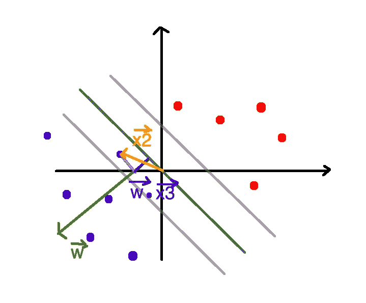

# 支持向量机 Python 示例

> 原文：<https://towardsdatascience.com/support-vector-machine-python-example-d67d9b63f1c8?source=collection_archive---------0----------------------->


Photo by [Green Chameleon](https://unsplash.com/@craftedbygc?utm_source=medium&utm_medium=referral) on [Unsplash](https://unsplash.com?utm_source=medium&utm_medium=referral)

支持向量机(SVM)是一种有监督的机器学习算法，能够执行分类、回归甚至离群点检测。线性 SVM 分类器的工作原理是在两个类之间画一条直线。落在线一侧的所有数据点将被标记为一类，落在线另一侧的所有数据点将被标记为第二类。听起来很简单，但是有无限多的行可供选择。我们如何知道哪一行在分类数据方面做得最好？这就是 LSVM 算法发挥作用的地方。LSVM 算法将选择一条线，该线不仅将两个类分开，而且尽可能远离最近的样本。事实上，“支持向量机”中的“支持向量”指的是从原点到指定决策边界的点所绘制的两个位置向量。


# 算法

假设，我们有一个向量 *w* ，它总是垂直于超平面(垂直于 2 维中的直线)。通过将样本的位置向量投影到向量 *w* 上，我们可以确定样本距离我们的决策边界有多远。快速复习一下，两个向量的点积与第一个向量到第二个向量的投影成正比。


[https://commons.wikimedia.org/wiki/File:Scalar_Projection.png](https://commons.wikimedia.org/wiki/File:Scalar_Projection.png)

如果它是一个正样本，我们将坚持认为前面的决策函数(给定样本的位置向量和 *w* 的点积加上某个常数)返回一个大于或等于 1 的值。


类似地，如果它是一个负样本，我们将坚持继续决策函数返回一个小于或等于-1 的值。


换句话说，我们不会考虑位于决策边界和支持向量之间的任何样本。



正如在[麻省理工学院讲座](https://www.youtube.com/watch?v=_PwhiWxHK8o)中所述，为了方便起见，我们引入了一个附加变量。变量 *y* 对于所有正样本等于正 1，对于所有负样本等于负 1。


在乘以 *y* 之后，正样本和负样本的等式彼此相等。


也就是说，我们可以将约束简化为一个等式。


接下来，我们需要解决我们着手最大化利润的过程。为了得到边缘宽度的等式，我们从下面的一个中减去第一个支持向量，然后将结果乘以单位向量 *w* ，其中总是垂直于决策边界。


使用上面的约束和一点代数，我们得到下面的。


因此，为了选择最佳决策边界，我们必须最大化我们刚刚计算的方程。在继续之前，我们还应用了一些技巧(参考[麻省理工学院讲座](https://www.youtube.com/watch?v=_PwhiWxHK8o))。


现在，在大多数机器学习算法中，我们会使用类似梯度下降的东西来最小化所述函数，然而，对于支持向量机，我们使用拉格朗日函数。拉格朗日超出了本文的范围，但是如果你需要一个快速速成班，我推荐你去看看 [*汗学院*](https://www.youtube.com/watch?v=hQ4UNu1P2kw) 。本质上，使用拉格朗日，我们可以像在高中水平的微积分中一样求解全局最小值(即，取函数的导数并使其等于零)。拉格朗日告诉我们，通过对所有约束求和来减去成本函数，其中每个约束将乘以某个常数α(拉格朗日通常记为λ)。


然后，我们执行更多的代数运算，将上一步中找到的方程插回到原始方程中。


在我们进一步讨论之前，我们需要用矩阵来表示这个方程，而不是求和。原因是，来自 [CVXOPT](https://cvxopt.org/userguide/coneprog.html#quadratic-programming) 库的`qp`函数，我们将使用它来求解拉格朗日函数，接受非常具体的参数。因此，我们需要从:


其中:


并且:


收件人:


我们可以使用以下标识来实现这一点:


在应用它们时，我们得到:


*注:X 是 X 和 y 的乘积(不要和 X 混淆)*

然后，我们将变量映射到 [CVXOPT](https://cvxopt.org/userguide/coneprog.html#quadratic-programming) 库所期望的变量。


# Python 代码

现在，我们准备写一些代码。我们将从导入必要的库开始。

```
import numpy as np
import cvxopt
from sklearn.datasets.samples_generator import make_blobs
from sklearn.model_selection import train_test_split
from matplotlib import pyplot as plt
from sklearn.svm import LinearSVC
from sklearn.metrics import confusion_matrix
```

然后，我们定义我们的 SVM 类。正如我们之前提到的，我们可以使用拉格朗日函数直接求解 *w* 和 *b* ，而不是像线性回归那样使用梯度下降来寻找最佳拟合线。

```
class SVM:def fit(self, X, y):
        n_samples, n_features = X.shape# P = X^T X
        K = np.zeros((n_samples, n_samples))
        for i in range(n_samples):
            for j in range(n_samples):
                K[i,j] = np.dot(X[i], X[j])P = cvxopt.matrix(np.outer(y, y) * K)# q = -1 (1xN)
        q = cvxopt.matrix(np.ones(n_samples) * -1)# A = y^T 
        A = cvxopt.matrix(y, (1, n_samples))# b = 0 
        b = cvxopt.matrix(0.0)# -1 (NxN)
        G = cvxopt.matrix(np.diag(np.ones(n_samples) * -1))# 0 (1xN)
        h = cvxopt.matrix(np.zeros(n_samples))solution = cvxopt.solvers.qp(P, q, G, h, A, b)# Lagrange multipliers
        a = np.ravel(solution['x'])# Lagrange have non zero lagrange multipliers
        sv = a > 1e-5
        ind = np.arange(len(a))[sv]
        self.a = a[sv]
        self.sv = X[sv]
        self.sv_y = y[sv]# Intercept
        self.b = 0
        for n in range(len(self.a)):
            self.b += self.sv_y[n]
            self.b -= np.sum(self.a * self.sv_y * K[ind[n], sv])
        self.b /= len(self.a)# Weights
        self.w = np.zeros(n_features)
        for n in range(len(self.a)):
            self.w += self.a[n] * self.sv_y[n] * self.sv[n]

    def project(self, X):
        return np.dot(X, self.w) + self.b

    def predict(self, X):
        return np.sign(self.project(X))
```

为了简单起见，我们将使用`scikit-learn`库来生成线性可分数据。我们将阴性样品标记为`-1`而不是`0`。`cvxopt`希望数据采用特定的格式，这就是我们采取中间步骤的原因。

```
X, y = make_blobs(n_samples=250, centers=2,
                  random_state=0, cluster_std=0.60)y[y == 0] = -1tmp = np.ones(len(X))y = tmp * y
```

让我们通过绘制图表来感受一下这些数据。

```
plt.scatter(X[:, 0], X[:, 1], c=y, cmap='winter')
```


我们将数据分成训练集和测试集。

```
X_train, X_test, y_train, y_test = train_test_split(X, y, random_state=0)
```

然后，我们创建并训练我们的支持向量机类的一个实例。

```
svm = SVM()svm.fit(X_train, y_train)
```

接下来，我们绘制决策边界和支持向量。

```
def f(x, w, b, c=0):
    return (-w[0] * x - b + c) / w[1]plt.scatter(X_train[:, 0], X_train[:, 1], c=y_train, cmap='winter')# w.x + b = 0
a0 = -4; a1 = f(a0, svm.w, svm.b)
b0 = 4; b1 = f(b0, svm.w, svm.b)
plt.plot([a0,b0], [a1,b1], 'k')# w.x + b = 1
a0 = -4; a1 = f(a0, svm.w, svm.b, 1)
b0 = 4; b1 = f(b0, svm.w, svm.b, 1)
plt.plot([a0,b0], [a1,b1], 'k--')# w.x + b = -1
a0 = -4; a1 = f(a0, svm.w, svm.b, -1)
b0 = 4; b1 = f(b0, svm.w, svm.b, -1)
plt.plot([a0,b0], [a1,b1], 'k--')
```


我们使用我们的模型来预测测试集中样本的类别。假设我们使用我们的模型来分类数据，我们使用混淆矩阵来评估其准确性。

```
y_pred = svm.predict(X_test)confusion_matrix(y_test, y_pred)
```


让我们使用支持向量分类器的`scikit-learn`实现来尝试同样的事情。

```
svc = LinearSVC()svc.fit(X_train, y_train)
```

在训练我们的模型之后，我们绘制决策边界和支持向量。

```
plt.scatter(X_train[:, 0], X_train[:, 1], c=y_train, cmap='winter');
ax = plt.gca()
xlim = ax.get_xlim()
w = svc.coef_[0]
a = -w[0] / w[1]
xx = np.linspace(xlim[0], xlim[1])yy = a * xx - svc.intercept_[0] / w[1]
plt.plot(xx, yy)yy = a * xx - (svc.intercept_[0] - 1) / w[1]
plt.plot(xx, yy, 'k--')yy = a * xx - (svc.intercept_[0] + 1) / w[1]
plt.plot(xx, yy, 'k--')
```


同样，我们根据样本落在线的哪一侧来预测哪个样本属于哪个类别。

```
y_pred = svc.predict(X_test)confusion_matrix(y_test, y_pred)
```


正如我们所看到的，分类器正确地对每个样本进行了分类。

# 结论

我们看到了如何使用拉格朗日函数来确定最佳的数据分割线。在现实世界中，大多数问题都不是线性可分的。因此，我们利用一种叫做内核技巧的东西，用直线以外的东西来分离数据。请继续关注我们即将发表的关于这个主题的文章。