# 支持向量机——简单解释

> 原文：<https://towardsdatascience.com/support-vector-machine-simply-explained-fee28eba5496?source=collection_archive---------2----------------------->

## 支持向量机基本概念的简化说明


Photo by [Malte Schmidt](https://unsplash.com/@maltesimo?utm_source=medium&utm_medium=referral) on [Unsplash](https://unsplash.com?utm_source=medium&utm_medium=referral)

我总是在逃避我的 ML 书籍中的支持向量机一章。它只是令人生畏，你知道，名称，支持，向量，机器。

但是，一旦我开始将支持向量机视为“*道路机器*”，它就会变得不那么可怕，它可以分离左侧、右侧的汽车、建筑物、行人，并尽可能形成最宽的车道。那些离街道很近的汽车和建筑是支持向量。

感觉好多了。让我们开始了解这个“*路机*是如何工作的。

本博客包括三个部分:

1.  什么是支持向量机
2.  在线性可分的情况下，它是如何工作的
3.  在线性不可分的情况下，它是如何工作的

# 什么是支持向量机(分类器)

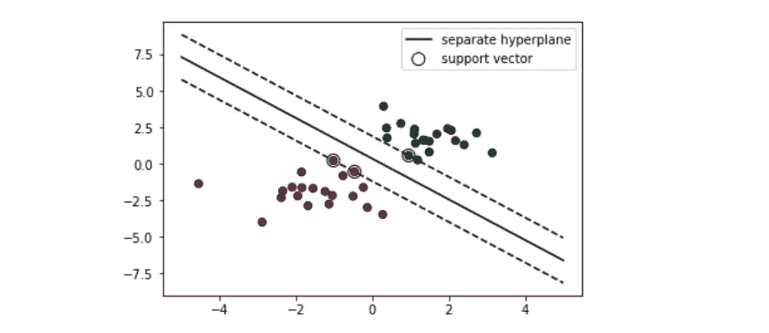

回到 ML 世界，那些汽车，建筑，行人现在都变成了点。红点代表街道左侧的物体；绿点代表右边的。街道变成了虚线和实线。

S 支持向量机(“路机”)负责寻找决策边界，以区分不同类别并最大化裕量。

边距是线条和最靠近线条的点之间的(垂直)距离。

# 线性可分情形下的 SVM

显然，在上面的例子中，存在无限的线来分隔红色和绿色的点。SVM 需要找到一条最优线，约束条件是要正确地分类这两类中的任何一类:

1.  遵循约束:只查看**单独的** **超平面**(例如，单独的线)，正确分类的超平面
2.  进行优化:选择最大化**余量**的一个

我将举例说明分离超平面和边界的概念，但在这篇文章中不会解释如何用约束条件来解决优化问题。

那么什么是**超平面**？

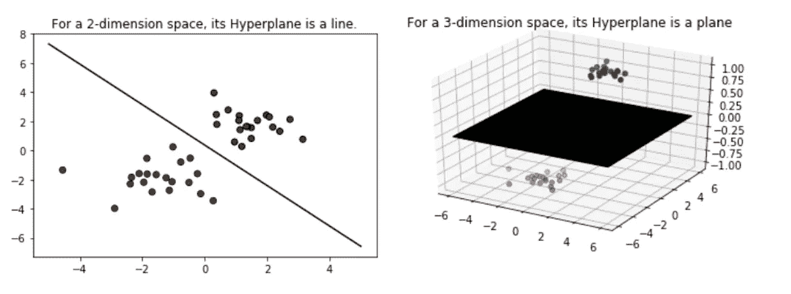

H 超平面是 n 维空间的(n 减 1)维子空间。对于一个 2 维空间，它的超平面将是 1 维的，这只是一条线。对于三维空间，它的超平面将是二维的，这是一个切割立方体的平面。好吧，你明白了。


Any Hyperplane can be written mathematically as above


For a 2-dimensional space, the Hyperplane, which is the line.

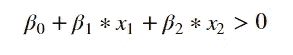

The dots above this line, are those x1, x2 satisfy the formula above

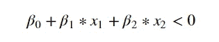

The dots below this line, similar logic.

什么是**分离超平面？**

假设标签 y 是 1(代表绿色)或-1(代表红色)，下面的三条线都是分离超平面。因为它们都有相同的属性——在这条线上，是绿色的；线下面是红色的。

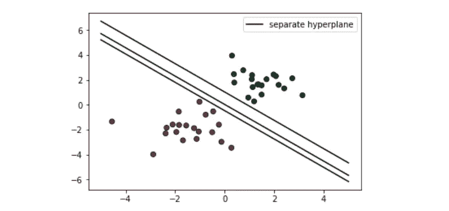

该属性可以用数学公式再次写成如下形式:


如果我们进一步把这两个归纳成一个，它就变成了:


S 分离超平面约束用数学方法写在上面。在完美的情况下——线性可分的情况，这个约束可以由 SVM 来满足。但是在不可分的情况下，我们需要放松它。

那么什么是**保证金呢？**

*   假设我们有一个超平面——X 线
*   计算所有这 40 个点到 X 线的垂直距离，将会有 40 个不同的距离
*   40 分中，最小的距离，就是我们的差距！


虚线两侧到实线之间的距离就是边距。我们可以把这条最佳线想象成红点和绿点之间最大延伸的中线。

**综上所述，SVM 在线性可分的情况下:**

*   约束/确保每个观察都在超平面的正确一侧
*   选择最佳线，使这些最近的点到超平面的距离最大化，即所谓的边距

# 线性不可分情形下的 SVM

在线性可分的情况下，SVM 试图找到使裕度最大化的超平面，条件是两个类都被正确分类。但在现实中，数据集可能永远不会线性分离，所以超平面 100%正确分类的条件永远不会满足。

SVM 通过引入两个概念来处理非线性可分的情况:**软余量**和**内核技巧。**

我们来举个例子。如果我在绿色聚类中添加一个红点，数据集就不再是线性不可分的了。这个问题有两个解决方案:

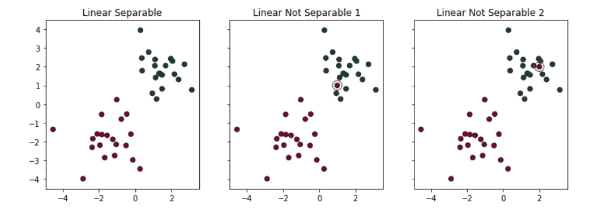

1.  **软边距:**尝试找到一条线来分隔，但允许一个或几个错误分类的点(例如，用红色圈出的点)
2.  **内核技巧:**尝试找到一个非线性决策边界

# 软利润

在软裕度下，SVM 容忍两种类型的错误分类:

1.  该点位于决策边界的错误一侧，但位于正确一侧/边缘(如左侧所示)
2.  该点位于决策边界的错误一侧和页边距的错误一侧(如右图所示)

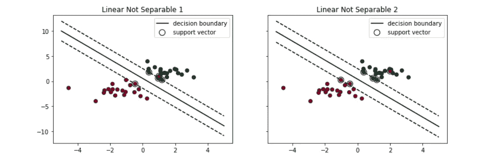

应用软边距，SVM 容忍一些点被错误分类，并试图在找到一条最大化边距和最小化错误分类的线之间进行平衡。

***容差程度***
在寻找决策边界时，我们希望给出多少容差(软)是 SVM(线性和非线性解决方案)的一个重要超参数。在 Sklearn 中，它被表示为惩罚项—‘C’。C 越大，SVM 在分类错误时受到的惩罚就越多。因此，边缘越窄，决策边界将依赖的支持向量就越少。

```
# Default Penalty/Default Tolerance
clf = svm.SVC(kernel='linear', C=1)
# Less Penalty/More Tolearance
clf2 = svm.SVC(kernel='linear', C=0.01)
```

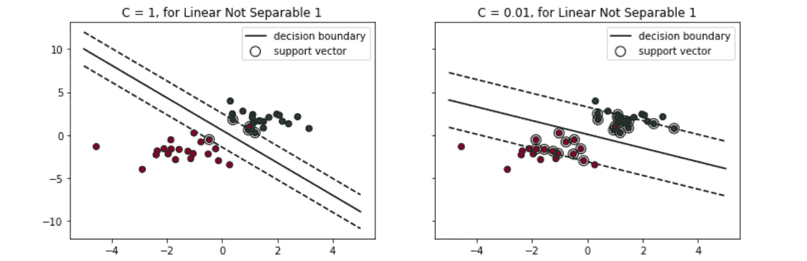

# 内核技巧

Kernel Trick 所做的是利用现有的特性，应用一些转换，并创建新的特性。这些新特征是 SVM 找到非线性决策边界的关键。

在 Sklearn — svm。SVC()，我们可以选择'线性'，'多边形'，' rbf '，' sigmoid '，' precomputed '或一个 callable 作为我们的内核/转换。我将给出两个最流行的核的例子——多项式和径向基函数(RBF)。

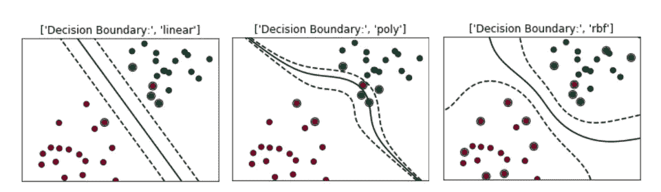

***多项式内核***

将多项式内核视为一个转换器/处理器，通过应用所有现有要素的多项式组合来生成新要素。

为了说明应用多项式转换器的好处，我们举一个简单的例子:

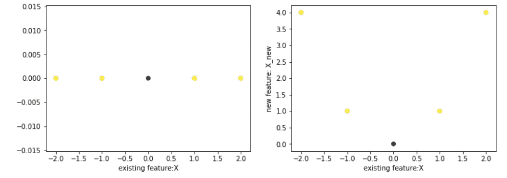

现有特征:X = np.array([-2，-1，0，1，2])
标签:Y = np.array([1，1，0，1，1])
我们不可能找到一条线将黄色(1)和紫色(0)的点分开(如左图所示)。

但是，如果我们应用变换 X 得到:
新特征:X = np.array([4，1，0，1，4])
通过组合现有的和新的特征，我们当然可以画一条线把黄紫色的点分开(如右图所示)。

具有多项式核的支持向量机可以使用那些多项式特征生成非线性决策边界。

***径向基函数核***

将径向基函数核视为一个转换器/处理器，通过测量所有其他点到特定点(中心)的距离来生成新要素。最流行/最基本的 RBF 核是高斯径向基函数:


**gamma (γ)** 控制新特征—**φ(x，center)** 对决策边界的影响。灰度系数越高，特征对决策边界的影响就越大，边界的波动就越大。

为了说明应用高斯 rbf (gamma = 0.1)的好处，让我们使用相同的示例:

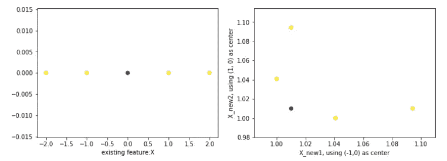

现有特征:X = np.array([-2，-1，0，1，2])
标签:Y = np.array([1，1，0，1，1])
同样，我们也不可能找到一条线把点分开(左手)。

但是，如果我们使用两个中心(-1，0)和(2，0)应用高斯 RBF 变换来获得新特征，那么我们将能够绘制一条线来分隔黄色紫色点(在右侧):
新特征 1: X_new1 = array([1.01，1.00，1.01，1.04，1.09)
新特征 2: X_new2 = array([1.09，1.04，1.01，1.00

```
# Note for how we get New Feature 1, e.g. **1.01**:
Φ(x1,center1) = np.exp(np.power(-(gamma*(x1-center1)),2)) = 1.01
# gamma = 0.1
# center1 = [-1,0]
# x1 = [-2,0]
```

类似于软边界中的惩罚项 C，伽马是一个超参数，当我们将 SVM 与内核结合使用时，我们可以对其进行调整。

```
# Gamma is small, influence is small
clf = svm.SVC(kernel='rbf', Gamma=1)
# Gamma gets bigger, influence increase, the decision boundary get wiggled
clf2 = svm.SVC(kernel='rbf', Gamma=10)
# Gamma gets too big, influence too much, the decision boundary get too wiggled
clf3 = svm.SVC(kernel='rbf', Gamma=20)
```

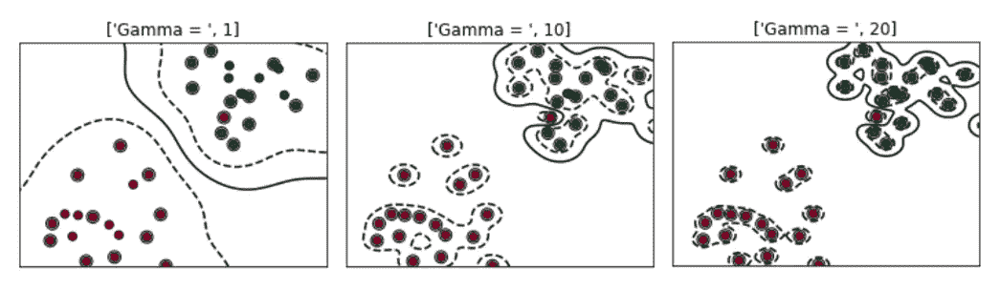

**总而言之，SVM 在线性不可分的情况下:**

*   通过将**软裕度**(误分类容忍度)和**核技巧**结合在一起，支持向量机能够构造线性不可分情况的决策边界。
*   像 C 或伽马这样的超参数控制着 SVM 决策边界的摆动程度。

1.  C 越高，SVM 在错误分类时得到的惩罚就越多，因此决策边界的波动就越小
2.  伽马值越高，特征数据点对决策边界的影响越大，因此边界的摆动越大

最后，就是这样。

这个博客的代码可以在我的 GitHub 链接中找到。

优化的一个很好的解释/理由可以在[链接](https://www.youtube.com/watch?v=5yzSv4jYMyI&list=PLgIPpm6tJZoShjm7r8Npia7CMsMlRWeuZ&index=1)中找到，这里是 SVM uda city 的 YouTube 视频。

请在下面留下任何评论、问题或建议。谢谢大家！