# 支持向量机

> 原文：<https://towardsdatascience.com/support-vector-machines-22a51baba064?source=collection_archive---------14----------------------->

## 支持向量:从来没有这么多人欠这么少人这么多

# 1.问题是

支持向量机着手解决“分类”问题。如果给我们一些数据，它将由一定数量的条目/行/点组成。现在，我们想把每一个点分成几类。为了简单起见，我们假设我们只对两类感兴趣，“积极的”和“消极的”。这可能有助于回答的重要问题示例(有些比其他更重要):

1.  给定像素数据，照片中是否有猫(有猫表示阳性标签)。
2.  从主题、发件人、文本等方面来看，一封邮件是否是垃圾邮件。
3.  确定患者是否患有某种疾病。

这个想法是，当我们已经知道正确的答案时，我们想出一些规则来将数据分成两类(对于 SVM 的，这个“规则”恰好是画一个平面，称一边的所有点为正，另一边的所有点为负)。然后，当我们遇到一个我们不知道答案的新数据点时，我们使用我们(或我们的“机器”)“学习”的相同规则来分类它。这个话题很大程度上依赖于约束优化理论，并且是一个很好的例证，我[不久前在博客](/lagrange-multipliers-with-pictures-and-code-ace8018dac5e)上写了一篇关于约束优化理论的文章。此外，我们将大致遵循吴恩达的[论文。](http://cs229.stanford.edu/notes/cs229-notes3.pdf)

## 1.1.在图片中

我觉得直到我画了画，我才真正理解了事物。还有，大家都喜欢图片。所以让我们来看一些。

我们在特征空间中有一些点。为了便于可视化，让我们考虑一个二维特征空间，这样我们可以在屏幕上看到它。我们在这个空间中散布了一些点，每个点都有一个二进制标签(1/-1)。在下图中，我们可以认为绿点代表正标签，红点代表负标签。对于黄点，我们不知道它们的标签是什么(正面还是负面)。如果让你猜一个标签，你会选哪个？你可能会发现有些观点并不明确。

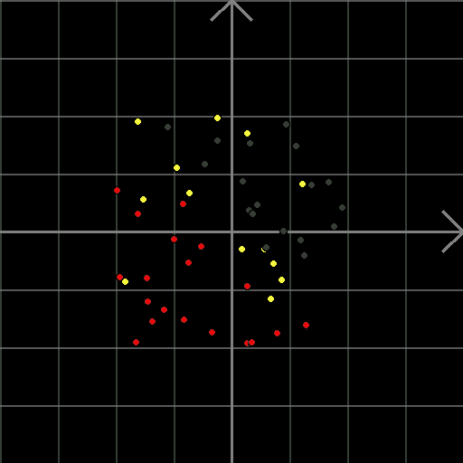

Fig 1: 2-D classification problem. Green points are positive and red ones are negative. Can you guess the labels for the yellow points? Created using: [https://github.com/ryu577/pyray](https://github.com/ryu577/pyray)

现在，如果我画一条紫色的线来分隔这两个类，那么每个黄色点应该属于哪个类就变得更加清楚了(线上的任何东西都是绿色的，线下的任何东西都是红色的)。

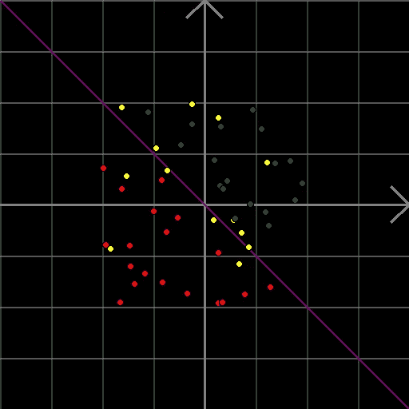

Fig 2: Drawing a separating line gives us a “rule” for assigning positive and negative labels. Now, we can use that rule to label each of the yellow points. Created using: [https://github.com/ryu577/pyray](https://github.com/ryu577/pyray)

然而，上面这条线并不是唯一的。有多条紫色的线完美的分隔了绿色和红色的点。下图显示了其中的一些。当我们在这些线之间切换时，一些黄色点的含义很严重(它们最终位于线的不同侧，因此会根据线的选择翻转它们的标签)。

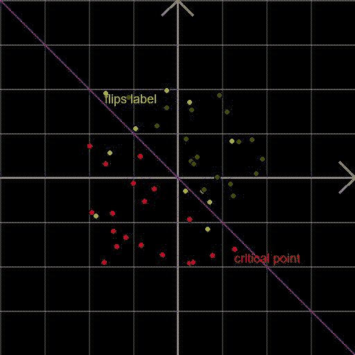

Fig 3: There could be multiple separating lines that split the red points from the green perfectly well. Which of these lines should be choose? Created using: [https://github.com/ryu577/pyray](https://github.com/ryu577/pyray)

所以，在所有候选线路中，问题是哪一条是“最好的”？从上面的图 3 中可以清楚地看出，当紫色线靠近右下角的红点时，它似乎不能很好地概括，而当它远离该点时，它看起来像是一条更好的分隔线。因此，似乎有一点决定了这条线有多好，使它变得“至关重要”。可以说，远离该红点的线尽可能远离所有训练示例，而不必要地靠近该红点的线最终看起来不如分类器那么好。因此，即使是最接近的训练样本，最终也会被推离自己很远的线会成为好的分类器。我们将在第 3 节更具体地阐述这一观点。但首先，让我们学习用数学画线。

# 2.画线

所以我们想画一条分隔线(或者只是一条一般的线)(在二维空间；它将是高维空间中的超平面)。那么，什么是线呢？它是有共同点的点的无限集合。它们都满足某个等式。为了找到这个方程，让我们从最简单的 x 轴开始。上面各点的位置向量有什么共同点？它们看起来都像:v_x = [x，0]意味着它们的 y 坐标为零。

另一种说法是，其上每个点的位置向量都与指向 y 轴方向的向量正交(垂直)。

第二个陈述可能看起来像是用一种奇怪而复杂的方式来表达更简单的东西，但这种方式很重要，因为它对所有行都适用，而不仅仅是这个 x 轴。这很好，因为我们不关心 x 轴本身。我们真的希望能够推广到任何行。一步一步来，让我们首先考虑穿过原点的直线(如 x 轴)。这些线可以通过简单地将 x 轴旋转某个角度来获得，如下图所示。

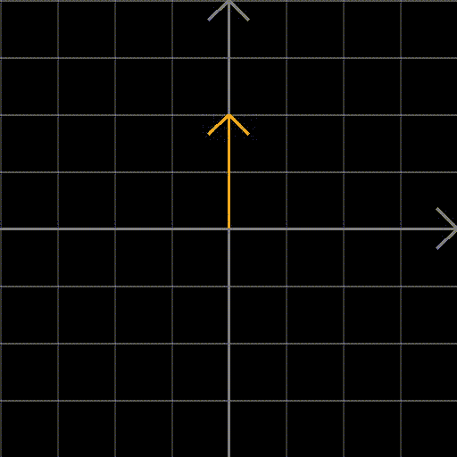

Fig 4: Rotating the x-axis can give us any line passing through the origin. And for all these lines, every point on them will be perpendicular to the orange vector.

当线改变时，恰好垂直于它的向量也改变，但是线上每个点的位置向量垂直于某个向量的事实对于所有线都是不变的。让我们称这个向量为 **w** 为通过原点的一般直线。当我们改变 **w** 时，我们将捕获所有这样的线。

注意，对于任何给定的行，也有多个值 **w** 。本质上，如果我们把它放大或缩小任意倍，直线上每个点的位置向量都垂直于它的事实不会改变。

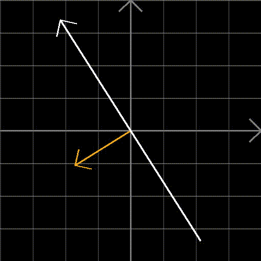

Fig 5: Orthogonal w vector scaling up and down.

那么，为什么不把我们自己限制在大小为 1 的向量上呢？从现在开始，让我们假设任何时候我们谈论一个名为 **w** 的向量，它的大小都是 1。

所以现在我们已经成功地参数化了所有经过原点的线。那些没有的呢？我们可以通过将穿过原点的其中一条线向 **w** 的方向移动一定量 **b** ，得到这样一条线。现在， **w** 与直线上任意一点的位置矢量的点积不为零。但是，还是不变， **b** 。从下面的图 6 中可以清楚地看到这一点。w 矢量是一个单位矢量，从原点指向线(紫色)并与之垂直。a 是直线上离原点最近的点。假设距离 OA 为 **-b** 。现在，考虑两个随机点 B 和 C(绿色和橙色)。如果你取 OB 或 OC 与单位向量 w 的点积，你就分别得到三角形 OAB 和 OAC 的底边。而且这两种情况下，这只是 OA，也就是 **-b** 。由于这两个点是直线上的任意点，我们可以得出结论，直线上的所有点都将满足 **w^T x+b=0** (其中 **x** 是点的位置向量，即上面两个示例点的 OB 和 OC)。

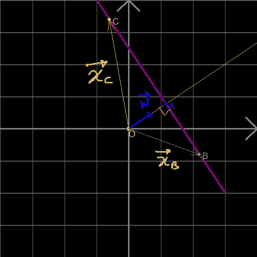

Fig 6: A line that doesn’t necessarily pass through the origin.

当我们把一个不在直线上的点代入上面推导出的直线的方程，会发生什么？我们得到一个不为零的数，当然，但它也恰好是点到直线的垂直距离(所以对于直线上的点，这是预期的零)。值得注意的是，这个结论只有在 **|w|=1** 时才成立，正如我们一直要求的那样。下图应该清楚地表明了这一结果。我们取任意一点，B 不在直线上。然后，我们从紫色线 B "和代表 w 矢量的线 B '上的 B 点开始画垂线。从 B 到直线的垂直距离由图中的 BB”给出。但是由于 A-B'-B-B ' '形成一个矩形，这个距离等于 AB'=OB'-OA。现在，OB '只是 B (OB)的位置向量与 w 的点积，所以，如果 x 是 b 的位置向量，那么|OB'| = **w^T x** 。这意味着|AB'|= **w^T x-(-b)** (回想一下 OA= **-b** )。所以点到直线的垂直距离变成:|AB'|= **w^T x+b** ，这是直线的方程。

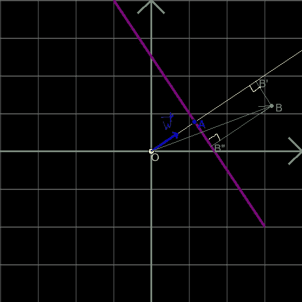

Fig 7: What happens when we plug a point not on the line into its equation? We get the perpendicular distance between the point and the line.

请注意，插入电源时， **w** 指向的线一侧的所有点(如图 7 中的 B 点)的垂直距离为正，而另一侧的点的垂直距离为负。

但是，所有位于 w 点一侧的点都有一个正标号( **t_i=1** )，位于另一侧的点都有一个负标号( **t_i=-1** )。因此，如果我们将标注与垂直距离相乘，只要这些点被线正确分类，调整后的垂直距离对所有点都是正的(即标注为正的点位于一侧，标注为负的点位于另一侧)。

# 3.最佳路线

现在来看看支持向量机的妙处。我们称调整后的任意点到直线的垂直距离为该点的边距。任何给定的线对于所有点都有一些边距(如果该点被该线正确分类，这些边距将为正，否则为负)。我们希望线条能够很好地区分积极和消极。换句话说，边距应该尽可能大，即使是最靠近边界(分离平面)的点也是如此。这与我们在 1.1 节末尾讨论的想法是一致的。

因此，最大化甚至最差裕量的平面应该很好地分离点。现在，给定一个( **w，b** )组合，第 I 个点的余量将由下式给出( **x_i** 是特征空间中的位置向量， **t_i** 是标签:1 表示正，1 表示负):

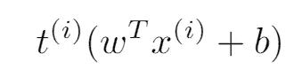

Equation of the margin.

所有点的最小余量变成:

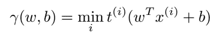

Eq (1): The minimum margin across all points.

我们希望( **w，b** )对最大化这个最小余量。换句话说，我们想要:

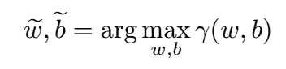

换句话说，我们想要满足 **|w|=1** 并最大化余量的( **w，b** )对:

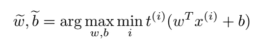

Eq(2): The SVM objective function.

注意，如果该行没有分隔数据，那么对于那个( **w，b** )组合，术语:

Equation of the margin.

某些点会是负的。其中一个点会在第一次最小化中胜出。这将意味着那些( **w，b** )组合永远不会在第二个 arg max 中“胜出”。所以，这确保了获胜的( **w，b** )组合将总是分离数据，如果数据是可分离的话。

等式(2)是一个优化问题，包括最小化和最大化(mini-max)。解决只涉及一级优化而不是两级优化的问题要容易得多。所以，我们试着把它转化为一个约束优化问题。

让我们回到将跨越所有点的最小余量称为 **γ** 的问题上来。

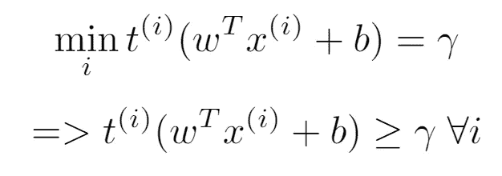

Eq (3): The constraints

最终的优化问题变成了:

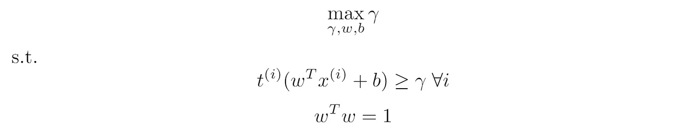

Eq (4): SVM optimization problem

这是一个带有二次/线性约束和线性目标函数的优化问题。它可以用二次规划求解器(我们将在后面看到一些代码)求解，并获得最佳分离线/平面( **w，b** 组合)。

现在，让我们看看是否可以进一步简化它。原来，有一种方法可以摆脱 **γ** 。这是有代价的——我们必须放弃 w^t w = 1 T3 的要求。但是考虑到简化，这是值得的。让我们以它来划分两边的约束。我们得到:

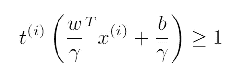

Eq (5): Divide plane equation by gamma.

现在，设置:

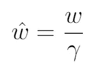

Introducing a new w variable.

取两边的模数，

Take modulus

但是，我们一直要求 **|w|=1** 。这意味着:

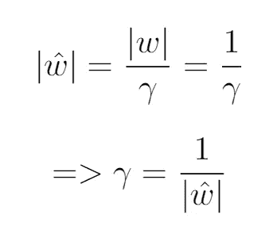

此外，等式(3)现在变成:

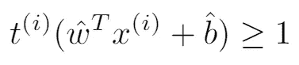

Eq (6)

等式(5)和(6)产生等式(4)中的优化问题:

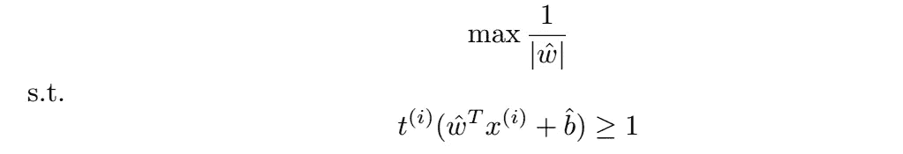

到目前为止，优化问题有一个丑陋的目标函数。但是最大化 **1/|w|** 和最小化 **|w|** 是一回事，和最小化 **|w|** 是一回事。增加 1/2 会让以后的生活稍微轻松一点。

所以，我们可以把它重新表述为:

Eq (7)

这现在是一个具有二次目标函数和线性约束的优化问题(线性约束二次规划或 LCQP)。它可以用各种语言的二次规划求解器来解决。

我们现在知道如何通过解决一个优化问题来找到最优线。透过表面看这些类型的优化问题是如何解决的(通过[拉格朗日乘数](/lagrange-multipliers-with-pictures-and-code-ace8018dac5e))会给我们对问题的强烈洞察力和直觉。请继续关注第 2 部分([此处为](/svm-an-optimization-problem-242cbb8d96a8))，在这一部分中，我们将完成这一过程，并展示一些玩具示例。