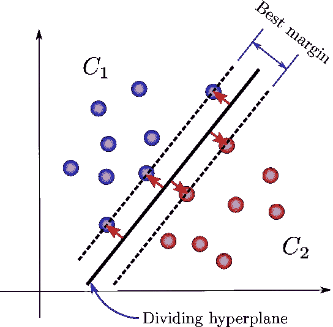
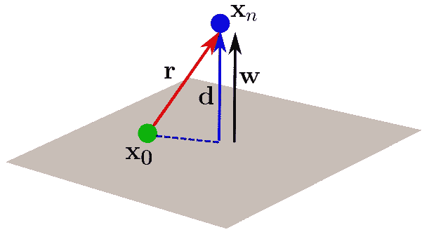
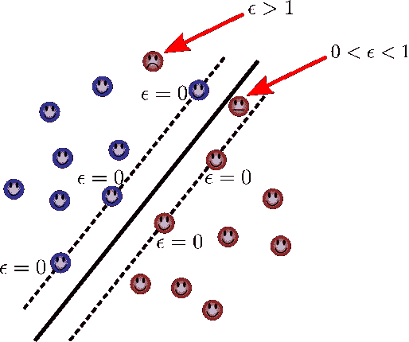
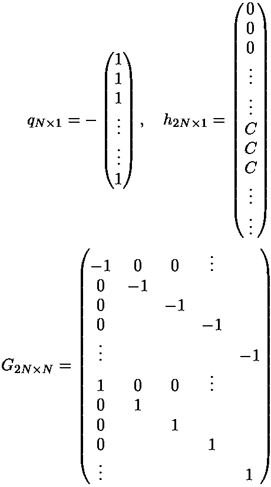
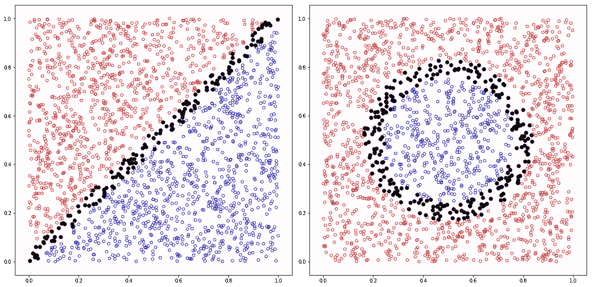

# 支持向量机分类

> 原文：<https://towardsdatascience.com/support-vector-machines-for-classification-fc7c1565e3?source=collection_archive---------4----------------------->

## 了解支持向量机(SVM)，从直觉到实现

机器学习中的分类是学习区分数据集中属于两个或更多类别的点的任务。在几何术语中，将一组点与某个类别相关联涉及找到这些点之间的最佳可能分离。假设我们有一个类似这样的数据集:

Figure 1\. Dataset representation and margin

在这里，我们可以清楚地区分两类，分别用 **C1 = 1** 和 **C2 = -1** 来标识。我们也将这定义为一个*二元分类问题*。例如，如果我们的每个数据点都代表电子邮件文本，并且我们希望将这些分类为垃圾邮件和非垃圾邮件，那么我们将每封电子邮件都是一个数据点 **x** ，而 **y = 1** 将识别垃圾邮件， **y = -1** 非垃圾邮件。同样，我们还可以有其他类似的场景，比如猫狗分类、信用/非信用批准等。

在图 1 中，我们还可以看到，中间的线性函数确保了两个类别之间的最佳分离。我们故意称之为*超平面*的原因是因为我们这里的描述可以扩展到多维场景。例如，如果我们在 3D 空间中工作，我们将有一个分割平面而不是一条线。

从现在起，我们将分类数据集之间的分离标识为*边缘*、，并且它将由最近点和分离超平面之间形成的距离来管理。因此，立即出现的问题是，我们如何确保这个最佳超平面确保两个类别的最佳可能余量？这正是支持向量机，或简称 SVM 将为我们做的。

在继续之前，值得指出的是，支持向量机是用于分类任务的最强大的机器学习算法之一，广泛用于从计算机视觉到 NLP 的应用。让我们进一步探讨这个方法。

## 导出原始问题

首先，假设我们的数据集由 *N* 个点组成。在图 1 中，我们可以看到，通过使用由下式定义的线性函数(即超平面),可以很好地分离这两个类别:

这里， **x** *n* 表示一个数据点， **w** 是一个权重向量， *b* 是偏差， ***y*** *n* 是模型的预测。在这种情况下，对于位于超平面两侧的点，每个预测可以是 1 或-1，对于位于超平面本身上的点，每个预测可以是 0。给定一个包含几个 **x** 及其对应的 **y** 的数据集，我们想要做的是找到给我们最好的可能余量的 **w** 和 *b* 的值。

为了更清楚，让我们用几何图形来说明我们的模型变量:

Figure 2\. Geometric representation of variables

这里，**x*n*是最接近超平面的点之一，并且它形成了源自该点的正交向量 **d** 。我们可以看到，矢量 **d** 与 **w** 方向相同。此外，位于超平面上的任何一点 **x0** 都会与**x*n*形成一个矢量 **r** 。根据这些定义，我们可以清楚地看到 **d** 是 **r** 在 **w** 上的投影，由下式给出:****

让我们把 *b* 和- *b* 加到这个等式的分子上。 **d** 的大小将给出 **x** 到超平面的距离，定义如下:

注意，对于位于超平面上的 **x0** ，其对应的预测 **y0** 为零，这就是括号内的表达式消失的原因。所以为了找到最优余量，我们要做的就是最大化 *d* 。有了这些考虑，我们最终可以陈述模型的优化问题:

嗯，从微积分我们知道，为了找到最大值，我们需要使用导数。在这种情况下，我们使用不涉及对等术语的表达会更方便。那么，我们怎样才能使 d*d*方程更容易优化呢？是的，你猜对了！将括号内的倒数项倒置，然后将其转化为最小化问题。让我们这样做:

Equation 1\. Optimal distance expression

所以现在你可能会问，为什么我们把 w 的幂提高到 2，然后除以 2？这只是我们在计算导数时，为了让事情变得简单而应用的一个数学技巧。基本上，主要原因是这个表达式的导数就是 **w** 。然而，最重要的是，这将帮助我们定义一个二次规划问题，我们将能够使用流行的优化库来解决这个问题，我们将在后面看到。

好了，现在我们已经定义了优化问题的一部分。但是，让我们更深入地看看这个限制:

我们可以看到，这涉及到一个绝对值。看起来不太好，对吧？如果我们能摆脱它就好了。怎么才能做到呢？让我们稍微想想我们预测的正确性。我们希望我们的模型尽最大努力对所有点进行正确分类。但是我们如何用数学术语定义一个正确分类的点呢？让我们首先介绍一些有用的符号。

所以我们希望我们的模型做出与正确答案 ***yn*** 相等的预测。当给出的答案和预测的答案符号相同时，就会发生这种情况。也就是说，当两者的乘积至少为 1 时。让我们用数学表达式来表述:

Equation 2\. Modified restriction

太好了！有了这个限制，以及等式 1，我们的优化问题将如下:

Equation 3\. Expression for the primal problem

这个表达式定义了支持向量机的主要问题。请注意，对于由( **x** *n* ， *yn* )形成的每个限制，都有一个关联的 Langrange 乘数 *α* 。阿尔法值大于零的数据点**x**n 也被称为*支持向量*，因为它们影响分离超平面的行为。

此外，如果我们看一下等式 3，我们可以看到它在 **w** 上有一个二次型。因此我们可以说这是一个二次规划问题。然而，我们这里有一个问题，这个问题取决于三个变量，而不是一个。让它只依赖于一个参数集肯定会让事情变得更简单，这将激发我们对下一节讨论的对偶问题的推导。

## 定义对偶问题

在上一节中，我们阐述了 SVM 的原始问题。然而，正如我们之前讨论的，让它依赖于一个参数会容易得多。让我们现在做那件事。

如果我们计算等式 3 中的 *L* 相对于 **w** 和 *b* 的导数，然后使导数等于零，我们得到:

从这里，我们得到:

替换等式 3 中的这两个表达式，我们得到:

重新排列:

Equation 4

嗯，正如我们所看到的，这已经成为一个二次规划问题，它只取决于拉格朗日乘数 *α* ，而不再取决于**w***和 *b* 。这肯定比我们之前讨论的原始问题要简单得多。除此之外，关于等式 4 中**x**m*和**x** *n* 的产生还有一个有趣的方面。原来这个产品其实可以表述为一个*内核函数*。一般来说，核函数允许我们将非线性可分空间转换为线性可分空间，并且当我们试图执行不同的分类任务时，它是一个有用的工具。通常使用的核包括但不限于线性核和径向基函数(RBF)。更多关于内核方法的信息可以在【2】这里找到。

最后，对偶问题可以表述如下:

Equation 5\. Dual problem for SVM

这是一个最大化的二次规划问题。这里， **k** 是我们定义的一个核函数。另外，请注意第一个限制，它强制所有字母大于或等于零。如前所述，阿尔法值大于零的数据点是*支持向量*，并影响分离超平面的行为。此外，如果我们将此转化为最小化问题，并将这些表达式转换为矩阵形式，我们可以很容易地使用 CVXOPT 等优化库来求解最佳参数。我们将在后面看到如何做到这一点。

我们对对偶问题的定义在这里有一个重要的限制。只有当类别可以完全分离时，它才能很好地工作。这就是为什么这个默认版本也被称为*硬边际 SVM* 。但是你可以想象，我们不太可能在现实生活中找到完全分离的数据集。因此，我们接下来将讨论一种变体，它允许我们将支持向量机扩展到一些点可能被错误分类的场景，也称为*软裕度 SVM* 。

## 软利润 SVM

如前所述，硬边界支持向量机在实际应用中用途有限。在这里，我们将表明，通过对原始对偶问题做一点小小的改变，我们可以将支持向量机扩展到一些点可能被错误分类的场景。让我们用图表来说明我们的想法:

Figure 3\. Misclassification scenarios for the soft-margin SVM

这里，我们定义了一个新的公差变量ε。位于边缘的点的ε = 0。另一方面，我们离正确的边界越远，ε的值就越大。最终，对于在超平面错误一侧的点，我们期望ε大于 1。我们现在需要做的是，把这个新变量插入到原始问题的初始定义中。因此，如果我们将ε加入等式 2 中定义的限制条件，我们会得到:

这意味着我们的限制现在允许一些点离边界更远一点。ε本身现在成为另一个参数，我们必须在我们的主要问题中考虑，我们必须努力使它最小化。在这种情况下，我们的目标是:

如我们所见，这里的第二项是我们定义的一个新变量 *C* 和所有ε之和的乘积。这将迫使当 *C* 较大时，由ε值给出的总体错误分类将较小。这意味着， *C* 越大，保证金就越严格。通过考虑原始问题中的这些新变量，我们得到:

Equation 6

这里，μ是我们为公差值ε定义的拉格朗日乘数。我们期望每个μ大于或等于零。现在让我们相对于 **w** 、 *b* 和ε来区分 *L* 。

从这里，我们得到:

让我们把注意力稍微转向第三个表达。我们之前说过，μ和 *α* 都可以大于或等于零，这意味着:

然后，通过替换等式 6 中的所有这些表达式，并像我们对硬边界 SVM 情况所做的那样重新排列，我们得到以下结果:

Equation 7\. Dual problem for the soft-margin SVM

太好了！在这一点上，我们可以看到，除了现在考虑到 *C* 的第一个限制之外，一切都与硬边际 SVM 的情况相同。在下一节中，我们将通过使用一个玩具数据集来实现一个软边界 SVM，我们将使用 CVXOPT 进行优化。

## 用 CVXOPT 实现软利润 SVM

注意:完整的实现可以在[https://bit.ly/2xBDJ2Q](https://bit.ly/2xBDJ2Q)的 Jupyter 笔记本上获得

CVXOPT [3]是一个用于凸优化的 Python 库。我们将用它来解决软间隔支持向量机的对偶问题。然而，在此之前，我们需要将这样一个对偶问题转化为一个最小化目标，然后将所有变量转化为矩阵。为了将对偶问题转化为最小化问题，我们只需反转等式 7 中拉格朗日量的符号，然后将其表示为矩阵形式:

在哪里

这里，我们使用了*操作符来表示 Python 中的逐元素乘法。此外， *K* 是通过计算整个数据集 **X** 的核值而得到的 Gram 矩阵。

现在以矩阵形式表示的限制如下:

现在，CVXOPT 将需要一个特殊的符号来配置我们的对偶问题，以及我们的限制。本质上，我们需要做的是配置以下矩阵:

使用 CVXOPT 的相应 Python 代码如下:

最后的容差参数定义了在声明收敛之前我们允许的变化量。如你所见， **solvers.qp** 调用接收我们配置的所有矩阵，它将打印出每个时期的成本值，直到收敛。

一旦我们的 SVM 被完全训练，我们可以通过使用下面的表达式容易地获得参数 **w** 和 *b* :

其中 **S** 是支持向量的子集。相应的实现如下:

为了便于说明，我们使用两个自己生成的数据集测试了这个实现。第一个数据集是线性可分的，第二个数据集包含可以用圆圈分隔的类别。这是两个数据集的图表:

Figure 4\. Dataset graphs

在这两种情况下，我们可以看到属于第一类和第二类的点分别被染成红色和蓝色。同样，黑色的点是我们找到的支持向量。通过适当配置 *C* 参数，我们应该可以看到不同的裕量行为。

此外，第二数据集不是线性可分的。在这些情况下，我们所做的就是使用*内核技巧*。也就是说，我们使用一个核函数，将我们从某个空间中的非线性可分数据集带到另一个空间中的线性可分数据集。特别是，我们在本例中处理第二个数据集的方法是使用 RBF 而不是线性核。

线性核和 RBF 可以分别通过这些表达式来计算:

其中γ是我们为 RBF 情况设置的超参数。这些内核的相应实现如下所示:

## 结束语

支持向量机是一种非常强大的机器学习模型。尽管我们的注意力主要集中在用于二元分类的支持向量机上，但我们可以通过使用一对一或一对一等技术将它们的使用扩展到多类场景，这涉及到为每一对类创建一个 SVM。我强烈建议您进一步研究实现，以及我们如何使用流行的库来训练 SVM，例如 *sklearn。*在这里，您需要为 *C* 选择合适的值，以及一个合适的内核以获得更好的分类结果。

## 参考

[1] Bishop，Christopher M. *模式识别和机器学习* (2006)施普林格出版社柏林，海德堡。

[2]托马斯·霍夫曼。伯恩哈德·肖科普夫。《机器学习中的核心方法》 (2008)统计年鉴。第 36 卷，第 3 卷，1171-1220 页。

[3] CVXOPT。*解一个二次规划*。在 https://cvxopt.org/examples/tutorial/qp.html[有售](https://cvxopt.org/examples/tutorial/qp.html)

[4]加州理工学院。*从数据中学习* (2012)。在[https://work.caltech.edu/telecourse](https://work.caltech.edu/telecourse)上市