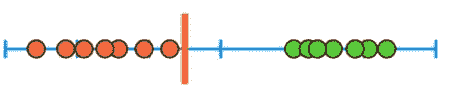
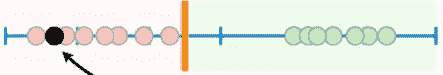
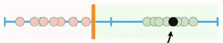
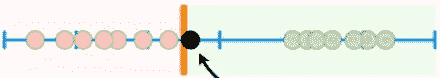
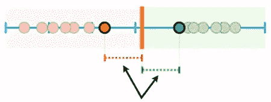
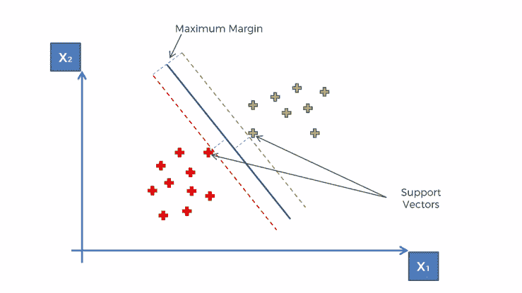
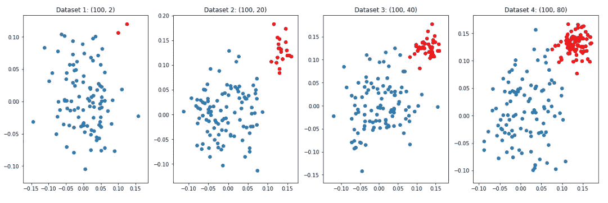
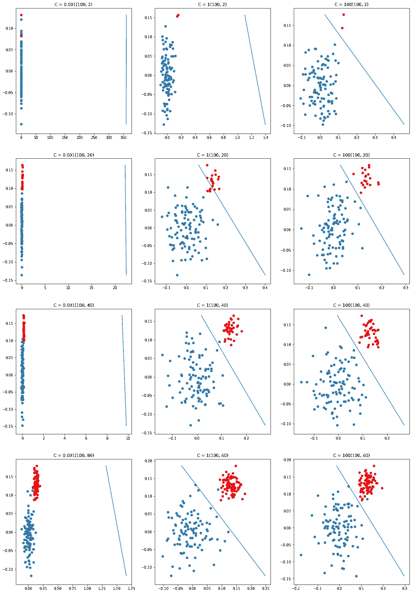

# 支持向量机和不平衡数据

> 原文：<https://towardsdatascience.com/support-vector-machines-imbalanced-data-feb3ecffbb0e?source=collection_archive---------9----------------------->

## 在不平衡数据集的情况下，SVM 是如何工作的？


# 内容:

1.  支持向量机简介
2.  观察 SVM 在不平衡数据集的情况下如何工作。
3.  观察超平面如何根据正则项的变化而变化。

# 支持向量机简介

> 在机器学习中，支持向量机器是具有相关学习算法的监督学习模型，其分析用于分类和回归分析的数据。给定一组训练样本，每个样本被标记为属于两个类别中的一个或另一个，SVM 训练算法建立一个模型，将新样本分配给一个类别或另一个类别。

在 SVM，超平面是以这样的方式选择的，它与两个类都是等距的，并且距离最短。

迷茫？看看下面的解释。


Figure 1

我们假设，红点是 1 类，绿点是 2 类。

现在，如果要我画一个阈值来区分这两个类别，我可以画出来，实际上有 n 种方法。



Figure 2

当我画一个如图 2 所示的边距时会发生什么？左边的任何东西都将被归类为红点，右边的任何东西都将被归类为绿点。

我们来分析一下。



Figure 3

这个新点可以归为红点，也就是 1 类。



Figure 4

这个新点可以归为绿点，也就是 2 类。

好吧！那是非常直接的。但是让我们看看下面的情况。



Figure 5

这个新点将被归类为绿点，因为它位于右侧。根据阈值，是的，这是一个正确的分类。但这真的对吗？不要！

该点离红点近得多，离绿点远得多。所以，这是一个错误的分类。

那我们怎么决定合适的阈值呢？


Figure 6

让我们把注意力集中在这两个类的边缘的观察上。现在让我们画一个阈值，这样它到两点的距离是相等的。



Figure 7

现在，该阈值左侧的任何点都将比绿点更靠近红点，因此将被归类为红点。右边的任何一点都是绿点。



Figure 8

边缘观察被称为支持向量。

观察值和阈值之间的最短距离称为裕度。当阈值在两个观察值的中间时，差值尽可能大。

现在让我们开始吧……

# SVM 和不平衡数据

首先，让我们创建不平衡数据集，每个数据集都有正类和负类。

数据集 1-100 个正点和 2 个负点

数据集 2-100 个正点和 20 个负点

数据集 3-100 个正点和 40 个负点

数据集 4-100 个正点和 80 个负点

```
import numpy as np
import matplotlib.pyplot as plt
ratios = [(100,2), (100, 20), (100, 40), (100, 80)]
plt.figure(figsize = (20,6))
for j,i in enumerate(ratios):
 plt.subplot(1, 4, j+1) 
 X_p=np.random.normal(0,0.05,size=(i[0],2))
 X_n=np.random.normal(0.13,0.02,size=(i[1],2))
 y_p=np.array([1]*i[0]).reshape(-1,1)
 y_n=np.array([0]*i[1]).reshape(-1,1)
 X=np.vstack((X_p,X_n))
 y=np.vstack((y_p,y_n))
 plt.title(“Dataset “ + str(j+1)+ “: “ +str(i))
 plt.scatter(X_p[:,0],X_p[:,1])
 plt.scatter(X_n[:,0],X_n[:,1],color=’red’)
plt.show()
```

这段代码将创建 4 个不同的数据集。这些数据集如下所示:



Figure 9

现在，您已经看到了我们的数据集的样子，让我们继续。

现在我们要画一个分离这些点的超平面。我们将考虑正则项的 3 个不同值，并在不平衡数据集上观察超平面如何随着正则项的变化而变化。

我们只需要添加几行代码来完成我们的代码。因此，更新后的代码如下所示:

```
def draw_line(coef,intercept, mi, ma):

  points=np.array([[((-coef[1]*mi — intercept)/coef[0]), mi],
  [((-coef[1]*ma — intercept)/coef[0]), ma]])

  plt.plot(points[:,0], points[:,1]) 
```

上面的代码是画出分隔点的线。

```
c = [0.001,1,100]
plt.figure(figsize = (20,30))
ratios = [(100,2), (100, 20), (100, 40), (100, 80)]
num=1
for j,i in enumerate(ratios):
 for k in range(0, 3):
   model=LinearSVC(C=c[k])
   plt.subplot(4, 3, num) 
   num=num+1
   X_p=np.random.normal(0,0.05,size=(i[0],2))
   X_n=np.random.normal(0.13,0.02,size=(i[1],2))
   y_p=np.array([1]*i[0]).reshape(-1,1)
   y_n=np.array([0]*i[1]).reshape(-1,1)
   X=np.vstack((X_p,X_n))
   y=np.vstack((y_p,y_n))
   model.fit(X,y)
   plt.scatter(X_p[:,0],X_p[:,1])
   plt.scatter(X_n[:,0],X_n[:,1],color=’red’)
   plt.title(‘C = ‘+ str(c[k])+str(i))
   draw_line(coef=model.coef_[0],intercept=model.intercept_,ma=       max(X[:,1]), mi= min(X[:,1]))

plt.show()
```

输出:



Figure 10

# 观察

1.  当 c = 0.001 时

由于 c 非常小，模型无法对数据进行分类，我们可以观察到超平面位置离数据点非常远。数据平衡或不平衡在这里没有任何区别，因为 c 值非常小。

2.当 c = 1 时

超平面远离数据点，可以说该模型不能对不平衡数据集进行分类。在最后一种情况下，数据集几乎是平衡的，我们可以看到，该模型可以分类有位错误，但这似乎只有在数据平衡的情况下才能很好地工作。

3.当 c = 100 时

即使 c 值很高，该模型也无法对高度不平衡的数据集进行分类。因此，我们可以得出结论，该模型效果不佳，或者当数据集高度不平衡时，不建议使用该模型。随着数据的增加，模型在分类方面做得非常好。

# 参考资料:

[](https://en.wikipedia.org/wiki/Support-vector_machine) [## 支持向量机

### 在机器学习中，支持向量机(SVMs，也称为支持向量网络)是一种有监督的学习模型

en.wikipedia.org](https://en.wikipedia.org/wiki/Support-vector_machine) 

## 应用人工智能课程—[https://www.appliedaicourse.com/](https://www.appliedaicourse.com/)