# 从零开始的核支持向量机

> 原文：<https://towardsdatascience.com/support-vector-machines-learning-data-science-step-by-step-f2a569d90f76?source=collection_archive---------26----------------------->

## 从最大间距分隔符到内核技巧的逐步数学和实现

从 20 世纪 90 年代末，直到深度学习的兴起，具有非线性核的支持向量机(SVM)一直是领先的算法。他们能够解决像逻辑回归这样的线性分类器无法解决的许多非线性问题。最简单和最著名的例子是一个数据集，其标签分布类似于异或(XOR)真值表。

SVM 是由机器学习的主要理论家之一 Vladimir Vapnik [1]于 1992 年至 1995 年提出的。他与人合著了 Vapnik-Chervonenkis 机器学习理论[2]。

[© Jason Steffan, Pexel](https://www.pexels.com/photo/landscape-photography-of-green-and-gray-mountain-2125075/)

SVM 背后有三个主要想法:

*   **最大空白分隔符**:画一条线或超平面，使分隔符和训练数据之间的距离最大化，从而引入一个空白层
*   **软页边距分隔符**:当不同标签的数据混淆时，考虑页边距内的样本，画出最佳分隔线
*   **内核技巧**:对于数据分离边界不是线性的更复杂的模型，允许使用高阶多项式甚至非多项式函数

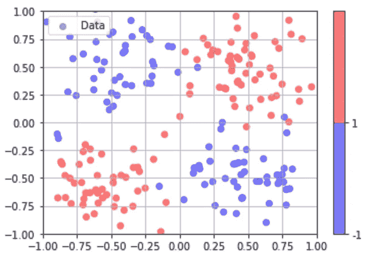

Dataset looking like the exclusive-or (XOR) truth table © the author

为了更好地理解这些想法，我们将按顺序逐一解释。每次我们都会提供支持数学的摘要。**完整的 Python 笔记本在 Github 上有** [**HTML**](https://tonio73.github.io/data-science/classification/ClassificationSVM.html) **或者** [**木星**](https://tonio73.github.io/data-science/classification/ClassificationSVM.ipynb) **。**

有两种方法来安装 SVM:

*   通过使用更新规则的梯度下降
*   使用求解器和拉格朗日原始或对偶形式的问题陈述

在本文中，使用的是第二种解决方案。

# 1.最大边距分隔符

使用几何解释可以更好地理解 SVM。给定一个 p 维的向量空间，我们想用一个超平面(如果 p=2，则是一条直线，即 2D 平面)来分隔它，使得标签为 1 的训练数据在超平面的一侧，标签为-1 的训练数据在超平面的另一侧。

超平面方程是:

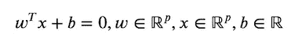

其中 w 是与超平面正交的向量，b 是相对于原点定位超平面的偏差。

给定一个向量 x 和{-1，1}中相应的二进制标号 y，到超平面的有符号距离是:

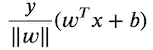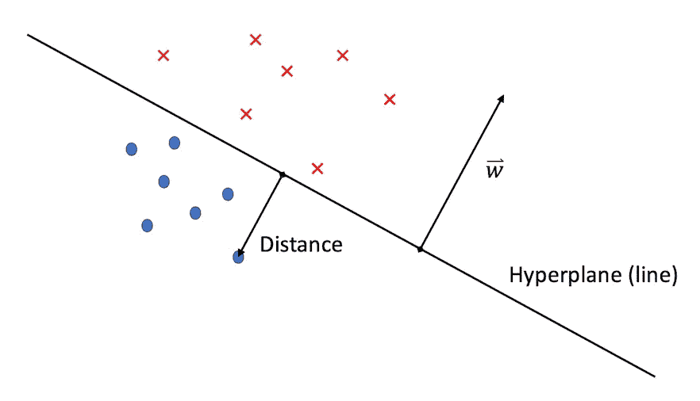

© the author

宽度 *M* 的最大边距分隔符的表达式为:

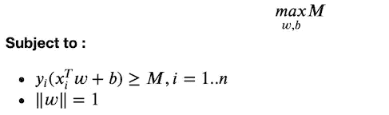

这个优化问题可以被重写为对偶拉格朗日问题，并且由求解器提供解决方案。

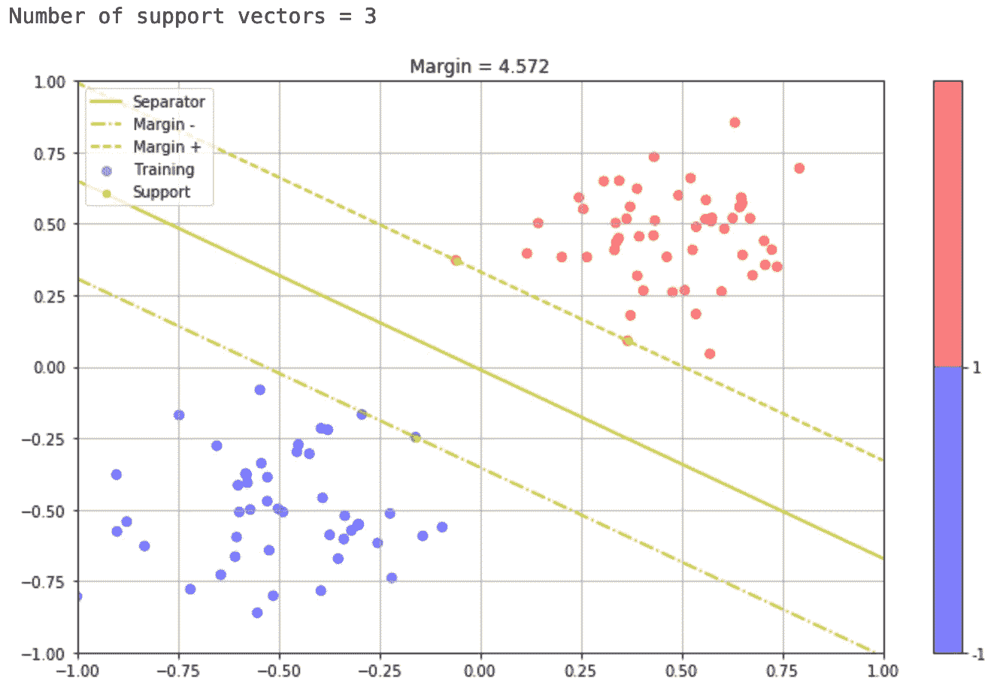

Maximum margin separator © the author

边距边界上的点称为支持向量。

这种分类器非常接近于逻辑回归，但是不能处理由于噪声(一种无法解释的量)而导致数据类混合的数据集。这导致了以下改进。

# 2.软利润 SVM

为了克服当数据类混合时的优化问题，添加了一个新的约束来容忍误分类的数据点:位于分离超平面的错误侧的点，在边缘板之内或之外。

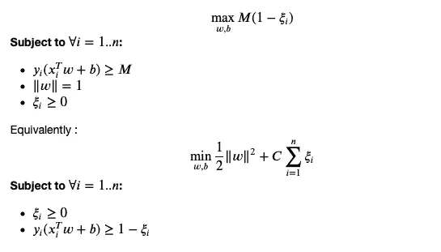

在下图中，我们看到分隔线现在位于两个类的数据点内。支持向量现在包括边缘板内的点。

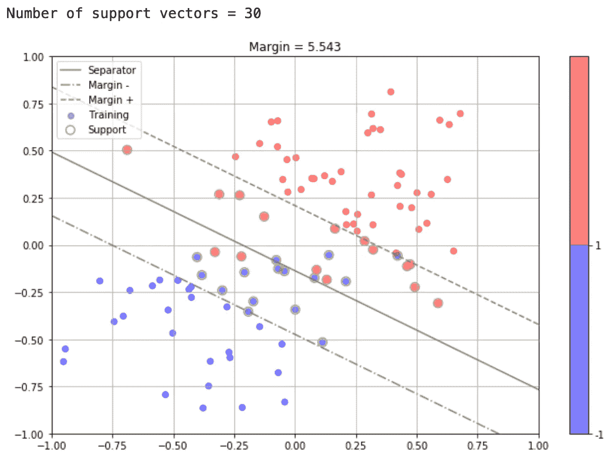

Soft margin linear SVM © the author

这个分类器分离超平面非常接近逻辑回归或线性判别分析(LDA)的分类器分离超平面。即使决策函数看起来不同，性能也是一样的。

我们仍然无法解决异或数据集。需要第三个也是最后一个技巧。

# 3.内核技巧

到目前为止，SVM 与其他线性分类器如逻辑回归或线性判别分析没有太大的不同。

然而，观察到 SVM 的拟合和预测仅依赖于 *x* 样本的内积，出现了使用替代产品的新想法，好像通过变换 *h(x)* 对 *x* 进行了预处理。

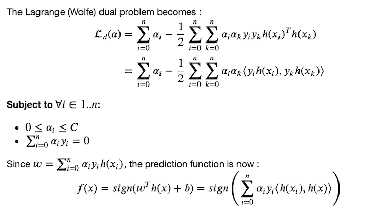

以下产品功能应是对称的和正的:

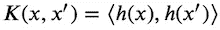

其范围从简单的二次函数到更复杂的函数，如高斯径向核函数(RBF):

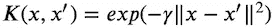

由于需要新的 *x* 值与训练样本的乘积，预测变得更加复杂。然而，我们可以将这种计算限制到支持向量。

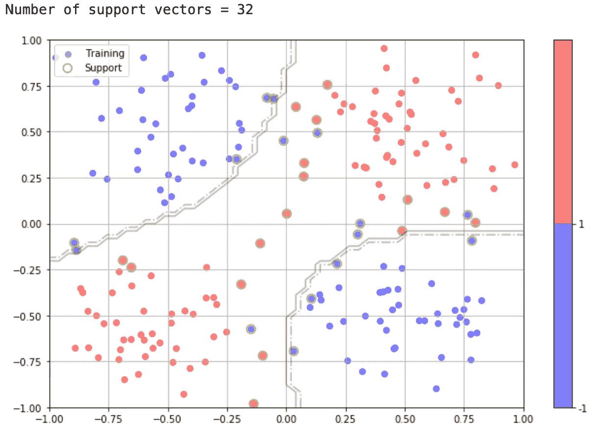

XOR problem solved by an SVM with Gaussian RBF kernel © the author

有了具有非线性内核的 SVM，我们已经能够解决 XOR 问题，这是在 60 年代感知机发明之后第一个人工智能冬天[3]的原因之一。

**完整的 Python 笔记本在 Github 上有**[**HTML**](https://tonio73.github.io/data-science/classification/ClassificationSVM.html)**或者**[**Jupyter**](https://tonio73.github.io/data-science/classification/ClassificationSVM.ipynb)**的版本。**它包含了**更详细的数学，一个用 Python 定制的实现**使用 **Scipy** 通用解算器**，**与实现 **Scikit 的比较学习，**与**与逻辑回归和线性判别分析的比较**

这篇帖子是 Github“[**循序渐进学习数据科学**](https://tonio73.github.io/data-science/) ”中开发的系列文章的一部分。如果你喜欢它，请访问我们的知识库，并在项目中添加一颗星来提高它的可见性。

参考资料:

*   [1]支持向量网络，Cortes，C. & Vapnik，载于 v . Mach Learn(1995)20:273—【https://doi.org/10.1007/BF00994018 
*   [2]维基百科上的 Vapnik Chervnonenkis 机器学习理论—[https://en.wikipedia.org/wiki/Vapnik–Chervonenkis_theory](https://en.wikipedia.org/wiki/Vapnik–Chervonenkis_theory)
*   [3]艾冬天上维基—[https://en.wikipedia.org/wiki/AI_winter](https://en.wikipedia.org/wiki/AI_winter)
*   [4]朱庇特本帖笔记本—[https://medium.com/r/?URL = https % 3A % 2F %2F nio 73 . github . io % 2f 数据-科学% 2f 分类% 2f 分类 SVM.ipynb](https://tonio73.github.io/data-science/classification/ClassificationSVM.ipynb)