# 支持向量机——软间隔公式和核技巧

> 原文：<https://towardsdatascience.com/support-vector-machines-soft-margin-formulation-and-kernel-trick-4c9729dc8efe?source=collection_archive---------0----------------------->

## 学习一些使支持向量机成为强大的线性分类器的高级概念

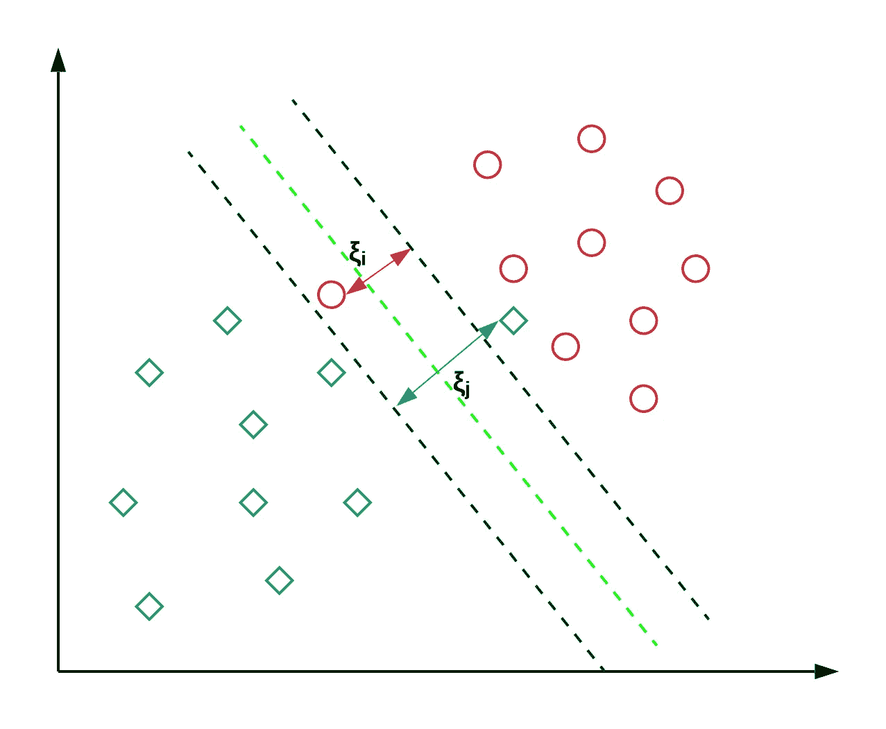

SVM’s soft margin formulation technique in action

# 介绍

支持向量机(SVM)是最流行的分类技术之一，旨在直接最小化误分类错误的数量。有许多可访问的资源可以理解支持向量机(SVM)如何工作的基础知识，然而，在几乎所有的现实世界应用中(其中数据是线性不可分的)，SVM 使用一些高级概念。

> 这篇文章的目的是解释软边界公式的概念和支持向量机用来分类线性不可分数据的核心技巧。

如果你想先重温一下 SVM 的基础知识，我推荐你看看下面这篇文章。

[](/support-vector-machine-introduction-to-machine-learning-algorithms-934a444fca47) [## 支持向量机——机器学习算法简介

### 从零开始的 SVM 模式

towardsdatascience.com](/support-vector-machine-introduction-to-machine-learning-algorithms-934a444fca47) 

# 线性*不可分性*

在我们继续讨论软余量和核心技巧的概念之前，让我们先确定它们的必要性。假设我们有一些数据，可以在 2D 空间中描述如下:

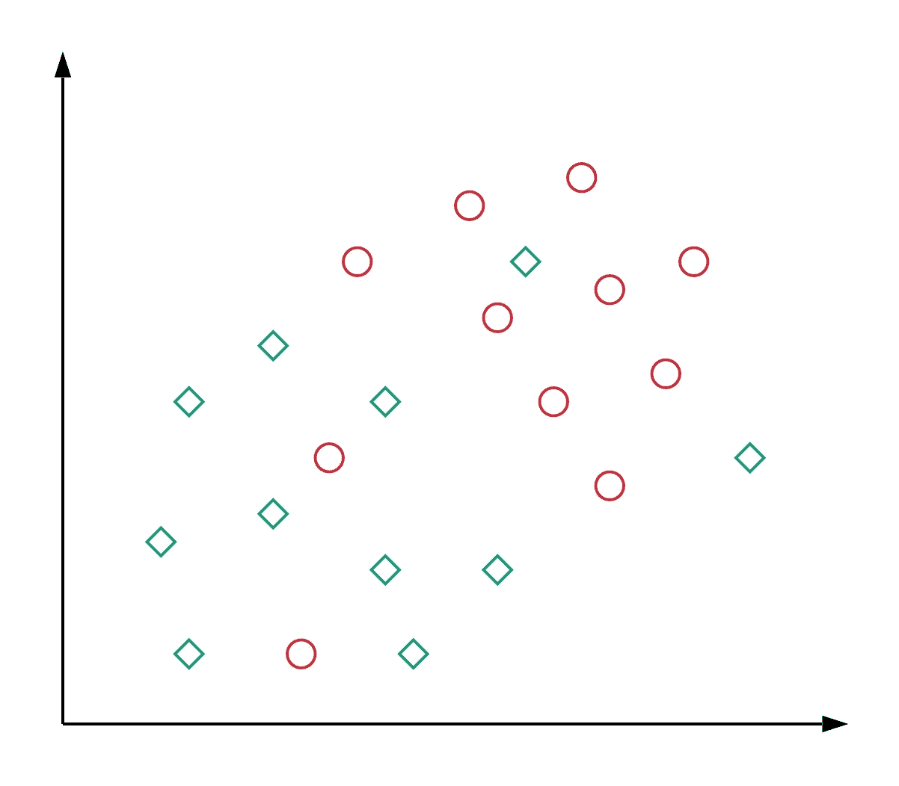

Figure 1: Data representation where the two classes are not linearly separable

从图中可以明显看出，没有特定的线性判定边界可以很好地分离数据，即*数据是线性不可分的*。在更高维度的表现中，我们也可以有类似的情况。这可以归因于这样一个事实:通常，我们从数据中获得的特征不包含足够的信息*以便我们可以清楚地区分这两个类别。在许多现实世界的应用程序中通常都是这种情况。幸运的是，研究人员已经提出了能够处理这种情况的技术。让我们看看它们是什么以及它们是如何工作的。*

# 软边界公式

> 这个想法是基于一个简单的前提:*允许 SVM 犯一定数量的错误，并保持尽可能大的差距，以便其他点仍然可以正确分类*。只要修改 SVM 的目标，就可以做到这一点。

## 动机

让我们简要回顾一下采用这种提法的动机。

*   如前所述，几乎所有现实世界的应用程序都有线性不可分的数据。
*   在数据*是*线性可分的极少数情况下，我们可能不想选择一个完美分离数据的决策边界来避免过度拟合。例如，考虑下图:

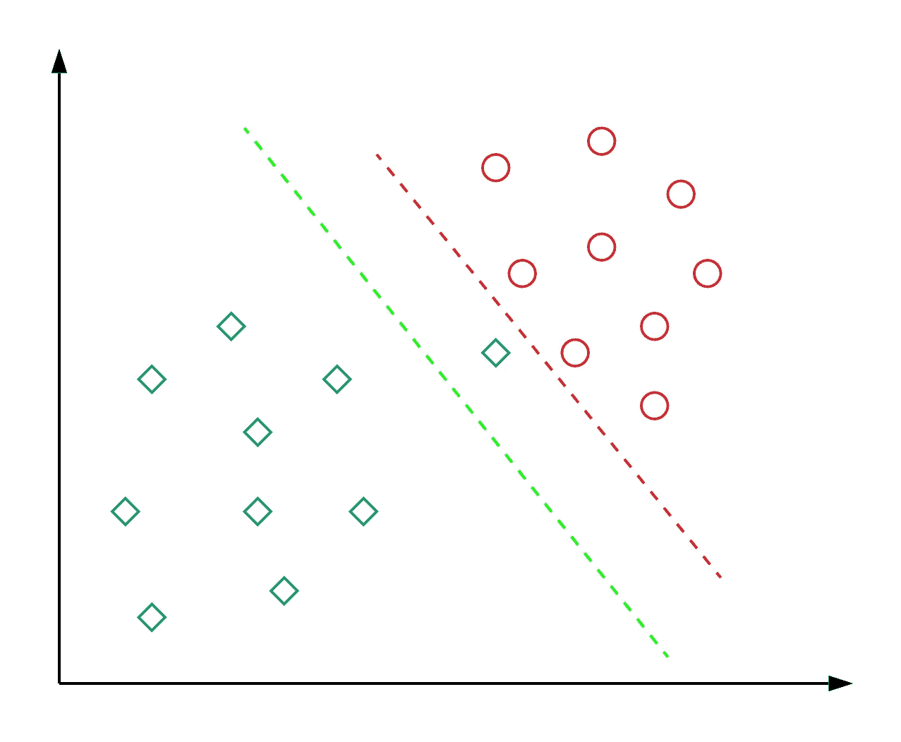

Figure 2: Which decision boundary is better? Red or Green?

这里的`red`决策边界完美地分隔了所有的训练点。然而，拥有如此少的余量的决策边界真的是一个好主意吗？你认为这样的决策边界会在看不见的数据上很好地推广吗？答案是:不。`green`决策边界有更宽的边界，这将允许它对看不见的数据进行很好的概括。从这个意义上说，软余量公式也有助于避免过度拟合问题。

## 它是如何工作的(数学上)？

让我们看看如何修改我们的目标，以达到预期的行为。在这种新环境下，我们的目标是最大限度地降低以下目标:

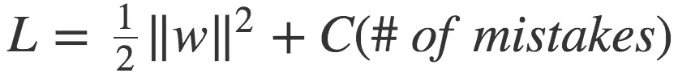

equation 1

这与第二任期的最初目标不同。这里，`**C**`是一个超参数，它决定了最大限度地提高利润和最小化错误之间的权衡。当`**C**`较小时，分类错误的重要性较低，重点更多地放在最大化裕度上，而当`**C**`较大时，重点更多地放在避免错误分类上，代价是保持裕度较小。

在这一点上，我们应该注意到，然而，并不是所有的错误都是相同的。与距离较近的数据点相比，远离决策边界错误一侧的数据点应该招致更多的惩罚。让我们看看如何在下图的帮助下实现这一点。


Figure 3: The penalty incurred by data points for being on the wrong side of the decision boundary

想法是:对于每个数据点`**x_i**`，我们引入一个松弛变量`**ξ_i**`。`**ξ_i**` 的值是`**x_i**`到*对应类的边距*的距离，如果`**x_i**`在边距的错误一侧，否则为零。因此，在错误一侧远离边缘的点将得到更多的惩罚。

有了这个想法，每个数据点`**x_i**` 需要满足以下约束:


equation 2

这里，不等式的左边可以被认为是分类的置信度。置信度得分≥ 1 表明分类器对该点进行了正确分类。但是，如果置信度得分< 1, it means that classifier did not classify the point correctly and incurring a linear penalty of 【 **。**

鉴于这些限制，我们的目标是最小化以下功能:

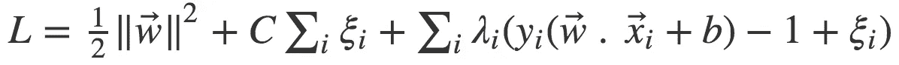

equation 3

其中我们使用了[拉格朗日乘数](https://en.wikipedia.org/wiki/Lagrange_multiplier)的概念来优化约束条件下的损失函数。让我们把它与 SVM 处理线性可分情况的目标相比较(如下所示)。

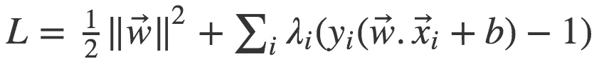

equation 4

我们看到，在修改后的目标中，只有`**ξ_i**` 项是额外的，其他都是相同的。

> 注意:在最终解决方案中，对应于最接近边缘和边缘错误侧的点(即具有非零的`**ξ_i**`)的`**λ_i**`将是非零的，因为它们在决策边界的定位中起关键作用，本质上使它们成为支持向量。

# 内核技巧

现在让我们探索使用“内核技巧”来解决线性不可分性问题的第二种解决方案。但首先，我们应该了解什么是核函数。

## 核函数

核函数是将两个向量(任何维度)作为输入并输出表示输入向量相似程度的分数的广义函数。你已经知道的一个简单的核函数是点积函数:如果点积小，我们得出向量不同的结论，如果点积大，我们得出向量更相似的结论。如果您有兴趣了解其他类型的内核函数，[这个](https://en.wikipedia.org/wiki/Kernel_method#Popular_kernels)将是一个很好的来源。

## “诡计”

让我们看看线性可分情况的目标函数:

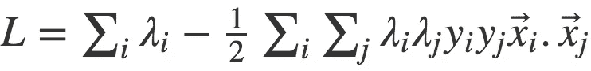

equation 5

> 这是`equation 4`中物镜的修改形式。这里，我们代入了`**w**`和`**b**`的最佳值。这些最佳值可以通过对这些参数求微分`equation 4`并使其等于 0 来计算。

我们可以从`equation 5`中观察到，目标依赖于输入向量对的点积(`***x_i . x_j***`)，它只不过是一个核函数。现在这里有一件好事:*我们不必局限于像点积*这样简单的内核函数。我们可以使用任何[花哨的核函数](https://en.wikipedia.org/wiki/Kernel_method#Popular_kernels)来代替点积，它具有在更高维度中测量相似性的能力(在这种情况下，它可能更精确；稍后将详细介绍)，而不会增加太多的计算成本。这基本上被称为*内核技巧*。

## 它是如何工作的(数学上)？

核函数可以用数学方法写成如下形式:

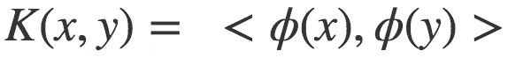

equation 6

这里`**x**`和`**y**`是输入向量，`***ϕ***`是变换函数，`< , >`表示点积运算。在点积函数的情况下，`***ϕ***` 只是将输入向量映射到自身。

> 核函数本质上采用变换后的输入向量的点积。

现在让我们考虑下面`figure 4`中描述的情况。我们看到，在 2d 空间中没有可以完美分离数据点的线性决策边界。圆形(或二次型)决策边界可能可以完成这项工作，但是，线性分类器无法得出这些类型的决策边界。

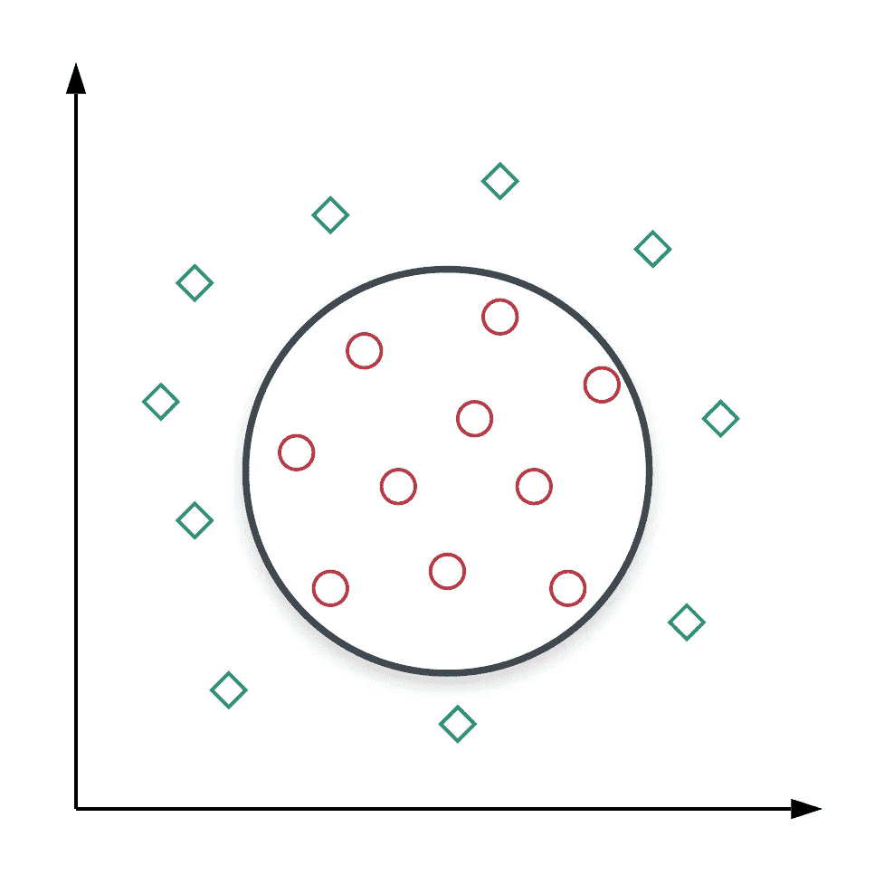

Figure 4: Points in 2D space are separable by a circular decision boundary.

在`figure 4`中，每个点`P`由 2D 空间中形状`(x,y)`的特征表示。查看理想的决策边界，我们可以将点`P`的转换函数`***ϕ***`定义为`***ϕ***(P) = (x^2, y^2, √2xy)`(我们为什么要进行这样的转换一会儿就清楚了)。让我们看看对于两点`P_1`和`P_2`的这种类型的变换，核函数是什么样子的。

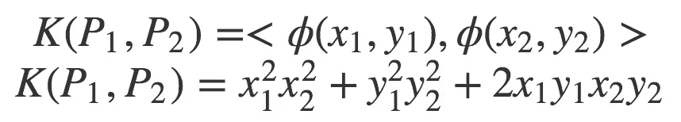

equation 7

如果我们观察内核函数的最终形式，它无非是[一个圆](https://www.mathsisfun.com/algebra/circle-equations.html)！这意味着我们改变了相似性的概念:我们不再通过点的接近程度(使用点积)来衡量相似性，而是根据点是否在一个圆内来衡量相似性。在这个意义上，定义这样的变换允许我们在 2D 空间中有一个*非线性决策边界*(它在原始 3D 空间中仍然是线性的)*。*要跟踪的内容可能很多，因此以下是我们所做决定的简要总结:

```
**1** - Each point P is represented by (**x**,**y**) coordinates in 2D space.**2** - We project the points to 3D space by transforming their coordinates to (**x^2**, **y^2**, **√2xy**)**3** - Points which have high value of **x**.**y** would move upwards along the z-axis (in this case, mostly the red circles). [This video](https://www.youtube.com/watch?v=3liCbRZPrZA) provides a good visualization of the same.**4** - We find a hyperplane in 3D space that would perfectly separate the classes.**5** - The form of Kernel function indicates that this hyperplane would form a circle in 2D space, thus giving us a non-linear decision boundary.
```

主要的要点是:

> 通过将数据嵌入到更高维的特征空间中，我们可以继续使用线性分类器！

这里需要注意的是，这些变换可能会大幅增加特征空间，从而增加计算成本。有什么方法可以在不增加计算成本的情况下获得上述好处呢？原来是有的！

让我们尝试重写`equation 7`中的内核函数:

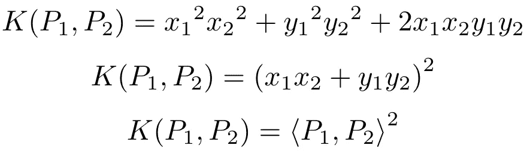

equation 8

哇哦。因此，核函数的值(因此，3D 空间中的点之间的相似性)正好是 2D 空间中的点之间的点积的平方。很棒，对吧？！但是这是怎么发生的呢？

原因是我们明智地选择了我们的转换函数`***ϕ***` 。只要我们继续这样做，我们就可以绕过变换步骤，直接从 2D 空间中的点之间的相似性来计算核函数值。这反过来也会抑制计算成本。我们有许多流行的[内核函数](https://en.wikipedia.org/wiki/Kernel_method#Popular_kernels)，它们都有这种良好的特性，可以开箱即用(我们不需要搜索完美的`***ϕ***`)。

# 结束语

到此为止，我们已经完成了这篇文章。希望本文提供的细节能让您深入了解是什么让 SVM 成为一个强大的线性分类器。如果你有任何问题或建议，请在评论中告诉我。干杯！🥂

如果你喜欢这篇文章，并对我未来的努力感兴趣，可以考虑在 Twitter 上关注我:[https://twitter.com/rishabh_misra_](https://twitter.com/rishabh_misra_)