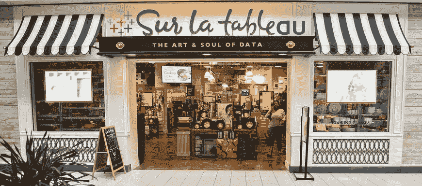
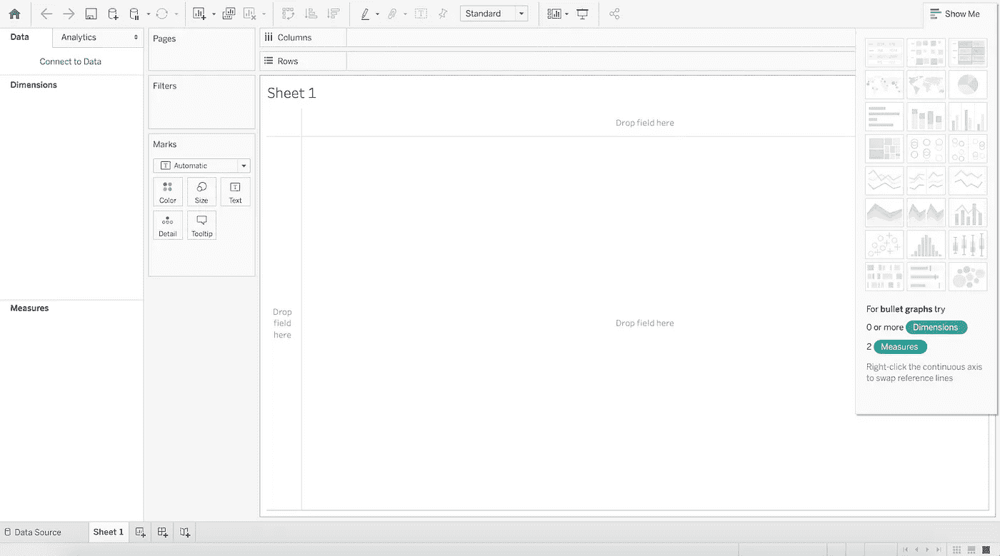
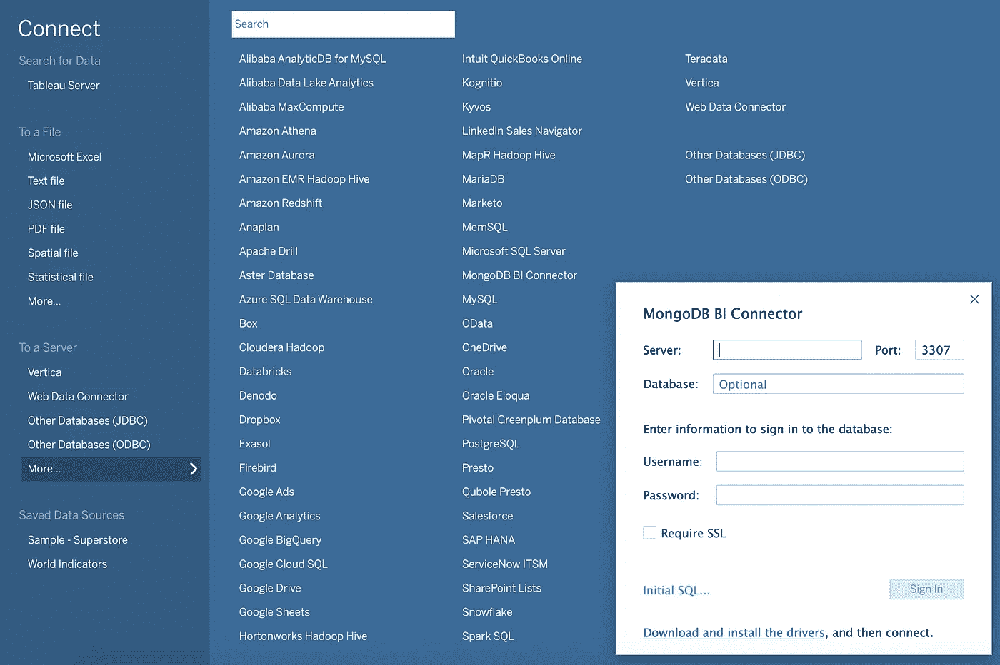
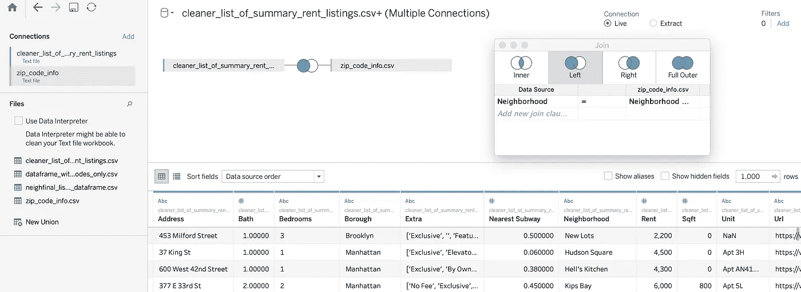
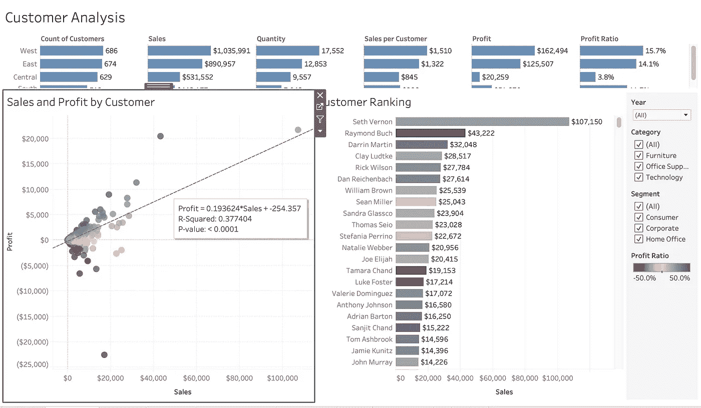
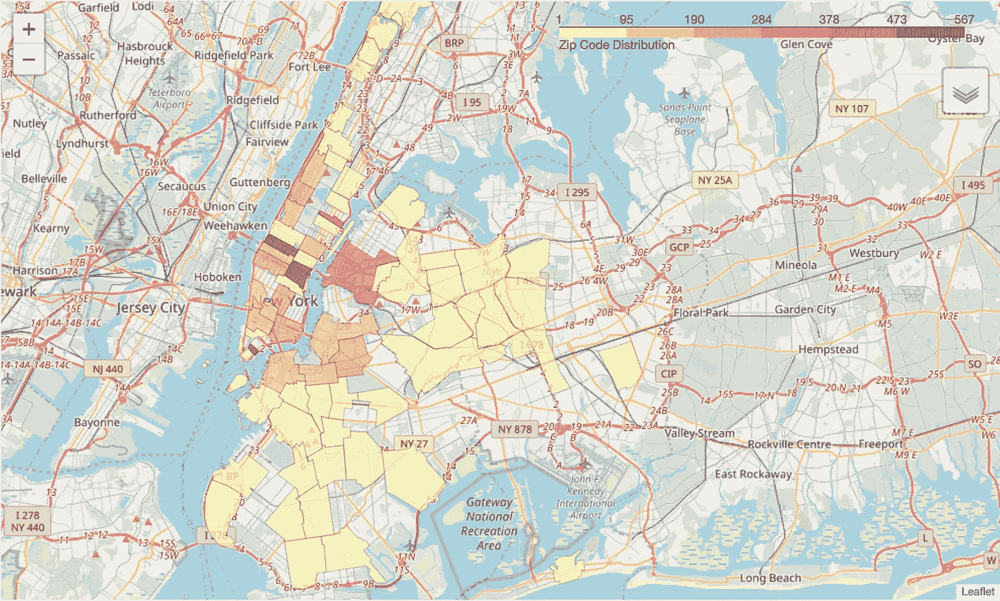
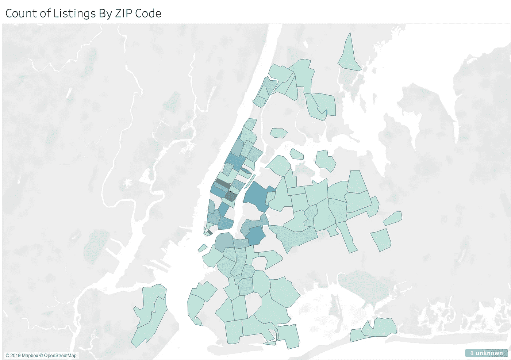
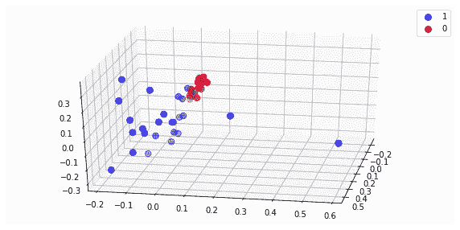
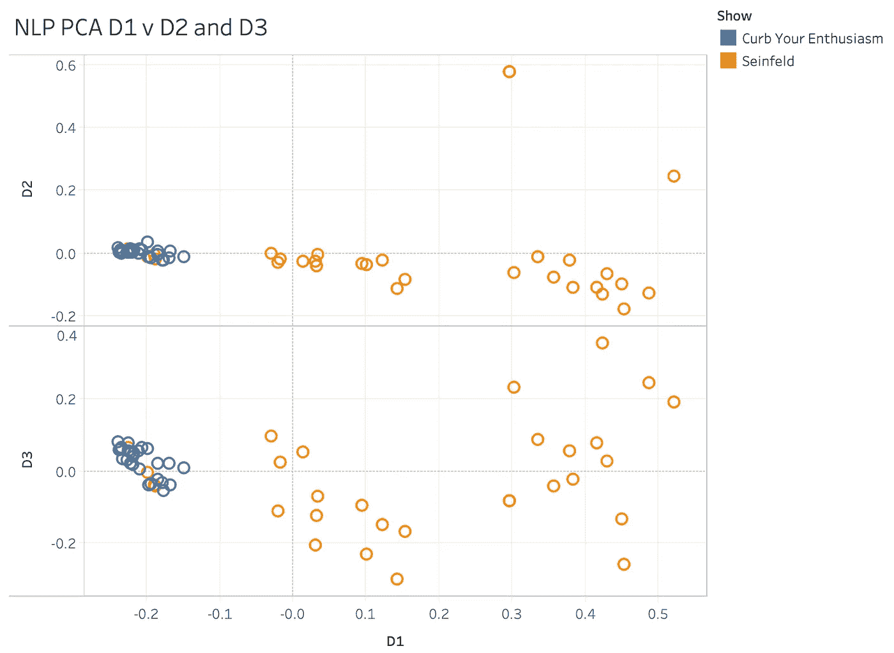

# 在舞台上

> 原文：<https://towardsdatascience.com/sur-la-tableau-cd6fdbd33770?source=collection_archive---------31----------------------->

A picture of a [**Sur La Table**](https://www.surlatable.com) storefront edited with elements from the [**Tableau**](https://www.tableau.com) visualization software

可视化是数据科学家向广大受众清晰传达其发现的主要方法之一。在我开始数据科学之旅之前，我的主要可视化工具是 Microsoft Office 套件和一组简单的图像编辑器(信不信由你，主要是 MS Paint 和 Mac Preview)。这些工具对于我当时的需求来说绰绰有余，也是我高中和大学唯一关注的工具。一旦我进入专业领域，我很快意识到，仅仅这些工具还不足以在任何分析职业中取得成功，如果我不建立自己的技能组合，我将达不到我的目标。现代工作环境需要超越 Excel 能力的高级数据工具，这就是为什么商业智能(BI)软件，如 Tableau，越来越受跨职能团队的欢迎。

我学习数据科学技术的动机是因为我开始处理大型外部数据集，Excel 和 Google Sheets 用太长时间来计算聚合列。我学习了如何操作 Python 的 Matplotlib、Seaborn、Folium 和 Plotly 库，从多个数据源创建强大的可视化。这些库需要对每种类型的图表的特定参数有透彻的理解，以创建专业水平的可视化，这可能很耗时，并且对没有编码经验的人来说是一个入门障碍。有一些 BI 工具将这些库的强大功能和可定制性与 Excel 和 Paint 的相对简单性结合在一起。在与该领域的几个实践成员交流之后，我决定熟悉 Tableau，他们除了使用各种可视化库之外，还使用该软件。

Tableau 是一个 BI 工具，可以轻松地组合来自多个来源的数据，以创建专业的交互式可视化。Tableau 的两个优点是，用户可以创建深入的可视化，而不必调整大量的代码参数，并且用户可以使用相同的 SQL 查询逻辑合并来自多个来源的表。Tableau 现在是在订阅的基础上销售的，在过去几年里经历了增长。根据该公司 2018 年提交的[10k SEC 文件，“截至 2018 年 12 月 31 日，我们拥有超过 86，000 个客户账户，而截至 2017 年 12 月 31 日超过 70，000 个，截至 2016 年 12 月 31 日超过 54，000 个。”然而，这是由你来决定是否值得](https://www.sec.gov/Archives/edgar/data/1303652/000130365219000007/a10k2018.htm)[每月 70 美元的用户订阅费](https://www.tableau.com/pricing/teams-orgs)。

我完成了 Tableau 的创建者部分的在线[教程视频](https://www.tableau.com/learn/training)和练习作业来熟悉这个软件。然后，我从我以前的数据科学项目中重新创建了一些可视化，以比较一些 Python 可视化库和 Tableau，并在这里详细介绍了我的体验。

# 第 1 部分:入门

Tableau 以[包月](https://www.tableau.com/pricing/individual)的方式提供，根据您的需求提供多种价位。你可以下载为期 14 天的[免费试用版](https://www.tableau.com/products/trial),如果你是学生或教师，你可以[获得一年的免费 Tableau](https://www.tableau.com/academic/students)。我用了两个星期的试用期来跟随教程视频。

A New Tableau Workbook

像 Excel 一样，Tableau 文件被称为工作簿，一个**工作簿**可以包含多个**工作表**。在 Tableau 表中，您可以创建多种类型的图表，以不同的方式显示部分数据。这些图表本质上是互动的；您可以选择感兴趣的数据部分，并使用 Tableau 的 GUI 创建自定义的数据分组。屏幕左侧的数据窗格将您的数据分为分类列和连续列。然后，您可以将这些列拖放到可视化的 x 和 y 轴上。

Tableau 工作簿还可以包含**仪表板**和**故事点**。仪表板是一个或多个交互式可视化的视图。您可以将这些可视化效果设置为最初一致地显示给所有其他用户。例如，假设您有一个带有“按国家销售”图表的仪表板。这个图表可以通过多种方式进行调整，用户可以将这个图表更改为“按产品类型销售”对于与您共享工作簿的每个人，您可以将此可视化设置为默认的 *by country* 视图，以确保您发送的是您想要的一致信息。Tableau story points 是一组有序的、带注释的仪表盘，它们共同讲述一个支持您的分析结论的故事。

Tableau’s server connection options with the MongoDB BI menu open

Tableau 允许您从本地文件导入数据并直接连接到外部服务器；您选择由服务器托管的数据库类型(列出了许多 SQL 和 NoSQL 数据库选项)，然后进行查询以选择您想要分析的数据。

有许多选项可以保存 Tableau 工作簿。打包的工作簿(文件扩展名为`.twbx`)包含您分析的基础数据。非打包工作簿(文件扩展名为`.twb`)没有包含在文件中的基础数据，这意味着接收者需要访问相同的数据源才能查看文件。这两种文件类型都保留了可视化的交互性。您还可以将数据和可视化共享为其他文件类型，如 Excel 或 PDF，但是这些将不会保留 Tableau 工作簿的交互性。你也可以将这些文件分享给 Tableau 的云服务。拥有 Tableau Desktop 的用户在获得适当权限的情况下可以查看和编辑工作簿，拥有 Tableau Viewer 的用户( [$12 包月，最少 100 个用户](https://www.tableau.com/pricing/teams-orgs))只能查看工作簿。

# 第 2 部分:数据源

The Join menu open on the Data Source tab in Tableau. Like a SQL query you can join multiple tables on a specific column.

在 tableau 中连接多个数据源很容易。一旦你选择了你感兴趣的表，Tableau 的连接菜单就会弹出。它会自动选择要连接的公共列，并且您可以选择更改连接的列和所使用的连接类型。Tableau 提供了一个健壮的 GUI，对于那些对基于文本的 SQL 和 NoSQL 数据库查询感到厌烦的用户来说，这是一个很好的选择。

**数据源**选项卡包含原始数据，并具有传统 Excel 表的所有排序和聚合选项。如果您使用的是外部数据库，您还可以通过位于窗口右上方的“实时”选项来更新数据。如果选择了“提取”选项，数据将按设定的时间间隔更新。我正在处理静态的`.csv`文件，所以这个选项现在并不重要。

# 第 3 部分:分析和可视化

我使用了三个数据集；来自 Tableau 的样本销售数据集、来自我的逻辑租金预测项目的数据以及来自我的用于自然语言处理的朴素贝叶斯分类器的数据。

教程详细介绍了 Tableau 查看由一家虚构的家具公司生成的典型内部销售数据的多种方式。Tableau 的 GUI 允许您单击并拖动与您的分析最相关的列。工作表窗口右上角的**演示**按钮提供可视化效果，显示所选列之间的关系。

A Tableau dashboard that utilizes sample customer data from a fictional furniture company. Note the regression line and **tooltip** information box open on the bottom left pane.

示例数据集包含关于示例公司的客户、供应商和内部现金流的详细数据。我能够轻松地创建可视化效果，按照市场位置、客户群、产品类型和利润率来分解数据。在本教程之后，我可以看到，如果您的团队一直在生成大量内部数据，那么购买 Tableau 是有意义的。让我们看看 Tableau 如何处理其他数据科学主题的可视化。

## 纽约公寓列表 Choropleth

我的租金预测项目的 GitHub 存储库托管在[这里](https://github.com/amitrani6/nyc_asking_rent_regression)。我有两个熊猫数据框；一个是询问租金和房源信息，另一个是纽约市街区和相应邮政编码的表格。两个数据框共享“邻域”列。在 Python 的 Pandas 库中，您可以使用`.join()`或`.concat()`方法将两个数据帧相加。在 tableau 中，您可以使用交互式加入菜单。

我最喜欢的租金预测可视化是我用 Python 的[叶库](https://python-visualization.github.io/folium/)创建的按邮政编码排列的房源总数的 choropleth 地图。由于所涉及的步骤，我花了大约两个小时来完成这个可视化。我首先必须找到一个向导来绘制一张 choropleth 地图；我遵循的指南是基于洛杉矶的数据。这意味着我必须找到一个特定于纽约邮政编码的`.geojson`文件。一旦我把这些都放在一起，我抛出了几个错误信息。事实证明，最近对 follow 库进行了更新，对代码进行了一些重要的修改。我阅读文档并寻找能帮助我纠正答案的答案。一旦我最终修复了代码，我就有了一个交互式 choropleth 地图来支持我的分析，下面是地图的截图和代码的要点。

A screenshot of the choropleth map created with Python’s Folium library. Folium generates an HTML interactive map, which can be downloaded from the project repository and rendered with a web browser.

The code used to create the interactive choropleth

在 Tableau 中创建一个 choropleth 映射比编写一个简单得多。首先创建一个与原始数据分开的新工作表。然后将邮政编码列拖放到列**栏**和行**栏**中。然后，单击行栏中邮政编码气泡右侧的下拉菜单。您将数据转换为条目数，其中每个条目代表一个列表。最后，点击窗口右上角的**演示**，第一个选项是交互式 choropleth 地图。我不需要搜索特定于纽约市的`.geojson`文件。这花了我两分钟时间，比编码方式快多了。

A screenshot of an interactive Tableau choropleth map. Tableau maps move by dragging and scrolling instead of the point-and-click controls of a Folium map.

Tableau 地图是高度可调的。我很快制作了一个按邮政编码划分的平均租金图，并且我能够用下拉菜单来改变颜色，而不是调整代码中的参数。

## **PCA 可视化**

我最近完成了一个[朴素贝叶斯分类器](https://medium.com/analytics-vidhya/curb-your-enthusiasm-or-seinfeld-2e430abf866c)，它可以区分*抑制你的热情*和*宋飞*的脚本。利用自然语言处理和主成分分析的原理，我确定了三个维度，这三个维度可以最好地解释这两种文字之间的差异。我利用 Python 的 Matplotlib 和 Scikit-Learn 库生成了下面的可视化。

适用于以下可视化的 PCA 的相关部分是每个脚本中的每个单词都是脚本的一个维度。如果一个脚本包含七次提到名字 *Kramer* ，那么这个脚本的 *Kramer 维度*的值就是七。如果脚本不包含单词 *Cat* ，则该脚本的 *Cat Dimension* 的值为零。一个文字可以有和单词一样多的维度，PCA 试图减少维度的数量，同时尽可能多地解释文字之间的差异。我选择了三个*主成分*来解释最大的差异，以创建下面的可视化。

A 3-D representation of the scripts utilizing features identified with Principal Component Analysis. Note the red (Curb) scripts are tightly clustered while the blue (Seinfeld) scripts are more spread out.

The code to create the 3-D representation of the “Curb your Enthusiasm” and “Seinfeld” scripts

我将用于创建上述图表的数据导出到 Tableau。我搜索了各种论坛来学习如何在 Tableau 中制作三维图表，并且我很快了解到在商业智能社区中有一场关于第三轴是否是坏习惯的辩论(参见 Tableau 社区论坛对话[这里](https://community.tableau.com/ideas/1328)和[这里](https://community.tableau.com/thread/249498))。三维图表在数据科学社区中很常见，因为我们可以解释用于创建额外维度的数学原理。

我创建了脚本主要组件的并排可视化，并将其添加到仪表板中。

A Tableau Dashboard visualization of the Principal Components for “Curb Your Enthusiasm” and “Seinfeld” scripts. The visualization contains two side-by-side charts of the first dimension to the second and third dimensions, respectively.

虽然 Tableau 不支持我想要创建的 XYZ 三维图形类型，但仪表板清楚地显示，与广泛传播的*宋飞*脚本相比，有一个紧密的*抑制你的热情*脚本集群。幸运的是，Tableau 有许多导入选项，如果我的分析绝对需要的话，这些选项可以让我将 Python 生成的图像上传到 Tableau 仪表板。

# 结论

Tableau 有许多优点和缺点:

## 赞成的意见

*   Tableau 是一个 BI 工具，旨在从客户/客户销售、供应商和内部财务数据中发掘洞察力
*   Tableau 有一个简单直观的图形用户界面
*   Tableau 用户可以快速创建 BI 可视化，无需编码经验
*   有许多导入选项允许用户轻松整合内部和外部数据源
*   联接数据源遵循 SQL 查询的逻辑
*   仪表板和故事点视图允许您通过交互式可视化引导您的观众进行分析
*   他们的网站上有许多培训视频和练习
*   您可以保存和共享完整的 Tableau 工作簿或创建不同类型的文件，以便与非 Tableau 用户共享静态图像
*   Tableau 的云服务提供了多种发布选择

## 骗局

*   Tableau 是一个 BI 工具，它不是为创建数据科学领域流行的所有可视化而设计的
*   Tableau 很贵，只能为一直使用它的团队成员订阅
*   Tableau 中可供数据科学家使用的模型和选项不像 Python 库中的那么多，比如 [Scikit-Learn](https://scikit-learn.org/stable/supervised_learning.html)

## TL；速度三角形定位法(dead reckoning)

Tableau 是一个商业智能工具。习惯它直观的 GUI 是相当容易的。如果您的团队持续生成大量的内部数据(*即*来自客户/顾客、供应商和产品/服务的数据)，那么 Tableau 可以成为帮助您发现有价值见解的强大工具。Tableau 在从消费者行为中获得洞察力方面大放异彩，但在为 PCA 等高级主题生成三维图表方面却表现不佳。

Tableau 不是商业或数据科学的一体化软件解决方案，它不具备 Python 包的功能和可定制性。Tableau 很容易生成可视化和相关的统计信息，请确保您在展示您的发现之前理解这些信息的含义。Tableau 按月订阅；如果您计划使用该软件，并且如果您的团队生成了该软件旨在处理的数据，则只为您和您的同事购买订阅。

只有你能决定 Tableau 对你的团队来说是否值得。