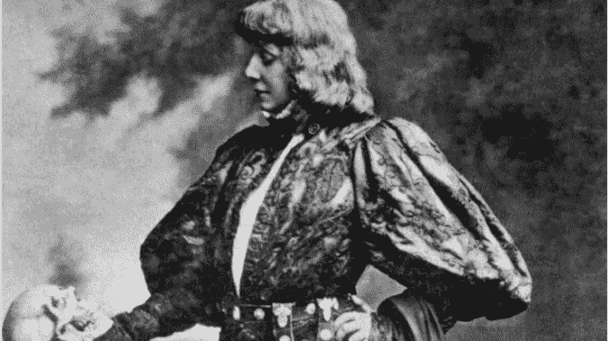
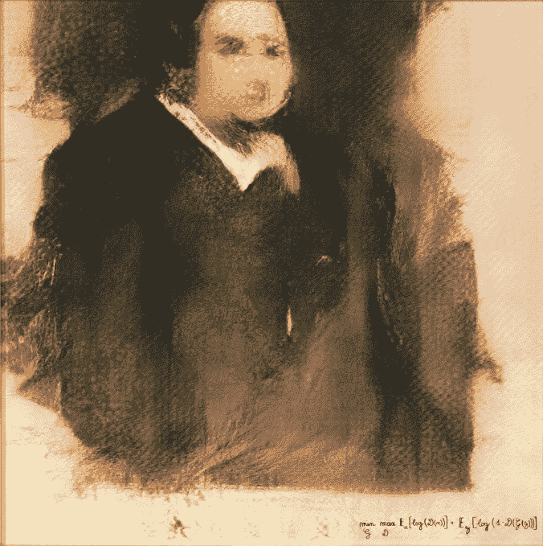
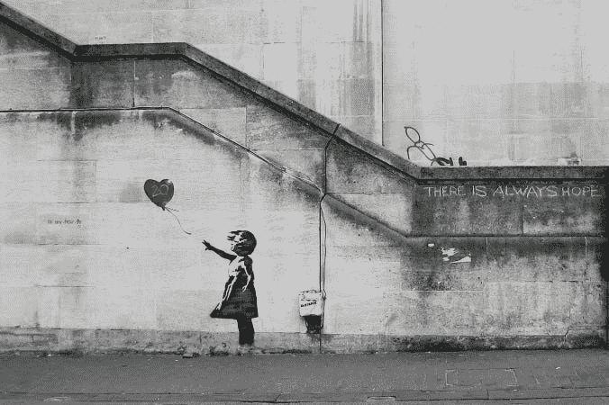

# 当然，人工智能可以有创造力，但它永远不会拥有天才

> 原文：<https://towardsdatascience.com/sure-ai-can-be-creative-but-it-will-never-possess-genius-8a6fecd7fbbc?source=collection_archive---------24----------------------->

Sarah Bernhardt plays Hamlet, London 1899

***“赫卡柏对他来说算什么，还是他为了赫卡柏，***
***那他应该为她哭泣？”***

在第二幕第二场的结尾，哈姆雷特质疑在一部关于围攻特洛伊的戏剧中，演员们如何能够传达这样的情感——对一座古城的陌生女王产生这样的共鸣。

这里的构造很复杂。一出戏中的戏，引发了关键时刻的自省，并最终自我怀疑。并非巧合的是，在这部作品中，我们可能最早使用了术语“[我的心眼](http://www.bardwords.org/famous-shakespeare-quotes/my-minds-eye.htm)”，这预示着戏剧焦点的转变，从传统的制定争端、情人激情和闹剧，到更微妙的一种从心理混乱中产生的戏剧。

《哈姆雷特》被普遍认为是一部创造性天才的作品。对于许多从事创造性艺术的人来说，像这样的作品和其他更广泛的作品是理想的基准。不可磨灭的对人类创造力辉煌的提醒。

现在，在我们的历史上，人类第一次在审美创造的刻意行为中有了对手。在人工智能炒作的雪崩中，出现了一个新的承诺——创造性的人工智能；这里是为了减轻我们繁重的任务，包括[音乐](https://newatlas.com/creative-artificial-intelligence-computer-algorithmic-music/35764/)、[文学](https://www.theatlantic.com/technology/archive/2018/10/automated-on-the-road/571345/)和[艺术](https://www.christies.com/features/A-collaboration-between-two-artists-one-human-one-a-machine-9332-1.aspx)创作。

在最近一集 Gigaom 的人工智能播客中，高通技术副总裁 Max Welling 解释了复制这一努力的可能性，直到现在，这还是人类的唯一权限:

> “有时人们会说，有创造力是一件非常神奇的事情。这不是我们可以在计算机中创造的东西，但我不同意…创造力实际上是以非常令人惊讶的新方式将你在过去学到的东西结合起来，对吗？将模块重组为对其他人来说非常惊人的新方式。现在，作为人类，我们在这方面做得相当好，但我要说，对于计算机来说，没有理由认为它们不能比人类做得更好。”

无论是对创造力构成要素的看法，还是对智能机器的雄心，韦林都不是唯一的一个。当被问及儿童可能从教育系统中学习创造力的未来时，教育科技公司松鼠 AI 的发言人类似地告诉我:“(T2)我们相信人工智能将在 5 到 10 年内超越人类的创造力。”超越！显然，他们已经确定了创造力的四个组成部分，每一个现在都可以在人工智能计算机中演示:广泛的知识，好奇心，发散思维和逻辑归纳。

[另一家投资于这一成长领域的公司 Creative AI](https://creative.ai/) ，可能没有宣布计算机的文学作品会让伟大的小说看起来像无聊的涂鸦，但他们已经支持了它在帮助人类创造力方面的新兴实力。他们说，我们正朝着前所未有的创新工具(图片编辑器、音乐工作室等)和更大的合作机会(社交网络平台)发展。这导致了他们所谓的“创造力的升级”；或者“*一个创造力高度开放的世界，任何人都可以像莎士比亚一样写作，像巴赫一样作曲，像梵高一样绘画……”*

这种观点表明了一种病毒式的信念，即任何东西都可以被分解成模块或被捕捉为数据，被量化，并最终被机器复制或指导。甚至创作才华。

*Edmond de Bellamy, a generative adversarial network portrait painting*

对我来说，这完全误解了真正创造力的目标和乐趣。

即使我们向松鼠 AI 承认好奇心(例如)是创造的一个公理部分，他们也选择了参考深度学习系统来证明这一点，该系统最近胜过了游戏中的人类玩家，[蒙特祖马的复仇](https://venturebeat.com/2019/01/31/ai-teaches-itself-how-to-play-montezumas-revenge/)。这可能令人印象深刻，但这是一种好奇心，需要由机器的人类创造者密切监管。虽然有证据表明，蹒跚学步的儿童以明显系统的方式学习和适应——使用与人工智能类似的“算法”基于统计概率进行推理——但他们无疑是这一过程中的意志原动力。正如柏克莱大学教授兼发展心理学家[艾莉森·戈普尼克(Alison Gopnik)所描述的那样](https://aeon.co/videos/what-toddlers-can-teach-us-about-how-the-human-brain-does-science)，小孩子“进入一切”作为他们收集证据的一部分。我们从经验中知道，这意味着探索各种环境、人工制品、情感、交流、感觉等。

即使对于一个“好奇”的人工智能，它们的等价领域也必然是有限的。艺术 AI 从艺术中学习如何做艺术*；它不会根据环境来创作艺术。然而这是创造性艺术*是*的一个重要组成部分。它是对我们生活经历的反应和表达。*

在我们发现创造性天才的地方——无论是在一个创造性的作品中，还是在一个人类创造者的集体作品中——我们都被其吸收和传播深刻事物的能力所吸引。我们也许不能清楚地说出它的特征，但我们可以说它是一种信息的载体，通常被包裹在一种情感之中。一个机械系统也许能够制造出看起来*就像*班克斯的东西，但是就像赝品一样，它情感上的不真实性使它的艺术价值无效。

一个真正的创造者不可能没有思想或意识，而一个人工智能不可能创作出对它无法体验的世界进行评论的作品。正如一个人如果没有经历过风，也没有长出过头发，就无法表达头发被风吹动的感觉。

除了感官或情感之外，伟大的创造力通常会吸引我们人类熟悉的、但通常不言而喻的密集联系网络。保罗·萨格[写了](https://aeon.co/essays/why-do-we-allow-objects-to-become-tainted-by-chance-links)人类对联想的巨大重视，并借用了西蒙·布莱克本的例子:

> “想象一下，我请你吃饭，在切烤肉的时候，我不经意地提到这正是刺客用来谋杀我妻子和孩子的刀。你还会放心吃我刚刚放在你盘子里的那片牛肉吗？”

正是这些类型的社会和心理关联的显著性，创造性的杰出作品才能如此娴熟地运用。作为一个推论，我们的大部分享受来自于我们努力确定创作者的动机，或主体的意图。

*Banksy, Girl With Heart Balloon*

哈姆雷特真的疯了吗？蒙娜丽莎在微笑吗？关于信仰，Pi 的动物教会了我们什么？和威利·罗曼谈成功？为什么大卫如此悲伤地看着歌利亚的头？这些东西是无法通过数据的计算分析获得的。如果没有对支撑它们的人类状况的物种层面的理解，同样价值的作品也不可能产生。

这并不是说科学在创造力中没有位置。相反，如果没有辅助技术，创造性人工制品的历史将会更加糟糕。画笔、钢笔、打字机、照相机、录音棚——不胜枚举。有了这惊人的祖先，新的人工智能技术无疑将促进未知领域的创造性艺术，使我们所有人感到惊讶和挑战。“增强”是描述这种帮助的流行方式，但这只是含蓄地承认，当涉及到有意义的创造性工作时，人工智能将是一种工具，而不是托尔金。

这种区别很重要，尤其是在从业者将人工创造力描述为人工智能的[“终极登月”的时候。事实上，这些系统并没有努力创造美丽的、有挑战性的东西。相反，他们试图预测和生产人类可能认为有价值或美丽的东西。在其他行业——如营销和广告——这种方法迄今为止在预测，然后](https://www.ibm.com/watson/advantage-reports/future-of-artificial-intelligence/ai-creativity.html)[逐渐塑造我们的偏好和行为方面非常成功。不久，我们可能会发现我们的艺术品味在重新调整，变得更有利于快速、轻松地创作出创造性的作品，而且成本只是真正作品的一小部分。这种塑造可能已经发生了。](https://blogs.scientificamerican.com/observations/cambridge-analytica-and-online-manipulation/)

像《哈姆雷特》中的演员一样，艾并不刻画真实的情感，只刻画其表面的所指。它是拟态，有它的用途(包括娱乐)，但永远代替不了光彩。让我们确保，在试图将人类的创造力归结为其组成部分并廉价地模拟它的同时，智能技术被用来培养和提升真正的交易。