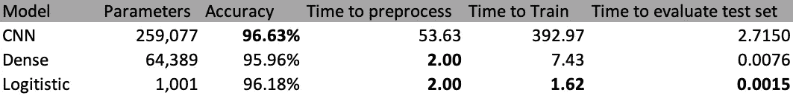
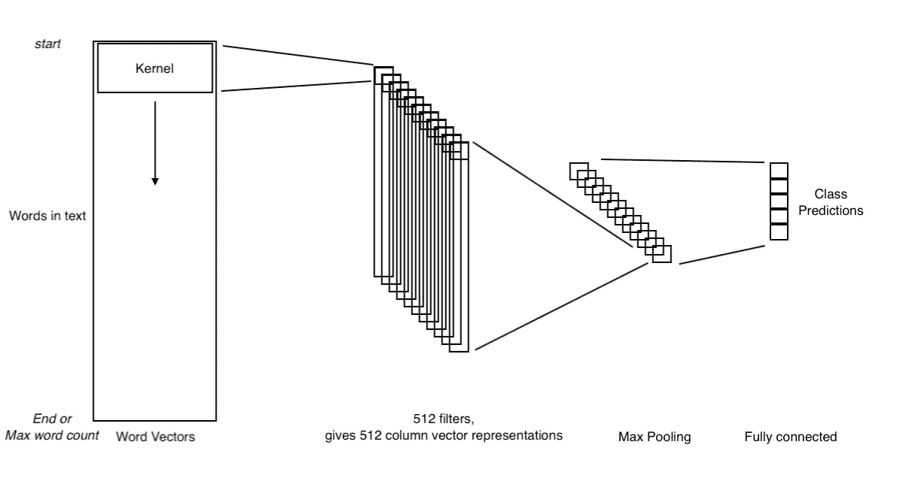
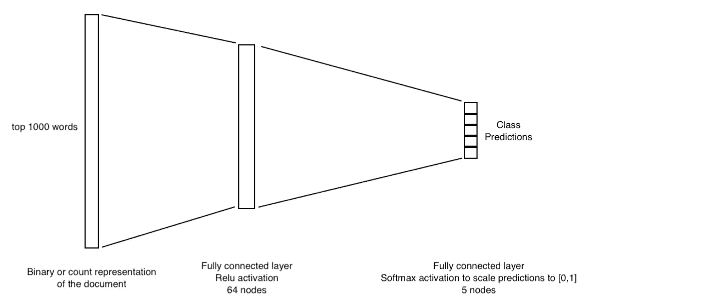

# 文档分类中的惊人发现

> 原文：<https://towardsdatascience.com/surprising-findings-in-document-classification-7a79e30f1666?source=collection_archive---------15----------------------->

## 有时候简单会赢

文档分类:给大量文本分配标签的任务。在这种情况下，任务是将 BBC 新闻文章分类到五个不同的标签中的一个，例如体育或科技。所使用的数据集并不理想地适合深度学习，只有数千个例子，但这在大公司之外远不是不现实的情况。

通常这种类型的技术文章会通过几个模型运行，然后以结果比较和总体评估结束，但今天我想我会给你留一个卷轴，从意想不到的结果开始。

简单的模型效果最好。就像，**真的是**简单的型号。逻辑回归优于或等同于各种深度神经网络方法。我假设这是由于数据集的较小尺寸和所讨论的长文本。不同于诸如句子分类的任务，在句子分类中，单词的数量很少并且单词的**顺序**极大地影响句子的意思，文档分类问题有大量的单词用于对每个文档进行分类。这导致单词的顺序对类别的预测能力较低，降低了卷积网络、LSTMs 和分层注意网络(HAN)等技术的有效性，所有这些技术在大规模数据集上都表现良好。相反，只使用文本中存在的单词的方法效果更好，最上面的 *n* 个单词的计数或二进制编码(0:单词不在文档中| 1:单词在文档中)效果最好。

好的，现在让我们来看看一些模型。那些表现令人震惊的模型不包括在内。

## 起始复数|卷积神经网络| 96.63%

CNN 的方法旨在使用文本中单词的顺序来提供含义。完全连接的层也可以做到这一点，但这存在两个问题:

1.  要优化的权重数量将是巨大的，有过度拟合的风险。
2.  权重对文本中单词的相对位置敏感。

CNN 的方法旨在通过假设文本中的单词序列对类别具有预测能力来解决这些问题，但是这些序列在文本中的位置是不相关的。通过在文本中的单词上移动**相同的**内核，我们从过滤器获得相同的激活，而不管短语在文本中的位置。唯一的位置变化是激活在第一层的列向量中。这是通过使用最大池层将列向量减少到单个行向量来消除的。结果，可以想象 512 个内核中的每一个都在文本中搜索特定的短语。

当然，**完全相同的**短语不太可能出现在多个文本中。这通过使用单词向量来编码每个单词的相对**含义**来缓解，因此短语“我爱我的手机”和“我爱我的手机”将传递相似的激活，尽管不是逐字相同的。这也减少了单词表示的维度，允许 350 万单词的词汇表只有 50 到 300 个维度。

## 降一个档次|密集神经网络| 95.96%

让我们把事情简化一点。在密集网络中，我们只有一个 64 节点的隐藏层，然后是一个输出预测层，就像 CNN 模型一样。如引言中所述，所使用的输入也被简化为二进制编码，其中 0 表示“单词不在文档中”, 1 表示最常见的 *n* 单词的“单词在文档中”。

这种方法工作得非常好，给出了与 CNN 方法相似的性能，但是具有更快的训练和处理时间。它的内存效率也更高，只需要 CNN 模型的 24%的参数。

## 简化！多项逻辑回归| 96.18%

一个更简单、统计上更严谨的模型是逻辑回归模型。在这种情况下，使用与密集网络相同的特征工程。这被输入到逻辑模型中，该逻辑模型类似于没有隐藏层并且在其输出层上具有 sigmoid 激活的神经网络，尽管用于拟合它的方法和损失函数是特定于该模型的。

这个模型非常简单，不考虑 CNN 捕捉到的单词和短语的顺序信息。它也没有任何词义的上下文，对待“爱”和“崇拜”就像对待“狗”和“三明治”一样。然而，尽管做出了所有这些让步，它只牺牲了 0.5%的准确性，却获得了更多的好处:极小的内存使用量、统计上的严格性以及相对较快的训练和评估时间。

也许，只是有时候，简单确实会赢，而且比**好得多**。

*如果你看到这个，为阅读/滚动到这里而欢呼吧。想要结论，再看一遍简介就行了！❤️*