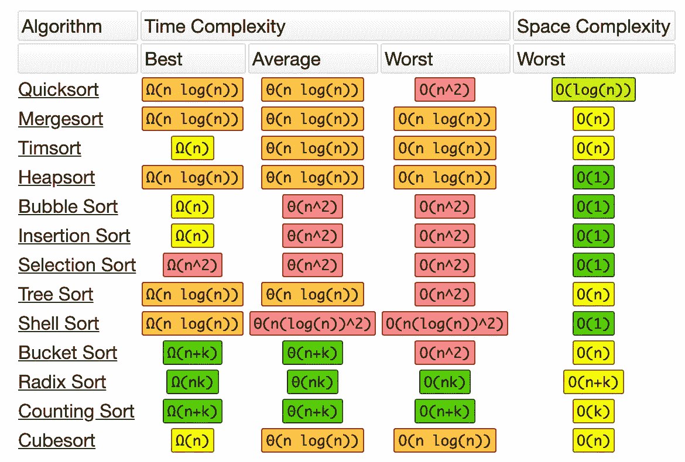
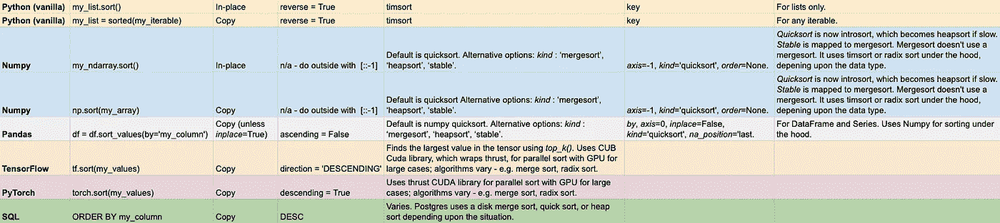
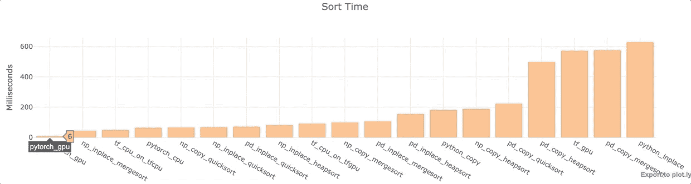

# 数据科学家的惊人排序技巧

> 原文：<https://towardsdatascience.com/surprising-sorting-tips-for-data-scientists-9c360776d7e?source=collection_archive---------10----------------------->

## Python、NumPy、pandas、PyTorch 和 TensorFlow 中的排序函数

对数据进行排序是数据科学家和数据工程师的基本任务。Python 用户有许多带有内置优化排序选项的库可供选择。有些甚至在 GPU 上并行工作。令人惊讶的是，一些排序方法并不使用指定的算法类型，而另一些排序方法并不像预期的那样执行。

选择使用哪个库和哪种类型的排序算法可能很棘手。实现变化很快。截至本文最初撰写时，pandas 文档甚至没有更新代码(尽管我的 PR 更新排序选项刚刚被接受)。😄

在本文中，我将向您介绍情况，提供帮助您记住方法的技巧，并分享速度测试的结果。


Sorted Tea

让我们开始分类吧！

2019 年 7 月 17 日更新:速度测试评测结果现在包括 PyTorch 和 TensorFlow 的 GPU 实现。TensorFlow 还包括`tensorflow==2.0.0-beta1`和`tensorflow-gpu==2.0.0-beta1`下的 CPU 结果。令人惊讶的发现:PyTorch GPU 快如闪电，TensorFlow GPU 比 TensorFlow CPU 慢。我怀疑 GPU 版本中存在性能错误。2021 年 9 月进一步更新，以提高清晰度。

# 语境

有许多不同的基本排序算法。有些执行速度更快，使用的内存更少。有些更适合大数据，有些如果数据以某种方式排列会更好。很多常用算法的时间和空间复杂度见下图。

[](http://bigocheatsheet.com/)

From [http://bigocheatsheet.com/](http://bigocheatsheet.com/)

对于大多数数据科学问题来说，成为基本实现方面的专家并不是必要的。事实上，过早的优化偶尔会被认为是万恶之源。然而，当您需要重复排序大量数据时，知道使用哪个库和哪个关键字参数会很有帮助。这是我的小抄。



My Google Sheet available here: [https://docs.google.com/spreadsheets/d/1zQbDvpmrvTYVnRz_2OTlfB6knLlotdbAoFH6Oy48uSc/edit?usp=sharing](https://docs.google.com/spreadsheets/d/1zQbDvpmrvTYVnRz_2OTlfB6knLlotdbAoFH6Oy48uSc/edit?usp=sharing)

多年来，许多图书馆的排序算法都发生了变化。本文的分析中使用了以下软件版本:

```
python 3.6.8
numpy 1.16.4
pandas 0.24.2
tensorflow==2.0.0-beta1  #tensorflow-gpu==2.0.0-beta1 slows sorting
pytorch 1.1
```

让我们从基础开始。

# Python(香草)


Python 包含两种内置的排序方法。

*   `my_list.[sort()](https://docs.python.org/3/library/stdtypes.html#list.sort)`就地排序列表。它改变了列表。`sort()`返回`None`。
*   `[sorted(my_list)](https://docs.python.org/3/library/functions.html#sorted)`对任何 iterable 进行排序复制。`sorted()`返回排序后的 iterable。`sort()`不变异原来的 iterable。

`sort()`应该快一点，因为到位了。令人惊讶的是，我在下面的测试中并没有发现这一点。就地排序更危险，因为它会改变原始数据。


Vanilla

对于普通 Python，我们将在本文中研究的所有实现，默认的排序顺序是升序——从最小到最大。大多数排序方法接受一个关键字参数来将排序顺序切换到降序。不幸的是，每个库的参数名称都不同。😦

要在 vanilla Python 中将排序顺序改为降序，传递`reverse=True`。

`key`可以作为关键字参数来创建你自己的排序标准。例如，`sort(key=len)`会按每个列表项的长度排序。

vanilla Python 中使用的唯一排序算法是 Timsort。Timsort 根据要排序的数据的特征选择排序方法。例如，如果要对一个短列表进行排序，则使用插入排序。点击查看 [Brandon Skerritt](https://medium.com/u/2480a7e35749?source=post_page-----9c360776d7e--------------------------------) 的精彩文章，了解更多关于 Timsort [的详细信息。](https://skerritt.blog/timsort-the-fastest-sorting-algorithm-youve-never-heard-of/)

Timsort，也就是普通的 Python 排序，[是稳定的](https://docs.python.org/3/howto/sorting.html?highlight=sort)。这意味着，如果多个值相同，那么这些项目在排序后将保持原来的顺序。

为了记住`sort()` vs. `sorted()`，我只记得 *sorted* 是一个比 *sort* 更长的单词，sorted 应该需要更长的时间来运行，因为它必须进行复制。尽管下面的结果不支持传统观点，但助记法仍然有效。😃

现在让我们看看如何使用 NumPy。

# NumPy


NumPy 是科学计算的基础 Python 库。像普通 Python 一样，它有两个 sort 实现，一个改变数组，另一个复制数组。

*   `[my_array.sort()](https://docs.scipy.org/doc/numpy-1.16.0/reference/generated/numpy.ndarray.sort.html#numpy.ndarray.sort)`就地改变数组并返回排序后的数组。
*   `[np.sort(my_array)](https://docs.scipy.org/doc/numpy-1.16.0/reference/generated/numpy.sort.html#numpy.sort)`返回排序后的数组的副本，因此它不会改变原始数组。

以下是可选参数。

*   `**axis**`*: int，可选—* 排序的轴。默认值为-1，表示沿最后一个轴排序。
*   `**kind**` *: {'* ***快速排序*** *'，'* ***归并排序*** *'，'* ***堆排序*** *'，'* ***稳定排序*** *'}，可选—* 排序算法。默认为'**快速排序**'。以下是更多相关信息。
*   `**order**` *: str 或 str 列表，可选—* 当 *a* 是定义了字段的数组时，该参数指定首先比较哪些字段，其次比较哪些字段，等等。可以将单个字段指定为一个字符串，并且不需要指定所有字段，但是仍将使用未指定的字段(按照它们在 dtype 中出现的顺序)来中断连接。

现在使用的排序算法与您根据它们的名称所预期的有所不同。通过`kind=quicksort`意味着排序实际上从一个 [introsort](https://en.wikipedia.org/wiki/Introsort) 算法开始。[文档](https://docs.scipy.org/doc/numpy/reference/generated/numpy.sort.html)解释:

> 当[它]没有取得足够的进展时，它切换到堆排序算法。在最坏的情况下，这种实现使得**快速排序** O(n*log(n))。
> 
> **稳定** 自动为被排序的数据类型选择最佳的稳定排序算法。它与 **mergesort** 一起当前被映射到 timsort 或 radix sort，这取决于数据类型。API 向前兼容性目前限制了选择实现的能力，并且它是为不同的数据类型硬连线的。
> 
> 添加 Timsort 是为了在已经排序或接近排序的数据上获得更好的性能。对于随机数据，timsort 几乎与 mergesort 相同。它现在用于**稳定**排序，而**快速排序**仍然是默认排序，如果没有选择…’**合并排序**和’**稳定**映射到整数数据类型的基数排序。

——来自 [NumPy 文档](https://github.com/numpy/numpy/blob/v1.16.1/numpy/core/fromnumeric.py#L815-L935)——(经过我的一些编辑)。

一个要点是，NumPy 为排序算法选项提供了比普通 Python 更广泛的控制。第二点是*种类*关键字值不一定对应于实际使用的排序类型。最后一点是`mergesort`和`stable`值是稳定的，但是`quicksort`和`heapsort`不是。

NumPy 排序是我们列表中唯一没有使用关键字参数来反转排序顺序的实现。幸运的是，用这样的切片反转一个数组很快:`my_arr[::-1]`。

NumPy 算法选项也可以在更加用户友好的熊猫中使用——我发现这些函数更容易保持直线。

# 熊猫


Panda

用`[df.sort_values(by=my_column)](https://pandas.pydata.org/pandas-docs/stable/reference/api/pandas.DataFrame.sort_values.html)`对熊猫数据帧进行排序。有许多关键字参数可用。

*   `**by**` : *str* 或*str 列表*，必选——排序依据的名称或名称列表。如果轴是 *0* 或*索引*，那么*乘*可能包含索引级别和/或列标签。如果轴是 *1* 或*列*，那么*到*可能包含列级别和/或索引标签
*   `**axis**` : { *0* 或*索引*， *1* 或*列* }，默认为 *0* —待排序的轴。
*   `**ascending**` : *布尔型*或布尔型的*列表，默认*真* —升序或降序排序。为多个分类订单指定*列表*。如果这是一个*列表*的*布尔值*，则必须通过*自变量匹配*的长度。*
*   `**inplace**` : *bool* ，默认*False*——如果 *True* ，执行就地操作。
*   `**kind**` : { *quicksort，mergesort，heapsort，*或 *stable* }，默认 *quicksort —* 选择排序算法。更多信息参见`ndarray.np.sort`。对于数据帧，此选项仅在对单个列或标签进行排序时适用。
*   `**na_position**` : {'first '，' last'}，默认为' last' — *first* 将 *NaNs* 放在开头， *last* 将 *NaN* s 放在末尾。

按照相同的语法对熊猫系列进行排序。对于一个系列，你不需要提供一个`by`关键字，因为你没有多个列。

因为 pandas 使用了 NumPy，所以您可以轻松地使用同样的优化排序选项。然而，熊猫需要一些额外的时间来提供便利。

按单列排序时默认使用 NumPy 的`quicksort` *。*你会想起`quicksort`现在实际上是一个 introsort，如果排序进展缓慢，它会变成一个 heapsort。Pandas 确保通过多列排序使用 NumPy 的`mergesort`。NumPy 中的 Mergesort 实际上使用的是 Timsort 或者 Radix 排序算法。这些是稳定的排序算法，当按多列排序时，稳定排序是必要的。

熊猫要记住的关键事情是:

*   功能名称:`sort_values()`。
*   您需要`by=column_name`或一个列名列表。
*   `ascending`是反转的关键词。
*   如果你想要一个稳定的排序，使用`mergesort`。

当使用 pandas 进行探索性数据分析时，我经常发现自己用`Series.value_counts()`对 pandas 数据帧中的值进行求和和排序。下面是对每一列中最常见的值进行求和和排序的代码片段。

```
for c in df.columns:
    print(f"---- {c} ---")
    print(df[c].value_counts().head())
```

pandas 中的排序是对较小数据集进行探索性数据分析的一个很好的选择。当你的数据放不进内存时，Dask 实现了大部分的 pandas API。截至 2019 年年中，Dask 没有并行排序实现，尽管正在讨论。当您拥有大量数据并希望在 GPU 上进行并行搜索时，您可能希望使用 TensorFlow 或 PyTorch。

# 张量流


[TensorFlow](https://www.tensorflow.org/versions/r2.0/api_docs/python/tf/sort) 是目前最流行的深度学习框架。看我这篇关于深度学习框架普及和使用的文章[这里](/which-deep-learning-framework-is-growing-fastest-3f77f14aa318?source=friends_link&sk=0a10207f22f4dbc143e7a90a3f843515)。以下信息适用于 TensorFlow 2.0 的 GPU 版本。

`tf.sort(my_tensor)`返回张量的排序副本。可选参数:

*   `**axis**` : {int，optional}排序的轴。默认值为-1，对最后一个轴进行排序。
*   `**direction**` : { *升序*或*降序* } —对值进行排序的方向。
*   `**name**` : {str，可选} —操作的名称。

`tf.sort`在幕后使用 `top_k()`方法。`top_k`使用 [CUB 库](https://nvlabs.github.io/cub/)用于 CUDA GPUs，使并行更容易实现。正如文档解释的那样，“CUB 为 CUDA 编程模型的每一层提供了最先进的、可重用的软件组件。”TensorFlow 通过 CUB 在 GPU 上使用基数排序，这里[讨论](https://github.com/tensorflow/tensorflow/issues/288)。

TensorFlow GPU 信息可以在这里找到[。要使用 TensorFlow 2.0 启用 GPU 功能，您需要`pip3 install tensorflow-gpu==2.0.0-beta1`。正如我们将从下面的评估中看到的，如果你所做的只是排序(这不太可能)，你可能想坚持使用`tensorflow==2.0.0-beta1`。](https://www.tensorflow.org/install/gpu)

使用以下代码片段查看每行代码是在 CPU 上运行还是在 GPU 上运行:

`tf.debugging.set_log_device_placement(True)`

要指定您想要使用的 GPU，请使用下面的*和*块:

```
with tf.device('/GPU:0'):
  %time tf.sort(my_tf_tensor)
```

使用`with tf.device('/CPU:0'):`来使用 CPU。

`tf.sort()`是一个非常直观的方法，如果您在 TensorFlow 中工作，可以记住并使用它。记住`direction=descending`切换排序顺序即可。

现在让我们看看另一个流行的深度学习包 PyTorch 中的排序。

# PyTorch


`torch.sort(my_tensor)`返回张量的排序副本。可选参数:

*   `**dim**` : {int，optional *}* —排序所依据的维度
*   `**descending**` : {bool，可选 *}* —控制排序顺序(升序或降序)。
*   `**out**` : {tuple，optional*}*—( Tensor，LongTensor)的输出元组，可以选择用作输出缓冲区。

通过将`.cuda()`添加到张量来指定您想要使用的 GPU。

```
gpu_tensor=my_pytorch_tensor.cuda()
%time torch.sort(gpu_tensor)
```

如果数据集大于 100 万行乘以 100，000 列，PyTorch 将通过[推力](https://thrust.github.io/)使用分段并行排序。

[Thrust](https://github.com/thrust/thrust/wiki/Quick-Start-Guide) 是一个并行算法库，支持 GPU 和多核 CPU 之间的性能移植。它提供了一个排序原语，可以自动选择最有效的实现。TensorFlow 使用的 CUB 库包装推力。因此，如果你深入研究，你会发现 PyTorch 和 TensorFlow 正在使用类似的实现来进行 GPU 排序——无论 thrust 为这种情况选择了什么。

不幸的是，Google Colab 服务器在试图通过 NumPy 创建 1.1M x 100K 的随机数据点时耗尽了内存。😦所以我搬到了有 416 MB 内存的谷歌云平台(GCP ),但仍然内存不足。😦 😦所以我不得不保持在一百万行以下。

> 分段排序和局部排序是 mergesort 的高性能变体，它们对非均匀随机数据进行操作。分段排序允许我们并行排序许多变长数组。—[https://moderngpu.github.io/segsort.html](https://moderngpu.github.io/segsort.html)

像 TensorFlow 一样，PyTorch 中的排序方法并不太粗糙，不容易记住:`torch.sort()`。唯一棘手的是排序值方向的关键字参数:TensorFlow 使用`direction`，而 PyTorch 使用`descending`。不要忘记使用`.cuda()`来提高大型数据集的速度。😉

虽然使用 GPU 进行排序对于非常大的数据集来说是一个很好的选择，但是直接在 SQL 中对数据进行排序也是有意义的。在本文的最后，我有一个关于使用 SQL 的简短的附加部分。👍

# 比较

对于上面的每个 Python 库，我进行了一次 wall time 分析，以便在一个列、数组或列表中对相同的 1，000，000 个数据点进行排序。我使用了一台 [Google Colab](https://colab.research.google.com/) Jupyter 笔记本电脑，配备 K80 GPU 和英特尔(R)至强(R) CPU @ 2.30GHz。



Source code: [https://colab.research.google.com/drive/1NNarscUZHUnQ5v-FjbfJmB5D3kyyq9Av](https://colab.research.google.com/drive/1NNarscUZHUnQ5v-FjbfJmB5D3kyyq9Av)

## 观察

*   PyTorch 配 GPU 超快。
*   对于 NumPy 和 pandas 来说，inplace 通常比复制数据更快。
*   默认的熊猫快速排序相当快。
*   大多数熊猫的功能相对来说比它们的 NumPy 同类要慢。
*   TensorFlow CPU 相当快。即使使用 CPU，GPU 安装也会降低 TensorFlow 的速度。GPU 排序相当慢。这看起来像是一个可能的错误。🐞
*   Vanilla Python 就地排序慢得惊人。它比 PyTorch GPU 支持的排序慢了近 100 倍。我对它进行了多次测试(使用不同的数据)，以再次确认这不是一个异常。

同样，这只是一个小测试。这肯定不是决定性的。😉

# 包装

通常不需要定制排序实现。现成的选项很强大。他们通常不仅仅使用单一的排序方法。相反，他们首先评估数据，然后使用表现良好的排序算法。如果排序进展不快，一些实现甚至会改变算法。

在本文中，您已经看到了如何在许多 Python 数据科学库中进行排序。我希望它对你有所帮助。如果你有，请分享到你最喜欢的社交媒体上，这样其他人也可以找到它。👏

你只需要记住选择哪个选项，以及如何调用它。使用我上面的小抄来节省时间。👍我的一般建议如下:

*   使用默认的熊猫`sort_values()`来探索相对较小的数据集。
*   对于大型数据集或者当速度非常重要时，可以尝试 NumPy 的就地合并排序。为了进一步提高速度，在 GPU 上使用 PyTorch。

我没见过太多关于 GPU 排序的文章。这是一个需要更多研究和指导的领域。这里有一篇 2017 年的文章，让你领略一下最近的[研究](https://dl.acm.org/citation.cfm?id=3079105)。更多关于 GPU 排序算法的信息可以在[这里](https://devtalk.nvidia.com/default/topic/951795/fastest-sorting-algorithm-on-gpu-currently/)找到。

# 奖励:SQL

SQL 中的排序通常非常快，尤其是当排序在内存中时。


SQL 是一种规范，但并没有规定实现必须使用哪种排序算法。根据具体情况，Postgres 使用磁盘合并排序、堆排序或快速排序。如果你有足够的内存，在内存中排序会变得更快。通过`[work_mem](https://wiki.postgresql.org/wiki/Tuning_Your_PostgreSQL_Server)` [设置](https://wiki.postgresql.org/wiki/Tuning_Your_PostgreSQL_Server)增加分拣可用内存。

其他 SQL 实现使用不同的排序算法。比如 Google BigQuery 用 introsort 配合一些小技巧，根据[这个栈溢出回答](https://stackoverflow.com/a/53026600/4590385)。

SQL 中的排序是用`ORDER BY`命令执行的。这种语法不同于 Python 实现，Python 实现都使用某种形式的单词 *sort。*至少按顺序是独一无二的！😃

要进行降序排序，请使用关键字 DESC。按照从后到前的字母顺序返回客户的查询如下所示:

```
SELECT Names FROM Customers
ORDER BY Names DESC;
```

# 就是这样！

我写关于 Python、Docker、数据科学等等的文章。如果你对此感兴趣，请在这里阅读更多[和关注我的媒体。😄](https://medium.com/@jeffhale)

[](http://eepurl.com/gjfLAz)

Tea time!

分类愉快！😀