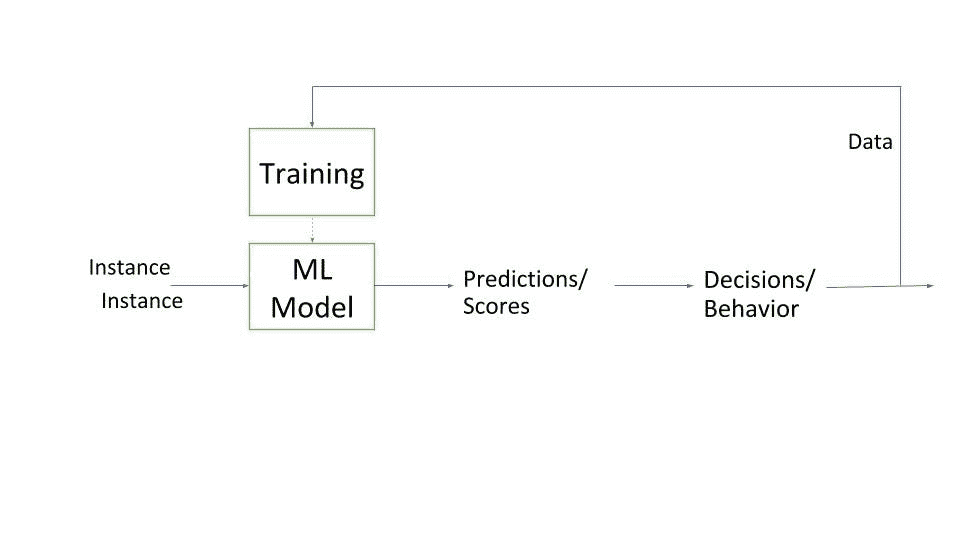

# 理解数据偏差

> 原文：<https://towardsdatascience.com/survey-d4f168791e57?source=collection_archive---------2----------------------->

## 数据偏差的类型和来源

过去十年，机器学习(ML)应用程序在图像识别、推荐系统、电子商务和在线广告方面取得了巨大成功，这促使其在社会正义、就业筛选等领域以及 Siri、Alexa 等智能交互界面中得到采用。随着这些应用程序的激增，关于这些系统中性别、种族和其他类型偏见的报告也出现了惊人的增长。《Propublica》期刊上一篇被广泛讨论的报告声称，在对刑事被告进行累犯风险评分的工具中，存在对非裔美国人的严重偏见[1]。亚马逊关闭了一个为求职者评分的模型，因为他们意识到这不利于女性。预测性警务系统[3]受到了严密的审查，由于发现了偏差，它们的使用受到了限制。内容个性化系统产生了过滤泡沫[23]，广告排名系统被指责带有种族和性别偏见[22]。

这些偏差的主要来源是用于训练 ML 模型的数据。**事实是，几乎所有由基于 ML/AI 的模型驱动的系统生成的大数据集都是有偏差的**。然而，大多数 ML 建模者并没有意识到这些偏见，即使他们意识到了，他们也不知道该怎么办。很少有 ML 出版物讨论数据——使用了什么数据、如何生成数据以及在建模之前对数据做了什么等细节。相反，作者似乎有意用他们构建复杂、深奥模型的能力给读者留下深刻印象，并用他们模型的准确性打动他们。下面这幅 xkcd 的漫画很好地抓住了这种心态。

Cartoon by xkcd.com, creative commons license ([https://xkcd.com/license.html](https://xkcd.com/license.html))

机器学习科学家最好注意一下安德鲁·吉尔曼的格言:“统计分析最重要的方面不是你用数据做什么，而是你用什么数据”[4]。统计分析师理解探索性数据分析(EDA)的重要性，John Tukey [16]在几十年前将其系统化。然而，大多数 ML 科学家有着不同的血统，似乎并不重视探索性数据分析的重要性。

我在本文中的目标是确定数据偏差的主要来源，主要集中在 web 数据和由在线系统(如广告服务和内容排名系统)生成的数据上。

这篇文章的要点是:

*   由 ML 驱动的系统生成的大多数(几乎所有)大数据集是有偏见的
*   数据中的偏差会产生有偏差的模型，这些模型可能是歧视性的，对人类有害
*   对可用数据及其处理进行全面评估以减少偏差应该是建模的关键步骤

那么我们所说的“数据偏差”是什么意思呢？数据偏倚的常见定义是可用数据不能代表研究的总体或现象。但是我在更广泛的意义上使用它。偏见也表示:

*   数据不包括恰当地捕捉我们想要预测的现象的变量
*   数据包括人类制作的内容，其中可能包含对人群的偏见

基于这个定义，除了通过精心设计的随机实验产生的数据，大多数有机产生的数据集都是有偏差的。正如 Torralba 和 Efros 在他们关于图像识别模型的论文[12]中所讨论的，即使是精选的参考数据集也是有偏见的。他们考虑了 12 个广泛使用的参考图像数据集。他们在其中一个数据集上训练了一个模型，并在另外 11 个数据集上测试了它的性能。他们发现在这些测试数据集上，预测准确性显著下降。他们从这个玩具实验中得到的教训是，尽管他们的创造者尽了最大努力，这些参考数据集还是有很强的内在偏见。

产生数据的系统的结构特征会导致数据偏差。根据我的分析，以下是最常见的数据偏差类型:

*   回应或活动偏差:这种类型的偏差出现在人类生成的内容中:亚马逊上的评论、Twitter 推文、脸书帖子、维基百科条目等。事实上，只有一小部分人贡献了这些内容，他们的观点和偏好不太可能反映整体人口的观点。
*   反馈循环导致的选择偏差:当模型本身影响用于训练它的数据的生成时，就会出现这种偏差。这发生在对内容进行分级的系统中，例如内容和广告个性化、推荐系统中，这些推荐系统呈现或给予某些项目比其他项目更高的优先级。收集用户对所呈现的项目的响应(例如生成标签),对未呈现的项目的响应是未知的。用户的反应也受到项目在页面上的位置和显示细节的影响，如字体、媒体(项目包含图像吗？).
*   系统漂移引起的偏差:漂移是指产生数据的系统随时间的变化。变更包括数据中捕获的属性的定义(包括结果)或改变用户与系统交互方式的基础模型或算法。例如:添加新的用户交互模式，如喜欢或分享按钮，添加搜索辅助功能。
*   遗漏变量偏倚:这种类型的偏倚发生在影响结果的关键属性缺失的数据中。当数据生成依赖于人工输入或者记录数据的过程不能访问关键属性时，通常会发生这种情况。
*   社会偏见:这种类型的偏见发生在人类制作的内容中，无论是社交媒体内容还是策划的新闻文章。例子:使用性别或种族刻板印象。这种类型的偏差可以被认为是一种*标签偏差。*

让我们更详细地考虑这些类型。意识到偏见是第一步，减轻偏见是下一步。我没有详细讨论偏差缓解技术，因为偏差缓解技术取决于特定的数据集及其应用。

# 反应偏差

响应偏差在网络上很常见，大多数数据来自几个来源。巴埃萨-耶茨[5]提供了网络偏见及其原因的几个例子。他指出:

*   7%的用户产生了脸书上 50%的帖子。
*   4%的用户产生了亚马逊上 50%的评论
*   0.04%的维基百科注册编辑(约 2000 人)制作了英文维基百科一半条目的第一版。

更令人担忧的是，这些用户中的大多数仅代表少数人口统计群体和地理区域。显然，这些数据不能用来对所有用户进行推断。例如，Crawford [6]报告称，在飓风桑迪袭击美国东北部后，Twitter 上的推文被用来研究人们的行为。希望了解受灾最严重地区用户的行为，研究人员后来发现大部分数据来自曼哈顿。很少有推文来自纽约受灾更严重的地区。她指出，随着时间的推移，停电开始了，手机电池耗尽了，来自受灾最严重地区的推文就更少了。

# **反馈环路引起的偏差**

用于在线广告、内容个性化、推荐的系统都有内置的反馈回路。这些系统嵌入了影响所生成数据的 ML 模型，这些数据反过来作为模型的训练数据反馈到系统中。ML 模型将用户的注意力引导到一小部分项目上，并记录用户对这些项目的操作(见下面的图示)。通过跟踪用户的浏览、点击和滚动来推断用户偏好。选择偏差是由于呈现给用户的项目的非随机子集而产生的。在排序列表中呈现这些项目引入了*位置偏差*——因为用户从左到右和从上到下扫描项目(基于对美国用户进行的实验)。*如果字体和媒体类型(图像对文本对视频)在不同的项目之间有所不同，那么就会引入呈现偏差*。这些偏差的一个影响是，使用来自该数据的维持样本的模型评估倾向于支持生成该数据的模型[8]。这些系统还可以改变用户的长期内容消费行为。Cheney 等人[8]讨论了相对于没有推荐内容的相同平台，推荐算法如何鼓励相似用户与同一组项目进行交互，从而使他们的行为一致化。例如，基于流行度的系统以相同的方式表示所有用户；这使得所有用户都是一样的。社交推荐系统使连接的用户或小团体内的用户均质化，矩阵分解使用户沿习得的潜在因素均质化。

Feedback loop in ad and content personalization systems

# 系统漂移引起的偏置

系统漂移表示改变用户与系统交互方式或系统生成数据性质的系统变化。漂移的例子包括:

*   正在学习的概念或目标的定义可能会改变。在欺诈预测系统中，欺诈的定义会发生变化。这种类型的漂移通常被称为“概念漂移”。
*   用户交互模式发生了变化。例如，内容个性化系统可以在文章下添加共享或类似按钮。网络搜索界面可以添加可以改变用户查询组成的查询建议。这种类型的漂移通常被称为“模型漂移”。

在存在漂移的情况下，静态模型的性能会随着时间而降低，如果使用来自多个时间段的数据来训练模型，则定期训练的模型可能表现不佳。Harel 等人[10]提出了一种检测概念漂移的重采样方法。

系统漂移导致高知名度的 ML 应用程序失败的一个例子是谷歌流感趋势(GFT)。几年来，谷歌流感趋势被认为是搜索数据的一种创新用途，用来“预测”一个季节的流感病例数。然而，2013 年 2 月,《自然》[18]报道称，GFT 预测的流感样疾病(ILI)的医生就诊比例是疾病控制和预防中心(CDC)的两倍多，后者的估计基于美国各地实验室的监测报告。尽管 GFT 是为了预测疾病预防控制中心的报告而建立的，这种情况还是发生了[11]。

根据 Lazer 等人[11]的说法，失败背后的一个关键原因是由于谷歌定期对其搜索界面进行更改。谷歌引入了“推荐搜索”，基于其他用户的类似搜索。这增加了某些搜索的相对数量。因为 GFT 在其模型中使用了相对流行的搜索术语，搜索算法的改进对 GFT 的估计产生了不利影响。GFT 提出了一个假设，即某些术语的相对搜索量与外部事件静态相关，但搜索行为不仅仅是由外部因素决定的，它也是由服务提供商内生培养的。

# 省略可变偏差

这种类型的偏差通常发生在由人工输入数据生成数据的系统中，或者发生在在线系统中，在这些系统中，由于隐私问题或缺乏访问权限，某些事件或操作不会被记录。这意味着关键预测变量可能无法包含在模型中。

回归模型中存在遗漏变量偏差必须满足两个条件:

*   被省略的变量必须与 ***【目标】*** 变量相关。
*   被省略的变量必须与 ***一个或多个其他解释变量*** (或*)相关。*

*这里有一个可能发生遗漏变量偏差的场景示例:一家笔记本电脑制造商有一个在线聊天系统，其客户可以使用该系统请求支持或提出问题。制造商希望利用这个机会交叉销售产品，并开发了一个模型来评估用户购买更多产品的可能性。该分数旨在帮助在聊天系统中工作的代理有效地分配他们的时间。当他们很忙的时候，代理会投入更多的精力(和时间)来尝试向高分用户交叉销售，而对低分用户投入较少的精力。但是，不会记录代理花费的时间(和精力)。如果没有这些数据，看起来评分模型表现得非常好，而代理花费的时间可能更好地解释了用户的购买决策。*

*卡鲁阿纳等人[14]主张在医疗保健等高风险应用中使用可理解的模型，以识别因遗漏变量而产生的偏差。神经网络、随机森林、提升树等建模方法通常比逻辑回归和决策树等方法产生更准确的模型，但后者更容易理解，因此更值得信赖。他们讨论了一个案例，其中的目标是预测肺炎患者的死亡概率(POD ),以便高风险患者可以住院，而低风险患者作为门诊患者治疗。他们的 ML 模型在数据中了解到一种模式，即患有哮喘的肺炎患者比没有哮喘的患者死于肺炎的风险更低。意识到这似乎不正常，研究人员进一步调查并了解到，有哮喘病史并表现出肺炎症状的患者通常不仅被送入医院，而且直接被送入 ICU(重症监护病房)。哮喘性肺炎患者接受的积极治疗非常有效，与非哮喘患者相比，降低了他们死于肺炎的风险。然而，这些患者在 ICU 接受积极治疗的事实并没有记录在数据中。作者指出，他们不会了解难以理解的模型中的异常模式。*

# *社会偏见*

*人类在网络和社交媒体上创造的内容充满偏见。两个引人注目的案例可以说明这一点。Bolukbasi 等人[15]表明，甚至在谷歌新闻文章上训练的单词嵌入也表现出女性/男性性别刻板印象。例如:女性与护士和保姆职业联系在一起，而男性则与医生和金融家职业联系在一起。他们提出消除偏见的策略来减轻这些偏见。在另一个案例[2]中，亚马逊试图建立一个人工智能工具来筛选候选人，直到管理层发现它已经学会惩罚女性候选人。问题是，在今天的大多数公司中，技术角色由男性担任，这种偏见蔓延到任何使用当前员工数据来训练模型的模型中。除非数据中检测到的社会偏见会导致算法对性别、种族和其他类别的歧视。*

# *如何识别和纠正偏差*

*识别偏倚的第一个关键步骤是理解数据是如何产生的。正如我上面所讨论的，一旦绘制了数据生成过程，就可以预测偏差的类型，并且可以设计干预措施来预处理数据或获得额外的数据。另一个关键步骤是执行全面的探索性数据分析(EDA) [16]。一些教科书和论文讨论了 EDA 技术。*

*识别和处理社会偏见需要特殊的技巧，其中一些我将在下面提到。对于由反馈循环引起的偏差，一种方法是将系统设计成在少量查询样本上随机化。例如，在一小部分请求(比如 0.1%)中，项目是以随机方式选择和呈现的。在模型训练和评估中仅使用这些请求的数据。有时，出于用户体验的考虑，这是不可行的。在这些情况下，在[9]中提出的倾向加权技术是一种可能的方法。*

*对于人类生成的内容中的偏见，最近有很多关于量化歧视和去偏见技术以提高公平性的研究。最近，量化歧视的基准[20]甚至设计用来评估这些算法的公平性的数据集[21]已经出现。挑战当然是在不牺牲性能的情况下提高公平性。然而，这些技术通常是特定于数据集和应用程序的。一般来说，这些技术属于三类之一:*

*   *那些在训练前使用数据预处理的*
*   *培训期间正在处理*
*   *培训后的后处理*

*然而，严重不平衡的训练数据集的问题以及如何将去偏置能力集成到人工智能算法中的问题在很大程度上仍然没有解决[19]。最近发表的一项研究[19]使用训练后的后处理，并尝试将去偏置能力直接集成到模型训练过程中，该过程自动适应训练数据的缺点，无需监督。他们的方法采用端到端的深度学习算法，同时学习所需的任务以及训练数据的潜在结构。以无监督的方式学习潜在分布能够揭示训练数据中隐藏的或隐含的偏差。Bolukbasi 等人[15]描述了一种去偏差单词嵌入的后处理方法，以减轻性别偏差。*

# *参考*

*[1]朱莉娅·安格温、杰夫·拉森、苏亚·马特和劳伦·基什内尔。“机器偏见:全国各地都有用来预测未来罪犯的软件，它对黑人有偏见”。ProPublica(2016 年 5 月 23 日)。*

*[2][https://www . Reuters . com/article/us-Amazon-com-jobs-automation-insight/Amazon-scraps-secret-ai-recruiting-tool-that-show-bias-against-women-iduskcn 1 MK 08g](https://www.reuters.com/article/us-amazon-com-jobs-automation-insight/amazon-scraps-secret-ai-recruiting-tool-that-showed-bias-against-women-idUSKCN1MK08G)*

*[3]肮脏的数据，糟糕的预测:公民权利侵犯如何影响警察数据，预测性警务系统和司法， [*纽约大学法律评论在线，即将出版(*](https://papers.ssrn.com/sol3/papers.cfm?abstract_id=3333423##)[*https://papers.ssrn.com/sol3/papers.cfm?abstract_id=3333423*](https://papers.ssrn.com/sol3/papers.cfm?abstract_id=3333423))*

*[4][https://stat modeling . stat . Columbia . edu/2018/08/07/important-aspect-statistical-analysis-not-data-data-use-survey-adjustment-edition/](https://statmodeling.stat.columbia.edu/2018/08/07/important-aspect-statistical-analysis-not-data-data-use-survey-adjustment-edition/)*

*[5]里卡多·巴埃萨-耶茨，“对网络的偏见”。ACM 通讯，2018 年 6 月，第 61 卷第 6 期，第 54-61 页。*

*[6][https://hbr.org/2013/04/the-hidden-biases-in-big-data](https://hbr.org/2013/04/the-hidden-biases-in-big-data)*

*[7]奥尔特亚努、亚历山德拉和卡斯蒂略、卡洛斯和迪亚兹、费尔南多和基西曼、埃姆雷，《社会数据:偏见、方法陷阱和伦理界限》(2016 年 12 月 20 日)。大数据前沿 2:13。doi: 10.3389/fdata.2019.00013 .在 https://ssrn.com/abstract=2886526 的[或 http://dx.doi.org/10.2139/ssrn.2886526 的](https://ssrn.com/abstract=2886526)[的](https://dx.doi.org/10.2139/ssrn.2886526)SSRN 发售*

*[8] Cheney、Allison J.B .、Brandon M. Stewart 和 Barbara E. Engelhardt，“推荐系统中的算法混淆如何增加同质性并降低效用”，第 12 届 ACM 推荐系统会议论文集，第 224-232 页*

*[9]托拜厄斯·施纳贝尔。、Adith Swaminathan、Ashudeep Singh、Navin Chandak、Thorsten Joachims，“[作为治疗的建议:去偏置学习和评估](http://proceedings.mlr.press/v48/schnabel16.pdf)”，arXiv 预印本 arXiv:1602.05352。*

*[http://proceedings.mlr.press/v32/harel14.pdf](http://proceedings.mlr.press/v32/harel14.pdf)*

*[11]大卫·雷泽、瑞恩·肯尼迪、Gary King、亚历山德罗·维斯皮亚尼，“谷歌流感的寓言:大数据分析中的陷阱”，《科学》第 343 卷，2014 年 3 月 14 日*

*[12] A. Torralba，A. Efros。无偏地看待数据集偏差。2011 年 IEEE 计算机视觉和模式识别会议(CVPR)。*

*[https://5harad.com/papers/included-variable-bias.pdf](https://5harad.com/papers/included-variable-bias.pdf)*

*【14】[里奇·卡鲁阿纳](https://www.microsoft.com/en-us/research/people/rcaruana/)，[保罗·科赫](https://www.microsoft.com/en-us/research/people/paulkoch/)，尹娄，马克·斯特姆[，约翰内斯·戈尔克](https://www.microsoft.com/en-us/research/people/johannes/)，小糯米·埃尔哈达德。，“医疗保健的可理解模型:预测肺炎风险和 30 天再入院”， *KDD，2015 年 8 月 10-13 日，澳大利亚新南威尔士州悉尼*| 2015 年 8 月*

*[15]([https://papers . nips . cc/paper/6228-男人是电脑程序员，女人是家庭主妇-debiasing-word-embeddings . pdf](https://papers.nips.cc/paper/6228-man-is-to-computer-programmer-as-woman-is-to-homemaker-debiasing-word-embeddings.pdf)*

*[16]约翰·图基，探索性数据分析，皮尔逊现代经典著作。*

*[17] Léon Bottou，Jonas Peters，Joaquin qui onero-Candela，Denis X. Charles，D. Max Chickering，Elon Portugaly，Dipankar Ray，Patrice Simard 和 Ed Snelson:反事实推理和学习系统:计算广告的例子，机器学习研究杂志，14(11 月):3207–3260，2013 年。*

*[18]德克兰·巴特勒，“当谷歌弄错流感时”，《自然》，第 484 卷，第 7436 期，2013 年 2 月。*

*[19]亚历山大·阿米尼、艾娃·索莱马尼、威尔科·施瓦廷、桑吉塔·巴蒂亚和丹妮拉·鲁斯。，“通过学习的潜在结构发现和减轻算法偏差”，AAAI/ACM 人工智能伦理与社会会议，2019 年。*

*[20]M . Hardt，E . Price，N . Sr ebro，“监督学习中的[机会均等](http://papers.nips.cc/paper/6373-equality-of-opportunity-in-supervised-learning)”，神经信息处理系统进展，2016 年*

*[21] Buolamwini，j .和 Gebru，T. 2018 年。性别差异:商业性别分类的交叉准确性差异。《公平、责任和透明度会议》, 77–91 页。*

*[22] Sweeney，Latanya，在线广告投放中的歧视(2013 年 1 月 28 日)。可在 https://ssrn.com/abstract=2208240[或 http://dx.doi.org/10.2139/ssrn.2208240](https://ssrn.com/abstract=2208240)[的](https://dx.doi.org/10.2139/ssrn.2208240)SSRN 买到*

*[23] Eli Pariser,《过滤泡沫:新的个性化网络如何改变我们的阅读和思维》,企鹅图书公司，2012 年。*