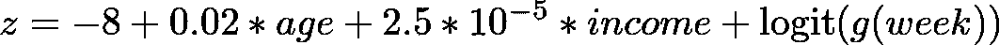
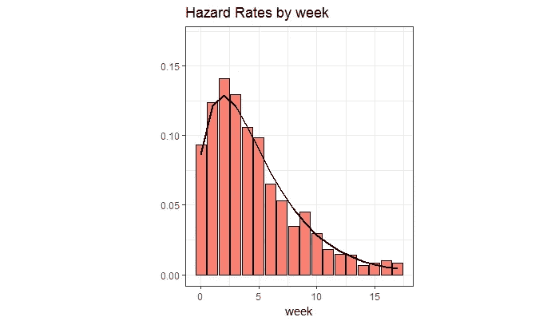
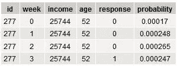
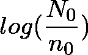
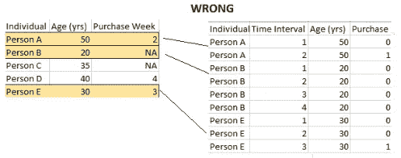
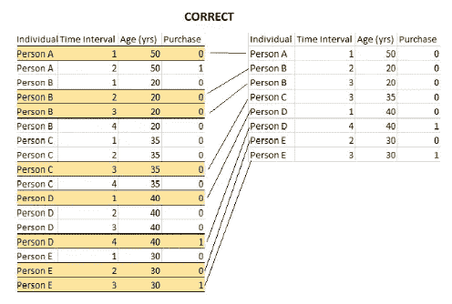
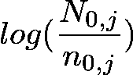
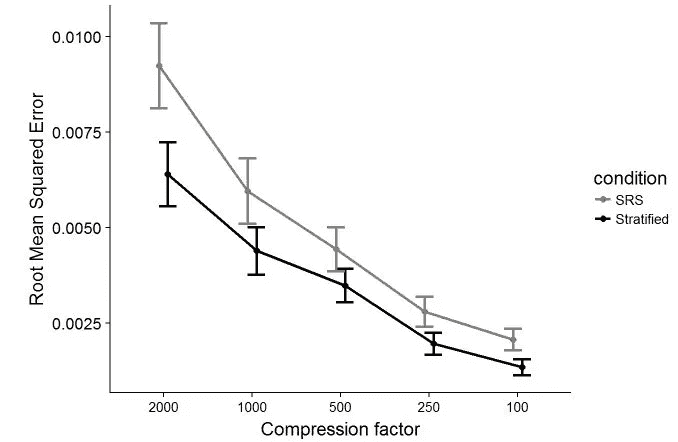

# 生存分析和分层样本

> 原文：<https://towardsdatascience.com/survival-analysis-and-the-stratified-sample-2c2582aa9805?source=collection_archive---------16----------------------->

## 在不牺牲预测能力的情况下，为逻辑回归整理大型生存数据集。


本文讨论了在对非常大的生存分析数据集执行逻辑回归时所面临的独特挑战。当这些数据集对于逻辑回归来说太大时，为了保持事件概率随时间的变化，必须对它们进行非常仔细的采样。

下面，我分析了一个大型模拟数据集，并论证了以下分析流程:

1.  从人群水平的数据集中抽取一个分层的病例对照样本
2.  在逻辑回归中将(时间间隔)视为一个因素变量
3.  应用可变偏移来根据真实的总体水平概率校准模型

[用于构建模拟和绘图的代码可在[这里](https://github.com/edwagner07/survival_analysis/blob/master/survival_code_markdown.md)找到]

## **第一部分:** *介绍概念和数据*

通常，仅仅预测*事件是否*会发生是不够的，还要预测*事件将在*发生的时间。开始实验性癌症治疗后，一个人可能存活多久？何时(何地)我们可能会发现一个罕见的宇宙事件，比如超新星？这项研究的重点是:如果数百万人通过邮件联系，谁会回复，什么时候回复？

所有这些问题都可以通过一种叫做生存分析的技术来回答，这种技术是由卡普兰和迈耶在他们 1958 年的开创性论文[中提出的](https://www.tandfonline.com/doi/abs/10.1080/01621459.1958.10501452)。在这篇文章中，他们演示了如何调整“审查”的纵向分析，这是他们的术语，指的是一些受试者被观察的时间比其他人长。如 [Alison (1982)](https://www.jstor.org/stable/270718?casa_token=0vk-lNdwoe8AAAAA:-xVR-nQnDGuDdxr5VEtsERJW9tQ-6JCpU4FAtGlXLqBy3xwffLiodC9KNuA5Qqm-PWOOJjaFcCOFKSIehvjQz0I7ICaREaRkZ8lmsrrlfOq6gP83sl_KdQ&seq=1#metadata_info_tab_contents) 所总结的，生存分析后来根据离散时间进行了调整。这里，不是将时间视为连续的，而是以特定的间隔进行测量。

生存分析的中心问题是:给定一个事件尚未发生，它在当前区间发生的概率是多少？这由风险率决定，风险率是特定时间间隔内*事件*相对于该间隔开始时*风险集*规模的比例(例如，已知治疗 4 年后存活的人数)。

举一个危险率的例子:百万分之十的人死亡(危险率 1/100，000)可能不是一个严重的问题。但是 20 个人中有 10 人死亡(风险率为 1/2)可能会让人吃惊。

本研究调查了对一个假想的邮寄活动的回复的**时间。虽然数据是模拟的，但它们都是基于真实数据的，包括数据集大小和响应率。**

人口级别的数据集包含 100 万“人”，每个人都有 1-20 周的观察值。数据被标准化，以便所有受试者在第 0 周收到他们的邮件。受试者的反应概率取决于两个变量，年龄和收入，以及时间的伽玛函数。这样，分析的单位不是人，而是**人*周**。



**Above:** The formula used to calculate the log-odds of response probability in a given week. ***z*** is the log-odds of response probability. The function ***g*(*week)*** is a gamma function of time.

并快速检查我们的数据是否符合我们预测的总体形状:



**Above:** the gamma function used in the hazard function (line) overlaid against a density histogram of hazard rates in the simulated data set (bars). As time passes after mailing, subjects become less and less likely to respond.

一个人每周大约有 1/10，000 的机会作出回应，这取决于他们的个人特征和多久前与他们联系。

下面是数据集的快照。它放大了假设的主题#277，他在被邮寄 3 周后回复。如上所述，他们被观察的每个星期都有一个数据点。生成二项式响应变量的概率值也包括在内；这些概率值将是逻辑回归试图匹配的。



## **第二部分:** *病例对照抽样和回归策略*

由于资源的限制，对具有数百万个观察值和数十个(甚至数百个)解释变量的数据集进行逻辑回归是不现实的。幸运的是，有一些经过验证的数据压缩方法可以准确、公正地生成模型。

*传统物流案例控制*

**病例对照抽样**是一种基于“病例”(如反应)和“对照”(如无反应)的随机子样本建立模型的方法。不管子样本大小如何，**只要子样本是以真正随机的方式抽取的，解释变量的** **效应在病例和对照**之间保持不变。例如，如果女性回答的可能性是男性的两倍，那么这种关系在病例对照数据集中和在全部人口水平数据集中同样准确。因此，我们可以准确地知道什么样的人可能会做出反应，什么样的人不会做出反应。

在压缩的病例对照数据集上建立了逻辑模型后，只需要调整模型的截距。虽然相对概率不会改变(例如男性/女性差异)，但绝对概率*会*改变。例如，假设有 500 万受试者和 5000 个回答。如果病例对照数据集包含所有 5，000 个响应，加上 5，000 个无响应(总共 10，000 个观察)，则模型将预测响应概率为 1/2，而实际上是 1/1000。当病例对照集中使用所有响应时，添加到逻辑模型截距的偏移量如下所示:



这里，n0 等于总体中的非事件数，而 n0 等于病例对照集中的非事件数。

提醒一下，在生存分析中，我们处理的数据集的分析单位不是个体，而是**个体*周**。以下非常简单的数据集展示了考虑采样的正确方式:



This technique incorrectly picks a few individuals and follows them over time.



This technique captures much more variability by randomly selecting individual observations from the data set.

*生存分析病例对照和分层样本*

当处理生存分析数据集时，事情变得更加复杂，特别是因为风险率。例如，如果一个人在第 2 周的反应可能是第 4 周的两倍，那么这个信息*需要保存在病例对照集*中。保护它的最好方法是通过分层抽样。

在分层抽样中，我们手动选择每周的病例数和对照数，以便在人群水平数据集和病例对照集之间每周的相对反应概率是固定的。这样，我们在构建逻辑模型时就不会意外地扭曲风险函数。

这很容易做到，从每周的未回复中抽取一定数量(例如 1000)。

这种方法要求使用可变偏移，而不是简单随机样本中的固定偏移。偏移值按周变化，如下所示:



同样，该公式与简单随机样本中的公式相同，只是我们不是查看整个数据集的响应和无响应计数，而是查看每周的计数，并为每周生成不同的偏移量 *j* 。

因为偏移每周都不同，所以这种技术保证了来自第*周 j* 的数据被校准到第*周 j* 的危险率。

*逻辑回归代码*

以下 R 代码反映了用于生成数据的内容(唯一的区别是用于生成`sampled_data_frame`的采样方法):

```
glm_object = glm(response ~ age + income + factor(week),
                  data = sampled_data_frame,
                  family = "binomial")
```

使用`factor(week)`可以让 R 为每个时间段拟合一个唯一的系数，这是定义风险函数的一种精确和自动的方式。可以手动定义一个危险函数，但是尽管这种手动策略可以节省一些自由度，但这样做的代价是大量的工作和操作员出错的机会，因此建议允许 R 自动定义每周的危险。

## 第三部分:比较抽样方法

此时，您可能会疑惑:**为什么要使用分层抽样？有什么意义？**这是真的:到目前为止，这篇文章已经提出了一些冗长而复杂的概念，却没有什么正当理由。

重点是**分层样本产生的结果比简单的随机样本要精确得多。**

为了证明这一点，我对下面的过程进行了 1000 次迭代:

1.  首先，我采取了一定规模的样本(或“压缩因子”)，SRS 或分层。
2.  然后我从这个样本中建立了一个逻辑回归模型。
3.  我使用该模型预测了一个单独测试集的输出，并计算了每个人的预测概率和实际概率之间的均方根误差。

以下是这种迭代采样的结果:



While both techniques become more accurate as the sample approaches the size of the original data set (smaller compression factor), it is clear that the RMSE for stratified samples is lower regardless of data set size.

很容易看出(并通过多因子方差分析得到证实),分层样本在数据压缩的每个级别都具有明显更低的均方根误差。同样，这是因为分层样本保留了风险率随时间的变化，而简单随机样本则没有。

## 第四部分:结论

首先，我们研究了在群体水平的数据集中考虑事件发生的不同方式，表明风险率是缓冲具有不完整观察值的数据集的最准确方式。

然后，我们讨论了不同的抽样方法，认为分层抽样产生了最准确的预测。这通过使用两种策略的多次采样和建模迭代得到了实证。

这种策略适用于随着时间推移低频事件发生的任何场景。在社会科学中，分层抽样可以观察一段时间内个人的再犯概率。在医学上，在给定某些风险因素的情况下，人们可以研究吸烟者因呼吸问题而去医院的概率的时间过程。在工程中，这种分析可以应用于设备的罕见故障。

虽然这些类型的大型纵向数据集通常不会公开提供，但它们确实存在——使用分层抽样和受控风险率对它们进行分析，是根据小样本事件得出关于人口范围现象的结论的最准确方式。