# 生存分析:直觉& Python 中的实现

> 原文：<https://towardsdatascience.com/survival-analysis-intuition-implementation-in-python-504fde4fcf8e?source=collection_archive---------0----------------------->

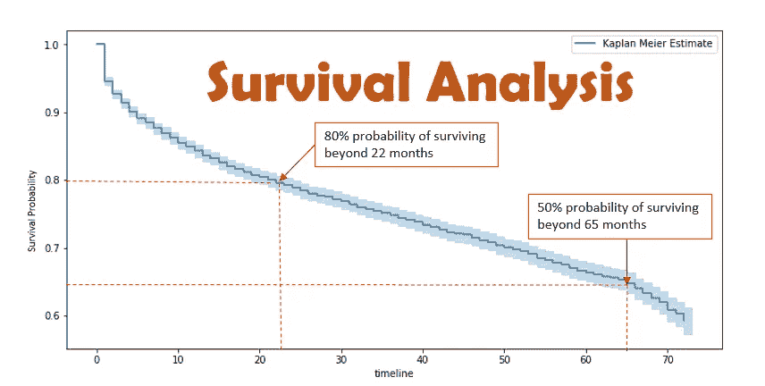

有一种统计技术可以回答如下业务问题:

*   一个特定的客户会在你的公司呆多久？换句话说，这个客户经过多少时间会流失？
*   成功运行一年后，这台机器还能使用多久？
*   不同营销渠道的相对留存率是多少？
*   被诊断后，病人存活的可能性有多大？

如果你觉得上面的任何问题(或者甚至是与它们无关的问题)有趣，那么继续读下去。

本文的目的是建立一种直觉，以便我们可以在不同的商业环境中应用这种技术。

# 目录

1.  介绍
2.  定义
3.  数学直觉
4.  卡普兰-迈耶估计
5.  Cox 比例风险模型
6.  结束注释
7.  额外资源

# **简介**

生存分析是一套统计工具，它解决了诸如“在一个特定事件发生之前，需要多长时间”这样的问题；换句话说，我们也可以称之为“事件时间”分析。这种技术被称为生存分析，因为这种方法主要是由医学研究人员开发的，他们更感兴趣的是发现不同群组(例如:群组 1-用药物 A 治疗，群组 2-用药物 B 治疗)中患者的预期寿命。这种分析不仅可以进一步应用于传统的死亡事件，还可以应用于不同业务领域中许多不同类型的事件。我们将在下一节详细讨论事件和事件时间的定义。

# 定义

如上所述，生存分析也被称为事件时间分析。因此，从名称本身来看，很明显，兴趣事件和时间的定义对于生存分析是至关重要的。为了理解时间和事件的定义，我们将为行业中的各种用例定义时间和事件。

1.  **机械操作中的预测性维护**:生存分析适用于机械零件/机器，以回答“机器将持续多长时间？”。预测性维护是其应用之一。这里，**事件** *定义为机器发生故障的时间。* **原点时间***定义为机器开始连续运转的时间。*除了时间的定义，我们还应该定义**时间刻度**(时间刻度可以是周、天、小时..).事件发生的时间和时间原点之间的差异给了我们事件发生的时间。
2.  **客户分析**(客户保留):借助生存分析，我们可以专注于低生存时间的高价值客户的流失预防工作。这种分析还有助于我们计算客户生命周期价值。在这个用例中，**事件** *被定义为客户翻腾/退订的时间。* **起始时间****定义为客户开始服务/订购某公司*的时间。* **时间尺度**可以是月，也可以是周。事件发生的时间和时间原点之间的差异给了我们事件发生的时间。**
3.  ****营销分析**(队列分析):生存分析评估各营销渠道的留存率。在这个用例中，**事件** *被定义为客户退订营销渠道的时间。* **时间***原点*定义为客户开始服务/订阅营销渠道*的时间。* **时间尺度**可能是月，也可能是周。**
4.  ****精算师**:给定人群的风险，生存分析评估人群在特定时间范围内死亡的概率。这种分析有助于保险公司评估保险费。猜猜看，这个用例的**事件**和**时间**定义！！！**

**我希望从上面的讨论中可以清楚地了解事件、时间起源和事件发生时间的定义。现在是时候深入一点分析的数学公式了。**

# **数学直觉**

**让我们假设一个**非负连续随机变量 T** ，代表直到某个感兴趣的事件发生的时间。例如，T 可能表示:**

**从客户订阅到客户流失的时间。
从机器启动到故障的时间。
从疾病诊断到死亡的时间。**

**既然我们假设了一个随机变量 T(随机变量一般用大写字母表示)，那么我们也要讲一下它的一些属性。**

****T 是随机变量**，‘这里什么是随机？’。为了理解这一点，我们将再次使用我们以前的例子如下。**

**T 是从客户(随机选择的**客户)订阅到客户流失的时间。
T 是从一台**随机选择的**机器启动到故障的时间。
T 是从疾病诊断到随机选择的**患者死亡的时间。******

****T 是连续的**随机变量，因此它可以取任何实数值。 **T 是非负的**，因此它只能取正的实数值(包括 0)。**

**对于这类随机变量，常用**【概率密度函数(pdf)****【累积分布函数(cdf)** 来表征其分布。**

**因此，我们将假设该随机变量具有概率密度函数 **f(t)** ，以及累积分布函数 **F(t)** 。**

****pdf : f(t)****

****cdf : F(t) :** 根据给定 pdf 中 cdf 的定义，我们可以将 cdf 定义为**F(T)= P(T<T)；**这里， **F(t)** 给出了事件在持续时间 **t.** 内发生的概率，简而言之， **F(t)** 给出了事件发生时间值小于 **t.** 的人口比例**

**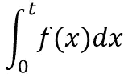**

****cdf as the integral form of pdf****

****生存函数:S(T)= 1-F(T)= P(T≥T)；S(t)** 给出了事件在时间 **t** 之前没有发生的概率。简单地说， **S(t)** 给出了事件发生时间值大于 **t.** 的人口比例**

**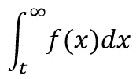**

****Survival Function in integral form of pdf****

****风险函数:h(t) :** 除了生存函数，我们还对事件发生的速率感兴趣，在任何给定时间 t 的存活人口中。在医学术语中，我们可以将其定义为“在时间 t 存活的人中，那些人的死亡率是多少”。**

**让我们把它变得更简单:**

1.  **让我们把它写成它的定义的形式:**

**h(t) = [( S(t) -S(t + dt) )/dt] / S(t)**

**极限 dt → 0**

**2.从上面的公式中，我们可以看到它有两个部分。让我们理解每一部分**

***事件的瞬时速率*:(S(t)-S(t+dt))/dt；这也可以看做生存曲线任意点 t 的斜率，或者任意时刻 t 的死亡率。**

**也让我们假设总人口为 p。**

**在这里，S(t) -S(t + dt)，这种差异给出了在时间 dt 死亡的人在时间 t 存活的人中所占的比例。在 t 存活的人数是 S(t)*P，在 t + dt 存活的人数是 S(t+dt)*P。在 dt 期间死亡的人数是(S(t) -S(t + dt))*P。在时间 t 死亡的人的瞬时比率是(S(t) -S(t + dt))*P/dt。**

***时间 t 的存活比例*:S(t)；我们也知道 t，S(t)*P 时刻的存活人口。**

**因此，用在时间 dt 死亡的人数，除以在任何时间 t 存活的人数，我们得到了风险函数，作为在时间 t 存活的死亡人数的风险度量。**

**风险函数不是密度或概率。然而，我们可以将其视为在(t)和(t+ dt)之间无限小的时间段内失败的概率，假设受试者已经存活到时间 t。在这种意义上，**危险是一种风险度量:时间 t1 和 t2 之间的危险越大，该时间间隔内失败的风险就越大。****

****我们有:h(t)= f(t)/S(t)；**【既然我们知道(S(t)-S(t+dt))/dt = f(t)】**这是一个非常重要的推导。这个函数的美妙之处在于生存函数可以从风险函数中导出，反之亦然。当在 Cox 比例模型中从给定的风险函数推导出生存函数时，这一点的效用将更加明显(本文的最后一部分)。****

****这些是理解生存分析所需的最重要的数学定义和公式。我们将在这里结束我们的数学公式，并向估计生存曲线前进。****

# ****卡普兰-迈耶估计****

****在上面的数学公式中，我们假设了 pdf 函数，从而从假设的 pdf 函数中导出了生存函数。由于我们没有人口的真实生存曲线，因此我们将从数据中估计生存曲线。****

****估计生存曲线主要有两种方法。第一种方法是参数方法。这种方法假设一个参数模型，它是基于某种分布如指数分布，然后我们估计参数，最后形成生存函数的估计量。第二种方法是一种强大的**非参数** **方法，称为 Kaplan-Meier 估计器。我们将在这一节讨论它。在本节中，我们还将尝试手动以及使用 [Python 库(生命线)创建卡普兰-迈耶曲线。](https://lifelines.readthedocs.io/en/latest/Survival%20Analysis%20intro.html)******

****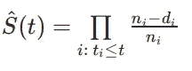****

****在这里， **ni** 被定义为在时间 **ti 之前处于危险中的人群；**和 **di** 定义为时间 **ti** 发生的事件数。通过下面的例子，这一点将变得更加清楚。****

****我们将讨论一个来自非常小的自己创建的数据的任意示例，以理解手动以及使用 python 包创建 Kaplan Meier 估计曲线。****

******事件、时间和时标定义为例:******

****下面的例子(参见图 1)显示了一个网站的 6 个用户的数据。这些用户访问网站，并在几分钟后离开该网站。因此，**感兴趣事件**是用户离开网站的时间。**原点时间**定义为用户打开网站的时间，**时间刻度**以分钟为单位。研究开始于时间 t=0，结束于时间 t=6 分钟。****

******审查:******

****这里值得注意的一点是，在研究期间，6 个用户中有 4 个用户(显示为红色)发生了事件，而两个用户(显示为绿色)继续发生了事件，事件直到研究结束才发生；这样的数据称为**删失数据。******

****在**审查**的情况下，就像这里的用户 4 和用户 5 的情况一样，我们不知道事件将在何时发生，但我们仍然使用该数据来估计生存的概率。如果我们选择不包括被删截的数据，那么很可能我们的估计会有很大的偏差和低估。包含用于计算估计值的删失数据，使得生存分析非常强大，并且与许多其他统计技术相比，它非常突出。****

******KM 曲线计算及解释:******

****现在，让我们来谈谈为创建下面的 KM 曲线所做的计算(参见图 1)。在图 1 中，Kaplan Meier 估计曲线，x 轴是事件发生的时间，y 轴是估计的生存概率。****

****从 t=0 到 t <2.5 or t∈[0 , 2.5), number of users at risk(ni) at time t=0 is 6 and number of events occurred(di) at time t=0 is 0, therefore for all t in this interval, estimated S(t) = 1\. From the definition of the event we can say that 100% is the probability that the time between a user opens the website and exit the website is greater than 2.499* minutes.****

****From t=2.5 till t<4 or t ∈ [2.5 , 4), number of users at risk(ni) at time just before time 2.5 minutes (2.4999* mins) is 6 and number of events occurred(di) at time t=2.5 minutes is 1, therefore therefore for all t in this interval, estimated S(t)= 0.83\. From the definition of the event we can say that 83% is the probability that the time between a user opens the website and exit the website is greater than 3.999* minutes.****

****From t=4 till t<5 or t ∈[4 , 5), number of users at risk(ni) at time just before time 4 minutes (3.999* mins) is 5 and number of events occurred(di) at time t=4 minutes is 2, therefore for all t in this interval, estimated S(t) = 0.5\. *这个结果也可以通过相对频率的简单数学来验证。对于任何 t∈[4，5]，假设 t=4.5，开始时用户总数是 6，t 时剩余的用户总数是 3。因此，用户在网站上花费超过 4.5(或任意时间 t ∈[4，5])分钟的概率为(3/6)，即 50%。*****

****类似地，我们可以估计其他时间间隔的概率(参考图 1 中的表格计算)****

****数学上，对于任意时间 t ∈ [t1，T2]，我们有
S(t) = P(在[0，t1]中生存)× P(在[t1，t]中生存|在[0，t1]中生存)****

****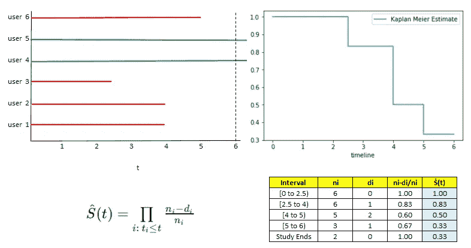****

****fig 1: a. Shows the user level time data in color.; b. Shows Kaplan Meier (KM)Estimate Curve; c. Formula for estimation of KM curve; d. Table showing the calculations****

```
******# Python code to create the above Kaplan Meier curve****from** **lifelines** **import** KaplanMeierFitter

*## Example Data* 
durations = [5,6,6,2.5,4,4]
event_observed = [1, 0, 0, 1, 1, 1]

*## create a kmf object*
kmf = KaplanMeierFitter() 

*## Fit the data into the model*
kmf.fit(durations, event_observed,label='Kaplan Meier Estimate')

*## Create an estimate*
kmf.plot(ci_show=**False**) *## ci_show is meant for Confidence interval, since our data set is too tiny, thus i am not showing it.*****
```

****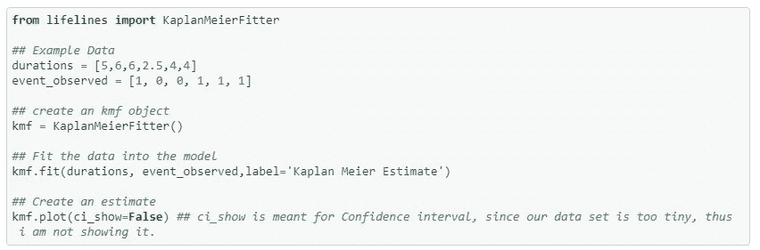****

******现实世界的例子:******

****如前所述，生存分析可用于群组分析，以获得洞察力。因此，在这里我们将使用[电信客户流失数据集](https://www.kaggle.com/blastchar/telco-customer-churn)，来深入了解不同群体中客户的生命线。****

****[代码 Github 链接:链接](https://github.com/anurag-code/Survival-Analysis-Lifelines/blob/master/Survival%20Analysis%20-%20Quick%20Implementation.ipynb)****

****让我们根据客户是否订阅了流媒体电视来创建两个客户群。我们想知道哪个群体的客户保持率更高。****

****绘制存活估计值所需的代码如下所示。****

```
****kmf1 = KaplanMeierFitter() *## instantiate the class to create an object*

*## Two Cohorts are compared. Cohort 1\. Streaming TV Not Subscribed by users, and Cohort  2\. Streaming TV subscribed by the users.*groups = df['StreamingTV']   
i1 = (groups == 'No')      *## group i1 , having the pandas series  for the 1st cohort*
i2 = (groups == 'Yes')     *## group i2 , having the pandas series  for the 2nd cohort*

*## fit the model for 1st cohort*
kmf1.fit(T[i1], E[i1], label='Not Subscribed StreamingTV')
a1 = kmf1.plot()

*## fit the model for 2nd cohort*
kmf1.fit(T[i2], E[i2], label='Subscribed StreamingTV')
kmf1.plot(ax=a1)****
```

****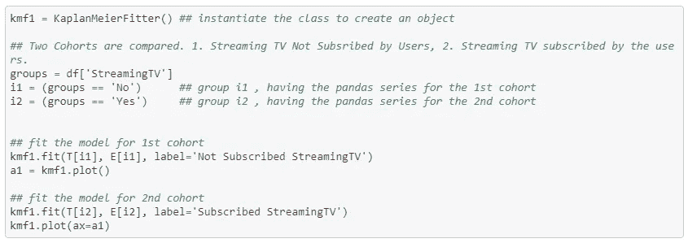************

****Fig 2: Kaplan Meier Curve of the two cohorts.****

****我们有两条存活曲线，每组一条。从曲线中可以明显看出，与没有订购流电视的客户相比，订购了流电视的客户具有更好的客户保持率。在时间线上的任意一点 t，我们可以看到蓝色群体的生存概率小于红色群体。对于蓝色队列，生存概率在前 10 个月快速下降，之后相对变好；然而，对于红色队列，存活率的下降率相当稳定。因此，对于尚未订购流媒体电视的群体，应努力在不稳定的前 10 个月留住客户。****

****我们可以从不同队列的生存曲线中做更多这样的队列分析。该队列分析代表了生存分析潜力的有限使用案例，因为我们将其用于数据的汇总水平。基于协变量对基线生存曲线的影响，我们甚至可以为单个用户创建生存曲线。这将是本文下一节的重点。****

# ****Cox 比例风险模型****

****群体中个体的事件发生时间对于总体水平上的生存曲线非常重要；然而，在现实生活中，除了事件数据，我们还有该个体的协变量(特征)。在这种情况下，了解协变量对生存曲线的影响是非常重要的。如果我们知道相关的协变量，这将有助于我们预测个体的生存概率。****

****例如，在上面讨论的电信客户流失示例中，我们有每个客户流失时的任期(事件时间 T)以及客户的性别、每月费用、受抚养人、合作伙伴、电话服务等。在这个例子中，其他变量是协变量。我们经常对这些协变量如何影响生存概率函数感兴趣。****

****在这种情况下，它是条件生存函数 S(t|x) = P(T > t|x)。这里 x 表示协变量。在我们的例子中，我们对 S(任期> t|(性别、每月费用、受抚养人、合作伙伴、电话服务等)感兴趣。****

****Cox(比例风险)模型是结合协变量和生存函数的最流行的模型之一。它从风险函数建模开始。****

****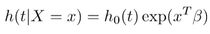****

****这里，β是每个协变量的 coefficients 向量。函数 h *o* (t)称为基线危险函数。****

*****Cox 模型假设协变量在风险函数上具有线性乘法 effect，并且 effect 在整个时间内保持不变。*****

******该模型背后的思想是，个体的对数风险是其静态协变量的线性函数，*和*是随时间变化的群体水平基线风险。【来源:生命线文档】******

****从上述等式中，我们还可以推导出累积条件风险函数，如下所示:****

****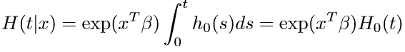****

****正如我们已经知道的，借助于上一节中推导出的表达式，我们可以从风险函数中推导出生存函数。因此，我们可以得到每个主体/个人/顾客的生存函数。****

******python 中的基本实现:******

****我们现在将借助 lifelines 包讨论它在 python 中的基本实现。我们使用了相同的电信客户流失数据集，我们已经在上面的章节中使用。我们将运行 python 代码来预测客户级别的生存函数。****

```
******from** **lifelines** **import** CoxPHFitter*## My objective here is to introduce you to the implementation of the model.Thus taking subset of the columns to train the model.*
*## Only using the subset of the columns present in the original data*df_r= df.loc[:['tenure', 'Churn', 'gender', 'Partner', 'Dependents', 'PhoneService','MonthlyCharges','SeniorCitizen','StreamingTV']]df_r.head() *## have a look at the data*****
```

****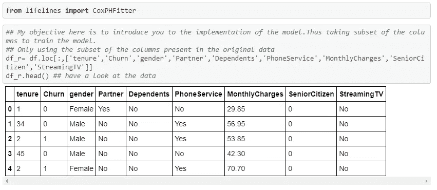****

```
*****## Create dummy variables*
df_dummy = pd.get_dummies(df_r, drop_first=**True**)
df_dummy.head()****
```

****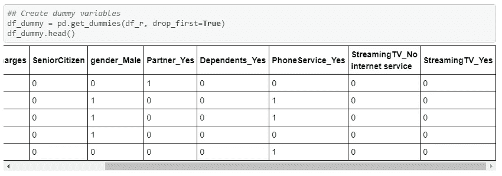****

```
*****# Using Cox Proportional Hazards model*
cph = CoxPHFitter()   *## Instantiate the class to create a cph object*cph.fit(df_dummy, 'tenure', event_col='Churn')   *## Fit the data to train the model*cph.print_summary()    *## HAve a look at the significance of the features*****
```

************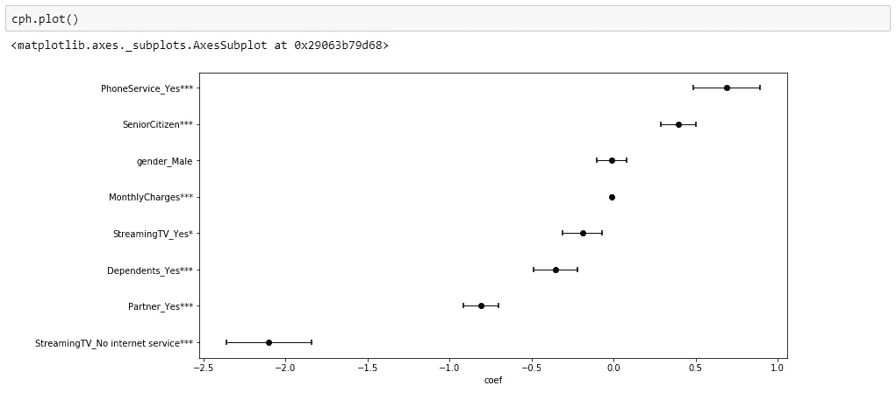****

****上述汇总统计数据表明了协变量在预测客户流失风险方面的重要性。性别在预测流失方面没有起到任何重要作用，而所有其他协变量都很重要。****

*******有趣的一点*** *这里要注意的是，在协变量为月度费用和性别 _ 男性的情况下，β (coef)值约为零(~-0.01)，但月度费用在预测流失方面仍然起着重要作用，而后者则不显著。原因是每月费用是连续值，可以从几十、几百到几千不等，当乘以小系数(β=-0.01)时，它变得很重要。另一方面，协变量性别只能取值 0 或 1，在这两种情况下[exp(-0.01 * 0)，exp(-0.01*1)]都将是无关紧要的。*****

```
*****## We want to see the Survival curve at the customer level. Therefore, we have selected 6 customers (rows 5 till 9).*

tr_rows = df_dummy.iloc[5:10, 2:]
tr_rows****
```

****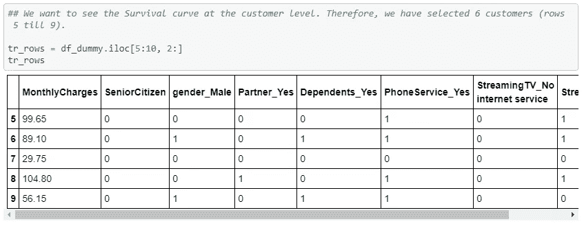****

```
*****## Lets predict the survival curve for the selected customers.* 
*## Customers can be identified with the help of the number mentioned against each curve.*cph.predict_survival_function(tr_rows).plot()****
```

****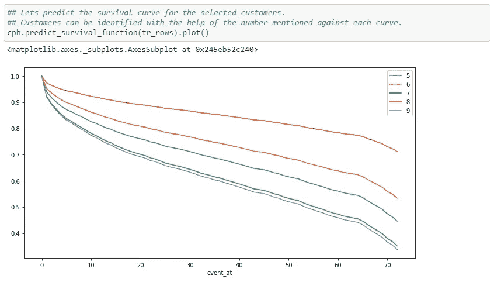****

****fig 2\. It shows the Survival Curves at customer level of customer number 5,6,7,8, and 9****

****图二。显示了客户层面的生存曲线。它显示了 5 号、6 号、7 号、8 号和 9 号顾客的生存曲线。****

****在每个客户级别创建生存曲线有助于我们主动为高价值客户创建定制战略，以应对时间线上不同的生存风险段。****

# ****结束注释****

****尽管如此，还有许多其他的事情仍然需要在生存分析中涉及，如[、【检验比例假设】、&、](https://lifelines.readthedocs.io/en/latest/jupyter_notebooks/Proportional%20hazard%20assumption.html#Checking-assumptions-with-check_assumptions)[、](https://lifelines.readthedocs.io/en/latest/Survival%20Regression.html#model-selection-in-survival-regression)；然而，通过对分析背后的数学的基本理解，以及生存分析的基本实现(使用 python 中的生命线包)将帮助我们在任何相关的业务用例中实现该模型。****

# ****额外资源****

****以下资源不仅对激励我研究生存分析非常有帮助，而且对我写这篇文章也非常有帮助。查看他们更多的生存分析。****

1.  ****[生命线 Python 文档](https://lifelines.readthedocs.io/en/latest/Quickstart.html)****
2.  ****[艾伦·唐尼的 SciPy 2015 讲座](https://www.youtube.com/watch?v=XHYFNraQEEo)****
3.  ****[IPPCR 2015:生存分析的概念方法](https://www.youtube.com/watch?v=dYorCZaF8ag)****
4.  ****[日元-陈驰非参数统计](http://faculty.washington.edu/yenchic/18W_425/Lec5_survival.pdf)****
5.  ****[普林斯顿大学讲义:生存模型](https://data.princeton.edu/wws509/notes/c7.pdf)****