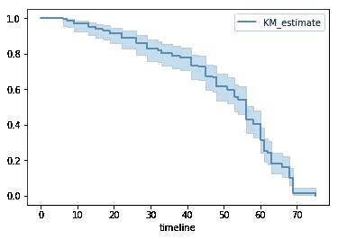
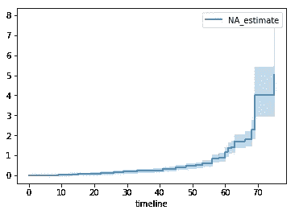

# 生存分析—A 部分

> 原文：<https://towardsdatascience.com/survival-analysis-part-a-70213df21c2e?source=collection_archive---------5----------------------->

## 生存分析的概念介绍及其在 Python 生命线包中的实现。

Photo by [Markus Spiske](https://unsplash.com/photos/3Tf1J8q9bBA?utm_source=unsplash&utm_medium=referral&utm_content=creditCopyText) on [Unsplash](https://unsplash.com/search/photos/prediction?utm_source=unsplash&utm_medium=referral&utm_content=creditCopyText)

生存分析用于估计研究中特定人群的寿命。它也被称为**“事件时间”分析**，因为其目标是估计一个人或一群人经历感兴趣的事件的时间。这个时间估计是出生和死亡事件之间的持续时间[1]。生存分析最初是由医学研究人员和数据分析师开发并用于测量特定人群的寿命[1]。但是，多年来，它已被用于各种其他应用，如预测客户/员工的变动，估计机器的寿命等。出生事件可以被认为是客户开始成为公司成员的时间，而死亡事件可以被认为是客户离开公司的时间。

# **数据**

在生存分析中，我们不需要确切的起点和终点。所有的观察并不总是从零开始。受试者可以在任何时候进入研究。所有的持续时间都是相对的[7]。所有受试者都被带到一个共同的起点，在这里时间 t 为零(t = 0 ),所有受试者的生存概率都等于 1，即他们没有经历感兴趣的事件(死亡、流失等)的几率是 100%。

可能会出现这样的情况:数据量太大，无法完全用于生存分析。对于这种情况，分层抽样可能会有所帮助。在分层抽样中，您的目标是在整个人群中，每组受试者的数量相等或接近相等。每一组称为一个地层。基于某些特征，整个人口被分层(划分)成组。现在，为了从每组中挑选一定数量的受试者，你可以使用简单的随机抽样。受试者的总数在开始时指定，你在每组中分配所需的总数，你从每组中随机挑选该数量的受试者[12]。

# **审查制度**

重要的是要明白，在研究期间，并非所有人都会经历感兴趣的事件(死亡、流失等)。例如，将会有仍然是公司成员的客户，或者仍然为公司工作的员工，或者在观察/研究期间仍然运行的机器。截至研究时，我们不知道他们何时会经历感兴趣的事件。我们只知道他们还没有经历过。他们的存活时间比他们在研究中的时间要长。他们的存活时间因此被贴上了“审查”的标签[2]。这表明他们的存活时间是截止的。因此，审查允许你测量那些还没有经历过感兴趣的事件的人的寿命。

值得一提的是，没有经历感兴趣事件的人/受试者需要成为研究的一部分，因为将他们完全移除会使研究结果偏向于经历感兴趣事件的每个人。因此，我们不能忽略这些成员，将他们与经历感兴趣事件的成员区分开的唯一方法是使用一个变量来指示审查或死亡(感兴趣事件)。

生存分析中有不同类型的审查，解释如下[3]。请注意，审查必须独立于特定受试者的未来风险值[24]。

*   **右删截:**当受试者在 t=0 时进入，即在研究开始时进入，并在感兴趣的事件发生前终止。这可能是因为在研究过程中没有经历感兴趣的事件，即他们活得比研究持续时间长，也可能是因为没有完全参与研究，没有经历感兴趣的事件就提前离开了，即他们离开了，我们无法再对他们进行研究。
*   **左侧审查:**出生事件未被观察到时会出现这种情况。这里还应该提到另一个被称为长度偏差抽样的概念。当研究的目标是对已经经历过该事件的人/受试者进行分析，并且我们希望了解他们是否会再次经历该事件时，就会出现这种类型的取样。lifelines 包通过添加关键字*left _ inspecting = True*支持左删截数据集。请注意，默认情况下，它被设置为 False。例[9]:

*   **间隔删截:**当随访期，即观察之间的时间**不连续**时，会发生这种情况。这可以是每周、每月、每季度等。
*   **左截断:**简称**迟录入**。受试者在参与研究前可能已经经历了感兴趣的事件。有一个名为“进入”的参数，它指定了出生和进入研究之间的持续时间。如果我们填充截断的区域，那么它将使我们对诊断后早期发生的事情过于自信。这就是我们截断它们的原因[9]。

简而言之，在研究期间未经历感兴趣事件的受试者为右删截受试者，出生未被发现的受试者为左删截受试者[7]。生存分析的发展主要是为了解决右删失问题[7]。

# **生存功能**

生存函数由下式给出，

生存函数定义了感兴趣的事件在时间 t 没有发生的概率。也可以解释为时间 t 后的**生存概率【7】。这里，T 是取自总体的随机寿命，它**不能为负。**注意 S(t)在零和一(含)之间，S(t)是 t 的非增函数[7]。**

# **危险功能**

风险函数也称为强度函数，定义为受试者在一小段时间间隔内经历感兴趣事件的概率，前提是该个体一直存活到该间隔开始[2]。它是在一段时间内计算的瞬时速率，该速率被视为常数[13]。它也可以被认为是在时间 t 经历感兴趣事件的风险。它是在时间 t 开始的间隔内经历事件的受试者人数除以在时间 t 存活的受试者人数和间隔宽度的乘积[2]。

因为连续随机变量等于特定值的概率为零。这就是为什么我们考虑事件在从 T 到(That)的特定时间间隔发生的概率。因为我们的目标是找到事件的风险，我们不希望风险随着时间间隔δT 变大而变大。因此，为了对此进行调整，我们将等式除以δT，这将等式缩放了δT[14]。危险率的等式如下所示:

极限δT 趋近于零意味着我们的目标是测量某一事件在特定时间点发生的风险。因此，使极限δT 接近零会产生一个无限小的时间段[14]。

这里要指出的一点是，危害不是概率。这是因为，即使分子中有概率，但分母中的δT 可能会导致大于 1 的值。

# **卡普兰-迈耶估计值**

Kaplan-Meier 估计值用于衡量在相同情况下存活一定时间 t[4]的受试者比例[2]。**用于给出总体的平均视图【7】**。这种方法也叫积极限。它可以生成一个叫做生命表的表格和一个叫做生存曲线的图表，以便更好地观察处于危险中的人口[2]。**存活时间被定义为从预定点开始到感兴趣的事件发生的时间【5】**。**Kaplan-Meier 生存曲线是在给定时间长度内生存的概率，其中时间被视为小间隔。**对于使用 Kaplan-Meier 估计值的生存分析，有三个假设[4]:

*   被审查的受试者和继续被跟踪的受试者有着相同的生存前景。
*   所有受试者的存活概率是相同的，无论他们何时被招募到研究中。
*   感兴趣的事件在指定的时间发生。这是因为该事件可能发生在两次检查之间。如果检查频繁发生，即如果检查之间的时间间隔非常小，则可以更准确地测量估计的存活时间。

任何特定时间的**存活概率**计算为存活的受试者人数除以处于危险中的人数。被审查的受试者不计入分母[4]。该方程式如下所示:

这里，ni 表示在时间 t 之前处于危险中的受试者的数量。di 表示在时间 t 感兴趣的事件的数量

对于 Kaplan-Meier 估计的存活曲线，y 轴代表受试者在时间 t 后仍未经历感兴趣事件的概率，其中时间 t 在 x 轴上[9]。为了了解我们对于点估计的不确定性，我们使用置信区间[10]。中位数时间是平均一半人口经历感兴趣事件的时间[9]。

# **尼尔森·艾伦钳工**

像卡普兰-迈耶菲特一样，尼尔森艾伦菲特也给了我们一个总体的平均观点[7]。它由 t 时刻的死亡人数除以处于危险中的受试者人数得出。这是一个非参数模型。这意味着没有一个带有参数的函数形式来拟合数据。它没有任何适合的参数[7]。

这里，ni 表示在时间 t 之前处于危险中的受试者的数量。di 表示在时间 t 感兴趣的事件的数量

# **生存回归**

生存回归不仅包括使用持续时间和审查变量，还包括使用额外的数据(性别、年龄、工资等)作为协变量。我们根据持续时间变量“回归”这些协变量。

用于生存回归的数据集需要采用(Pandas)数据框架的形式，其中一列表示受试者的持续时间，一个可选列表示是否观察到感兴趣的事件，以及需要回归的其他协变量。与其他回归技术一样，您需要在将数据输入模型之前对其进行预处理。

# **Cox 比例风险回归模型**

Cox 比例风险回归分析模型是由 Cox 引入的，它同时考虑了几个变量的影响[2]，并检查了生存分布与这些变量的关系[24]。它类似于多元回归分析，但不同之处在于因变量是给定时间 t 的风险函数。它基于非常小的时间间隔，称为时间点击，最多包含一个感兴趣的事件。这是一种估计比例风险模型中权重的半参数方法[16]。通过最大化权重的部分似然性来获得参数估计[16]。

梯度下降用于使 Cox 模型符合数据[11]。梯度下降的解释超出了本文的范围，但是它找到了使误差最小化的权重。

Cox 比例风险回归模型的公式如下所示。该模型的工作原理是，个体受试者的对数风险是其静态协变量的线性函数，也是随时间变化的人群水平基线风险函数。这些协变量可以通过部分似然估计[24]。

β0(t)是基线风险函数，它被定义为当所有其他协变量等于零时，经历感兴趣事件的概率。并且它是模型中唯一依赖于时间的组件。该模型没有对基线风险函数进行假设，并假设协变量对风险的影响为参数形式[25]。部分危险是一个不随时间变化的标量因子，仅增加或减少基线危险。它类似于普通回归中的截距[2]。协变量或回归系数 x 给出了危险中可预期的比例变化[2]。

回归系数的符号βi 在受试者的风险中起作用。这些回归系数或协变量的变化将增加或减少基线危害[2]。βi 的阳性符号意味着事件的风险更高，因此该特定受试者的感兴趣事件的预后更高。同样，负号意味着事件的风险较低。此外，请注意大小，即价值本身也发挥作用[2]。例如，变量的值等于 1 意味着它对危险没有影响。小于 1 的值会减少危险，大于 1 的值会增加危险[15]。这些回归系数β通过最大化部分似然估计[23]。

Cox 比例风险模型是一个半参数模型，在这个意义上，基线风险函数不必指定，即它可以变化，允许不同的参数用于每个独特的生存时间。但是，它假设在整个随访期内比率保持成比例[13]。这增加了模型的灵活性。全参数比例风险模型还假设基线风险函数可以根据生存时间分布的特定模型进行参数化[2]。

Cox 模型可以处理右删失数据，但不能直接处理左删失或区间删失数据[19]。

有些协变量可能不符合比例风险假设。他们被允许仍然是模型的一部分，但是不估计它的效果。这就是所谓的分层。基于分层协变量的唯一值，数据集被分成 N 个更小的数据集。每个更小的数据集都有自己的基线危险，这构成了模型的非参数部分，它们都有共同的回归参数，这构成了模型的参数部分。分层的协变量没有回归参数。

术语“比例风险”是指因变量和回归系数之间关系不变的假设[2]。因此，这意味着任何两个受试者在任何时间点的风险函数都是成比例的。比例风险模型假设协变量对风险函数有倍增效应[16]。

考克斯模型[23]提出了三个假设

*   两个受试者的风险比始终保持不变。
*   解释变量对风险函数有多重作用。
*   个体受试者的失败时间是相互独立的。

## **生命线包提供的一些内置功能【11】**

*   **print_summary** 打印系数和相关统计的表格视图。
*   **hazards_** 将打印系数
*   **baseline _ hazard _**将打印基线危险
*   **baseline _ cumulative _ hazard _**将打印 N 个数据集的 N 个基线危险
*   **_log_likelihood** 将在拟合模型后打印最大对数似然值
*   **方差矩阵**将呈现拟合模型后系数的方差矩阵
*   **score_** 将打印出拟合模型的一致性指数
*   梯度下降用于使 Cox 模型与数据拟合。您甚至可以在 **fit** 函数中使用变量 **show_progress=True** 来查看拟合。
*   **预测 _ 部分 _ 危险**和**预测 _ 生存 _ 函数**用于推断拟合的模型。
*   **图**方法可用于查看系数及其范围。
*   **plot_covariate_groups** 方法用于显示当我们改变一个(或多个)协变量，而保持其他一切不变时，生存曲线看起来是什么样子。通过这种方式，我们可以了解模型中共变量的影响。
*   **check _ assumptions**方法将输出违反比例危险假设的情况。
*   **weights _ col = ' column _ name '**指定包含代表某些采样权重的整数值或浮点值的权重列。您还需要在拟合方法中指定 **robust=True** 来更改标准误差计算。

# **艾伦的加法模型**

与 Cox 模型一样，该模型也是一个回归模型，但与 Cox 模型不同，它将风险率定义为一个加法模型，而不是乘法线性模型。危险被定义为:

在估计过程中，每一步都会计算线性回归。由于样本量较小或数据集中的共线性较高，回归可能会变得不稳定。添加 coef_penalizer 项有助于控制稳定性。从一个小的期限开始，如果它变得太不稳定就增加[11]。

这是一个参数模型，这意味着它有一个函数形式，带有我们用来拟合数据的参数。参数模型允许我们将生存函数、风险函数或累积风险函数扩展到超过最大观测持续时间。这个概念叫做外推法[9]。威布尔模型的生存函数如下所示:

这里，λ和ρ都是正的，并且大于零。当模型符合数据时，它们的值被估计。危险函数如下所示:

# **加速失效时间回归模型**

如果我们给定两个独立的总体 A 和 B，每个都有由 SA(t)和 SB(t)给出的生存函数，并且它们通过某个加速失效率λ彼此相关，这样，

它可以减慢或加快沿生存功能移动。λ可以建模为协变量的函数[11]。它将存活时间的延长或缩短描述为预测变量的函数[19]。

在哪里，

根据受试者的协变量，该模型可以加速或减速失败时间。xi 的增加意味着平均/中位存活时间以 exp(bi)[11]的因子变化。然后我们选择生存函数的参数形式。为此，我们将选择威布尔形式。

# **使用生命线包在 Python 中进行生存分析**

第一步是用 Python 安装生命线包。您可以使用 pip 安装它。

需要指出的一点是，生命线软件包假设每个受试者都经历了感兴趣的事件，除非我们明确指定[8]。

生存回归拟合方法的输入，即 CoxPHFitter、WeibullAFTFitter 和 AalenAdditiveFitter 必须包括持续时间、审查指标和 Pandas 数据框架形式的协变量。持续时间和审查指标必须在 fit 方法的调用中指定[8]。

lifelines 包包含 lifelines.statistics 中的函数来比较两条生存曲线[9]。对数秩检验比较两个事件序列的发生器。如果从测试返回的值超过某个预定义的值，则该系列具有不同的生成器。

# **对数秩检验**

这是一个非参数统计检验，用于比较两组的生存曲线。

# **和谐指数**

这是一个最常用的生存模型的性能评估。它用于验证生存模型的预测能力[18]。它是预测的和观察到的存活率一致的概率。它是“在所有可实际排序的受试者中，其预测存活时间被正确排序的所有受试者对的分数”[16]。

# **型号选择**

如果存在删失，那么我们不应该使用均方误差或平均绝对误差损失。我们应该选择和谐指数(简称 c 指数)。和谐指数评估预测时间排序的准确性。其解释如下[11]:

*   随机预测:0.5
*   完美一致:1.0
*   完美的反一致性:0.0(在这种情况下，我们应该将预测乘以-1，以获得完美的 1.0)

通常，拟合模型的一致性指数在 0.55 和 0.7 之间，这是由于数据中存在噪声。

我们也可以对 Cox 模型和 Aalen 加法模型使用 K-Fold 交叉验证。该函数将数据分为训练集和测试集，并根据训练集调整自身，根据测试集评估自身。该函数对每个折叠重复此操作。

## 在第二部分中，我们将在 Python 中实现生存(回归)分析来预测客户流失。

# **参考文献**

[1]生命线:Python 中的生存分析:[https://www.youtube.com/watch?v=XQfxndJH4UA](https://www.youtube.com/watch?v=XQfxndJH4UA)

[2]什么是考克斯模型？斯蒂芬·J·沃尔特斯。[www.whatisseries.co.uk](http://www.whatisseries.co.uk)

[3]应用生存分析:事件发生时间数据的回归建模，作者:小 David W. Hosmer，Stanley Lemeshow，Susanne May

[4]了解生存分析:卡普兰-迈耶估计:[https://www.ncbi.nlm.nih.gov/pmc/articles/PMC3059453/](https://www.ncbi.nlm.nih.gov/pmc/articles/PMC3059453/)

[5]统计评论 12:生存分析。贝维克 V，脸颊 L，球 j 暴击关怀。2004 年十月；8(5):389–94.

[6]奥特曼 DG。伦敦(英国):查普曼和霍尔；1992.生存时间分析。《医学研究实用统计》;第 365-93 页。

[7]生命线— [生存分析简介](https://lifelines.readthedocs.io/en/latest/Survival%20Analysis%20intro.html)

[8]生命线— [快速启动](https://lifelines.readthedocs.io/en/latest/Quickstart.html)

[9]生命线— [用生命线进行生存分析](https://lifelines.readthedocs.io/en/latest/Survival%20analysis%20with%20lifelines.html)

[10]格林伍德和指数格林伍德。生存分析中的置信区间—s . Sawyer—2003 年 9 月 4 日

[11]生命线— [生存回归](https://lifelines.readthedocs.io/en/latest/Survival%20Regression.html)

[12]分层抽样，[https://www.youtube.com/watch?v=sYRUYJYOpG0](https://www.youtube.com/watch?v=sYRUYJYOpG0)

[13]生存分析，第 3 部分:2017 年 11 月美国正畸和牙颌面整形杂志上的 Cox 回归文章

[14]生存分析中危害函数的定义:[https://www.youtube.com/watch?v=KM23TDz75Fs](https://www.youtube.com/watch?v=KM23TDz75Fs)

[15] [Cox 比例风险模型— STHDA](http://www.sthda.com/english/wiki/cox-proportional-hazards-model)

[16]关于生存分析中的排名:和谐指数的界限——Vikas c . ray kar，Harald Steck，Bala Ji Krishnapuram CAD and Knowledge Solutions(IKM·CKS)，Siemens Medical Solutions Inc ,(美国马尔文)和 Cary Dehing-Oberije，Philippe Lambin Maastro 诊所，马斯特里赫特大学医院，马斯特里赫特大学，荷兰 GROW

[17] [生命线—时变生存回归](https://lifelines.readthedocs.io/en/latest/Time%20varying%20survival%20regression.html)

[18] [和谐指数](https://discuss.analyticsvidhya.com/t/what-is-concordance-index/8408)

[19]参数生存模型——克里斯托夫·德特韦勒和丁满·斯图基。9.2011 年 5 月

[20] StatQuest:最大似然，解释清楚！[https://www.youtube.com/watch?v=XepXtl9YKwc](https://www.youtube.com/watch?v=XepXtl9YKwc)

[21]考克斯(1972)

[22]d . r . Cox(1975 年)提出的部分可能性

[23] [Cox 回归模型](https://pdfs.semanticscholar.org/b844/5171bd056ce18f174f339ab831d10b6e8b96.pdf)

[24]生存数据的 Cox 比例风险回归，见《应用回归指南》附录，第三版，John Fox & Sanford Weisberg

# **延伸阅读**

*   [https://NCSs-wpengine . net DNA-SSL . com/WP-content/themes/NCSs/pdf/Procedures/NCSS/Cox _ regression . pdf](https://ncss-wpengine.netdna-ssl.com/wp-content/themes/ncss/pdf/Procedures/NCSS/Cox_Regression.pdf)
*   [https://stat . ethz . ch/education/semesters/ss 2011/seminar/contents/讲义 _9.pdf](https://stat.ethz.ch/education/semesters/ss2011/seminar/contents/handout_9.pdf)
*   [https://lifelines.readthedocs.io/en/latest/Quickstart.html](https://lifelines.readthedocs.io/en/latest/Quickstart.html)