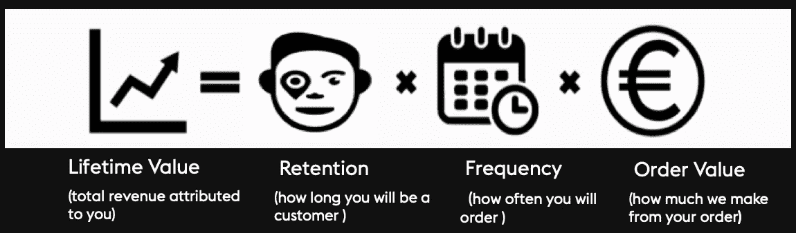
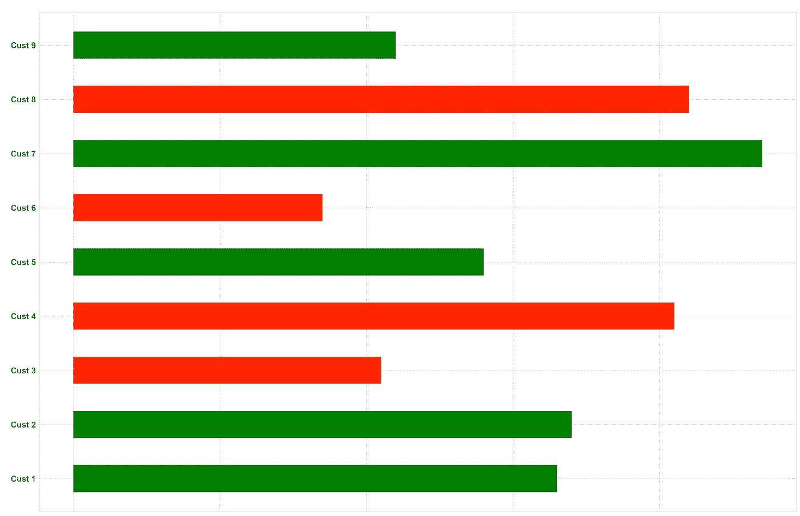
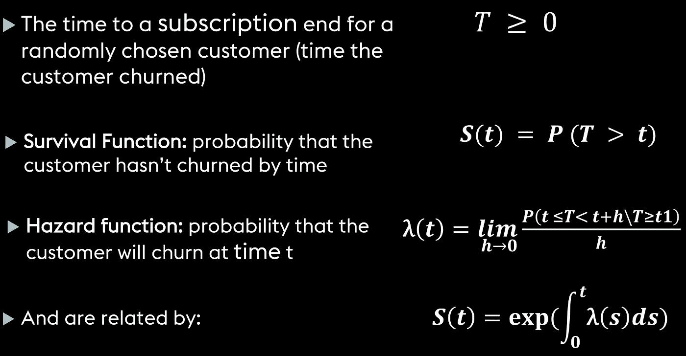
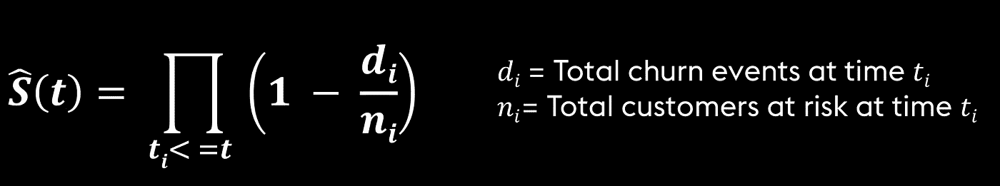
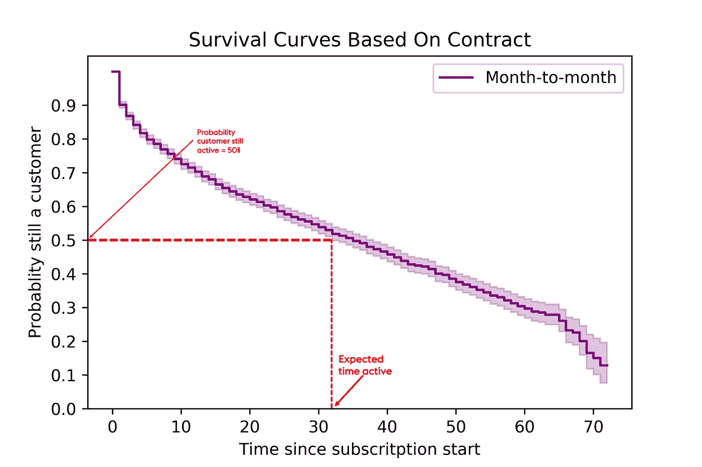
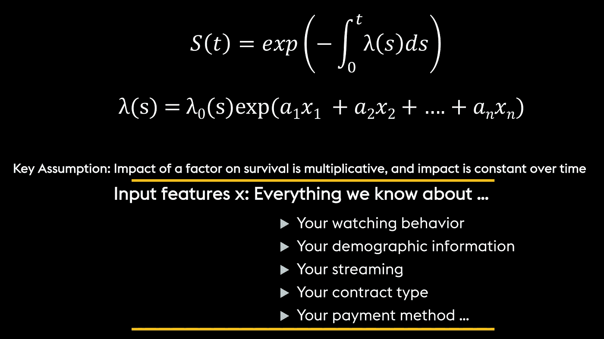
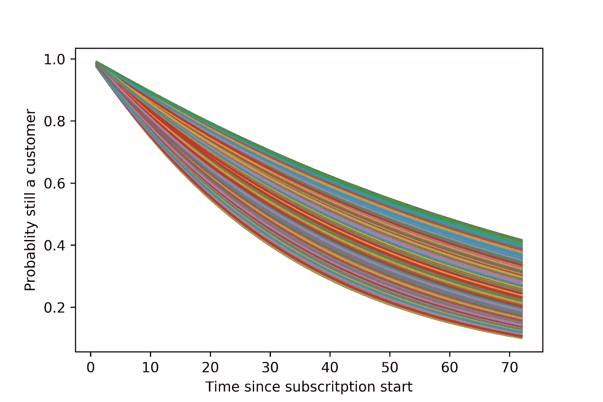

# 生存分析，了解客户保留

> 原文：<https://towardsdatascience.com/survival-analysis-to-understand-customer-retention-e3724f3f7ea2?source=collection_archive---------4----------------------->

# 介绍

在当今竞争日益激烈的商业舞台上，客户维系是一个日益紧迫的问题。公司渴望发展客户保持重点和计划，以最大限度地提高长期客户价值。具体来说，客户保持的重要性；构思一个综合的客户价值/保留模型；并解释了使用细分如何帮助建立关系、保持策略和利润规划。我提出了一个解决方案，它整合了客户数据分析、建模和挖掘多个概念层次关联的各种技术，以形成一种直观和新颖的方法来衡量客户忠诚度并预测他们背叛的可能性。由这些“早期警告”引发的立即行动可能是最终留住客户的关键

(source: [https://www.istockphoto.com](https://www.istockphoto.com/nl))

# 客户保持和终身价值

任何契约式或订阅式商业模式的核心都是留存率的概念。一项重要的管理任务是获取给定客户群的一系列过去的保留数字，并将其投射到未来，以对客户任期、终身价值等做出更准确的预测。因此，客户终身价值(LTV)是数据库营销的基石之一。客户终身价值通常被定义为一个公司可以从客户那里期望的总净收入(Novo 2001)。确切的数学定义及其计算方法取决于许多因素，如客户是“订户”(如在大多数在线订阅产品中)还是“访问者”(如间接营销或电子商务)。

# 我们为什么要在乎终身价值？

在这篇文章中，我将讨论客户终身价值(LTV)的计算和商业用途。CRM 的商业智能单元任何为商业问题定制分析解决方案的公司，这些问题在行业中处于高度优先地位:合作和保留分析、欺诈分析、活动管理、信贷和收款、风险管理等等。LTV 在其中一些应用中扮演着重要角色，尤其是客户流失分析和客户保持活动管理。在流失分析的背景下，客户或细分市场的 LTV 是其流失概率的重要补充信息，因为它提供了一种因流失而真正损失多少以及应该在该细分市场上集中多少努力的感觉。在留住人才的活动中，主要的业务问题是在留住人才方面投入的资源与目标细分市场 LTV 的相应变化之间的关系。

# 生命周期价值模型的组成部分

一般来说，一个 LTV 模型有三个组成部分:随着时间推移的客户价值，客户的服务年限和贴现因子。每个组成部分可以单独计算或估计，也可以将它们的模型结合起来。当在保留活动的背景下对 LTV 建模时，还有一个额外的问题，即需要计算客户在保留活动之前和之后的 LTV。换句话说，我们需要为每个客户或细分市场计算几个 LTV，对应于我们可能想要开展的每个可能的保留活动(即我们可能想要建议的不同激励措施)。能够估计这些不同的 LTV 是成功和有用的 LTV 应用程序的关键。

# 为什么要进行生存分析？

让我们从一个简单的动机和问题开始，有时我会被问及平均订阅时间和客户在公司的时间。例如，我们有九个客户，条形图跟踪他们的平均订阅时长。绿条表示仍在使用的客户，红条表示不再使用的客户。

那么，平均订阅时长是多少？然而，需要问的一个问题是，是否只取 CRM 数据库中所有这些客户或仍在活动的客户的平均值？

如果下个月采用平均订阅时长，可能会变得完全不同。从本质上说，这是一个我们试图观察的移动目标。第二种情况是忽略活跃的人，只看不活跃的人，然后看他们的平均值。这也不能解决问题，因为有些客户会变得不活跃。因此，我们正在大规模地偏向我们的数据集，让已经取消的客户无法直接得到我们想要的东西。综上所述，这些讨论表明，我们对数据有一种感觉，我们还没有实际观察到我们试图测量的终点，因此本质上像这样取平均值永远不会是明智的做法。

# **行动中的生存分析**

为了衡量上面提到的问题，我们需要生存分析来估计特定人群发生事件的时间，当你可能不知道所有你知道的，看到所有事件发生时，这都是你的数据点。生存分析在统计学中是一个非常古老的概念，它被广泛使用，例如，在医学统计学中，这并不是一个很好的例子。癌症后的存活率和人们存活 5-10 年的概率都是生存分析。回到我们关心的是我们的客户，我们关注的是客户何时注册并开始从免费试用转向付费订阅，以及我们认为他们将在多长时间内开放使用服务，这显然会成为 it 的终身价值。

([https://www.canstockphoto.com](https://www.canstockphoto.com/download/))

# **生存分析定义**

首先，浏览一些定义来从概念上理解生存分析是一个好主意。我们将关注大写 T，这是客户订购结束的时间。这显然大于零。然而，如果顾客从不搅动，它可能是无限的。这是我们关心的数量，这将帮助我们理解终身价值，这基本上是客户在未来任何一天都没有搅动的概率。这是非递增函数。总的概率也很重要，那就是在每一个无限小的日子里会发生什么。我们通过风险函数来定义这一点，风险函数是在任何给定的一天 T，即客户流失的确切日期，不是前一天也不是后一天。正如你所料，这两件事是相关的，但这就像一点基本概率，你可以证明，基本上生存函数是以相对简单的方式，用风险函数来表达的。

# **套餐选择**

在 Python 中，我们有两个主要的包生命线和 scikit-survival 包。救生索是较长的包装，重量很轻。尽管如此，它也提供了非常好的视觉效果。这两者都是基于他们的 scikit-learn。人们可以像使用任何 scikit-learn 包一样使用它们，并将其放入管道中。

# 资料组

数据集——这里我们使用了客户流失。这个想法是用数据科学的视角，用数据带领读者走过客户维系的整个周期。我们从理解问题的商业视角开始。然后，我们将使用可用的数据集来获得洞察力，并构建一个用于未来数据的预测模型。

# 特征工程

我们有很多分类数据，特别是像伴侣、家属、合同等。有一个标准的热门娱乐方法，你只需要根据类别把它变成 n 或 n 减 1 的二元特征。如果你还记得 cox 模型的样子，这对 X 来说是很好的:这意味着我们有一个系数附加到每个分类变量上。因此，我们将非常清楚地了解每个类别的影响。这将导致一个巨大的数据集，因为我们已经得到了维数灾难。

# 生存建模

*   提取生存函数的 Kaplan-Meijer 估计
*   Cox 比例风险回归分析

# **生存函数的 Kaplan-Meijer 估计值**

该函数给出了客户在 t 点之前不会流失的概率。生存函数的对应函数是累积风险函数。它描述了累积风险，或客户在时间 t 之前发生搅动的概率。

我们关心的是客户的生存函数 T 的数量以及他们在第 T 天仍然是客户的概率。在实践中，我们不能仅仅因为我们对数据的感觉而知道这个函数，所以我们可以使用函数的 kaplan-meier 估计来估计它，它本质上是建立在客户比率的所有乘积的基础上的。

风险率也称为死亡率或瞬时事件率，描述了在时间 t 前后的一小段时间内发生事件的风险，假设该事件尚未发生。由于社会的真实形式很少为人所知，生存分析的一部分涉及其估计，Kaplan-Meier 估计器考虑了流失客户的数量和所谓的“处于风险的数量”，即仍在合同中并可能在未来流失的客户。

当我们运行上面的代码时，我们得到了一个类似这样的图，我们可以看到置信区间非常接近。因此，我们的模型很好地逼近了这些数据中的真实生存曲线。最后，我们可以回答客户的平均订阅时长是多少；实际上是在读取我们有 50%的可能性，他们仍然是客户之前，客户预期存活的中间时间。这反过来又给了我们客户在这条生存曲线中的预期天数，我们认为他/她会在那里。

人们可以看到这种分析如何对我们的预期产生真正的影响，即我们认为某人会成为客户多久；这反过来影响客户的终身价值。最后，我们可以做的是对此进行扩展，建立一个回归模型，根据我们对客户的所有了解，尝试估计生存函数。

# **Cox 模型::**生存回归

最常用的模型是 Cox 比例风险模型，它用于将同时考虑的几个风险因素或暴露与存活时间相关联。在 Cox 比例风险回归模型中，效果的度量是风险率，它是失败的风险(即，遭受感兴趣的事件的风险或概率)，假设参与者已经存活到特定时间。它被称为比例风险，因为在给定的时间点上，每两个顾客的风险比率是恒定的。随着时间的变化被编码在基线风险函数 zero 中，并影响所有功能，如我们可能放入这个世界的合同、流媒体电影/电视。顾客被编码为这种类似于常数的术语，随着时间的推移，它对风险有着持续的影响。

然而，有一点需要注意的是，cox 模型是最常用的模型，但它有一个假设，即所有影响都是不变的；这可能不是真的。有许多因素可能会违背这一假设。类似于。例如，一个客户在一段时间内获得的退款总额会发生变化，然后随着时间的推移对生存产生不同的影响，因此，仅仅使用考克斯模型可能不是明智的选择。在你开始模拟客户和他们的终身价值以及我们认为他们会成为客户多久之前，你必须进行仔细的检查。

# **模特培训**

Cox 比例风险模型符合一个相对简单的方式。汇总结果看起来像是我们已经输入了一些特征，然后你可以读出系数和系数的指数，这最终是我们将要乘以你的危险率的东西。这是真正告诉我们某个特性的影响，以及模型找到适合这个特定特性的模型的可信度的数量。

我们可以看到第二条线下的安全指数是 0.67。如果指数越大，系数对生存函数的影响就越大，而系数越低，意味着风险率越低。因此，我希望顾客能停留更长时间。因此，这是一个强有力的指标，表明客户的风险率大大降低，并最终成为客户的时间会更长。如果一个系数非常接近一个系数，这意味着它基本上没有影响，而且模型也不能真正可靠地找到这个参数的位置。它可能在某个非常靠近任何一边的地方。因此，在现实中，我们只想从模型中去掉系数接近 1 左右的变量，因为它并没有告诉我们太多，它只是一种噪音。

# **和谐指数**

像开发任何预测模型一样，使用适当的性能测量来验证生存模型的性能是至关重要的。虽然已经提出了许多这样的方法，但我们使用的是一种叫做和谐指数的方法。本质上，它是测量有序对，以及在我们的数据集中，你对每一个可能对的排序有多好。例如，我们把我们所有的数据和所有的预期时间的预测，这将使人们成为一个明显大于 0 的客户。一致性指数的评分方法与曲线下面积(AUC)评分方法相同。实际上，它在 0.5 和 1 之间，而不是 0.5，就好像我们只是，你知道，完全随机地把所有东西放在棋盘上，一个会是路径上每个人的完美排序，他们显然越接近 1，你的模型就越精确。

# **客户层面的生存预测**

我们建立了一个 cox 比例风险模型。我刚刚随机抽取了 1%的数据作为测试，这些都是他们对生存曲线的预测。

我们可以在这里看到一些东西，其中一条线没有相交，这也是好的，这来自于我们的比例假设，因为曲线的形状是由基线风险函数给定的，它是如何相对于特征上下移动的。

此外，我们还可以推断出快乐的顾客是什么样子，也可以读出不快乐的顾客是什么样子。最重要的是，这为我们的客户提供了一个预测，以及对你将成为客户多久的预期，并有一种直觉，什么是快乐的客户，什么是人们没有真正参与我们的服务的地方，然后显然我们可以利用这一点来尝试和提高保留率，改善为每个人提供的服务，以及更好地了解保留率和终身价值。

# **Python、数据和客户生存**

这种方法将被证明有助于扩展我们对客户流失的理解，当客户结束与企业的关系时，客户流失是决定企业收入的最基本因素之一。企业需要知道他的哪些客户是忠诚的，哪些客户有流失的风险，你需要从客户的角度了解影响这些决策的因素。这篇博客解释了如何在分类问题之外解决客户保留问题，并使用生存分析方法来预测客户是否有流失的风险。这个博客还挖掘了针对性营销的指示性途径的见解和发现。

👋感谢阅读。如果你喜欢我的作品，别忘了喜欢，跟着我上[传媒](https://medium.com/@rashidkazmi)。这将激励我为媒体社区提供更多的内容！😊

# 参考资料:

布拉特伯格等人(2008):《数据库营销:分析和管理客户》。Springer
Rooset 等人(2002):客户终身价值建模及其在客户保留计划中的应用
CamDavidsonPilon/lifelines:v 0 . 22 . 10
[Cox 比例风险模型— STHDA](http://www.sthda.com/english/wiki/cox-proportional-hazards-model)
【要点-语法-主题】:[https://github.com/lonekorean/gist-syntax-](https://github.com/lonekorean/gist-syntax-)[https://towards data science . com/survival-analysis-intuity-implementation-in-python-504 FDE 4 fcf 8 e](/survival-analysis-intuition-implementation-in-python-504fde4fcf8e)[https:/](https://www.datacamp.com/community/tutorials/survival-analysis-R)