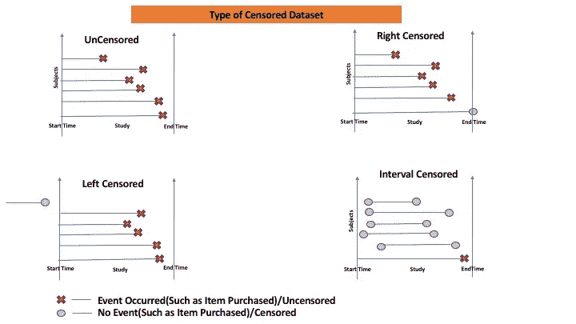
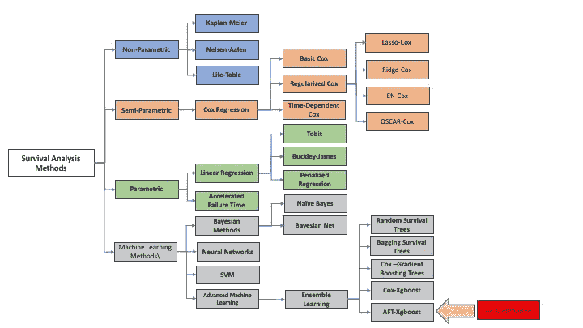
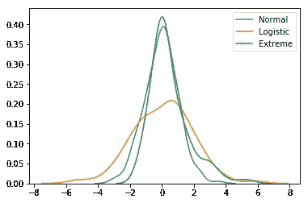
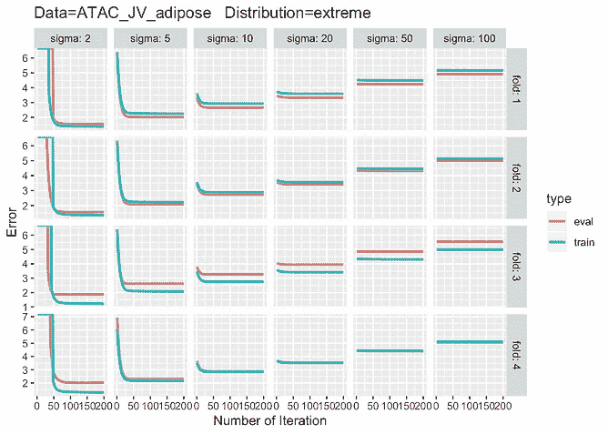
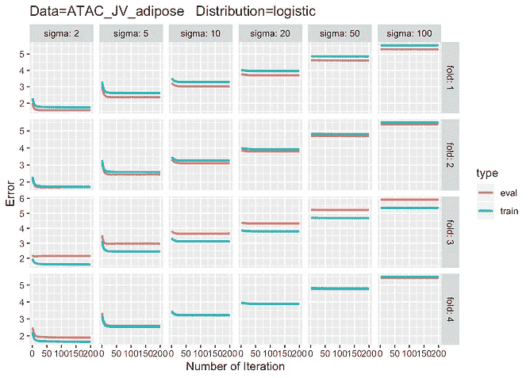
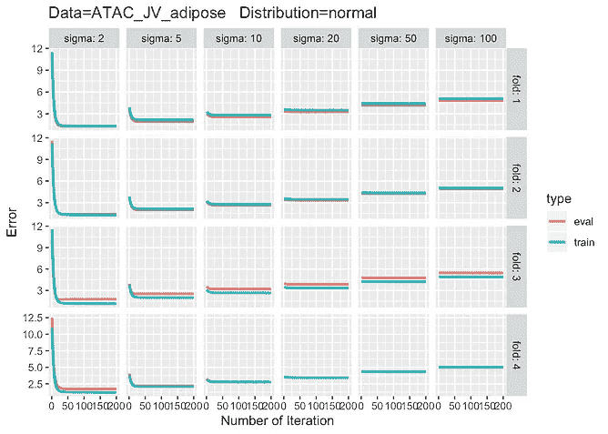

# 生存建模—加速故障时间— XGBoost

> 原文：<https://towardsdatascience.com/survival-modeling-accelerated-failure-time-xgboost-971aaa1ba794?source=collection_archive---------17----------------------->

# **简介**

生存分析是一个“**删失回归**”，其目标是学习事件时间函数。这类似于数据点未经审查的普通回归分析。生存建模没有**回归**和**分类**那么有名。因此，我将用例子更详细地解释它。这是一个有数据审查的建模任务。删失数据是指在研究期间感兴趣的事件没有发生，或者由于某些原因我们无法观察到感兴趣的事件的数据。

**审查类型和实例**

**左侧审查**发生在我们开始研究/活动时，并且该事件已经发生，导致更高的**示例** —我们希望研究给定报价的用户购买新 iPhone 的情况，但一些用户可能已经购买，丢弃这些数据是没有用的。

**区间删截**用于当我们不知道事件的确切时间，并且它可能在两个时间区间之间发生时。例如，用户购买保险，但不确定购买的确切日期。

**右删截**用于研究期间未发生的事件。示例—癌症患者接受的治疗。



Censored Data-Types

事件时间建模对于理解用户/公司的行为至关重要，不仅限于信贷、癌症和流失风险。

Cox 比例风险模型是一个半参数模型，其中我们使用预测器对**风险比**进行建模，而在加速故障时间**中，使用预测器对生存时间**的日志进行建模。这是参数生存模型，因为我们假设响应数据的分布。

下面是生存模型的流程图-



Flow Chart — Survival Machine Learning

# **最新技术水平**

基于树的模型改进了监督学习，在 Kaggle 上获得了许多奖项，在行业中也表现得更好。我们在 R 和 python 中实现了梯度推进模型，用于 Cox 比例风险函数和加速故障时间。为生存建模开发更多的基于树的模型也是很自然的。比如— GBM，mboost，Scikit-survival 等等。目前，XGBoost 支持没有基线预测的 Cox-Ph 模型。因此，我们在 Xgboost 中包含了加速故障时间，以提高生存建模支持。

# **数据类型支持**

大多数生存模型只支持正确的删失数据类型。我们通常有 4 种类型的数据— **右数据、左数据、区间数据和未经审查的数据**。右删失是最常用的删失数据类型。了解其他审查类型也很重要。

# **分布类型支持**

加速故障时间建模是参数生存建模，其中生存时间遵循一定的分布，不同于 Cox 比例风险模型。我们支持 3 种类型的分布——正态分布、逻辑分布和极端分布。正态分布是最常见的分布类型，但它有一个细尾，在厚尾事件或极端事件的情况下，这可能不是正确的选择。

还不如形象化一点。

```
import numpy as np
import seaborn as snssns.distplot(np.random.normal(0,1,200),hist=False,label=”Normal”)
sns.distplot(np.random.logistic(0,1,200),hist=False,label=”Logistic”)
sns.distplot(np.random.gumbel(0,1,200),hist=False,label=”Extreme”)
```



Distributions-Density

当数据有厚尾时，逻辑/极端会导致更好的结果。

**超参数调谐**

超参数优化是机器学习的重要任务之一。我们将响应的误差(\sigma)和基本分数作为超参数。有许多方法可以找到最佳超参数。

网格搜索就是其中之一。我们已经使用 GridSearch 找到了最佳的超参数。

对于区间删失数据集，我们也可以从σ等于 y 较低σ和 y 较高σ的平均值开始，因此对于不同的删失数据集，基础分数等于 y 较低和 y 较高σ的平均值。

# **真实例子**

这里我们使用了可用的芯片序列数据集。它有多个数据集。数据集的输出/响应是对数变换的。我们将使用 5 个数据集——[ATAC _ JV _ 脂肪](https://github.com/avinashbarnwal/GSOC-2019/tree/master/AFT/test/data/neuroblastoma-data-master/data/ATAC_JV_adipose)、[CTCF _ TDH _ 编码](https://github.com/avinashbarnwal/GSOC-2019/tree/master/AFT/test/data/neuroblastoma-data-master/data/CTCF_TDH_ENCODE)、[h3k 27 AC-h3k 4 me 3 _ TD ham _ BP](https://github.com/avinashbarnwal/GSOC-2019/tree/master/AFT/test/data/neuroblastoma-data-master/data/H3K27ac-H3K4me3_TDHAM_BP)、 [H3K27ac_TDH_some](https://github.com/avinashbarnwal/GSOC-2019/tree/master/AFT/test/data/neuroblastoma-data-master/data/H3K27ac_TDH_some) 和 [H3K36me3_AM_immune](https://github.com/avinashbarnwal/GSOC-2019/tree/master/AFT/test/data/neuroblastoma-data-master/data/H3K36me3_AM_immune) 。在所有数据集中，都已经定义了褶皱。

**基础分数**和**适马**是关键的超参数。

下面是用不同分布和 **sigma 生成**加速失效时间**性能的代码。**

[R 代码](https://github.com/avinashbarnwal/GSOC-2019/blob/master/AFT/R/aft_doc.Rmd)



# **结论**

参数删失回归——加速失效时间是 Cox 比例风险模型的一个强有力的替代方案。我们需要在不同的基于树的模型中对上述模型提供更多的支持，比如 gradient boosting、XGBoost 和 LightGBM。我们现在已经在 XGBoost 中实现了。大多数数据集是平坦的，而改变 sigma 意味着我们可能需要更多的迭代。正常情况下，西格玛起着至关重要的作用，因为当西格玛增加时，它会被奉承。

超参数调整在这里是一个重要的方面，因为我们可能会发现没有训练/测试损失的移动。很快 XGBoost 包中的所有人都可以使用它。

# **参考文献**

[1] [项目描述](https://github.com/rstats-gsoc/gsoc2019/wiki/xgboost-loss-functions)

[2] [更多细节](https://github.com/dmlc/xgboost/pull/4763)

[推导](https://github.com/avinashbarnwal/GSOC-2019/blob/master/doc/Accelerated_Failure_Time.pdf)

P.S. —我们已经将与此相关的论文提交给 [NeurIPS](https://nips.cc/) — 2020，论文的 Arxiv 版本在这里—[https://arxiv.org/abs/2006.04920](https://arxiv.org/abs/2006.04920)。