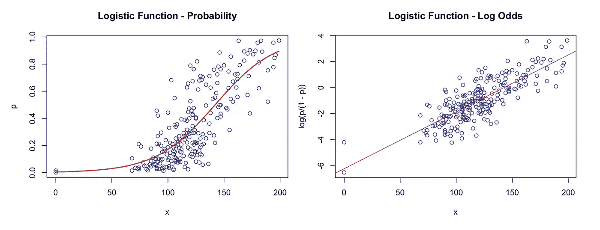
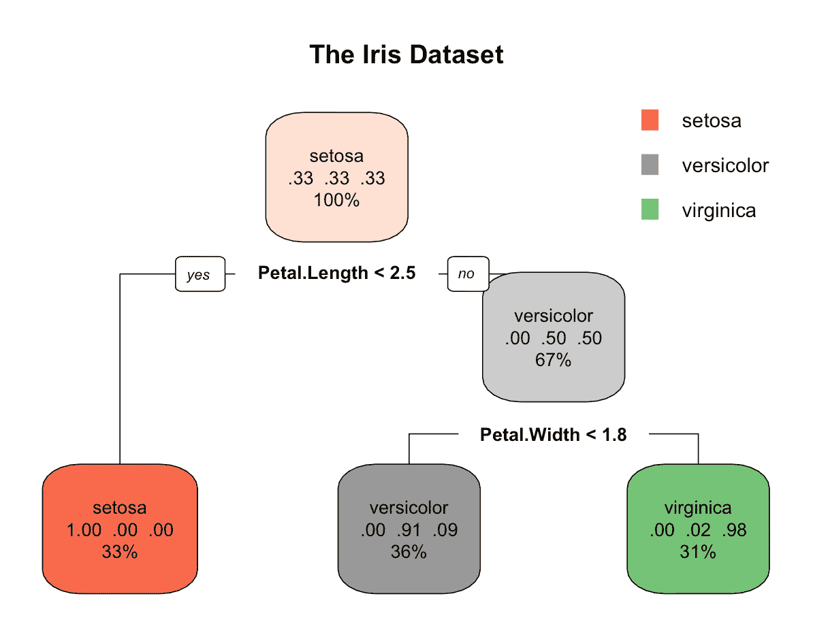
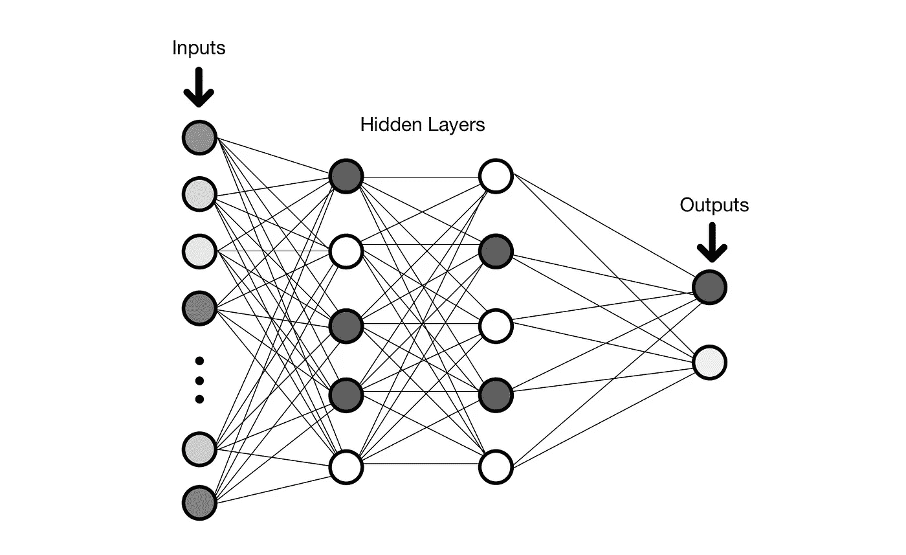
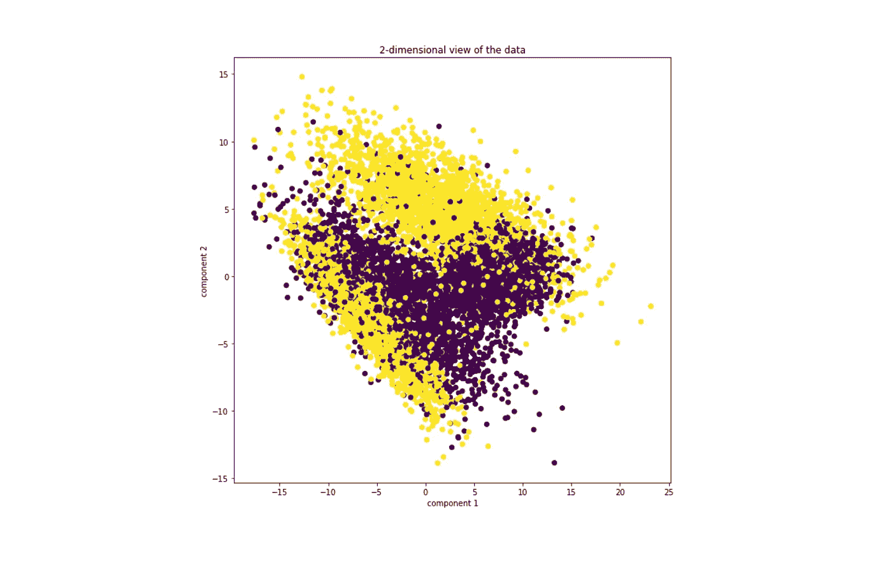
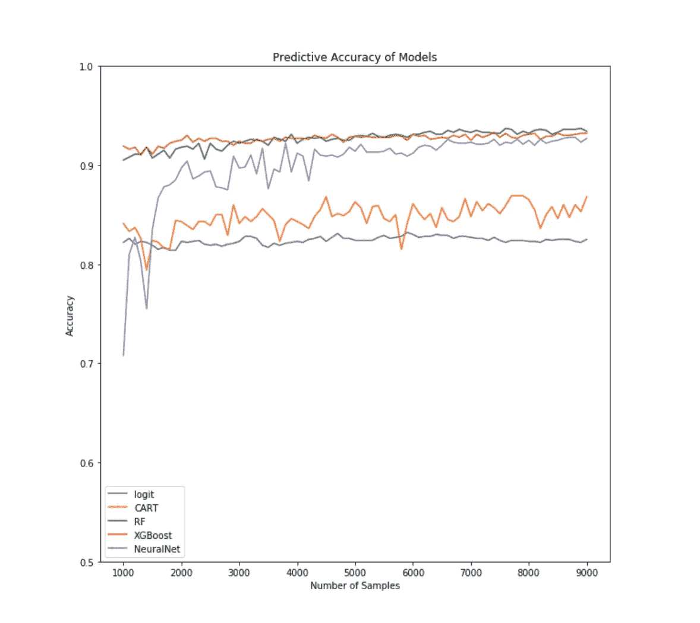
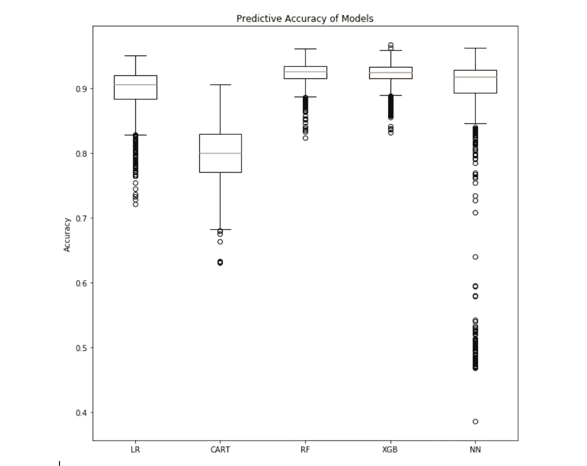

# 适者生存…模式

> 原文：<https://towardsdatascience.com/survival-of-the-fittest-model-c8681068c143?source=collection_archive---------19----------------------->

## 分类的进化观点

只有最适合的模型才能存活！多年来，这一直是数据科学家和统计学家的一项主要任务，即找出一种方法来捕捉数据中的预测本质。诚然，人们可能会认为最好的预测模型是优秀的实验设计、数据收集和特征工程的结果，但机器学习概念和算法的进步也有助于我们做出更好的预测。

从进化的角度来看我们所掌握的预测方法是很有趣的。预测建模领域的进步使得算法更智能、更高效，并且适用于更多场景。这篇文章并不是要对每种方法进行彻底的剖析，而是要表明研究建模领域的进步是理解每种方法的机制的一种奇妙的方式。最后，我将进行一次小规模的测试，比较每个型号的性能。

# 预测模型进化链

在我的预测模型进化层次结构中，我不会涵盖所有的方法——那会花费太长时间。相反，我选择了一些非常流行的预测建模技术，它们最能说明预测结果的“演变”。

## 抛硬币

让我们从抛硬币开始吧！谁*不能*说他们从未通过抛硬币做出决定？虽然不是传统意义上的预测模型，掷硬币仍然可以用作决策过程。我们都知道，一枚硬币有 50%的机会是正面或反面，因此，在二进制情况下，有 50%的概率将类别指定为 0 或 1。

这个类纯粹是随机决定的，所以不是一个很好的分类器。把这看作是我们进化链的开端——我们的草履虫——以及其他更高级物种模型改进的基础。

## 逻辑回归

进化的第一阶段是数学方法，以及解决分类问题的事实上的统计方法——逻辑回归。可以使用协变量的线性组合建立一个方程来预测反应，即结果的对数概率。logit 函数能够拟合一条回归直线，该直线最好地描述了结果的对数优势的变化。

逻辑回归是一种非常稳定和有效的方法，具有易于解释的输出，这使得它成为用于分类问题的有效的首选模型。当您面对大量数据时，逻辑回归的最大限制就来了——指定所有可能的相互作用和捕捉更复杂的关系将更加困难(尽管并非不可能),并且在尝试估计模型参数时可能会遇到收敛问题。此外，它仍然是一个参数模型，所以数据必须满足逻辑回归有效的某些假设。

因此，在进化的下一阶段，我们需要找到一种方法来有条不紊地处理这样的情况:我们可以轻松地捕捉数据中的非线性关系，但仍能实现高水平的分类准确性。

## 手推车

有了分类和回归树(CART)，我们开始远离统计学，进入机器学习的世界。通过递归划分预测器空间，构建决策树来对结果进行分类。CART 贪婪地搜索将最小化损失函数的可变分裂，在分类的情况下，损失函数是称为基尼指数的纯度度量。这衡量每个结果类的树的节点(或叶子)的纯净程度。

这可以很容易地通过用非常流行的 *iris* 数据集创建一个快速模型来可视化。

如您所见，决策树实际上只是一堆“如果-那么”语句。请注意，根节点是如何从平衡的数据组开始的，以及随后的每次拆分，决策规则是如何制定的，以使后续节点的同质性最大化。我们剩下的终端节点由 100%的 setosa，91%的 versicolor 和 98%的 virginica 组成。

决策树算法对于包含更复杂关系的数据非常有用。这是一种非参数、非线性的数据建模方法，非常容易实现。CART 的最大缺点是它有过度拟合数据的倾向，这可能导致模型在看不见的数据上表现不佳。修剪方法(即设置树的最大深度)可以帮助模型更具普遍性，但我们也可以给我们的模型一些罕见的糖果，看着它演变成模型的下一个阶段:整体。

## 装袋和随机森林

想象一下，有 10、100 甚至 1000 棵树可供我们用来做预测。像这样将多个预测工具组合成一个预测模型被称为*集成方法*。产生多个模型，并通过一种称为引导聚合或“bagging”的方法对整个集合的类别预测进行平均

这意味着每棵树在其集合中都必须有某种随机过程，以便对预测过程做出不同的贡献——如果每棵树都是相同的，那就没什么用了！这是通过用替换采样训练数据来实现的。这样，每棵树都是不同的，因为它们是通过对数据集的不同部分进行采样而构建的。

这些树非常深，旨在对数据进行过度拟合，以便学习更复杂的关系，但每个树都是不同的，因为它们是通过对数据集的不同部分进行采样而构建的。如果你考虑偏差-方差权衡，每棵树都能够大大减少偏差，但代价是在估计者之间产生更大的方差。对这些估计值的结果进行平均有助于减少方差。

随机森林采用 bagging 的思想，除了对训练数据进行采样之外，还通过在每个树分裂处随机选择变量的子集来增强算法。这有助于使集合中的树不那么相似，并允许不同的变量影响结果，从而进一步减少差异。

所以这太棒了！我们可以通过给多棵树装袋来减少手推车的过度装载问题。但是如果我们不想让估计者过多呢？有没有一种方法，我们可以用不同的方式来构建系综？

## 助推算法

通过进化，物种经历了基因构成的变化。在下一阶段，仍然使用树集合方法，只是这一次，树的设计方式发生了变化。还记得我在 CART 中说过我们可以修剪树来得到一个更一般化的估计量吗？Boosting 算法使用弱学习器(非常小的树或“决策树桩”)的集合可以比随机森林中的深度学习器表现得更好。

这些树不仅大小不同，而且它们之间的互动方式也不同。使用 bagging，可以并行构建各个分类器，并在最后进行平均。在 boosting 中，分类器是按顺序建立的，每个后续的树都可以改善其前一个树产生的错误。这样，就有了一种系统化的方法来改进先前模型的不足之处，并在将所有模型组合到整体分类器中时将误差降至最低。

有几种流行的增强方法，即自适应增强和梯度增强。如果集合是一个物种，可以把 boosting 看作是一种类型的属，后面是这些独立的分类器家族。如上所述，它们都有相同的直觉，但是采用不同的方法来最小化建模误差。简而言之:在自适应增强中，被一个模型错误分类的观察值在下一个模型中的权重更大，数据在重新加权的数据集上进行训练。在梯度提升中，不是在重新加权的训练数据上拟合后续模型，而是以最小化损失函数为目标，直接对先前分类器的误差进行建模。可以这样想，如果一个额外的分类器能够纠正前一个模型的一些错误，那么这个分类器的错误将小于前一个模型的错误。在集合结束时，误差应该被最小化。

## 神经网络

现在我们已经到了进化的最后阶段:神经网络。由于缺乏更好的过渡到这种类型的模型，想象一个外来物种降落到我们的预测模型空间，并开始以数据为食。它吸收的数据越多，它就越能学习，变得越强大。

假设你想用一组变量来预测一个结果。在神经网络空间中，这些分别被称为“输入”和“输出”。输入在网络中传播，经过称为隐藏层的不同节点层，直到它们到达网络末端的输出层。

后续层中的每个节点接收来自前一层中所有节点的“信号”。例如，来自输入层的每个值(或信号)被发送到第一个隐藏层中的所有节点，并且每个连接被分配一个权重(与回归方程中的系数相似)。激活函数/非线性变换被应用于加权值的和，以给出下一个节点(或神经元)是否激活的二元决策。另一项称为偏差，在应用激活函数之前添加到加权值的总和中，其作用类似于回归中的截距，控制神经元激活之前需要的权重总和。

该过程最终确定输出层中节点的强度，其中最强的输出节点成为由模型决定的分配类别。然后，神经网络测量响应中的误差，并递归地“反向传播”误差，以重新调整每个前面节点的权重，实质上是“学习”更准确地表示正确结果所需的最佳权重。

因此，有了大量的训练数据，神经网络可以学习有用的模式来对结果进行分类。这对于分析非常高维的数据特别有用，就像您在处理图像识别一样。一幅 64×64 的小图像就有 4096 个特征可以添加到神经网络的输入层。

# 模拟

我在这里展示了模型的层次结构，但是哪一个是“最合适的”将在很大程度上取决于您的数据。假设我们只关心预测精度，我设计了一个小模拟来确定适者生存模型。参见我的 github repo，获取用于该模拟的完整 python 代码。

在第一轮中，我模拟了一个包含 10，000 个观察值和 50 个变量的数据集，其中包括一些信息性特征、一些引入共线性的冗余特征和一大组无用变量，以测试模型使用信息性特征的能力。数据被分成两类，我在数据中引入了一点噪声，使问题变得更困难。

## 第一轮:训练数据大小

对于模拟的第一部分，我只是想了解每种方法是如何处理大量数据的。我根据可用的训练样本数量，绘制了每个模型预测测试数据集的能力的准确度。

逻辑回归非常稳定，但如果不进一步调整，可能无法提取数据的任何非线性特征。CART 在大多数情况下表现稍好，但变化很大，无法达到集合模型获得的精度。Random Forest 和 XGBoost 对这些数据的表现非常相似，神经网络赶上了这些模型，但只有当更多的训练数据可用时。

**第二轮:烘焙比赛**

在测试中，我创建了 1000 个不同的随机数据集，与第一轮中使用的相似，但行数和列数不同，并比较了不同分类器之间模型准确性的点估计。数据没有增加太多的复杂性，所以平均来说，每种方法的得分都很高。

我对所有这些模型都进行了最小的调整，这并不是每种方法能力的最佳表现，但为了本文的目的，它便于比较。

虽然我提出了模型的“进化”，并将这篇文章命名为“适者生存”，但这里没有一个模型有灭绝的危险。根据分析的目标(预测与推断)和数据的性质，一种模型可能比其他模型更适合。希望通过这篇文章，我能够说明每种方法的好处，以及它们是如何在彼此的基础上解决预测问题的。