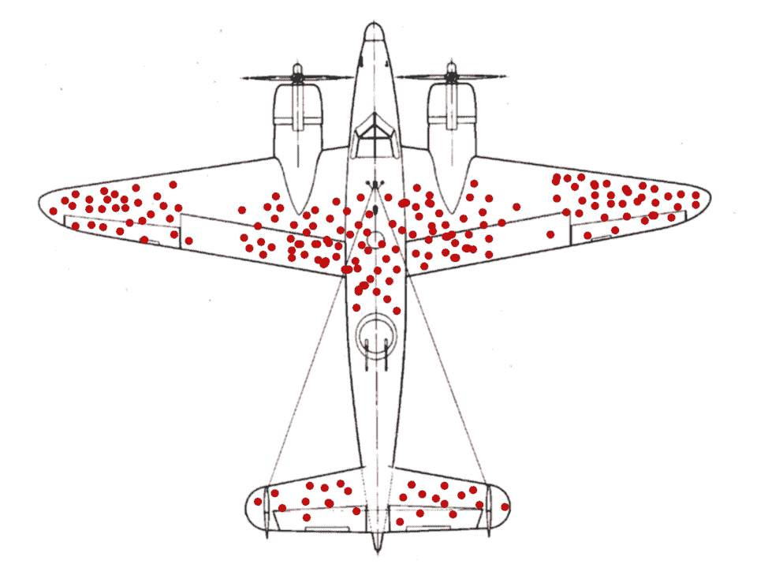
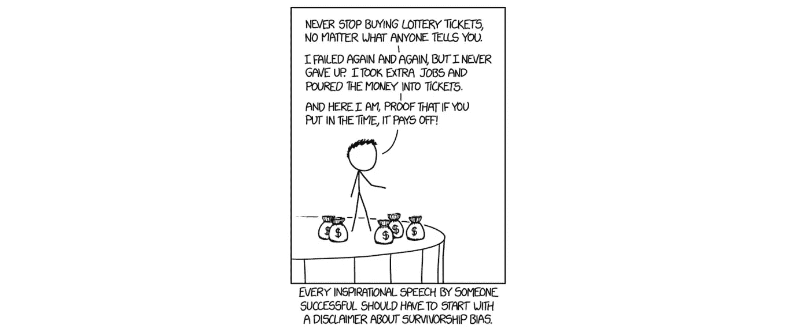
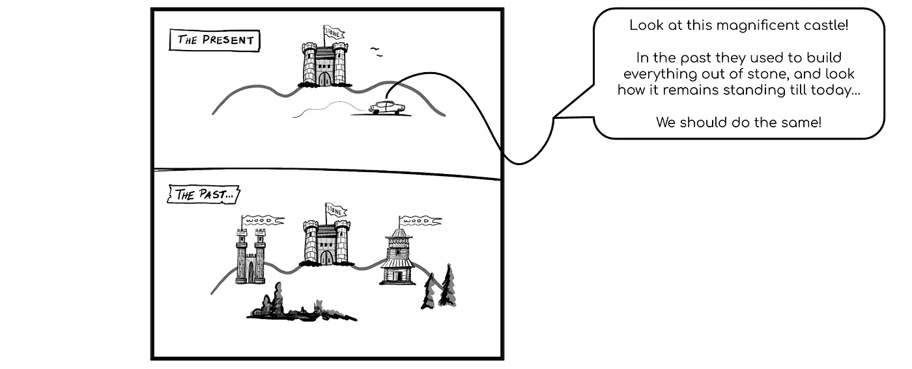

# 数据科学和机器学习中的生存偏差

> 原文：<https://towardsdatascience.com/survivorship-bias-in-data-science-and-machine-learning-4581419b3bca?source=collection_archive---------11----------------------->

source: unsplash — free stock images

## 关于缺失数据，亚伯拉罕·瓦尔德教会了我们什么

今天我们要谈谈偏见。所以第一个公平的问题是，什么是偏见，对吗？

**偏置**

**/ˈbʌɪəs/**

名词

*   *以不公平的方式支持或反对某个人或事物的行为，因为允许个人观点影响你的判断*
*   偏爱某一特定主题或事物的事实
*   *影响你判断的不公平的个人观点*
*   *允许个人观点不公平地影响你的判断*
*   更喜欢某人或某事的事实

如果我们对这些定义进行一些 NLP，我们肯定会对世界上的“特定”、“个人”、“观点”或“偏好”有所了解，但是，我认为下面的定义正好符合我们在数据科学中经常提到的“偏见”一词的含义:

*   *信息不正确的事实，因为收集或提供信息的方法不正确*

记住这个定义，几个月前在阅读查尔斯·惠兰的《赤裸裸的统计数据》一书时，我发现了一段特别有趣的摘录，他在其中表达了尽管人们经常谈论“用统计数据撒谎”，但他认为实际上一些最糟糕的统计错误(或“错误”)涉及“用数据撒谎”，而不是“T21”。在这场争论之后，但通常是真实的肯定，在章节*“数据的重要性”*的以下几页中，他谈到了通常影响我们数据分析的几种偏差:选择偏差、出版偏差、回忆偏差、健康用户偏差，以及我们接下来要谈到的一个偏差……生存偏差。

通常也被称为“生存”而不是“幸存”偏见，这种类型的偏见发生在我们专注于通过一些选择过程成功的人或事的时候。忽略那些没有的，通常是因为它们缺乏可见性。这可能会以几种不同的方式导致错误的结论，或者对某种情况的过于乐观的分析。

但是让我们从头开始:这种特殊类型的偏见何时以及为什么被命名为“生存”偏见？在第二次世界大战期间，美国陆军旨在实施统计和科学，以在敌人之间的战斗中获得竞争优势。这不再仅仅是关于谁拥有最大的军队，现在由于新技术的出现，一支最小但装备精良的军队可以面对一支更大的军队。在这种背景下，美国成立了 11 个不同专业的研究小组，统称为应用数学小组。他们的工作是解决陆军在战场上遇到的问题，并试图找到某种数学见解，以便给美国带来战术优势。

应用数学小组接手的一个问题是飞机的生存能力，因为那时，一架去战斗的飞机基本上有 50%的机会在战斗结束时安全回家。因此，提高这种可能性，即使只是一点点，也可以在这个领域产生巨大的影响。负责分析并试图改进的人是亚伯拉罕·瓦尔德。为了做到这一点，亚伯拉罕想出了一个非常简单且符合逻辑的解决方案:当一架飞机从战场上回来后，他让战场上的人在一张卡片上标出飞机被击中的部位。

这是一件非常简单且符合逻辑的事情。如此简单，以至于当军队中的人开始看到这些卡片时，当然，由于重量的限制，你不能加固飞机的每一个部分，他们很快就能直观地看到飞机被击中几次的地方，并命令立即加固那些区域，而且只加固那些区域。然而，当沃尔德发现这一点时，他指出了他们逻辑中隐含的生存偏见:与其强化那些高度标记的区域，不如强化其他所有的区域！

为什么你会想知道？嗯，那些回来的飞机实际上能够在所有标记的地方被击中，然后返回基地。他们确实是幸存者！所以可以肯定的是，在飞机的任何其他部分，没有返回的飞机被击中，因此，这些部分需要加强。

这就是“生存偏见”这个名字的由来。从那以后，事实证明这是一种特别危险的偏见。主要是因为它在我们的日常生活中非常非常普遍。有时候我们甚至没有意识到，但是例如，当我们看一个 Ted 演讲，一个人战胜了巨大的逆境或者在生活中取得了巨大的成功，我们正在以一种非常偏见的方式寻求建议。从一个非常特殊的人那里寻求建议，忽略了那些没有成功的人的观点和行动。虽然这不一定是错的，但是看看那些有潜力的、尝试过的和失败的人会更有用，这样可以避免导致他们失败的错误。

不幸的是，我们的大脑习惯于以这种方式思考和处理。这就是生存偏见如此危险的原因。让我们来看看其他一些日常的和平庸的例子……看看它们是否让你想起了什么:

*   背景:35 岁的家伙|“嗯…威尔和亚当已经打了一年的橄榄球，他们看起来身材棒极了…也许我应该试试。”
*   背景:20 岁学生|‘嘿……史蒂夫·乔布斯、比尔·盖茨和马克·扎克伯格从大学辍学，成为百万富翁，我也一样’
*   背景:夏天走在海滩前的街道上|“看看这些海鲜餐馆，挤满了人……我们在家里开一家吧！”
*   上下文:有人在选手机|“我认识的人中有一半人都有这款手机，没人对它有什么不好的看法……我应该买一部”
*   背景:一位父亲在为他的孩子评估一所高中|“这所高中一定很棒……三位在职的创始人去过那里，看看他们在哪里”

source: [https://www.explainxkcd.com/wiki/index.php/1827:_Survivorship_Bias](https://www.explainxkcd.com/wiki/index.php/1827:_Survivorship_Bias)

为了更好地理解这种偏见，让我们回顾一下 Charles Wheelan 在《裸统计数据》中使用的一个例子:

> 假设一所高中的校长报告说，一个特定的学生群体的考试成绩已经连续四年上升。这个班大二学生的成绩比大一学生的成绩要好。大三的成绩更好，大四的成绩最好。我们将规定没有作弊，甚至没有任何创造性地使用描述性统计。每一年，这一批学生都比前一年做得更好，用各种可能的标准来衡量:平均值、中间值、年级水平的学生百分比等等。你会(a)提名这位学校领导为“年度校长”还是(b)要求更多数据？(……)如果我们合理假设最差的学生(考试分数最低)最有可能辍学，那么随着越来越多的学生辍学，那些被落下的学生的平均考试分数将稳步上升。”

如果你想给这个人颁奖而不要求更多的数据，你可能犯了一个可怕的错误。

你可能已经发现，生存偏见无处不在。如果你仔细想想，很可能连你自己都在犯这个错误，当然你也能想到几个朋友和亲密的家庭成员经常掉进这个又深又宽的偏见洞里。然而，当你的朋友告诉你他想买那个流行的科技产品，因为 Instagram 上的所有视频看起来都超级有趣和时尚时，尽管这可能很有趣，但你可能是在和敌人睡觉，生存偏见也可能在你自己的机器学习算法中。当然，这一点也不好笑。

source: Google Images

让我们看看数据科学、机器学习和人工智能领域的几个例子:

*   **流失预测**:假设你正在为流失预测建立一个机器学习模型。因此，你要利用当前活跃客户的数据库，考虑你可能会用到的有用功能。订单总数？过去 X 个月的订单数量？他从什么时候开始在公司工作的？投诉总数？每月与客服的平均互动次数？嗯，诸如此类。你想了很多，最后得出了令人印象深刻的 100 个预测客户流失的功能…你做了很好的功能工程！干得好！然而，你是否已经发现了生存偏差在起作用？当然，以你当前的活跃客户为例，你会错过所有离开你的客户，因此，你的模型只会关注幸存者。正确的做法是，例如，取在某年某月注册的所有客户。通过这种方式，你可以获得一个具有代表性的客户样本，包括那些仍然和你在一起的客户以及那些已经离开的客户。
*   **欺诈防范**:数据科学、机器学习和人工智能领域在欺诈防范方面的生存偏差也可能非常危险。通常，我们在 Ravelin 的客户来找我们时，已经在使用某种防止欺诈的解决方案。无论是规则系统、人工审核客户还是其他。想象一下，如果为了建立我们客户的机器学习模型，我们只接受那些通过了客户先前解决方案的欺诈者。我们将只使用幸存者作为我们的目标变量，而忽略以前的解决方案通过防止一些欺诈者已经在做的所有有益的事情。
*   **疾病预测:**想象一下，取一个患有致命疾病的人的样本，并将年龄、自诊断以来的时间、诊断时的年龄、性别、健康水平等特征添加到我们的模型中。您可能已经发现了这里的问题，因为这与我们预测客户流失的情况类似(但显然更明智)。这样做的话，我们就忽略了所有那些自从他们的 weir 被诊断出患有这种疾病后没能挺过来的人。这些人肯定有他们自己的特点。也许抽烟或者不太爱运动？也许他们是在较晚的年龄被诊断出来的？我们不知道，这将是一个生存偏差的巨大案例，直接进入我们的数据集，因此预测。

如您所见，这种特定类型的偏见在我们的日常生活和作为数据科学家的工作中都非常危险。但更重要的是，如果我们不相应地评估这件事，对参与我们预测的人来说也是危险的。所以希望这个故事能帮助你更好地了解它:)

如果你喜欢这个故事，别忘了看看我最近的一些文章，比如提高绘图技能的 10 个技巧，我在使用火车测试分割或 5 分钟网络抓取时犯的 6 个业余错误。在我的中等个人资料中可以找到所有这些以及更多。还有，如果你想直接在邮箱里收到我关于数据科学、机器学习、人工智能和编程的最新文章，只要订阅我的时事通讯就行了:)

也可以通过…
LinkedIn:[https://www.linkedin.com/in/gferreirovolpi/](https://www.linkedin.com/in/gferreirovolpi/)
GitHub:[https://github.com/gonzaferreiro](https://github.com/gonzaferreiro)(在那里可以找到我所有的代码)

感谢阅读！

本故事所用的资料来源:

> [*https://brilliant.org/wiki/survivorship-bias/*](https://brilliant.org/wiki/survivorship-bias/)
> 
> [*https://en.wikipedia.org/wiki/Survivorship_bias*](https://en.wikipedia.org/wiki/Survivorship_bias)
> 
> [https://www.youtube.com/watch?v=NtUCxKsK4xg&t = s](https://www.youtube.com/watch?v=NtUCxKsK4xg&t=s)
> 
> [https://blog.hubspot.com/sales/survivorship-biasT21](https://blog.hubspot.com/sales/survivorship-bias)
> 
> [*http://blog . idonethis . com/7-lessons-survivority-bias-will-help-make-better-decisions/*](http://blog.idonethis.com/7-lessons-survivorship-bias-will-help-make-better-decisions/)